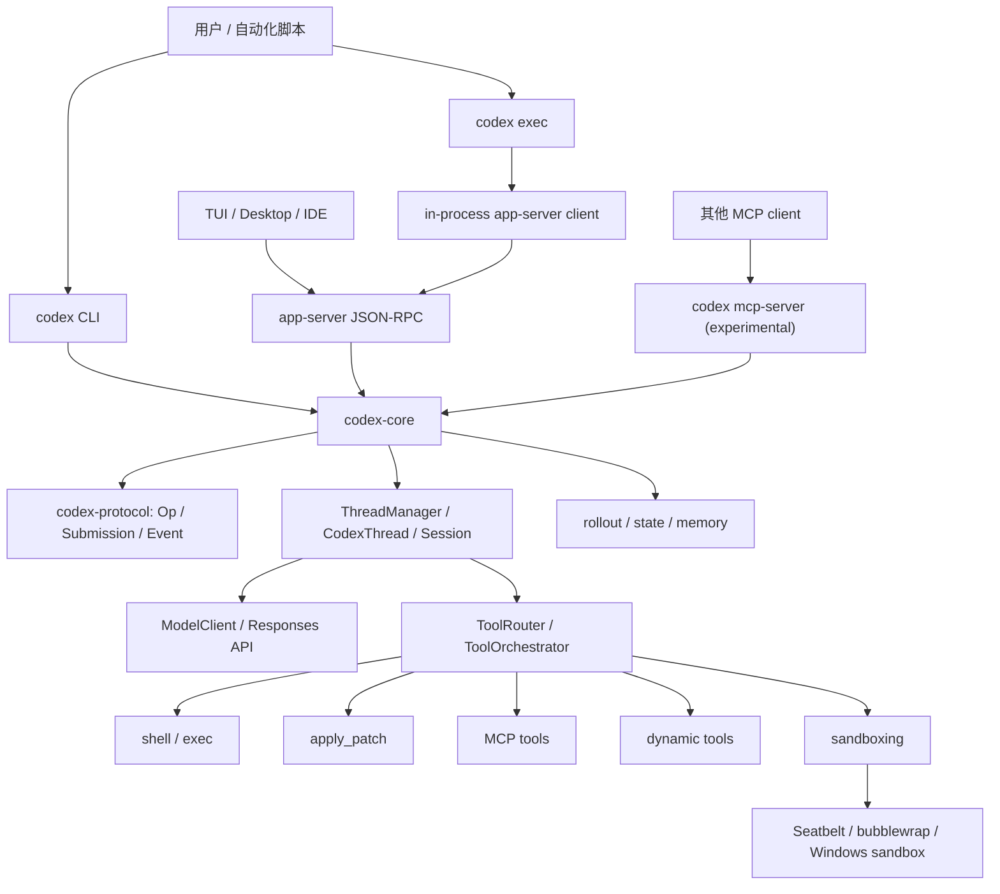

# How Codex Works

深入解读 OpenAI Codex CLI 的源码架构。这个项目不是安装手册，而是一份给工程师看的源码导读：Codex 如何把模型、工具、终端、权限、沙箱、MCP 和多前端体验组织成一个生产级 coding agent。

分析对象是公开仓库 [openai/codex](https://github.com/openai/codex)。当前核对的源码快照是 `87bc724`，提交日期 2026-04-25。仓库本身采用 Apache-2.0 许可证，这份文档采用 MIT 许可证。文档里的判断会尽量和源码路径放在一起，避免把推测写成事实。

## 致谢与形态参考

这个导读的项目形态参考了 [Windy3f3f3f3f/how-claude-code-works](https://github.com/Windy3f3f3f3f/how-claude-code-works)：中文源码导读、章节化拆解、架构图、资料来源和学习路线。这里借鉴的是教程组织方式和源码阅读密度，不照搬内容，也不把 Claude Code 的闭源内部机制作为 Codex 的事实来源。

## Codex 是什么

Codex CLI 是 OpenAI 的本地 coding agent。它可以在终端里和用户对话，也可以用 `codex exec` 非交互运行，还能通过 app-server 连接桌面应用、IDE 或其他前端。它的核心实现现在是 Rust workspace，主要代码在 `codex-rs/`。

一个最小 coding agent 只需要三件事：调用模型、执行工具、把工具结果塞回上下文。Codex 真正值得读的地方，是它把这三件事扩展成了一套完整 runtime：

- 用 `Submission` / `Event` 队列把 agent core 和 UI 解耦
- 用 `ThreadManager`、`CodexThread`、`Session` 管理线程、回合和持久化
- 用 `ToolRouter` 和 `ToolOrchestrator` 统一内置工具、MCP 工具和动态工具
- 用权限、审批、Guardian、OS sandbox 和网络代理控制工具风险
- 用 app-server、TUI、exec、实验性 MCP server 复用同一个核心能力
- 用 skills、plugins、hooks、apps、memory、sub-agents 把产品能力接进同一套 runtime

## 系统架构



## 这份源码为什么值得读

大多数 agent demo 都停在模型循环：问模型，跑工具，再问模型。Codex 的源码展示的是这个循环进入真实开发环境后需要补上的工程层。

第一层是运行时边界。Codex 没有把 UI、模型调用和工具执行绑死在一个函数里，而是通过协议和队列通信，让 TUI、`exec`、app-server 和实验性 MCP server 可以复用同一个核心。

第二层是工具安全。一个能执行 shell 的 agent 不能只靠提示词自律。Codex 把审批策略、exec policy、Guardian 复核、平台沙箱和网络代理都放到工具执行路径上。

第三层是长会话状态。真实任务会跨很多轮对话，涉及文件、git 状态、工具输出、压缩、恢复和记忆。Codex 把这些状态落在 rollout、state DB、thread manager 和 context 相关模块里。

第四层是产品化扩展。Codex 的特别之处不只是能跑命令。IDE、desktop、`exec`、MCP、skills、plugins、hooks、apps、memory、sub-agents 都会接到同一条协议和工具路径上。想理解它为什么用起来不像普通 demo，可以先读 [为什么 Codex 用起来不一样](./docs/11-why-codex-feels-different.md)。

## 关键发现

读源码时最容易低估的是 Codex 的“胶水层”。模型请求和 shell 执行都不是最难的部分，真正撑起产品体验的是这些边界：

| 发现 | 源码线索 | 为什么重要 |
|------|----------|------------|
| 前端和 core 通过 queue-pair 解耦 | `Submission`、`Op`、`Event` | TUI、`exec`、app-server、实验性 MCP server 能复用同一套核心 |
| 工具不是直接函数调用 | `ToolRouter`、`ToolRegistry`、`ToolOrchestrator` | 工具调用可以统一接入 hook、审批、sandbox、并发和协议事件 |
| 文件编辑被结构化 | `apply_patch`、`TurnDiffTracker` | patch 能被预览、审批、按路径授权，最终 diff 来自文件系统事实 |
| 上下文是 runtime state | `context/`、`record_context_updates_and_set_reference_context_item` | prompt 不只是字符串，环境、权限、skills、plugins、apps、hooks 都有来源和生命周期 |
| 多 agent 仍受父 session 控制 | `codex_delegate.rs` | 子 agent 继承 runtime 服务，但审批请求会回到父 session |
| 长任务需要 task/goals 层 | `tasks/`、`goals.rs` | 普通对话、review、compact、undo、自动继续不能都塞进一个 loop |

这些点解释了 Codex 和普通代码生成 demo 的差异：它把模型能力放进一个可审计、可恢复、可扩展的本地运行时。

## 这份导读追求的深度

这份导读不只做 crate 目录索引。对齐源码级阅读时，每个核心章节至少回答四类问题：

| 阅读层级 | 要回答的问题 | 例子 |
|----------|--------------|------|
| 入口层 | 从哪个文件、哪个函数开始读 | `submission_loop`、`run_turn`、`ToolRouter::from_config` |
| 调用链层 | 一次用户输入或工具调用穿过哪些模块 | `Submission -> Op -> SessionTask -> model stream -> ToolCallRuntime` |
| 状态层 | 哪些状态会被读写、哪些状态只用于 UI 展示 | `history`、`rollout`、`state DB`、`reference_context_item` |
| 取舍层 | 为什么要拆成这些模块，代价是什么 | 多前端复用、工具安全、长会话恢复、上下文压缩 |

和很多源码解读不同，这里会尽量把“事实”和“判断”拆开写。事实来自 `openai/codex` 的公开源码、README 和 docs；判断会落到“这个设计值得学什么”“如果自己做 agent 要不要照抄”这类工程问题上。

## 专题目录

| # | 文档 | 你会看到什么 |
|---|------|--------------|
| 0 | [10 分钟快速入门](./docs/quick-start.md) | 用一条主线理解 Codex：Rust workspace、queue-pair、tool runtime、sandbox |
| 0.5 | [源码阅读地图](./docs/00-reading-map.md) | 按问题追源码，避免在 workspace 里迷路 |
| 1 | [概述](./docs/01-overview.md) | 关键 crate 怎么分层，为什么 Codex 是 runtime 而不是单个 CLI |
| 2 | [Agent Loop](./docs/02-agent-loop.md) | `run_turn` 如何驱动模型流、工具调用和 follow-up |
| 3 | [协议层](./docs/03-protocol.md) | `Op`、`Submission`、`Event`、`EventMsg` 如何把前端和核心隔开 |
| 4 | [工具系统](./docs/04-tool-system.md) | `ToolRouter`、`ToolRegistry`、`ToolOrchestrator` 的职责划分 |
| 5 | [Sandbox 与安全](./docs/05-sandbox-security.md) | 审批、Guardian、三平台 sandbox 和网络代理如何接在一起 |
| 6 | [上下文、记忆与压缩](./docs/06-context-memory-compaction.md) | history、rollout、compact、memory 分别解决什么问题 |
| 7 | [MCP 与 App Server](./docs/07-mcp-app-server.md) | Codex 如何作为 MCP client、实验性 MCP server，多前端怎么接入 |
| 8 | [CLI、TUI 与 Exec](./docs/08-cli-tui-exec.md) | `codex`、`codex exec`、TUI 和 headless 模式的边界 |
| 9 | [定制系统](./docs/09-customization.md) | config、skills、plugins、hooks、AGENTS.md 如何进入 agent |
| 10 | [最小必要组件](./docs/10-minimal-components.md) | 如果自己做一个小 Codex，需要哪些模块 |
| 11 | [Codex 为什么不一样](./docs/11-why-codex-feels-different.md) | 多入口、持久化、工具、安全、扩展和子 agent 如何组成产品差异 |
| 12 | [代码编辑与 apply_patch](./docs/12-code-editing-apply-patch.md) | patch grammar、流式 diff、审批、turn diff tracker |
| 13 | [System Prompt 与上下文注入](./docs/13-system-prompt-context-injection.md) | base instructions、turn context、skills、plugins、apps、hooks 如何进入模型输入 |
| 14 | [Hooks 与扩展边界](./docs/14-hooks-extensibility.md) | `PreToolUse`、`PermissionRequest`、`PostToolUse` 的生命周期和安全边界 |
| 15 | [多 Agent 与委托执行](./docs/15-multi-agent-delegation.md) | 子 thread、事件桥接、父 session 审批、agent 工具生命周期 |
| 16 | [Task、Review 与 Goals](./docs/16-task-review-goals.md) | `SessionTask`、review/compact/undo/user_shell、goal runtime |
| 17 | [上下文压缩深读](./docs/17-context-compaction-deep-dive.md) | pre-turn/mid-turn compact、remote compact、replacement history、`reference_context_item` |
| 18 | [被称道的 Codex 特性深读](./docs/18-praised-features-deep-dive.md) | 公开资料里的亮点如何落到本地 runtime：开源、sandbox、exec、review、compaction、MCP、skills、subagents、worktrees |
| S | [源码索引与命令速查](./docs/source-index.md) | 核心概念、源码路径、命令、验证命令、按问题定位源码 |
| R | [参考资料与来源](./docs/reference.md) | 官方文档、社区文章、媒体报道和资料可信度说明 |

## 阅读建议

只有 10 分钟，先读 [快速入门](./docs/quick-start.md)。

准备认真读源码，先看 [源码阅读地图](./docs/00-reading-map.md)。它会告诉你不同问题应该从哪些路径切进去。

想理解核心机制，按顺序读 [Agent Loop](./docs/02-agent-loop.md)、[协议层](./docs/03-protocol.md)、[工具系统](./docs/04-tool-system.md)。

关注安全，直接读 [Sandbox 与安全](./docs/05-sandbox-security.md)，再回到 [工具系统](./docs/04-tool-system.md) 看审批如何挂到执行路径上。

想自己实现 agent，先读 [最小必要组件](./docs/10-minimal-components.md)，再用前面的章节补每个模块的设计细节。

想理解 Codex 的产品差异，先读 [Codex 为什么不一样](./docs/11-why-codex-feels-different.md)，再读 [被称道的 Codex 特性深读](./docs/18-praised-features-deep-dive.md)。前者从源码架构解释使用感，后者把官方资料和社区评价里的亮点逐个映射回 runtime。

准备读更深的实现细节，直接进入 12-18 章。它们分别对应几个容易被普通教程略过的区域：结构化代码编辑、prompt/context 注入、hooks 扩展、多 agent 委托、task/goals 生命周期、上下文压缩、公开称道特性的源码机制。

## 重要边界

这里讲的是开源的 Codex CLI/local agent 实现，不包括 GPT 模型本身、ChatGPT 后端、Codex Web 云端执行服务和账号体系。读源码时需要把本地 runtime 和云服务分开看。

## 本地预览

在项目目录运行：

```bash
python3 -m http.server 4173
```

然后打开 `http://127.0.0.1:4173`。

## 生成说明

由 GPT-5.5 xhigh fast 生成。
