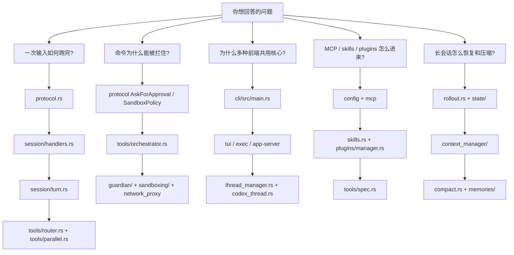
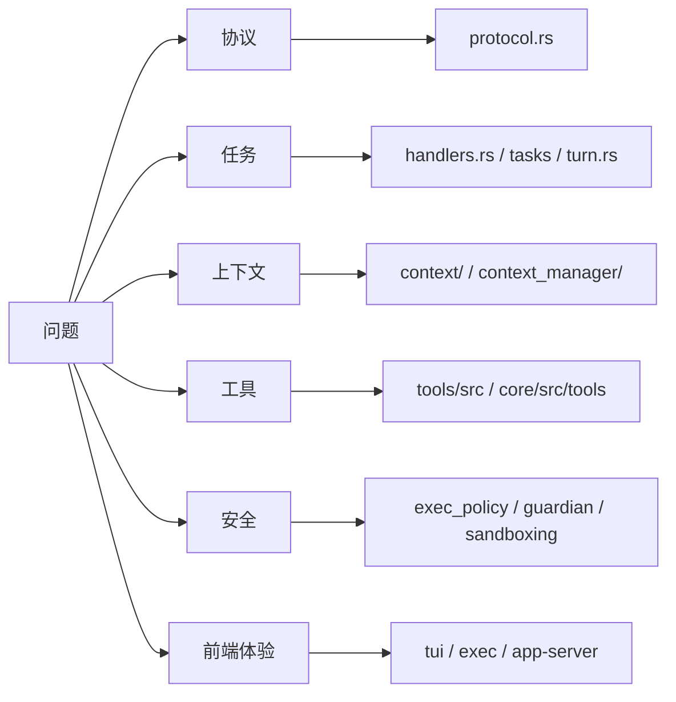

# 0. 源码阅读地图：如何把 Codex 读细

## 核心问题

Codex 的源码入口很多，直接从 `codex-rs/Cargo.toml` 往下翻，很容易迷路。更稳的读法是先确定你要回答的问题，再沿着协议、session、turn、tools、state 这些边界追下去。

当前核对的源码快照是 `openai/codex@4f1d5f00f0175e257ddc4a47746453edecb27017`，提交日期 2026-04-27，提交信息为 `Add Codex issue digest skill (#19779)`。后续如果官方主分支变动，建议先用这一页的方法重新跑路径检查。

## 源码入口

- `README.md`
- `codex-rs/README.md`
- `codex-rs/Cargo.toml`
- `codex-rs/docs/protocol_v1.md`
- `codex-rs/protocol/src/protocol.rs`
- `codex-rs/core/src/session/handlers.rs`
- `codex-rs/core/src/session/turn.rs`
- `codex-rs/core/src/tools/spec.rs`
- `codex-rs/core/src/thread_manager.rs`
- `codex-rs/app-server/README.md`

## 先按问题分流



## 四条精读路线

### 路线 A：核心 agent loop

想知道 Codex 如何把用户输入变成多轮工具调用，按这条线读：

1. `codex-rs/docs/protocol_v1.md`
2. `codex-rs/protocol/src/protocol.rs`
3. `codex-rs/core/src/session/handlers.rs`
4. `codex-rs/core/src/tasks/regular.rs`
5. `codex-rs/core/src/session/turn.rs`
6. `codex-rs/core/src/tools/router.rs`
7. `codex-rs/core/src/tools/parallel.rs`

读的时候抓住三个词：`Submission` 是输入，`Event` 是输出，`needs_follow_up` 决定是否继续问模型。

### 路线 B：工具和安全

想知道 shell、patch、MCP 工具为什么不会直接裸奔，按这条线读：

1. `codex-rs/protocol/src/protocol.rs` 里的 approval 和 sandbox 类型
2. `codex-rs/core/src/tools/spec.rs`
3. `codex-rs/core/src/tools/registry.rs`
4. `codex-rs/core/src/tools/orchestrator.rs`
5. `codex-rs/core/src/exec.rs`
6. `codex-rs/core/src/guardian/`
7. `codex-rs/sandboxing/`
8. `codex-rs/network-proxy/README.md`

这条线不要只看“有哪些策略”，更要看策略挂在哪个执行点上。安全规则如果不在工具执行路径里，就很容易被新工具绕开。

### 路线 C：多前端和 app-server

想知道为什么 TUI、`codex exec`、desktop、IDE 可以共用一套核心，按这条线读：

1. `codex-rs/cli/src/main.rs`
2. `codex-rs/tui/`
3. `codex-rs/exec/src/lib.rs`
4. `codex-rs/app-server/README.md`
5. `codex-rs/app-server/src/codex_message_processor.rs`
6. `codex-rs/core/src/thread_manager.rs`
7. `codex-rs/core/src/codex_thread.rs`

这条线的关键是不要把 TUI 当成核心。TUI 是事件消费者，app-server 也是事件消费者，真正复用的是 thread runtime。

### 路线 D：扩展、记忆和长期使用

想知道 Codex 怎么从个人工具变成团队可扩展工具，按这条线读：

1. `docs/config.md`
2. `codex-rs/core/src/agents_md.rs`
3. `codex-rs/core/src/skills.rs`
4. `codex-rs/core/src/plugins/manager.rs`
5. `codex-rs/hooks/`
6. `codex-rs/core/src/mcp.rs`
7. `codex-rs/core/src/rollout.rs`
8. `codex-rs/core/src/memories/README.md`

这里最值得看的不是某个格式，而是生命周期分层：配置长期存在，项目规则跟仓库走，skills 按需注入，plugins 负责分发，hooks 接外部流程。

## 怎么验证一个说法

写 Codex 源码导读时，最好把事实和判断分开。

事实可以这样验证：

```bash
rg -n "pub enum Op|pub struct Submission|pub struct Event" codex-rs/protocol/src/protocol.rs
rg -n "submission_loop|run_turn|run_sampling_request" codex-rs/core/src
rg -n "ToolRouter|ToolOrchestrator|ToolCallRuntime" codex-rs/core/src/tools
rg -n "thread/start|turn/start|thread/fork" codex-rs/app-server/README.md
```

判断要用“可以理解为”“值得学习的点”这类措辞标出来。比如“Codex 的工具系统像一层工具操作系统”是判断，支撑它的事实是 `tools/spec.rs` 聚合了内置工具、MCP、dynamic tools、discoverable tools、sub-agent tools，并通过统一 registry 和 router 进入执行路径。

## 读源码时容易踩的坑

第一，开源 CLI/runtime 和云端产品不是同一件事。`README.md` 明确区分了本地 Codex CLI、IDE/desktop app 入口和 Codex Web。这份文档只讨论开源仓库能验证的本地实现。

第二，app-server 和 MCP server 的 API 有一部分处在实验或 rollout 状态。官方 `app-server/README.md` 对 websocket、experimental API、部分 plugin 接口都写了限制。文档里遇到这些点，要标清稳定程度。

第三，配置文档会跳到 developers.openai.com。仓库内的 `docs/config.md` 是入口，不一定包含完整配置参考。要写配置细节时，需要同时看源码里的 schema 和官方在线文档。

第四，不要只看 README。测试文件经常暴露真实边界，比如并发工具、router 命名空间、skills watcher、thread fork、rollout reconstruction。遇到模糊行为，优先 `rg "_tests.rs"`。

## 设计取舍

按问题读源码会慢一点，但能避免把“路径列表”当成理解。Codex 的复杂度来自多个真实产品形态共用核心，阅读时也应该围绕产品问题建立路径。

另一个取舍是版本锚定。这份文档会尽量写源码路径，而不是只写抽象结论；但 `openai/codex` 变化很快，路径和接口可能移动。精品文档需要定期刷新源码快照。

## 如果自己做 Agent，可以学什么

给自己的 agent 写文档时，也可以用同样方法：每个结论至少能回到一个源码路径，每个判断都写清楚它是判断。这样文档不会变成宣传稿，后续维护的人也知道从哪里继续查。

## 精品版源码阅读路线

对 Codex 这种 workspace，按目录顺序读很容易陷进去。更稳的方式是按问题读，每条路线都从一个用户可感知的行为出发，再落到源码。

| 路线 | 用户看到的行为 | 源码切入点 | 深读目标 |
|------|----------------|------------|----------|
| 任务如何启动 | 输入一句话后 agent 开始工作 | `protocol.rs`、`handlers.rs`、`tasks/regular.rs` | 理解 `Submission -> SessionTask -> run_turn` |
| 工具如何执行 | shell、patch、MCP 工具被调用 | `tool_registry_plan.rs`、`router.rs`、`registry.rs`、`orchestrator.rs` | 区分模型可见工具和 runtime handler |
| 安全如何生效 | 命令需要审批或被 sandbox 拦住 | `exec_policy.rs`、`guardian/`、`sandboxing/`、`network_proxy_loader.rs` | 看审批、复核、沙箱、网络规则如何组合 |
| 上下文如何变 | AGENTS、skills、hooks、memory 进入 prompt | `context/`、`turn_context.rs`、`ContextManager` | 看哪些内容是初始上下文，哪些是增量 |
| 压缩如何继续任务 | 长会话自动 compact 后还能跑 | `turn.rs`、`compact.rs`、`compact_remote.rs` | 看 replacement history 和 reference context |
| 多前端如何复用 | TUI、exec、app 看到同一条 thread | `app-server/`、`exec/`、`tui/` | 看事件如何映射到不同前端 |



## 读源码时先确认事实类型

同一句话在源码导读里可能有三种性质。写或读的时候要分清楚。

| 类型 | 写法 | 验证方式 |
|------|------|----------|
| 源码事实 | `run_turn` 会先执行 pre-sampling compact | 用 `rg` 找函数和调用点 |
| 官方产品事实 | `codex exec` 支持非交互运行 | 查官方 docs 或 README |
| 工程判断 | replacement history 比普通摘要更适合继续任务 | 说明依据和取舍，不写成源码声明 |

精品教程的可信度来自这层区分。源码事实要能回到路径，产品事实要能回到官方资料，工程判断要写清楚为什么成立。

## 版本漂移如何处理

`openai/codex` 变化很快，当前快照是 `4f1d5f00`。如果后续刷新版本，先做四件事：

```bash
git -C /tmp/openai-codex-source-current fetch --depth 1 origin main
git -C /tmp/openai-codex-source-current rev-parse HEAD
find /tmp/openai-codex-source-current/codex-rs -name Cargo.toml | wc -l
rg -n "run_turn|build_tool_registry_plan|InitialContextInjection|HookEventName" /tmp/openai-codex-source-current/codex-rs
```

第一步确认快照，第二步确认 workspace 规模，第三步确认关键入口还在，第四步再改正文。不要先全局替换路径，很多 Rust 模块会移动或拆分。
