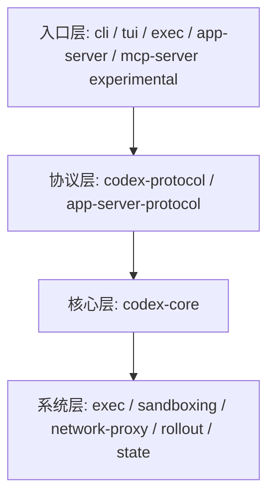
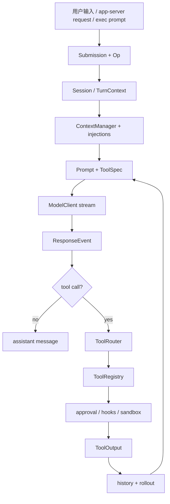

# 1. 概述：Codex 是一个 agent runtime

## 核心问题

为什么 Codex CLI 不是一个简单的终端聊天程序？因为它实现的是一个可以被多种前端复用的 agent runtime。终端只是入口之一，`codex exec`、app-server、实验性的 MCP server、桌面应用和 IDE 都在不同程度上复用同一套核心。

## 源码入口

- `README.md`：项目定位和安装方式
- `codex-rs/README.md`：Rust CLI 和关键 crate 总览
- `codex-rs/Cargo.toml`：workspace 成员
- `codex-rs/core/README.md`：核心 crate 的平台假设
- `codex-rs/core/src/lib.rs`：`codex-core` 对外暴露的模块

## 四层结构

入口层负责把外部世界接进来。`cli` 解析命令行，`tui` 负责终端交互，`exec` 负责非交互自动化，`app-server` 提供 JSON-RPC，实验性的 `mcp-server` 把 Codex 暴露给其他 MCP client。

协议层负责把这些入口统一成类型。`codex-protocol` 定义核心 agent 的 `Op` 和 `Event`，`app-server-protocol` 定义前端和 app-server 的 JSON-RPC 消息。

核心层负责 agent 真正的行为。`codex-core` 里有 `ThreadManager`、`CodexThread`、`Session`、模型客户端、工具路由、上下文、记忆、插件、技能和安全策略。

系统层负责和操作系统打交道。命令执行、沙箱、网络代理、会话记录、SQLite 状态库都在这里。

## 关键 crate 速读

| crate | 先读什么 | 解决的问题 |
|-------|----------|------------|
| `protocol` | `src/protocol.rs` | 核心输入输出协议 |
| `core` | `src/session/turn.rs` | agent loop 和会话状态 |
| `tools` | `README.md` | 工具定义和 schema |
| `cli` | `src/main.rs` | 命令行入口和子命令分发 |
| `tui` | `src/` | 终端 UI 和事件渲染 |
| `exec` | `src/lib.rs` | headless 模式和 JSONL 输出 |
| `app-server` | `src/codex_message_processor.rs` | 多前端 JSON-RPC 服务 |
| `mcp-server` | `src/message_processor.rs` | Codex 作为实验性 MCP server |
| `sandboxing` | `src/manager.rs` | 平台沙箱选择和命令转换 |
| `network-proxy` | `README.md` | 网络访问控制 |

## workspace 为什么这么大

本版核对快照里，`codex-rs/` 下可以找到 78 个 `Cargo.toml`。这不是因为核心 agent loop 需要 78 个 crate，而是因为 Codex 把本地 runtime 的边界拆得很细：

| 分组 | 代表 crate | 为什么要拆出来 |
|------|------------|----------------|
| 入口 | `cli`、`tui`、`exec`、`app-server`、`mcp-server` | 不同前端复用 core |
| 协议 | `protocol`、`app-server-protocol`、`exec-events` 相关模块 | 类型生成、JSONL、JSON-RPC 边界 |
| 核心状态 | `core`、`rollout`、`state`、`thread-store` | turn、thread、持久化和索引 |
| 工具 | `tools`、`apply-patch`、`exec-server`、`file-search` | 工具 schema、执行和专用能力 |
| 安全 | `sandboxing`、`linux-sandbox`、`windows-sandbox-rs`、`network-proxy`、`execpolicy` | 平台隔离、网络控制、命令策略 |
| 扩展 | `codex-mcp`、`rmcp-client`、`skills`、`plugin`、`hooks` | MCP、skills、plugins、hooks 生命周期 |
| 观测与产品支撑 | `analytics`、`otel`、`models-manager`、`login` | 登录、模型目录、埋点和诊断 |

读源码时不需要一开始理解所有 crate。可以先抓住 `protocol -> core -> tools -> sandboxing -> app-server/exec` 这条主线。其他 crate 多数是在给这条主线补平台、协议、扩展或产品能力。

## 五条主设计原则

Codex 的架构可以用五条原则概括：

1. 协议先行：外部世界只通过 `Submission` 进来，通过 `Event` 出去。
2. 工具集中管控：模型提出工具调用，执行前必须经过 router、registry、hook、approval、sandbox 等边界。
3. 状态分层：prompt history、rollout、SQLite state、memory 不混成一份聊天记录。
4. 多入口复用：CLI、TUI、exec、app-server、实验性 MCP server 都围绕 core runtime 构建。
5. 扩展按生命周期分层：config、AGENTS.md、skills、plugins、hooks、MCP、apps 各有进入 runtime 的位置。

这些原则也解释了 Codex 为什么比 demo 难读。它不是为了展示一次模型调用，而是在处理“一个本地 agent 长期运行在用户工作区里”这件事。

## 一次请求穿过哪些层

这条链路里，模型只占中间一段。Codex 真正的工程量在模型前后的系统：输入如何排队、上下文如何构造、工具如何安全执行、输出如何流式通知、状态如何落盘、失败后如何恢复。

## 设计取舍

Codex 选择 Rust 不是表面风格问题。单二进制分发、平台沙箱、异步 I/O、跨平台命令执行都更适合放在一个 native runtime 里做。代价是模块数量和编译复杂度都变高，读源码时要先建立地图，否则很容易在近 80 个 crate 之间迷路。

另一个明显取舍是协议先行。很多 agent 会把 UI 和 agent loop 直接写在一起，Codex 则把 `Submission` 和 `Event` 作为硬边界。这个边界增加了类型和事件数量，但换来的是多前端复用、可测试性和可恢复性。

## 如果自己做 Agent，可以学什么

不要一开始就堆功能。先把系统切成三层：外部入口、核心协议、工具运行时。只要这个边界稳，后面加 TUI、HTTP API、MCP、桌面应用都不会逼你重写 agent loop。

Codex 还提醒了一件事：coding agent 的难点不只是模型推理，而是模型推理旁边的工程边界。工具执行、安全、上下文、持久化和用户交互，任何一块没做好，都会让 agent 看起来不可靠。
