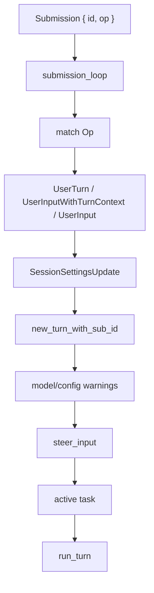
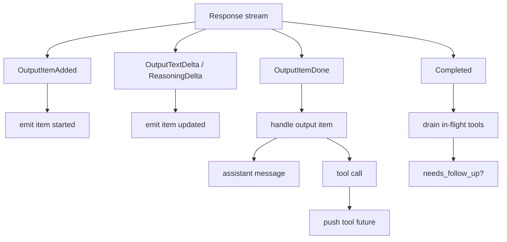
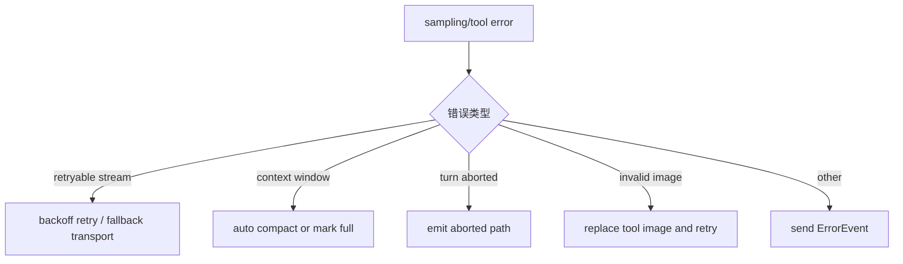

# 2. Agent Loop：从一次输入到多轮工具调用

## 核心问题

Codex 如何把一句用户请求变成多轮模型调用和工具执行？答案在 `codex-rs/core/src/session/turn.rs`。这里的 `run_turn` 是普通任务的核心循环，模型每次返回工具调用，Codex 就执行工具、记录结果，再继续下一次模型请求。

## 源码入口

- `codex-rs/core/src/session/handlers.rs`：`submission_loop`
- `codex-rs/core/src/session/turn.rs`：`run_turn`、`run_sampling_request`、`try_run_sampling_request`
- `codex-rs/core/src/stream_events_utils.rs`：处理模型流式事件和输出项
- `codex-rs/core/src/tools/parallel.rs`：工具调用运行时
- `codex-rs/core/src/tasks/`：不同类型的 session task

## 总流程

```mermaid
sequenceDiagram
    participant Client as TUI / App Server / Exec
    participant Loop as submission_loop
    participant Task as SessionTask
    participant Turn as run_turn
    participant Model as ModelClient
    participant Tools as Tool runtime

    Client->>Loop: Submission { Op::UserTurn }
    Loop->>Task: spawn regular task
    Task->>Turn: run_turn(input)
    Turn->>Turn: context updates / hooks / user message
    Turn->>Model: stream prompt + tools
    Model-->>Turn: response events
    Turn->>Tools: tool call futures
    Tools-->>Turn: tool outputs
    Turn->>Turn: append outputs to history
    Turn->>Model: follow-up request
    Model-->>Turn: final assistant message
    Turn-->>Client: TurnCompleted event
```

这张图只画主路径。源码里还要处理几类旁路：中断、审批响应、pending input、hook 阻断、stream 重试、上下文压缩、stop hook 继续执行。读 `turn.rs` 时可以把它拆成三层循环：

| 层级 | 关键函数 | 主要职责 | 不该承担的事 |
|------|----------|----------|--------------|
| Submission loop | `submission_loop` | 接收 `Submission`，按 `Op` 分发 | 不直接调用模型 |
| Turn loop | `run_turn` | 管理一次用户回合里的多次采样、pending input、压缩和 stop hook | 不关心每个工具怎么实现 |
| Sampling loop | `try_run_sampling_request` | 消费模型流事件，把输出项转成 UI 事件和工具 future | 不决定全局 session 生命周期 |

这个分层是 Codex 比 demo loop 深的地方。demo 常见写法是一个 `while` 里同时读用户输入、请求模型、执行工具、打印结果。Codex 把控制消息、模型采样和工具执行分开后，才能支持“模型还在跑时用户发中断”“工具等审批时 UI 继续活着”“stream 断线后重连但不丢 turn 状态”这些真实产品场景。

## 一次 UserTurn 的真实调用链

`Op::UserTurn` 进入 `submission_loop` 后，会被送到 `user_input_or_turn`。这个函数先把 turn-scoped 配置整理成 `SessionSettingsUpdate`，再调用 `new_turn_with_sub_id` 建立新的 turn context。之后才会把用户输入交给 `steer_input`，让它进入当前任务。



这里有一个容易忽略的细节：`UserTurn` 带完整的 `cwd`、`approval_policy`、`sandbox_policy`、`model`、`effort`、`service_tier`、`collaboration_mode` 等字段。`UserInput` 是更旧、更轻的入口，依赖 session 里的持久上下文。app-server 或桌面前端如果希望每一轮都能精确控制环境，应该优先理解 `UserTurn` 和 `UserInputWithTurnContext`。

## run_turn 之前先解决上下文注入

`run_turn` 一开始并不会立刻请求模型。它先处理几类“模型前置输入”：

- 根据模型窗口和上一次模型设置判断是否要 pre-sampling compact
- 记录 turn context update，并维护 `reference_context_item`
- 从输入里收集显式 plugin、skill、app/connector mentions
- 解析 skill 依赖，必要时提示安装 MCP 依赖
- 运行 session start hook 和 user prompt submit hook
- 把 skill/plugin 注入项写入 history
- 启动 ghost snapshot 或 turn diff 相关状态

这些动作解释了为什么 Codex 的上下文不只是聊天历史。模型真正看到的是当前 history、base instructions、turn context diff、skill/plugin 注入、工具 specs 和可能的额外上下文的组合。`run_turn` 的主循环之前做这么多准备，是为了让每次采样都建立在当前配置、项目规则和扩展状态上。

## 外层：submission_loop 只做分发

`submission_loop` 在 `session/handlers.rs` 里。它不直接跑模型，而是把不同 `Op` 分发给不同处理器。

常见分支包括：

- `Op::UserInput` / `Op::UserTurn`：开始一个普通用户回合
- `Op::Interrupt`：中断当前回合
- `Op::Compact`：触发上下文压缩
- `Op::ExecApproval` / `Op::ApplyPatchApproval`：把用户审批结果送回等待中的工具调用
- `Op::Shutdown`：关闭 session loop

这个分发层让审批、中断、压缩和普通输入都走同一条队列。工具等待审批时，整个 runtime 仍然可以处理新的控制消息。

## 中层：SessionTask 管生命周期

普通用户请求不会直接调用 `run_turn`。它会被包装成 session task。task 做几件 `run_turn` 之外的事：

- 发出 `TurnStarted` 事件
- 准备或复用模型连接
- 处理 pending input
- 在回合结束后整理最终状态

这样 `run_turn` 可以专注于单个回合的模型循环，不需要承担整个 session 的生命周期。

## 内层：run_turn 管模型和工具循环

`run_turn` 的核心可以简化成：

```text
prepare turn context
record user input and context updates

loop:
  input = history.for_prompt()
  result = run_sampling_request(input, tools)
  if result.needs_follow_up:
    continue
  run stop hooks
  if stop hook asks to continue:
    continue
  break
```

`needs_follow_up` 是这条循环最重要的信号。模型返回普通文本时，回合可以结束；模型返回工具调用时，工具结果会写入历史，下一次模型请求继续处理。

`run_turn` 里有几组状态值得重点看：

| 状态 | 作用 | 为什么重要 |
|------|------|------------|
| `client_session` | turn-scoped 模型连接，会复用 sticky routing / websocket 状态 | stream 重试时不必重建所有状态 |
| `can_drain_pending_input` | 控制用户运行中追加的输入何时进入 history | 避免新输入插到本轮采样之前 |
| `turn_diff_tracker` | 跟踪本轮文件差异，用于 UI 和 turn diff event | 让前端看到本轮实际改了什么 |
| `stop_hook_active` | 防止 stop hook 继续执行时丢状态 | hook 可以要求模型继续补一轮 |
| `last_agent_message` | 保存最终 assistant 文本 | stop hook 和 after-agent hook 会用 |

`pending_input` 是这一章最容易漏掉的点。用户在模型运行期间继续输入时，Codex 不会无脑把它插进当前 prompt。它会先通过 `inspect_pending_input` 交给 hook 检查，允许的输入记录到 history，被阻断的输入会带额外上下文或重新排队。这个机制让前端可以支持“运行中继续说话”，同时不破坏当前采样边界。

## run_sampling_request 做两件事

`run_sampling_request` 负责构建请求并处理重试。

第一步是构建工具。它会根据当前配置、MCP 状态、动态工具、技能和功能开关生成 `ToolRouter`。模型看到的工具列表不是固定的，而是每个回合根据上下文组装。

第二步是构建 prompt。prompt 包含对话历史、工具定义、base instructions、人格和结构化输出 schema 等。这里的关键不是把所有东西都塞进去，而是把当前回合需要的东西按协议格式交给模型客户端。

`run_sampling_request` 还有一个产品级细节：它在 stream 断开时会按 provider 的重试预算重连。如果 websocket 连续失败，`ModelClientSession` 可以切到 fallback transport，并通过 `StreamError`/`Warning` 把状态告诉前端。这样用户看到的不是静默卡住，而是一次可解释的恢复过程。

## try_run_sampling_request 处理流式事件

模型输出是流式的。`try_run_sampling_request` 需要边收事件边更新 UI，并在输出项完成时判断是否要执行工具。



`OutputItemDone` 是关键分支。普通消息会被记录为 assistant message；工具调用会交给 `ToolRouter::build_tool_call`，然后放入工具运行时。工具执行结束后，结果会作为新的历史项进入下一轮模型请求。

## ResponseEvent 如何变成前端事件

模型客户端返回的是 `ResponseEvent`，前端看到的是 `EventMsg` 或 app-server 映射后的 item 事件。`try_run_sampling_request` 中几个事件最关键：

| `ResponseEvent` | 处理动作 | 结果 |
|-----------------|----------|------|
| `OutputItemAdded` | 建立 `active_item`，必要时创建 tool argument diff consumer | UI 收到 item started |
| `OutputTextDelta` | 解析 assistant 文本片段或 reasoning delta | UI 实时显示文本 |
| `ToolCallInputDelta` | 把工具参数增量交给 diff consumer | `apply_patch` 等工具可以边流式展示结构化变化 |
| `OutputItemDone` | 调用 `handle_output_item_done` | 文本落 history，工具变成 future |
| `Completed` | 更新 token usage，设置 turn diff 标记 | 判断是否需要 follow-up |

这里能看到 Codex 的事件粒度。工具参数还没完全结束时，UI 就可能获得局部结构化更新；模型完成一个输出项时，工具 future 可以进入 `FuturesOrdered`；整个 response 完成后，再统一判断是否需要下一次采样。

## follow-up 的几种来源

`needs_follow_up` 不只代表工具调用。源码里至少有几类继续点：

- 模型返回工具调用，工具输出写回 history 后需要下一次模型请求
- Responses API 的 `end_turn` 为 `false`
- 本轮采样结束后发现有 pending input
- mailbox 有待处理消息，尤其是多 agent 相关场景
- token 到达 auto compact 阈值，同时还有后续工作要做
- stop hook 要求把额外 prompt 写入 history 并继续

这比简单的“有 tool call 就 loop”更接近真实 agent。Codex 的主循环本质上在问：当前 history 里是否已经包含足够信息，可以结束这个 turn；如果不能，就继续采样，但继续之前可能要先压缩、先记录 hook prompt、或先处理 pending input。

## 中断和失败路径

`try_run_sampling_request` 被取消时返回 `CodexErr::TurnAborted`，`run_turn` 会把它当成已报告的中断处理。图片不合法时，Codex 会尝试把最近工具输出里的图片替换成替代文本再继续，避免坏图片污染后续请求。普通错误会转成 `ErrorEvent` 发给前端，让用户还能继续会话。



这种失败路径是深读 Codex 时很值得看的部分。生产级 agent 的复杂度往往不在 happy path，而在工具执行一半、stream 掉线、上下文满、用户中断、hook 阻断这些边界上。

## 设计取舍

Codex 没有把工具执行嵌在模型流处理里同步等待。它用 future 管理 in-flight 工具，流结束后再 drain。这让多个工具调用可以并行运行，也让 UI 能持续收到模型文本和工具状态。

另一个重要取舍是所有状态变更都围绕 history 发生。模型只通过历史和工具结果观察世界，工具执行不直接修改模型内部状态。这个约束让回放、压缩、持久化和调试都有统一基础。

## 如果自己做 Agent，可以学什么

先不要急着做复杂 UI。把 agent loop 写成清楚的四段：收输入、构建 prompt、处理模型流、分发工具。只要 `needs_follow_up` 这个信号清晰，复杂工具和长任务都能自然接进去。

同时要把控制消息和普通用户消息放到同一条可排序队列里。中断、审批、压缩都是 agent runtime 的一部分，不应该散落在 UI 回调里。
