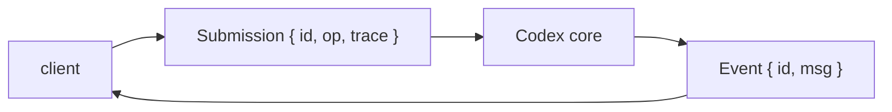
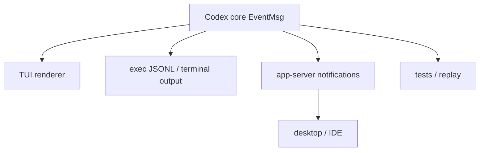

# 3. 协议层：Op、Submission 和 Event

## 核心问题

Codex 如何让 TUI、`codex exec`、app-server 和实验性 MCP server 共用同一个核心？靠的是协议层。`codex-rs/protocol/src/protocol.rs` 定义了核心 agent 的输入和输出：外部提交 `Submission`，核心发出 `Event`。

## 源码入口

- `codex-rs/protocol/src/protocol.rs`
- `codex-rs/protocol/src/items.rs`
- `codex-rs/app-server-protocol/`
- `codex-rs/exec/src/exec_events.rs`
- `codex-rs/core/src/codex_thread.rs`

## Submission Queue / Event Queue

源码注释里明确提到 SQ / EQ 模式。SQ 是提交队列，EQ 是事件队列。



`Submission` 有三个字段：

- `id`：一次提交的关联 ID
- `op`：实际操作
- `trace`：可选 W3C trace context

`Event` 也有 ID 和消息体。这样前端可以把模型输出、工具状态、审批请求、错误、token 使用量等都当作事件处理。

这个 ID 不是装饰字段。工具等待审批、用户中断、app-server 多 thread 并发、`exec --json` 输出事件流时，都需要用提交 ID 或 turn ID 把事件归到正确的操作上。`Submission` 里的 `trace` 则把 W3C trace context 带进异步分发路径，方便跨队列跟踪一次请求。

SQ / EQ 模式带来的一个好处是 backpressure 和中断都更自然。前端不需要拿到 core 的内部锁，只要继续投递 `Op::Interrupt` 或 approval response；core 也不需要知道前端是 TUI、desktop，还是 app-server client。

## Op 是外部能请求的事

`Op` 是一个 tagged enum。它不是只包含用户消息，还包含 session 控制、审批、压缩、MCP、实时对话等操作。

常见类别：

| 类别 | 代表 Op | 含义 |
|------|---------|------|
| 用户输入 | `UserInput`、`UserTurn`、`UserInputWithTurnContext` | 开始或继续一个用户回合 |
| 控制 | `Interrupt`、`Shutdown`、`Compact`、`Undo` | 控制 session 生命周期 |
| 审批 | `ExecApproval`、`ApplyPatchApproval` | 回应工具执行请求 |
| 上下文 | turn context overrides | 更新 cwd、model、approval、sandbox 等 |
| 实时 | `RealtimeConversationStart` 等 | 语音或实时对话 |
| MCP | `RefreshMcpServers` 等 | 刷新外部工具连接 |

`UserTurn` 比旧的 `UserInput` 更完整，因为它把 cwd、approval policy、sandbox policy、model、reasoning effort 等回合上下文一起带上。这样 app-server 和其他前端不需要依赖隐式全局状态。

更细一点看，`Op` 可以分成三种性质：

| 性质 | 例子 | 是否进入模型 |
|------|------|--------------|
| steerable input | `UserInput`、`UserTurn` | 通常会进入 agent loop |
| control plane | `Interrupt`、`Shutdown`、`OverrideTurnContext`、`ReloadUserConfig` | 不直接进入模型 |
| response to pending runtime request | `ExecApproval`、`PatchApproval`、`RequestPermissionsResponse`、`DynamicToolResponse`、`ResolveElicitation` | 唤醒等待中的工具或外部请求 |

这个分类比枚举名更重要。Codex 把用户输入、控制命令和审批回复放进同一条 submission queue，是为了保证顺序和一致性。比如 `UserInputWithTurnContext` 把上下文更新和用户输入合在一个 op 里，避免先更新 context 成功、后续输入却因为队列或验证失败而没有启动。

## UserTurn 为什么带这么多字段

`UserTurn` 里包含 `cwd`、`approval_policy`、`approvals_reviewer`、`sandbox_policy`、`permission_profile`、`model`、`effort`、`summary`、`service_tier`、`collaboration_mode`、`personality`、`environments` 等字段。看起来很重，但它解决的是多前端一致性。

如果前端只传一段文本，core 必须从 session 全局状态里猜当前 cwd、模型和权限。TUI 还能靠本地状态凑合，app-server、desktop、IDE、自动化客户端同时存在时，这种隐式状态很容易错位。`UserTurn` 把一次 turn 的关键执行上下文显式化，让 core 能在 `new_turn_with_sub_id` 阶段统一验证和落盘。

`UserInputWithTurnContext` 是折中形态：它只传要覆盖的字段，并和用户输入在同一个 queued operation 里提交。这样可以避免“先发 OverrideTurnContext，再发 UserInput”之间被其他 op 插队。

## EventMsg 是核心对外说话的方式

`EventMsg` 包含了 UI 和自动化工具需要观察的所有状态。它可以表示：

- session 配置完成
- 用户消息记录完成
- assistant 文本增量
- reasoning summary
- 工具调用开始、更新、完成
- exec 输出流
- 审批请求
- MCP 启动状态
- turn 完成、失败、中断
- token 使用量更新

这让 UI 不需要进入核心内部读取状态。只要订阅事件，就能重建用户看到的过程。

`EventMsg` 大致可以按事件族理解：

| 事件族 | 代表事件 | 用途 |
|--------|----------|------|
| lifecycle | `SessionConfigured`、`TurnStarted`、`TurnComplete`、`TurnAborted` | 前端控制 turn 状态 |
| message stream | `AgentMessageDelta`、`AgentMessageContentDelta`、`ReasoningContentDelta` | 渲染模型流式输出 |
| tool execution | `ExecCommandBegin`、`ExecCommandOutputDelta`、`ExecCommandEnd`、`PatchApply*`、`McpToolCall*` | 展示工具执行过程 |
| approval / elicitation | `ExecApprovalRequest`、`ApplyPatchApprovalRequest`、`RequestPermissions`、`ElicitationRequest` | 等待用户或外部系统决策 |
| state updates | `TokenCount`、`ContextCompacted`、`ThreadRolledBack`、`ThreadNameUpdated` | 同步长期状态 |
| diagnostics | `Warning`、`StreamError`、`DeprecationNotice`、`GuardianAssessment` | 让失败和风险可见 |

事件族越多，协议越厚；但这正是多前端所需的最小语言。TUI 可以把 `ExecCommandOutputDelta` 渲染成终端输出，`exec --json` 可以原样吐 JSONL，app-server 可以转成 `item/*` notification。不同前端展示不同，但都不需要重新实现 agent core。

## CodexThread 是协议友好的封装

`codex-rs/core/src/codex_thread.rs` 里的 `CodexThread` 是对 `Codex` 的一层封装。它暴露的方法很像一个异步端口：

```rust
pub async fn submit(&self, op: Op) -> CodexResult<String>
pub async fn next_event(&self) -> CodexResult<Event>
pub async fn shutdown_and_wait(&self) -> CodexResult<()>
```

这三个方法足够表达主循环：提交操作、等待事件、关闭线程。额外方法则服务于 app-server 和线程管理，比如读取 MCP resource、调用 MCP tool、更新 memory mode、读取 config snapshot。

`CodexThread` 还暴露了 `steer_input`、`validate_turn_context_overrides`、`set_thread_memory_mode`、`agent_status` 等方法。这些方法说明 thread 不是单纯 event stream，它还有可查询、可校验、可恢复的运行状态。app-server 用这些方法把 JSON-RPC API 映射回 core，而不是绕过 core 直接改内部字段。

## 协议如何支撑 app-server 和 exec

`codex-rs/app-server/README.md` 把核心概念进一步映射成 Thread、Turn、Item。app-server 面向的是富客户端，所以它关心 thread list、turn start、item delta、fork、rollback、archive、compact 等 API。底层仍然要落回 `CodexThread::submit` 和 `next_event` 这类能力。

`codex exec` 则走另一个方向：它不需要交互 UI，但需要稳定的 headless 事件输出。`codex-rs/exec/src/exec_events.rs` 会把 core events 转成 exec 模式的 JSONL 或终端输出。这个模式证明协议不是只服务 UI，它也服务自动化和脚本集成。



如果没有这层协议，每个入口都要自己理解 `run_turn` 内部状态。那样一旦 agent loop 变动，TUI、exec、desktop 和 IDE 都要一起改。

## 为什么协议层要这么厚

简单 agent 可以直接调用函数：

```text
answer = agent.run(prompt)
```

Codex 不能这么做，因为它要处理长时间运行的工具、用户中断、审批弹窗、多前端订阅、token 更新、压缩、恢复和错误事件。同步函数调用表达不了这些中间状态。

事件协议的代价是类型很多，但收益很直接：

- UI 可以实时渲染，而不是等最终结果
- `exec --json` 可以输出结构化 JSONL
- app-server 可以把同一套事件转成 JSON-RPC notification
- 测试可以喂入 `Op`，断言输出 `Event`
- session 可以被恢复、fork 或回放

## 设计取舍

协议层把内部实现暴露成稳定-ish 的事件语言，但也带来维护压力。每增加一种能力，往往要同时考虑核心 `EventMsg`、app-server protocol、TUI 渲染和 exec JSONL 输出。

Codex 的选择是接受这种显式复杂度，换取多入口一致性。对于一个只服务单一 CLI 的工具，这可能太重；对于一个同时面对终端、桌面、IDE 和自动化的 agent，这个边界很有价值。

## 如果自己做 Agent，可以学什么

如果你的 agent 只会在一个函数里跑完，函数返回值就够了。如果它需要 streaming、审批、中断和多前端，尽早设计事件协议。不要等 UI 和核心互相调用到打结以后再抽象。

最小版本不需要复制 Codex 的所有事件。可以先定义三类：生命周期事件、消息事件、工具事件。等需求出现，再扩展审批、压缩和状态同步。
