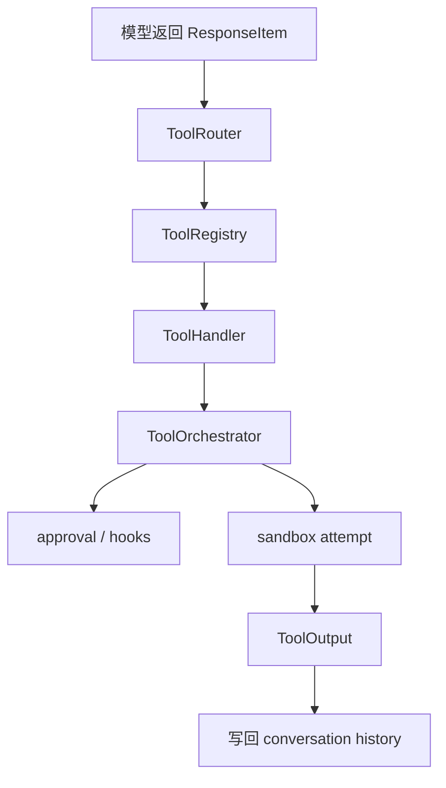
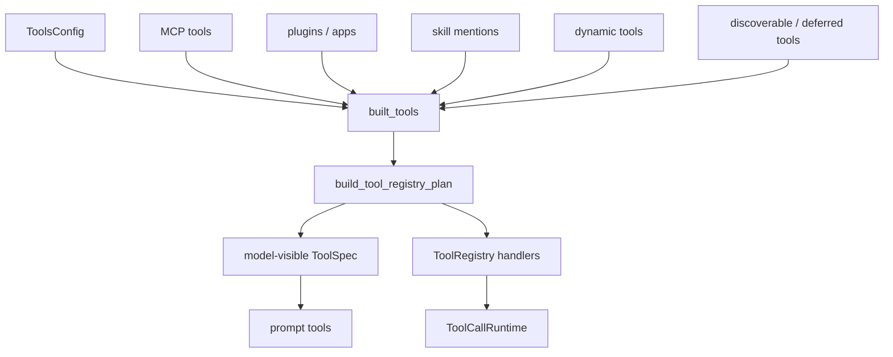
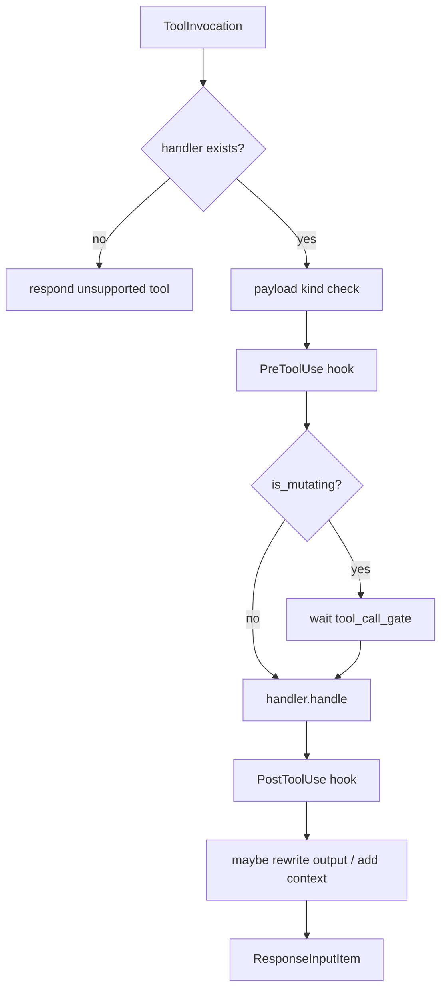
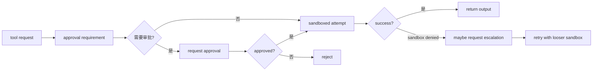
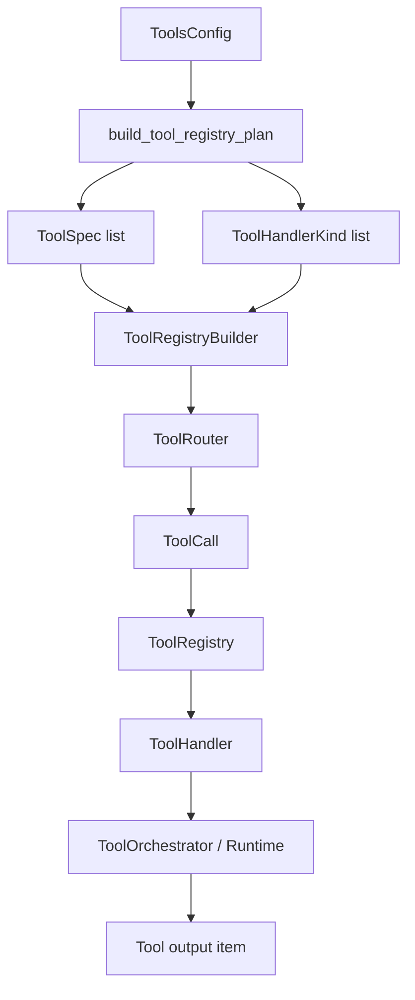
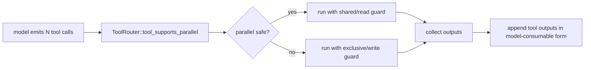
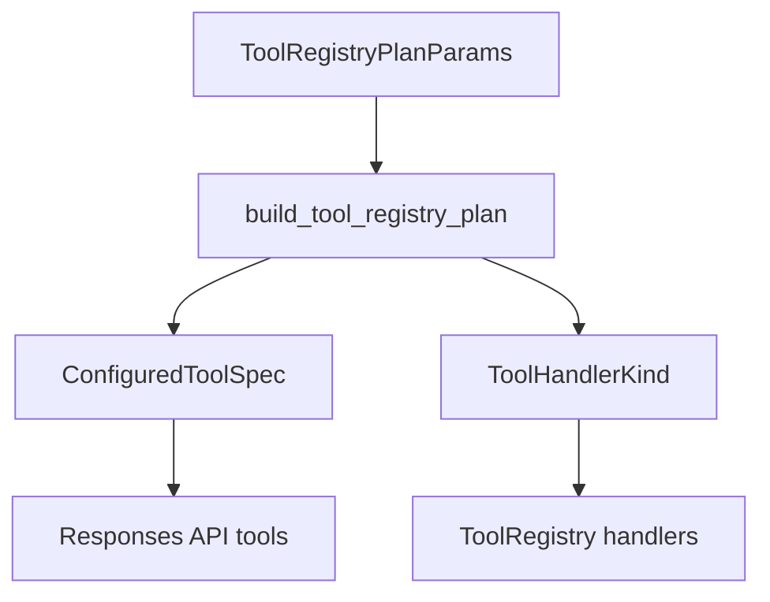
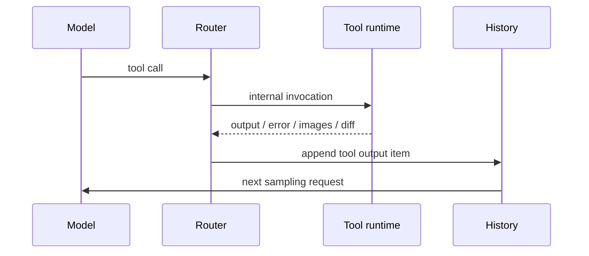

# 4. 工具系统：模型如何真正改动世界

## 核心问题

模型本身只能生成文本。Codex 能读文件、跑命令、应用 patch、调用 MCP，是因为工具系统把模型输出转换成受控执行。核心路径在 `codex-rs/core/src/tools/`。

## 源码入口

- `codex-rs/tools/README.md`：工具定义 crate
- `codex-rs/core/src/tools/router.rs`：`ToolRouter`
- `codex-rs/core/src/tools/registry.rs`：`ToolHandler` 和 `ToolRegistry`
- `codex-rs/core/src/tools/orchestrator.rs`：`ToolOrchestrator`
- `codex-rs/core/src/tools/parallel.rs`：并发工具运行时
- `codex-rs/core/src/tools/handlers/`：具体 handler

## 三层模型

第一层是工具定义。`codex-rs/tools/` 主要描述工具名称、说明、输入 schema 和模型可见规格。

第二层是路由。`ToolRouter` 根据模型返回的 `ResponseItem` 构造内部 `ToolCall`，再把调用交给 registry。

第三层是执行。每个工具类型实现 `ToolHandler`，真正执行前后会经过 registry、hook、orchestrator、审批和沙箱。

## 工具规格是每回合组装出来的

`run_sampling_request` 每次都会调用 `built_tools`。这一步不是简单读一份静态工具表，而是综合当前 turn 的配置和外部状态：

- MCP connection manager 当前列出的工具
- plugin 提供的 apps / MCP 能力
- 用户或 skill 显式提到的 connectors
- discoverable tools 和 deferred MCP tools
- dynamic tools
- unavailable dummy tools，用来给不可用工具返回解释性错误
- code mode 是否要过滤 nested tools

这个设计能解释 Codex 的一个重要特征：工具很多，但不一定全量暴露给模型。模型看到的是本轮需要的工具规格，registry 里也会注册一些延迟工具和兜底工具。这样可以降低 prompt 成本，也能给用户一个更清楚的错误反馈，比如某个 tool 被调用但当前环境不可用。

## ToolRouter 负责把模型语言变成内部调用

模型输出里可能出现不同类型的调用：普通 function call、本地 shell call、自定义工具、tool search、MCP 工具。`ToolRouter::build_tool_call` 的职责是把这些不同表示转换成统一的内部 `ToolCall`。

路由层不应该直接执行工具。它只回答两个问题：

- 这个输出项是不是工具调用？
- 如果是，它应该映射到哪个 handler 和 payload？

这让模型协议变化和工具执行实现之间有一个缓冲层。

`ToolCall` 只有三个核心字段：`tool_name`、`call_id`、`payload`。真正的差异都藏在 `ToolPayload` 里：

| 模型输出 | 内部 payload | 典型用途 |
|----------|--------------|----------|
| `FunctionCall` | `Function { arguments }` | 内置函数工具 |
| 命中 MCP tool info 的 `FunctionCall` | `Mcp { server, tool, raw_arguments }` | 外部 MCP 工具 |
| `ToolSearchCall` 且 `execution == "client"` | `ToolSearch { arguments }` | 动态发现工具 |
| `CustomToolCall` | `Custom { input }` | freeform / custom tools |
| `LocalShellCall` | `LocalShell { params }` | Responses API local shell |

这层转换非常关键。模型不应该知道每个 MCP server 的内部状态，也不应该直接决定某个 shell 调用怎样进 sandbox。它只生成协议层输出，router 把它翻译成 runtime 可控的内部调用。

## ToolRegistry 统一 handler

`ToolHandler` trait 定义了工具执行需要提供的接口，包括工具类型、是否会修改状态、如何处理调用、如何生成 hook payload 等。

这个 trait 的价值在于把内置工具和外部工具放到同一条运行路径里。shell、apply_patch、MCP、动态工具的来源不同，但在 registry 看来都是可分发的 handler。

`ToolRegistry::dispatch_any` 的生命周期比接口定义更重要。一次工具调用会经过这些步骤：

1. 找 handler，找不到就把 unsupported tool message 返回给模型。
2. 检查 handler kind 是否和 payload 类型兼容。
3. 如果 handler 暴露 `pre_tool_use_payload`，先跑 `PreToolUse` hooks。
4. 调用 `is_mutating`，mutating 工具要等待 turn 的 tool gate。
5. 记录 telemetry 和 tool dispatch trace。
6. 执行 handler。
7. 如果成功并且有 `post_tool_use_payload`，跑 `PostToolUse` hooks。
8. hook 可以追加上下文，也可以替换工具输出文本。
9. 把结果转换成模型可见的 `ResponseInputItem`。

这条路径说明 hooks 不只是外围通知。`PreToolUse` 可以阻断工具调用，`PostToolUse` 可以把反馈写回模型上下文，goal runtime 也会在工具完成后更新进度。工具系统因此变成 agent runtime 的中心通道，而不是“模型旁边的函数表”。

## ToolOrchestrator 管执行边界

`ToolOrchestrator` 是工具系统里最有工程味的部分。它不关心某个工具具体怎么做业务，而关心执行前后的边界：

- 是否需要审批
- 是否被 exec policy 或 hook 拒绝
- 选择哪个 sandbox
- 第一次 sandbox 失败后是否允许升级
- 执行结果如何转换成模型可见输出

这个设计避免每个工具自己实现一套审批逻辑。shell 和 apply_patch 都可以走统一的安全路径。

`ToolOrchestrator` 的顺序可以读成一条固定协议：

1. 问工具自己的 `exec_approval_requirement`，没有就用默认策略。
2. 如果策略要求审批，先走 permission hooks，再走 Guardian 或用户审批。
3. 选择第一次 sandbox，可能是平台 sandbox，也可能因为工具声明而直接无 sandbox。
4. 执行工具，并处理 immediate/deferred network approval。
5. 如果 sandbox denial 且工具允许升级，再构造 retry reason。
6. 必要时重新审批，然后用 `SandboxType::None` 做第二次尝试。

这条协议把“能不能执行”和“怎么执行业务”拆开。handler 负责业务，orchestrator 负责副作用边界。

## 并发控制

工具可以并行，但不是所有工具都能安全并行。`core/src/tools/parallel.rs` 管工具调用的并发执行，registry 和 handler 会标记工具是否 mutating。

一个实用原则是：读操作可以并行，写操作需要串行或更严格的互斥。Codex 通过工具运行时把这个原则落实到执行层，而不是只靠模型自觉不要同时改同一个文件。

`ToolCallRuntime` 的实现很直接：它持有一个 `RwLock<()>`。支持并发的工具拿 read lock，不支持并发的工具拿 write lock。MCP 工具还要看 server 配置里的 `supports_parallel_tool_calls`，不能只看工具名字。

这不是最复杂的调度器，但很实用。它让大量只读工具能并行，又给写操作一个默认互斥。更细粒度的文件级锁当然可以做，但第一层并发边界必须在 runtime，不应该交给模型自行管理。

## dynamic tools 和 tool_search

Codex 的工具系统还支持延迟发现。`build_specs_with_discoverable_tools` 会把 deferred MCP tools、deferred dynamic tools 转成 `tool_search` 的搜索条目。模型先调用 `tool_search`，再根据返回结果使用具体工具。

这背后的问题是 prompt 预算。外部 MCP server 可能提供很多工具，如果全部塞进模型输入，会快速消耗上下文，也会增加模型误选工具的概率。延迟加载相当于把工具列表做成索引，模型先查，再用。

如果自己做 agent，这个思路很值得学。工具数量少时可以静态暴露；工具数量变多后，需要 tool search、namespace、defer loading 或按场景过滤，不然工具系统会变成 prompt 噪声。

## 工具结果为什么要写回 history

模型执行工具以后不会自动知道结果。工具输出必须转换成 `ResponseItem` 或对应输出项，写回 conversation history。下一次模型请求才能看到观察结果。

这也是为什么 history normalization 很重要。只要出现 orphan tool call 或 orphan output，模型 API 可能拒绝请求，或者模型会看到不一致上下文。Codex 在构建 prompt 前会做归一化，保证发送给模型的历史结构合法。

## 工具系统的边界条件

深读工具系统时，不要只看成功路径。几个边界更能说明它的工程性：

| 边界 | 源码位置 | 意义 |
|------|----------|------|
| handler 不存在 | `ToolRegistry::dispatch_any` | 返回模型可理解的失败，而不是 runtime panic |
| payload 类型不匹配 | `matches_kind` | 防止 MCP payload 被内置 handler 误处理 |
| 工具被用户中断 | `ToolCallRuntime::aborted_response` | 给 shell 类工具返回稳定的中断输出 |
| hook 阻断 | `run_pre_tool_use_hooks` / `run_post_tool_use_hooks` | 让团队策略进入工具路径 |
| network approval | `tools/network_approval.rs` | 网络放行可能要等真实连接目标出现后再决策 |
| unavailable tool | `UnavailableToolHandler` | 给延迟或不可用工具一个可解释失败 |

这些细节决定了工具系统是不是能长期运行。功能 demo 可以只处理成功返回；生产 runtime 要把失败也转成模型和 UI 都能理解的事件。

## 设计取舍

Codex 把工具系统拆得比较细，初读时会觉得绕：router、registry、handler、orchestrator、parallel runtime 都在参与。但这个拆法让每层职责比较清楚。

如果所有逻辑都塞进 `run_tool_call`，短期会更好读，长期会变成难以测试的安全黑箱。尤其是审批、hook、sandbox 这些横切逻辑，一旦散到每个工具里，很容易漏。

## 如果自己做 Agent，可以学什么

工具系统至少要分成两层：工具识别和工具执行。识别层把模型输出变成内部调用，执行层做权限和副作用控制。

如果 agent 能写文件或跑 shell，就再加第三层 orchestrator。不要让每个工具自己决定要不要问用户、要不要进沙箱、失败后能不能重试。这些规则应该在一个地方统一。

## 工具系统的五段流水线

Codex 的工具系统可以按五段读，而不是只看 `ToolRouter`。

| 段 | 源码 | 关键问题 |
|----|------|----------|
| 组装 | `codex-rs/tools/src/tool_registry_plan.rs` | 当前 turn 让模型看到哪些工具 |
| 注册 | `codex-rs/core/src/tools/spec.rs` | 每个 spec 对应哪个 handler |
| 路由 | `codex-rs/core/src/tools/router.rs` | 模型返回的 item 怎么变成内部 `ToolCall` |
| 执行 | `codex-rs/core/src/tools/registry.rs` | handler 如何被调用，hook 如何接入 |
| 编排 | `codex-rs/core/src/tools/orchestrator.rs` | approval、sandbox、retry、输出事件如何统一处理 |

这五段拆开后，很多现象会变清楚：模型可见工具和 runtime 可执行能力不完全等价；MCP 工具和内置工具最终共享执行管道；动态工具可以晚一点被发现，但一旦加载，也要被转成 `ToolSpec` 和 handler。

## 工具清单为什么每轮生成

`build_tool_registry_plan` 的输入不只是配置文件。它还会看模型能力、feature flag、shell 类型、是否有本地环境、MCP 工具、deferred tools、dynamic tools、collab tools、goal tools、code mode 等。

| 输入 | 会影响什么 |
|------|------------|
| `has_environment` | 是否暴露 shell、apply_patch、view_image、list_dir 等本地工具 |
| `shell_type` | 暴露 `shell`、`shell_command`、`local_shell` 或 unified exec |
| `apply_patch_tool_type` | 用 freeform grammar 还是 JSON function |
| `mcp_tools` / `deferred_mcp_tools` | 直接暴露 namespace，或通过 `tool_search` 延迟加载 |
| `dynamic_tools` | app/connector/runtime 动态提供工具 |
| `multi_agent_v2` | 决定子 agent 工具形态和提示 |
| `goal_tools` | 决定是否暴露 goal runtime 工具 |

这种动态组装会增加阅读难度，但它解决了一个真实问题：同一个 Codex 可能运行在 CLI、desktop、IDE、headless、不同模型、不同权限环境里。固定工具表会让不该出现的工具进入 prompt，也会浪费上下文。

## 并发控制的边界

Codex 支持并行工具调用，但不是所有工具都能并行。`ToolRouter` 会根据 spec 和配置判断工具是否支持 parallel；`core/src/tools/parallel.rs` 再用读写锁一类的机制控制执行。

原则很简单：读世界可以并行，改世界要串行或经过更强约束。这个原则比具体实现更值得照抄。

## tool_search 的意义

`tool_search` 不只是搜索框。它是上下文预算机制。MCP、apps、connectors、dynamic tools 可能很多，如果全部展开给模型，工具 schema 会占掉大量 prompt。Codex 把一部分工具变成可搜索条目，模型需要时再加载。

| 直接暴露 | 延迟加载 |
|----------|----------|
| 模型马上能调用 | 模型先用 `tool_search` 找 |
| prompt 成本高 | prompt 成本低 |
| 适合少量核心工具 | 适合大量插件、MCP、connector |
| 工具列表变化会影响缓存 | 工具详情按需进入上下文 |

这和 skills 的懒加载思路类似：不要把可能有用的东西一次性塞进 prompt，而是在模型表现出明确需要时再给。

## Codex 和其他工具系统的比较边界

| 产品 | 公开可见相似点 | Codex 源码可学点 |
|------|----------------|------------------|
| Claude Code | 也有 shell、文件编辑、MCP、hooks 等能力 | Codex 能看到 `ToolSpec`、router、registry、orchestrator 的完整实现 |
| Aider | 强调 patch/diff 和 git 友好工作流 | Codex 把 patch 接入 approval、sandbox、hook、turn diff 和多前端事件 |
| Cursor / Cline / Roo | IDE 或插件形态里也有命令、编辑、MCP | Codex 的 app-server 让工具事件和 thread/item API 更集中 |

比较时要克制：闭源产品内部实现不能当事实。能写的是公开可见体验、官方资料和 Codex 源码里能确认的设计差异。

## 逐段源码走读：工具清单如何出现

### 1. `ToolsConfig` 收敛运行时差异

`ToolsConfig` 在 `codex-rs/tools/src/tool_config.rs`。它把模型能力、feature flag、shell 类型、是否启用 apply_patch、是否启用多 agent 等信息收敛成工具构建参数。工具清单不是随便从全局配置读出来，而是每轮根据当前环境计算。

| 字段或来源 | 影响 |
|------------|------|
| model info | 是否使用 local shell、apply_patch 形态、parallel tool call |
| feature flags | freeform patch、web search、code mode 等 |
| shell type | `shell`、`shell_command`、unified exec 的选择 |
| multi-agent config | v1/v2 工具、usage hint、metadata 展示 |
| environment | 是否允许本地工具出现在模型工具列表 |

### 2. `build_tool_registry_plan` 输出两类东西

`build_tool_registry_plan` 既输出 model-visible `ToolSpec`，也输出 handler 注册计划。这个双输出很重要：模型看到的是 schema，runtime 需要的是谁来执行。

如果只有 spec，没有 handler，模型会调用一个没人执行的工具。如果只有 handler，没有 spec，模型根本不知道工具存在。

### 3. `core/src/tools/spec.rs` 做 runtime 绑定

`core/src/tools/spec.rs` 把 plan 转成 `ToolRegistryBuilder`。这里能看到 apply_patch handler、dynamic tool handler、tool search handler、MCP handler 等如何注册到 registry。

| handler kind | 典型执行路径 |
|--------------|--------------|
| apply patch | parse patch、approval、runtime apply、diff tracking |
| dynamic tool | app-server 或 connector 提供的工具 |
| MCP | 发送到 MCP server，处理 tool result |
| tool search | 从 deferred MCP/dynamic entries 中返回 loadable spec |
| agent tools | 调用子 agent runtime |

### 4. `ToolRouter` 处理模型返回的多种 item

Responses API 返回的 tool call 不只有普通 function call，还可能有 local shell、namespace、tool search、freeform 等形态。`ToolRouter` 的价值是把这些外部形态统一成内部 `ToolCall` 或 payload。

| 外部形态 | 内部目标 |
|----------|----------|
| function call | 按 name 找 handler |
| namespace MCP call | 带 server/tool 命名空间 |
| freeform apply_patch | 转成 patch payload |
| local shell call | 转到 shell handler |
| tool_search | 返回 loadable tool specs |

## 工具结果为什么要回到模型历史

工具不是执行完就结束。模型下一步只能通过 history 看到工具结果，因此 tool output 的结构会直接影响下一轮推理。

这也是输出截断、图片处理、MCP result 转换、apply_patch diff 事件都必须谨慎的原因。工具输出一旦写进 history，就会影响后续模型判断和压缩结果。

## 自己实现时的最低安全线

| 能力 | 最小安全线 |
|------|------------|
| shell | timeout、cwd 限制、输出上限、危险命令审批 |
| file edit | 结构化 diff、执行前预览、按路径授权 |
| MCP | 明确 server 来源、输出按不可信内容处理 |
| dynamic tools | 工具名和 schema 要可审计，不允许静默覆盖内置工具 |
| web/image | 标明外部来源，避免把网页内容提升为系统指令 |
