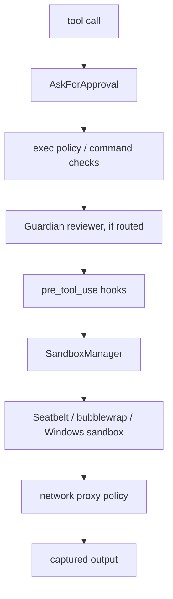
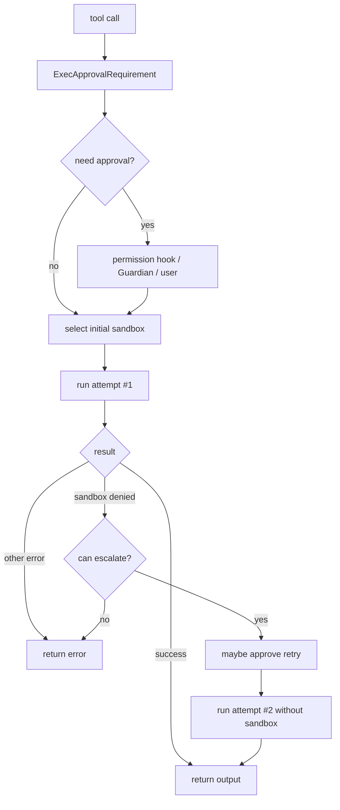

# 5. Sandbox 与安全：让工具执行有边界

## 核心问题

Codex 允许模型请求执行 shell、修改文件、调用外部工具。安全问题不是附加项，而是主路径的一部分。一次工具调用在真正执行前，会经过审批策略、exec policy、Guardian、hook、sandbox 和网络控制等多层边界。

## 源码入口

- `codex-rs/protocol/src/protocol.rs`：`AskForApproval`、`SandboxPolicy`
- `codex-rs/core/src/session/mod.rs`：审批请求和 Guardian 路由
- `codex-rs/core/src/guardian/`：Guardian 审批复核
- `codex-rs/core/src/tools/orchestrator.rs`：工具执行审批和升级
- `codex-rs/core/src/exec.rs`：命令执行请求、超时、输出收集
- `codex-rs/sandboxing/`：统一 sandbox manager
- `codex-rs/linux-sandbox/`、`codex-rs/windows-sandbox-rs/`
- `codex-rs/network-proxy/`

## 安全链路

不是每次调用都会经过所有层。比如只读工具可能不需要用户审批，某些环境可能没有启用网络代理。重要的是这些层都在工具路径上有明确位置，而不是散在提示词里。

## 审批策略

`AskForApproval` 定义模型请求工具时的默认策略。常见模式包括永不询问、失败时询问、非安全操作询问、总是询问等。具体策略会和 sandbox policy、permission profile、exec policy 共同决定一次工具调用能不能直接执行。

审批不是 UI 专属逻辑。工具可以异步发出审批请求，等待用户或自动 reviewer 的决定。等待期间，submission loop 仍然能处理其他 `Op`，比如中断。

`core/src/tools/sandboxing.rs` 里有一个更接近执行层的类型：`ExecApprovalRequirement`。它不是布尔值，而是三种结果：

| 结果 | 含义 | 后续动作 |
|------|------|----------|
| `Skip` | 不需要审批 | 直接进入第一次 sandbox attempt |
| `NeedsApproval` | 需要审批，可以带 reason 和 execpolicy amendment | 请求用户、hook 或 Guardian 决策 |
| `Forbidden` | 当前策略禁止执行 | 直接返回拒绝 |

默认策略也不是单看 `AskForApproval`。`default_exec_approval_requirement` 会把 approval policy 和 file-system sandbox policy 放在一起判断：`Never` / `OnFailure` 默认不问，`OnRequest` / `Granular` 在 restricted filesystem 下会问，`UnlessTrusted` 总是问。`Granular` 还可能因为配置不允许 sandbox approval prompt 而直接变成 `Forbidden`。

`ReviewDecision` 也不只是 approved / denied。它可以表达 `ApprovedForSession`、`ApprovedExecpolicyAmendment`、`NetworkPolicyAmendment`、`TimedOut`、`Abort` 等结果。这里能看到 Codex 的审批系统已经不是一个确认弹窗，而是一套会影响后续执行策略的控制协议。

## Guardian 是自动 reviewer

Codex 有一个 `guardian` 模块，用来把某些审批路由给自动 reviewer。它的作用不是替代所有安全边界，而是在用户审批和工具执行之间加一层模型辅助判断。

需要谨慎理解这层设计。Guardian 不是形式化验证，也不能保证命令安全。它更像一个降低审批疲劳的风险评估层。真正的硬边界仍然要靠 sandbox、policy 和用户授权。

Guardian 的源码注释很直接：它会过滤 transcript、构造待评估 action，要求独立 review session 输出结构化判断；超时、执行失败或输出无法解析时默认 fail closed。`core/src/guardian/review.rs` 里的 timeout message 还会提醒用户，不要因为自动 reviewer 超时就推断动作一定危险。

这层设计值得学的点是“自动审批也要可回退”。Guardian 可以降低人工审批负担，但它的结论仍然必须回到 `ReviewDecision`，并且要能被用户 override、被事件记录、被 circuit breaker 处理。自动 reviewer 如果直接执行命令，就会变成另一个没有边界的 agent。

## SandboxManager 统一平台差异

不同操作系统的沙箱能力差异很大。Codex 用 `sandboxing` crate 封装平台选择和命令转换，再由具体平台实现执行边界。

| 平台 | 主要机制 | 相关路径 |
|------|----------|----------|
| macOS | Seatbelt / `sandbox-exec` | `codex-rs/sandboxing/src/seatbelt.rs` |
| Linux | bubblewrap、Landlock、seccomp 相关路径 | `codex-rs/linux-sandbox/`、`codex-rs/sandboxing/` |
| Windows | restricted token、ACL、辅助进程 | `codex-rs/windows-sandbox-rs/` |

`core/src/exec.rs` 不直接拼平台命令。它构造 `ExecRequest`，交给 sandboxing 模块转换成具体可执行形式。这样核心执行路径可以保持平台无关。

`SandboxManager::select_initial` 的决策很小，但位置很关键。工具可以声明 sandbox preference：`Auto`、`Require`、`Forbid`。默认 `Auto` 会根据文件系统策略、网络策略和 managed network requirements 判断是否需要平台 sandbox；`Require` 会尽量选择当前平台沙箱；`Forbid` 直接无沙箱。

执行前还会做 policy transform。`SandboxTransformRequest` 同时携带 legacy `SandboxPolicy`、新的 file-system sandbox policy、network sandbox policy、additional permissions、cwd、Linux sandbox executable、Windows sandbox level 等信息。平台差异都被折叠进 `SandboxExecRequest`，这样上层工具不需要知道 macOS Seatbelt 参数、Linux helper 参数或 Windows restricted token 的细节。

## 第一次尝试和升级重试

`ToolOrchestrator` 的执行顺序可以概括成“先收紧，再按规则升级”。第一次尝试会选择当前策略允许的 sandbox。如果失败原因是 sandbox denial，且工具允许 `escalate_on_failure`，orchestrator 才会考虑第二次无 sandbox 尝试。

这条路径比“失败就 sudo”克制得多。`Never` 或部分 `OnRequest` 场景不会自动 retry without sandbox；strict auto-review 下，sandboxed attempt 的 approval 不覆盖无 sandbox retry，还需要重新评估。网络策略触发的 denial 也会先提取 host/protocol，构造更具体的 retry reason。

## 输出收集也是安全问题

命令输出可能很大，也可能卡住不结束。`core/src/exec.rs` 处理了几个容易被忽略的细节：

- 默认命令超时
- stdout/stderr 异步读取
- 输出大小上限
- 超时后杀进程组
- 子进程继承 pipe 导致读取挂住时的 drain timeout
- 实时输出 delta 事件数量上限

这些不是用户体验小优化。没有这些限制，一个简单命令就可能让 agent runtime 卡死或占满内存。

## 网络代理

Codex 还有 `network-proxy` crate，用来把网络访问纳入控制。它可以配合 sandbox 环境变量和策略，把命令发出的 HTTP/SOCKS 流量导向受控代理。

从 agent 安全角度看，文件系统和网络要一起管。只限制文件写入还不够，模型可以通过网络泄漏内容；只限制网络也不够，模型可以破坏本地文件。Codex 把两者都作为 sandbox policy 的一部分来处理。

网络审批比文件审批更麻烦，因为真实目标可能要到连接发生时才知道。`tools/network_approval.rs` 里有 immediate 和 deferred 两种模式：有些工具可以在执行前就知道请求目标，有些需要先注册 observer，等代理捕获 blocked request 后再完成审批。

网络审批还维护 session 级别的 approved/denied host cache。用户允许一次或允许本 session，会影响后续同 host/protocol/port 的决策。这个设计避免每次联网都弹窗，也避免一个笼统的“允许网络”把所有目标都放开。

## 安全边界之间怎么配合

把几层安全边界放在一起看，会更容易理解它们的职责：

| 边界 | 解决的问题 | 不能解决的问题 |
|------|------------|----------------|
| approval policy | 谁有权决定一次高风险动作 | 无法证明命令真的安全 |
| exec policy / shell command analysis | 已知命令模式的允许或拒绝 | 不能覆盖所有 shell 语义 |
| Guardian | 对计划动作做自动风险复核 | 不是形式化安全证明 |
| hooks | 团队或用户自定义拦截 | hook 本身也要可信 |
| OS sandbox | 限制文件和系统访问 | 平台能力不一致 |
| network proxy | 控制联网目标和协议 | 需要命令流量走受控路径 |
| output limits | 防止命令拖垮 runtime | 不能判断输出语义真假 |

Codex 的安全设计不是寻找一个万能开关，而是把模型产生的副作用分段拦截。每一层都不完美，但组合后能覆盖更多真实失败模式。

## 设计取舍

Codex 的安全系统比很多 CLI agent 重。它增加了代码量、平台分支和失败模式，但换来一个重要性质：工具执行不是信任模型，而是信任一组明确边界。

这也意味着本地体验会受到配置影响。不同操作系统、不同 sandbox 支持、不同审批策略下，同一个命令可能表现不同。Codex 接受这种复杂度，因为 coding agent 的权限太高。

## 如果自己做 Agent，可以学什么

只要 agent 能执行 shell，就不要把安全写成提示词里的禁止事项。至少需要三层：审批策略、命令执行隔离、输出和超时控制。

如果暂时做不到三平台原生沙箱，也可以先从最小硬边界开始：限定 cwd、默认禁止网络、命令超时、输出上限、写操作必须人工确认。后续再把规则收敛到统一 orchestrator。
