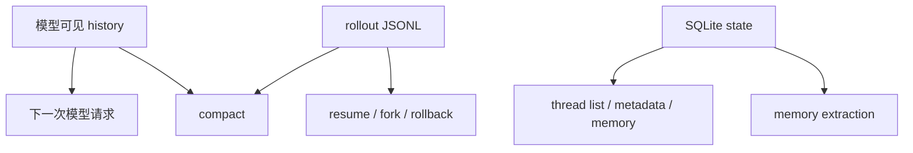
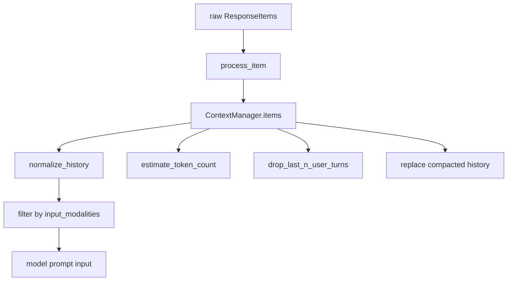
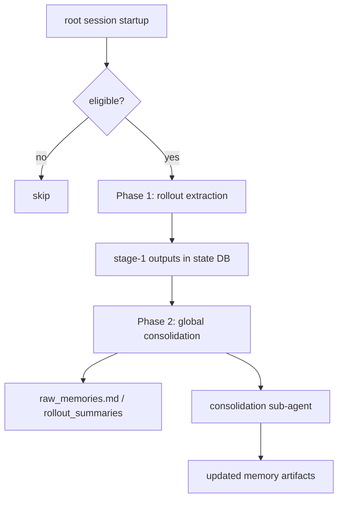
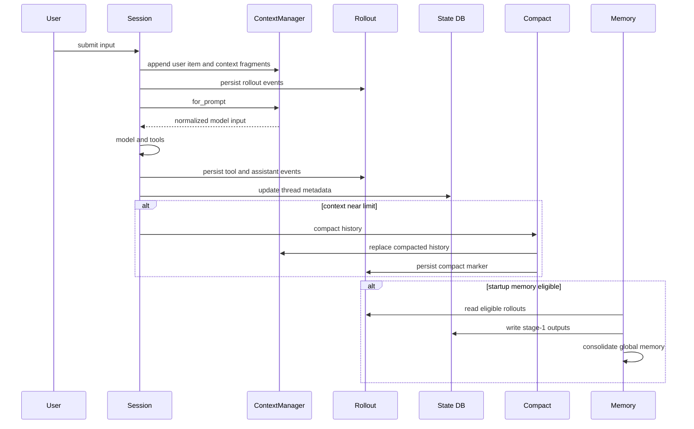
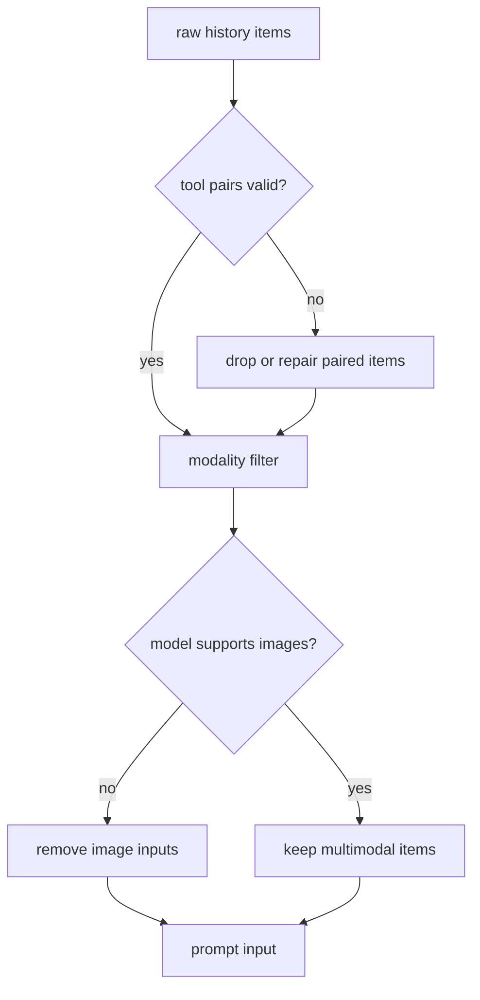
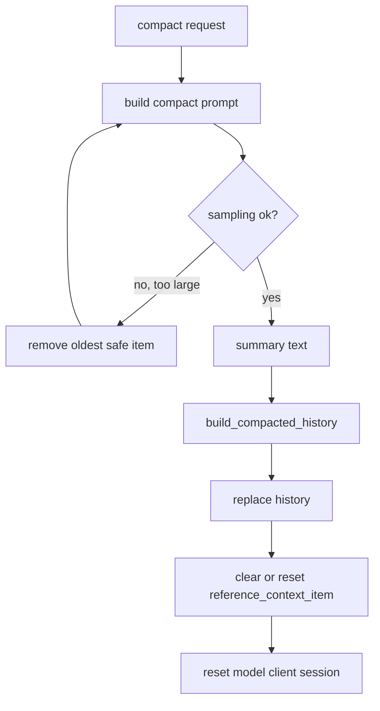
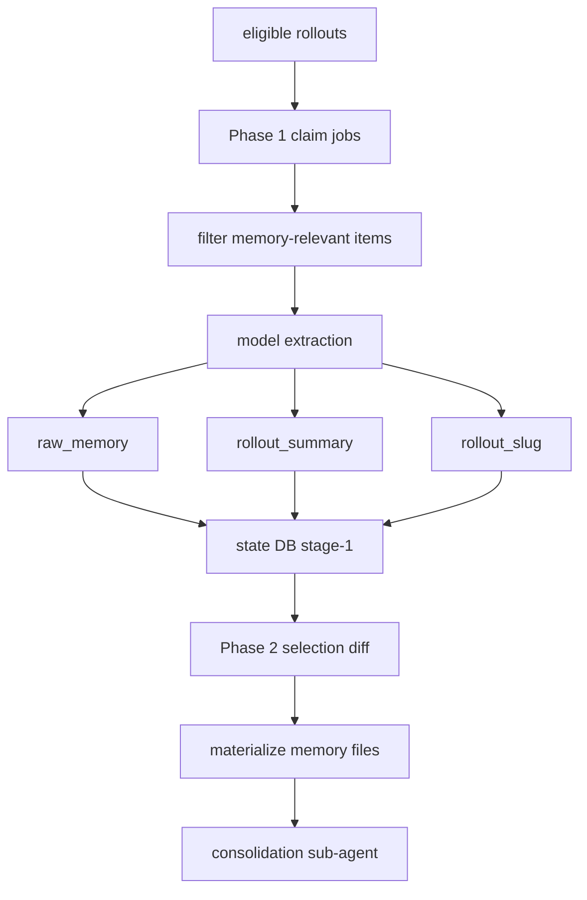
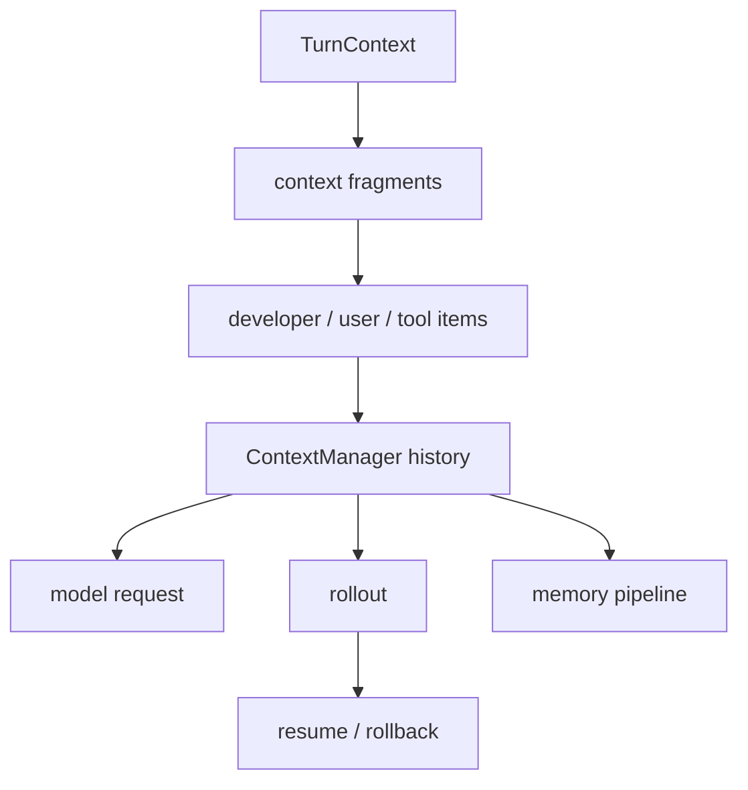
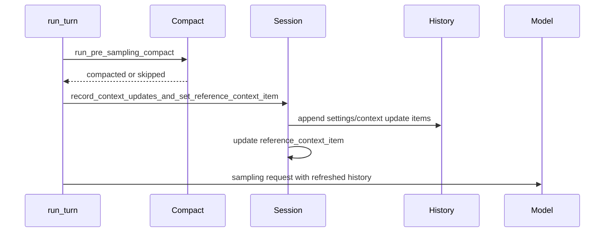

# 6. 上下文、记忆与压缩：长会话如何继续跑

## 核心问题

Coding agent 会产生大量历史：用户消息、assistant 消息、工具调用、工具输出、环境上下文、审批结果和压缩摘要。Codex 需要让模型看到足够上下文，同时避免上下文窗口爆掉，还要支持 resume、fork、rollback 和 memory。

如果只想深入上下文压缩机制，可以直接读专题页：[上下文压缩深读](./17-context-compaction-deep-dive.md)。

## 源码入口

- `codex-rs/core/src/context_manager/`
- `codex-rs/core/src/message_history.rs`
- `codex-rs/core/src/compact.rs`
- `codex-rs/core/src/compact_remote.rs`
- `codex-rs/core/src/rollout.rs`
- `codex-rs/rollout/`
- `codex-rs/state/`
- `codex-rs/core/src/memories/`
- `codex-rs/core/src/thread_manager.rs`

## 三种状态不要混在一起



`history` 是模型当前能看到的上下文。它要保持 API 合法，比如工具调用和工具输出要配对，图片要按模型能力过滤。

`rollout` 是会话记录。它服务于恢复、回放、fork 和调试，不等于每次都会完整送给模型。

`state` 是结构化状态。它让 thread 列表、标题、目标、memory 和元数据可以被查询，而不是每次从 JSONL 里重扫。

这三者相互关联，但职责不同。读源码时如果把它们都叫聊天记录，会很难理解。

## ContextManager 做模型前的整理

`ContextManager` 负责把会话历史整理成模型输入。这个阶段会做归一化和过滤，比如：

- 补齐缺失的工具输出或移除孤立输出
- 按模型能力过滤不支持的模态
- 控制哪些上下文片段进入 prompt
- 在压缩后重建可用历史

这里的重点是模型输入必须合法。工具执行失败、回合中断、压缩裁剪都可能让历史出现不完整片段，发送请求前必须整理。

`context_manager/history.rs` 里最值得看的字段有四个：

| 字段 | 作用 |
|------|------|
| `items` | 从旧到新的 `ResponseItem` 列表，是 prompt history 的主体 |
| `history_version` | history 被 replace、rollback、remove 时递增，帮助外部感知重写 |
| `token_info` | 最近一次 API token usage 和估算信息 |
| `reference_context_item` | turn context diff 的基线，决定下一轮是全量注入还是差量注入 |

`for_prompt` 不是简单返回 `items`。它会 normalize history，并按模型 input modalities 过滤不支持的内容，比如模型不支持图片时，图片会从消息或工具输出里剥离。`remove_first_item` / `remove_last_item` 也会调用 normalization 相关逻辑，把对应的 tool call 或 tool output 一起处理，避免留下不成对的历史。



`reference_context_item` 是理解 Codex 上下文注入的关键。它保存上一次已经注入给模型的 turn context baseline。新的 turn 如果只改变了部分设置，就可以发送 diff；如果 rollback 或 compaction 破坏了这个 baseline，Codex 会清空它，让下一轮回到全量注入，避免对 stale context 做差量更新。

## rollout 让会话可恢复

Codex 会把 session 过程写入 rollout。恢复会话时，系统不只是恢复最后一条消息，而是根据记录恢复 thread 的上下文、配置和历史。

这也是为什么 Codex 可以支持：

- `codex resume`
- `codex fork`
- app-server 的 thread list / thread read
- rollback / undo 相关能力
- 从非交互模式回看事件

rollout 的设计让本地 agent 更像一个可追踪系统，而不是一次性脚本。

rollout 和 prompt history 的关系也要分清。history 会被压缩、归一化、过滤；rollout 更接近事件证据，用于重建和调试。压缩后模型看到的是摘要和必要历史，rollout 仍然可以保留更完整的事件轨迹。memory pipeline 也不是从当前 prompt history 里抽取长期信息，而是从符合条件的 rollouts 里抽取。

## compact 解决上下文窗口

长会话一定会碰到上下文窗口。Codex 的压缩逻辑分布在 `compact.rs` 和 `compact_remote.rs`，大体上有两类路径：

- 本地 inline compaction：用模型生成摘要，再替换部分历史
- remote compaction：如果 provider 支持，把历史交给远端压缩能力

压缩的难点不是写一段摘要，而是保证压缩后还能继续工作：

- 保留必要的初始上下文
- 避免工具调用和输出失配
- 让最新用户意图仍然可见
- 保留 rollback 或恢复所需的记录
- 失败时不要破坏原 session

`run_turn` 里会在两处触发自动压缩：

| 阶段 | 触发点 | `InitialContextInjection` | 目的 |
|------|--------|---------------------------|------|
| Pre-turn | 采样前 token usage 已超过阈值，或切到更小上下文窗口的模型 | `DoNotInject` | 先把旧历史压到可采样范围 |
| Mid-turn | 模型或工具还需要 follow-up，但 token 已到 auto compact limit | `BeforeLastUserMessage` | 压缩后继续当前任务 |
| Manual | 用户触发 `Op::Compact` | `DoNotInject` | 明确要求摘要当前线程 |

mid-turn compaction 的插入点很讲究。`compact.rs` 里写明，模型被训练成在 mid-turn compaction 后把摘要看成 history 的最后一项，所以需要把 canonical initial context 插到最后一个真实用户消息之前，而不是简单 append 到末尾。`insert_initial_context_before_last_real_user_or_summary` 就是在处理这个边界。

压缩替换 history 时，Codex 会构造 `CompactedItem`，把 `replacement_history` 写入 session，并重置 model client session。之后还会重算 token usage，发出 warning，提醒长线程和多次压缩会降低准确性。这个 warning 很重要：压缩是继续工作的手段，不是无损存档。

## build_compacted_history 的保守策略

压缩不是只保留摘要。`build_compacted_history` 会先收集真实用户消息，跳过已有 summary message，然后从最近消息往前选，最多保留约 `COMPACT_USER_MESSAGE_MAX_TOKENS` 的用户输入，再把 summary 作为最后一条 user message 放入新 history。

这种做法有两个工程动机：

- 最近用户意图比很早的对话更可能影响下一步。
- 摘要可以承接旧信息，但不能完全替代用户原始需求。

如果 compact prompt 自己因为上下文太大而失败，`run_compact_task_inner_impl` 会从最旧 history item 开始裁剪，并同时移除对应 tool call/output 对，直到能请求模型或只剩无法处理的最小输入。它不是一次失败就放弃，也不会随意裁剪最新上下文。

## Memory 不是 history

Memory 解决的是跨会话的长期信息，而不是当前回合的短期上下文。Codex 的 memory 相关代码在 `core/src/memories/`，还会和 state、rollout、配置中的 memory mode 发生关系。

可以把三者区分开：

| 概念 | 生命周期 | 用途 |
|------|----------|------|
| history | 当前线程内 | 模型下一轮推理 |
| rollout | 当前线程持久化 | resume、fork、debug |
| memory | 跨线程或长期 | 提取可复用偏好和事实 |

把 memory 当 history 用会污染长期记忆；把 history 当 memory 用又会让每次任务都背着大量短期噪声。

`core/src/memories/README.md` 描述了两阶段 pipeline：



Phase 1 会在 state DB 中 claim 一批最近、空闲、未被处理的 rollout，过滤出 memory-relevant response items，然后并发调用模型产出 `raw_memory`、`rollout_summary` 和可选 `rollout_slug`。成功输出会写回 DB，失败 job 会带 retry/backoff，避免启动时热循环。

Phase 2 是全局串行 consolidation。它按 usage、last_usage、generated_at 选出 stage-1 输出，更新本地 memory artifacts，再启动一个内部 consolidation sub-agent。这个子 agent 运行时没有审批、没有网络、只有本地写权限，并且禁用 collab，防止记忆整理递归派生更多 agent。

这个拆分很重要。每个 rollout 的抽取可以并发，跨线程的全局记忆合并必须串行。不这样做，多个启动任务可能同时改同一份 memory 文件，长期记忆就会互相覆盖。

## fork、rollback 和恢复为什么依赖状态分层

`ThreadManager` 和 `CodexThread` 把 thread 当成可管理对象，而不是一次进程内聊天。`ForkSnapshot` 里已经能看到两种 fork 语义：截断到第 N 个用户消息之前，或把当前 mid-turn snapshot 当成被 interrupted 的历史。rollback 则会调用 history 的 user-turn 边界裁剪，但不会尝试自动还原文件系统改动。

这说明 Codex 对“对话状态”和“工作区状态”做了边界划分。thread rollback 可以回退模型上下文，不能保证撤销已经写入磁盘的文件。真正要撤销文件，需要依赖 git、patch reverse、undo task 或前端自己的工作区能力。

## 一次长会话的状态流

把上面的概念串起来，一次长会话大致会经历这条状态流：



这条流里没有一个“万能聊天记录”。同一个事件会以不同形态出现在不同层：模型输入层要合法和简洁，rollout 层要能重建，state DB 要能查询，memory 层要能跨线程复用。

## history 归一化的实际含义

工具调用历史必须满足模型 API 的结构约束。比如工具调用和工具输出要配对；被移除的用户回合如果包含工具调用，也要处理对应输出；不支持图片输入的模型不能收到图片项。`ContextManager` 的工作就是在发送模型请求前做这类清理。



这里的“合法”比“完整”更优先。一个不合法的 history 会导致模型请求直接失败；一个被适度裁剪但仍合法的 history 至少可以继续运行。Codex 的很多保守逻辑都是围绕这个现实展开。

## rollout 更像审计日志

`rollout` 记录的是 session/thread 运行过程，不等同于下一次请求模型时传入的 history。一个 rollout 可以包含已经被 compact 摘掉的工具输出，也可以包含 UI 事件、审批记录、thread 元数据和恢复所需标记。

| 需求 | 为什么靠 rollout |
|------|------------------|
| resume | 需要从磁盘恢复 thread |
| fork | 需要复制或截断历史 |
| thread list | 需要列出过去会话 |
| memory extraction | 需要从过去任务中抽取长期信息 |
| debug | 需要看到事件发生顺序 |

如果只保存 prompt history，压缩后很多证据会丢失；如果每次都把 rollout 全量送进模型，成本又会失控。两者分开是长会话产品化的必要条件。

## compact 的三条安全线

压缩本身也是一次模型调用，所以它也可能失败、超限或生成低质量摘要。Codex 在源码里至少有三条安全线：

| 安全线 | 作用 |
|--------|------|
| 保留最近真实用户消息 | 让最新任务意图不完全依赖摘要 |
| 失败后逐步裁剪旧 history | 避免一次超限就让 compact 彻底失败 |
| 重置 reference context item | 避免压缩后继续基于旧 context baseline 做差量注入 |



`COMPACT_USER_MESSAGE_MAX_TOKENS` 约束最近用户消息保留量。它说明压缩不是只存一段 summary，而是保留摘要加最近原始需求的混合结构。

## memory pipeline 的边界

Memory 最容易被误解成“把所有历史都永久记住”。Codex 的 memory pipeline 做了更窄的事：从符合条件的 rollouts 里提取可能长期有用的信息，再通过全局 consolidation 变成 memory artifacts。



这里有几个值得注意的边界：

| 边界 | 说明 |
|------|------|
| Phase 1 并发 | 单个 rollout 抽取可以并行 |
| Phase 2 串行 | 全局 memory 文件只能有一个 consolidation |
| secret redaction | stage-1 输出会做敏感信息处理 |
| memory mode | thread 是否参与 memory 可被配置控制 |
| sub-agent 限权 | consolidation agent 不应该有网络和审批扩散能力 |

这种设计比“每轮结束直接改一份 memory.md”复杂，但能避免并发写入、重复选择和长期记忆互相覆盖。

## 失败路径

| 场景 | 风险 | Codex 处理方向 |
|------|------|----------------|
| history 出现孤立工具输出 | 模型请求不合法 | `ContextManager` normalize |
| 压缩 prompt 仍然超限 | compact 无法请求模型 | 逐步裁剪旧 item |
| compact 后 context baseline 失效 | 下一轮差量 context 错误 | 清空或重置 `reference_context_item` |
| rollout 写入失败 | resume/debug 证据不完整 | 完成前 flush，失败发 warning |
| memory Phase 1 job 失败 | 启动时重复热循环 | DB 记录失败和 retry/backoff |
| Phase 2 并发运行 | memory artifacts 被覆盖 | 全局 consolidation 锁 |

## 读源码时的判断顺序

读上下文相关源码时，可以按这个顺序定位：

1. 看当前问题是不是模型输入问题。如果是，先读 `codex-rs/core/src/context_manager/`。
2. 看当前问题是不是恢复或回放问题。如果是，先读 `codex-rs/core/src/rollout.rs` 和 `codex-rs/rollout/`。
3. 看当前问题是不是列表、goal、memory stage 状态。如果是，先读 `codex-rs/state/`。
4. 看当前问题是不是长会话超限。如果是，读 `codex-rs/core/src/compact.rs` 和 `compact_remote.rs`。
5. 看当前问题是不是跨线程偏好。如果是，读 `codex-rs/core/src/memories/README.md` 再进入 `phase1.rs`、`phase2.rs`。

## 设计取舍

Codex 选择了相对明确的状态分层。代价是模块多，数据在 history、rollout、state DB 之间流动，初读比较费劲。收益是可恢复、可压缩、可索引，也能支持多前端同时围绕同一个 thread 工作。

压缩也是一种取舍。压缩可以让长会话继续跑，但摘要会损失细节，多次压缩还可能叠加误差。所以最可靠的策略仍然是让 thread 聚焦，不把无关任务都塞进同一段历史。

## 如果自己做 Agent，可以学什么

从第一天就区分三种存储：模型输入、事件日志、结构化索引。哪怕最小版本只用文件，也要避免把所有东西都塞进一个 `messages.json`。

压缩要谨慎。先实现可恢复的事件日志，再实现历史裁剪和摘要。否则压缩出了问题，用户和开发者都没法知道上下文是怎么坏掉的。

## 上下文工程的四个对象

Codex 的上下文工程不是一个 prompt 字符串，而是四个对象协作。

| 对象 | 作用 | 典型源码 |
|------|------|----------|
| `TurnContext` | 当前轮的运行环境快照 | `core/src/session/turn_context.rs` |
| `ResponseItem` history | 模型真正能看到的消息历史 | `core/src/context_manager/history.rs` |
| `reference_context_item` | 上一次已注入上下文的 baseline | `Session::record_context_updates_and_set_reference_context_item` |
| rollout/state DB | 恢复、索引、记忆和审计 | `rollout`、`state`、`thread-store` |



`reference_context_item` 是读 Codex 上下文时最值得盯住的字段。它让 Codex 知道哪些环境信息已经注入过，哪些变化需要以增量形式写入 history。没有这个 baseline，系统只能每轮重复塞完整上下文，或者冒险漏掉环境变化。

## 压缩不是记忆

压缩和记忆都在减少上下文压力，但它们解决的问题不同。

| 机制 | 输入 | 输出 | 生命周期 |
|------|------|------|----------|
| compact | 当前线程 history | replacement history 或 remote compacted history | 服务当前 thread 继续跑 |
| memory phase 1 | 最近 rollout | per-rollout raw memory 和 summary | 后台抽取 |
| memory phase 2 | phase 1 输出集合 | 文件系统 memory artifacts 和 consolidated memory | 跨线程复用 |

Codex 的 `core/src/memories/README.md` 明确把 memory pipeline 分成两阶段：Phase 1 从符合条件的 rollout 中抽取结构化 memory；Phase 2 串行做全局整合，把结果同步到 memories 目录，并通过专用 consolidation agent 更新高层记忆。它不是当前 turn 的紧急压缩机制。

## 上下文更新的实际顺序

每一轮进入模型前，Codex 会先处理压缩，再记录上下文变化。



这个顺序很关键。压缩可能清空或替换 reference context，随后上下文注入会根据新的 baseline 决定是否全量重注入。

## 失败路径

| 场景 | 风险 | Codex 的处理方向 |
|------|------|------------------|
| compact 请求本身超窗 | 连摘要请求都放不进模型 | 从临时 history 移除旧 item，保留合法 tool pair |
| remote compact 返回非 user/developer 内容 | 压缩结果污染 history | `process_compacted_history` 过滤和重注入 |
| baseline 丢失 | 后续 turn 缺环境上下文 | full reinjection |
| rollout 恢复遇到 compact | history 和 reference context 要重建 | rollout reconstruction tests 覆盖 |
| memory 后台失败 | 不应阻塞当前任务 | DB lease、retry backoff、phase2 串行 |

这也是 Codex 压缩看起来比普通摘要稳的原因：它围绕 history 合法性和 runtime baseline 做恢复，而不是只追求摘要文本质量。

## 可核对命令

```bash
rg -n "record_context_updates_and_set_reference_context_item|reference_context_item" codex-rs/core/src/session codex-rs/core/src/context_manager
rg -n "run_pre_sampling_compact|run_compact_task|InitialContextInjection" codex-rs/core/src/session/turn.rs codex-rs/core/src/compact.rs
rg -n "Phase 1|Phase 2|startup memory|selected_for_phase2" codex-rs/core/src/memories
rg -n "RolloutItem::Compacted|rollout_reconstruction" codex-rs/core/src/session codex-rs/core/src/rollout.rs
```
