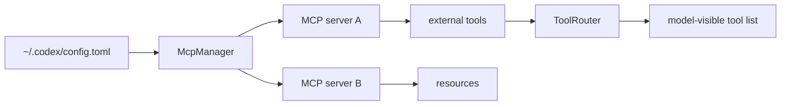
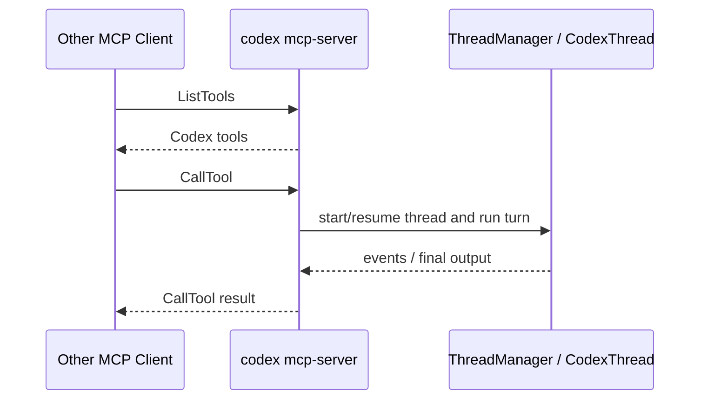
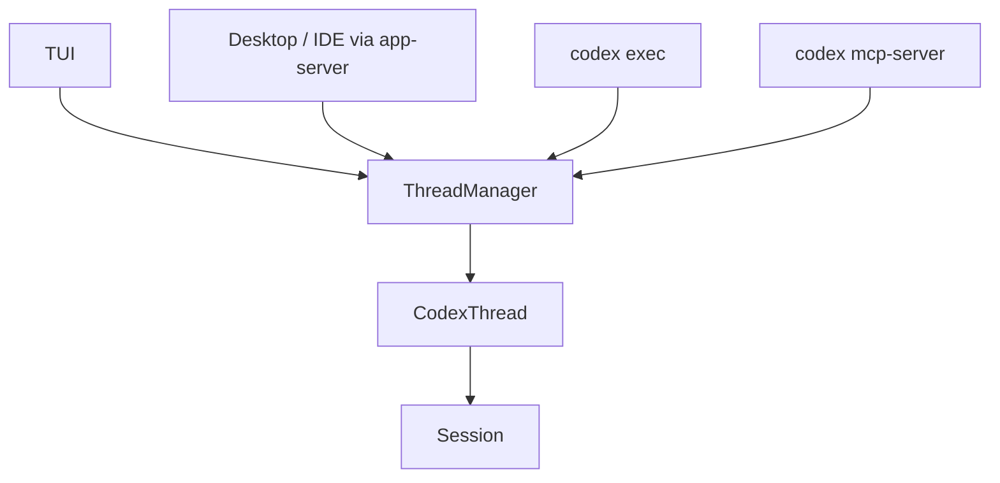
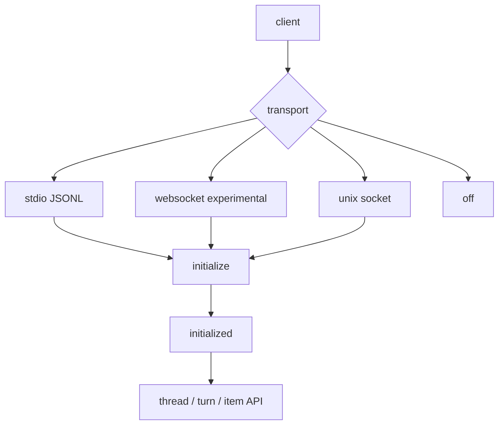
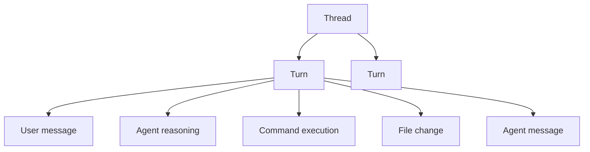
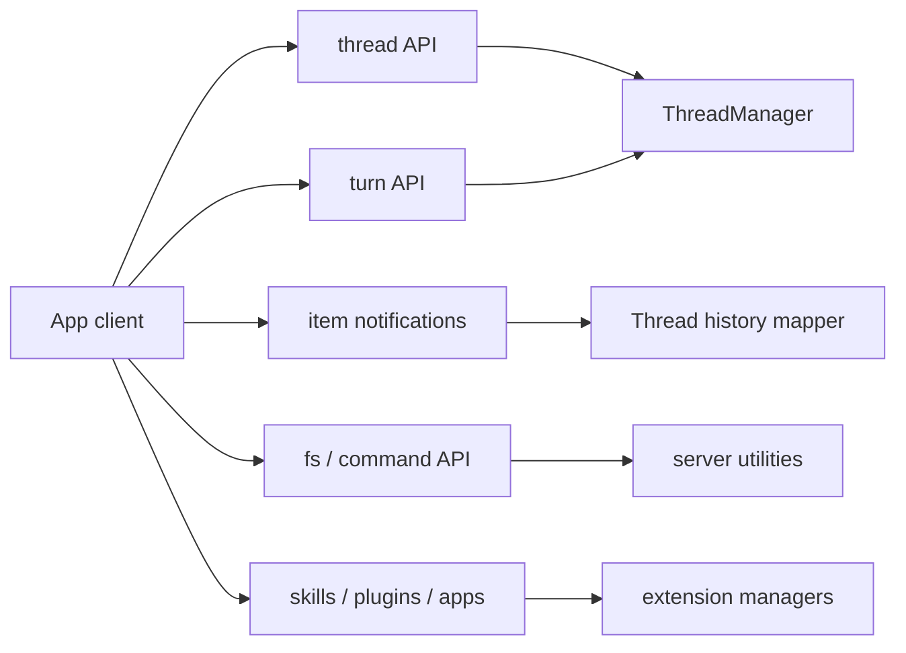
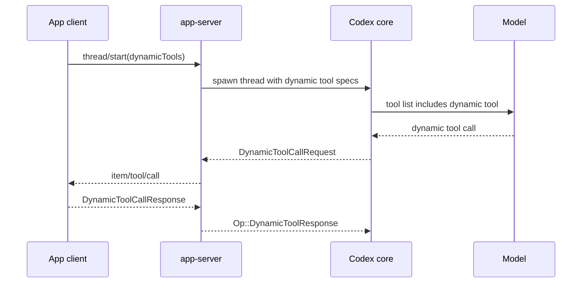
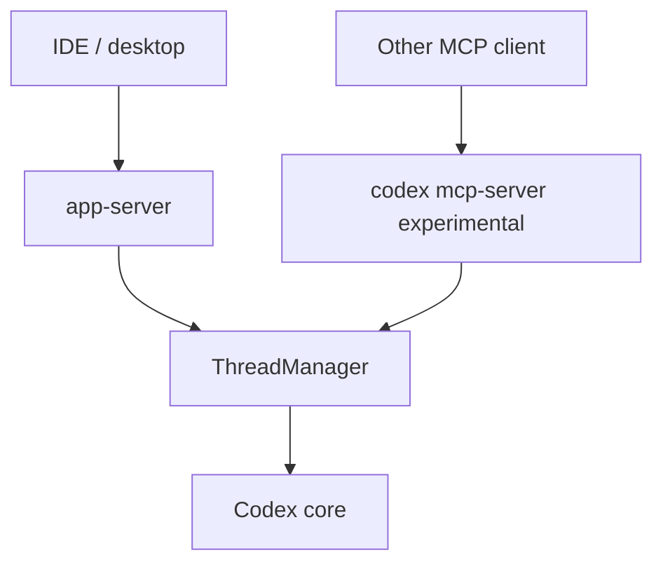
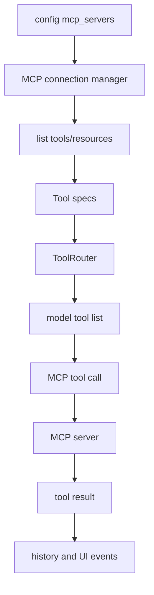
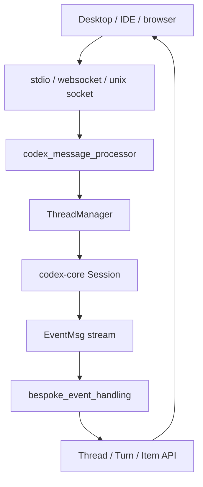

# 7. MCP 与 App Server：同一个核心，多种前端

## 核心问题

Codex 不只是一个终端程序。它可以连接外部 MCP server，把外部工具纳入模型可用工具；也可以作为实验性的 MCP server，被其他 agent 调用；还可以通过 app-server 给桌面应用、IDE 或其他客户端提供 JSON-RPC 接口。

## 源码入口

- `codex-rs/codex-mcp/`
- `codex-rs/rmcp-client/`
- `codex-rs/mcp-server/src/message_processor.rs`
- `codex-rs/mcp-server/src/codex_tool_runner.rs`
- `codex-rs/app-server/README.md`
- `codex-rs/app-server/src/codex_message_processor.rs`
- `codex-rs/app-server-protocol/`
- `codex-rs/core/src/thread_manager.rs`

## Codex 作为 MCP client

作为 MCP client 时，Codex 在启动或刷新配置时连接外部 MCP server，读取它们暴露的 tools、resources 和 resource templates。工具会进入 Codex 的工具系统，最终通过 `ToolRouter` 和 handler 路径被模型调用。

这让 Codex 不需要内置所有能力。数据库、内部 API、文档系统、浏览器控制都可以通过 MCP 接进来。

## Codex 作为 MCP server（实验性）

运行 `codex mcp-server` 时，Codex 自己会变成一个 MCP server。Rust README 把这条能力标成 experimental，所以读这块时要把它当成接口仍可能变化的能力。

其他 MCP client 可以把 Codex 当成工具调用。相关逻辑在 `mcp-server/src/message_processor.rs` 和 `codex_tool_runner.rs`。

这条路径有点反直觉，但很重要：Codex 不只是消费工具，也能把自己的 coding agent 能力包装成工具给别的 agent 用。

## App Server 是多前端层

app-server 是 JSON-RPC 服务。它把前端请求转换成 core 的 thread 操作，再把 core 事件转换成 server notification。

`app-server/src/codex_message_processor.rs` 里可以看到很多 `ClientRequest` 分支，比如：

- `ThreadStart`
- `ThreadResume`
- `ThreadFork`
- `ThreadRead`
- `ThreadList`
- `ThreadCompactStart`
- `ThreadShellCommand`
- `SkillsList`
- `PluginList`
- `AppsList`
- MCP status 和 tool call 相关请求

app-server 不只是一个简单转发器。它是桌面应用、IDE 和其他客户端使用 Codex 的主要协调层。

## ThreadManager 是共享核心

无论是 app-server 还是 mcp-server，最后都要回到 `ThreadManager` 和 `CodexThread`。`ThreadManager` 负责创建、恢复、fork 和管理线程，`CodexThread` 提供 submit/next_event 这样的异步接口。

这个结构让多前端共享同一个核心能力：

## App Server 的协议层

app-server 的 README 明确说它使用类似 MCP 的 JSON-RPC 2.0 通信，但 wire 上省略 `"jsonrpc":"2.0"` 头。支持的 transport 包括 stdio、websocket、unix socket 和 off。websocket transport 标记为 experimental / unsupported，非 loopback 暴露时还要显式配置 auth。

这层协议有几个产品化细节：

| 细节 | 说明 |
|------|------|
| initialize handshake | 同一连接必须先初始化，重复初始化会报错 |
| clientInfo | 客户端需要标识 name/title/version |
| notification opt-out | 客户端可以按 method 精确关闭通知 |
| bounded queues | 入口饱和时返回 `-32001` overload |
| schema export | `generate-ts` 和 `generate-json-schema` 输出版本匹配的协议类型 |

这些细节说明 app-server 面向的不只是内部 TUI，而是长期存在的外部客户端。协议要能版本化、限流、鉴权、生成类型。

## Thread、Turn、Item 是 app-server 的三层抽象

app-server README 把核心对象定义成三层：

| 对象 | 含义 | 典型 API |
|------|------|----------|
| Thread | 一段可恢复会话 | `thread/start`、`thread/resume`、`thread/fork`、`thread/list` |
| Turn | 一次用户输入到 agent 完成 | `turn/start`、`turn/interrupt`、`turn/steer` |
| Item | turn 内的用户输入、agent 输出、工具调用、文件编辑 | `item/started`、`item/completed`、各种 delta |

这个分层和 core 的 `SessionTask` / `run_turn` / `ResponseItem` 不是完全一一对应，但概念上相互映射。前端不需要知道 Rust 内部 task trait，也能通过 Thread/Turn/Item 建出可渲染的体验。

## app-server API 按产品能力分组

app-server 的 API 很多，可以按能力分成几类：

| 分组 | 代表方法 | 说明 |
|------|----------|------|
| 会话管理 | `thread/start`、`thread/resume`、`thread/fork`、`thread/archive` | 管理 thread 生命周期 |
| 运行 turn | `turn/start`、`turn/interrupt`、`turn/steer` | 驱动 agent 运行 |
| 历史读取 | `thread/read`、`thread/turns/list` | 不恢复也能读历史 |
| 上下文维护 | `thread/compact/start`、`thread/rollback` | 压缩和回滚模型上下文 |
| 目标系统 | `thread/goal/set`、`thread/goal/get`、`thread/goal/clear` | 管理 persisted goal |
| 文件系统 | `fs/readFile`、`fs/writeFile`、`fs/watch` | 前端侧文件能力 |
| 命令执行 | `command/exec`、`command/exec/write`、`command/exec/terminate` | 不启动 thread 的工具命令 |
| 扩展 | `skills/list`、`plugin/list`、`app/list`、`mcpServer/tool/call` | 能力发现和外部工具 |
| 配置 | `config/read`、`config/value/write`、`config/batchWrite` | 读取和修改配置 |

把这些 API 放在同一个服务里，前端可以既驱动 agent，也能读配置、列 skills、观察文件、处理动态工具调用。

## Dynamic tools 让前端也能提供工具

app-server 的 `thread/start` 参数支持 `dynamicTools`。这类工具不是 Codex 内置，也不是 MCP server 暴露，而是客户端在启动 thread 时声明，模型调用后由 app-server 发回客户端执行。

这条路径把前端从“只显示结果”提升为“可以提供能力”。比如 IDE 可以提供内部 symbol lookup，桌面客户端可以提供系统 UI 选择器，企业客户端可以提供工单查询。动态工具仍然走协议事件，模型不会直接调用客户端私有函数。

## app-server 与 MCP server 的区别

Codex 同时有 app-server 和实验性 MCP server，容易混淆：

| 维度 | app-server | `codex mcp-server` |
|------|------------|--------------------|
| 面向对象 | Codex 前端、IDE、desktop、自动化客户端 | 其他 MCP client |
| 协议 | Codex 自己的 JSON-RPC | MCP |
| 核心抽象 | Thread / Turn / Item | MCP tools |
| 稳定性 | richer interface，产品核心路径 | 官方标注 experimental |
| 能力范围 | 会话、配置、文件、命令、扩展、通知 | 把 Codex 能力包装成 MCP tool |

判断一个集成应该走哪条路，关键看它要不要完整控制 Codex 会话。如果要 thread list、turn stream、item UI、审批和配置，app-server 更合适；如果只是让另一个 MCP client 调用 Codex 做一件事，实验性 MCP server 才是对应入口。

## MCP client 进入工具系统的方式

Codex 作为 MCP client 时，外部 MCP tools 会被纳入统一工具系统，而不是另开一套模型调用协议。工具 schema 会进入模型可见工具列表；调用时通过 MCP manager 发送到外部 server；结果再回到模型 history。

这样做的收益是审批、hooks、并发、UI 事件和工具结果处理都能复用同一套路径。MCP 工具不是特权通道。

## 失败路径和安全边界

| 场景 | 风险 | 处理方向 |
|------|------|----------|
| app-server 未 initialize | 客户端可能乱序调用 | 请求被拒绝 |
| request ingress 饱和 | UI 卡死或内存膨胀 | 返回 overload 错误 |
| websocket 远程暴露 | 未认证访问本地 agent | 配置 capability token 或 signed bearer token |
| dynamic tool 客户端无响应 | 模型等待工具结果 | fallback response 或错误结果 |
| MCP server 断开 | 工具列表或调用失败 | 状态通知和工具错误 |
| `thread/shellCommand` unsandboxed | 用户主动命令绕过 thread sandbox | 文档明确标注语义，前端要谨慎暴露 |
| experimental API 被生产依赖 | 版本变化破坏客户端 | 需要 capability opt-in 和版本绑定 schema |

## 设计取舍

MCP client 和 MCP server 双向支持会增加协议复杂度，但它让 Codex 站在了两个位置上：既能用工具，也能成为工具。MCP server 仍处在实验阶段，文档里不要把它写成稳定集成承诺。

app-server 的存在则说明 Codex 的核心不依赖终端 UI。TUI 不是架构中心，thread runtime 才是中心。这让产品形态可以继续扩展，比如桌面 app、IDE extension、远程执行或自动化 API。

## 如果自己做 Agent，可以学什么

如果你的 agent 未来可能有多个入口，不要让第一个 UI 成为核心。先抽出 thread manager 和事件协议，再让 UI 订阅它。

MCP 集成也要早想清楚信任边界。外部工具不是天然可信，工具名、schema、输出和 elicitation 都可能影响模型行为。把 MCP 工具接入统一工具管道，比给它们开特殊通道更稳。

## app-server 是产品体验的协议层

`app-server` 不是把 CLI 包一层 HTTP。它维护 thread、turn、item、config、plugins、apps、dynamic tools、fs watch、transport 等一整套面向前端的 API。

| 能力 | 代表路径 | 说明 |
|------|----------|------|
| thread/turn/message | `codex-rs/app-server/src/codex_message_processor.rs` | 把 core 事件映射成前端可展示状态 |
| item 渲染 | `codex-rs/app-server/src/bespoke_event_handling.rs` | 对工具、hook prompt、diff 等做专门处理 |
| dynamic tools | `codex-rs/app-server/src/dynamic_tools.rs` | 前端或 app connector 提供工具 |
| plugin/app helpers | `codex-rs/app-server/src/codex_message_processor/` | plugins、apps、MCP OAuth 等产品能力 |
| transport | `codex-rs/app-server/src/transport/` | 同一协议跑在 stdio、websocket、unix socket 上 |

## MCP client、MCP server、app-server 的区别

| 角色 | Codex 在做什么 | 不要混淆的点 |
|------|----------------|--------------|
| MCP client | 连接外部 MCP server，把工具接入 Codex | 外部工具进入 `ToolSpec` 和 tool runtime |
| MCP server | 把 Codex 暴露给其他 MCP client | 其他 agent 可以把 Codex 当工具用 |
| app-server | 服务 Codex 自家前端和自动化接口 | 管 thread、turn、item、config、plugins、apps |

这三者都能和“工具”相关，但方向不同。MCP client 是 Codex 用别人，MCP server 是别人用 Codex，app-server 是 Codex 前端用 Codex core。

## dynamic tools 的产品意义

动态工具让工具系统不再只由本地配置决定。app、connector、前端或运行时可以提供工具 spec，再进入 `ToolRouter`。这解释了为什么工具系统不能写成编译期固定枚举。

如果自己做 agent，可以先只支持静态工具；当接入插件、外部 app 或组织内部工具时，再引入 dynamic tools 和 tool search。过早做动态工具会让调试变复杂。
