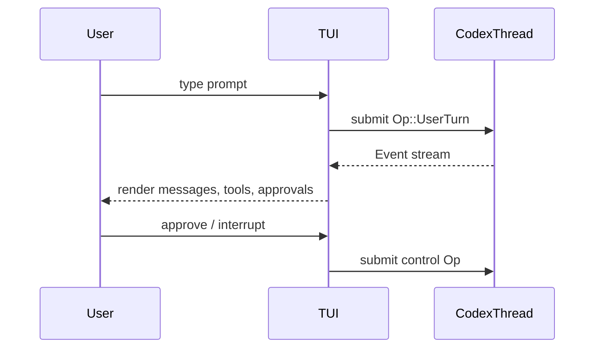
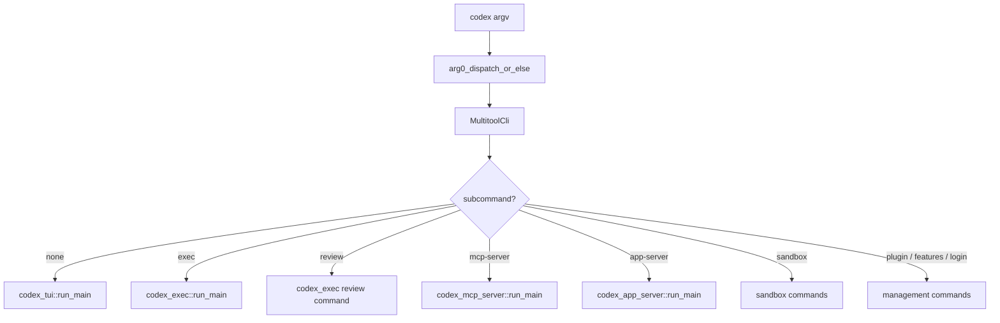
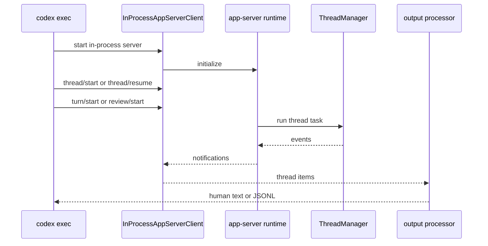
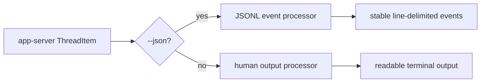
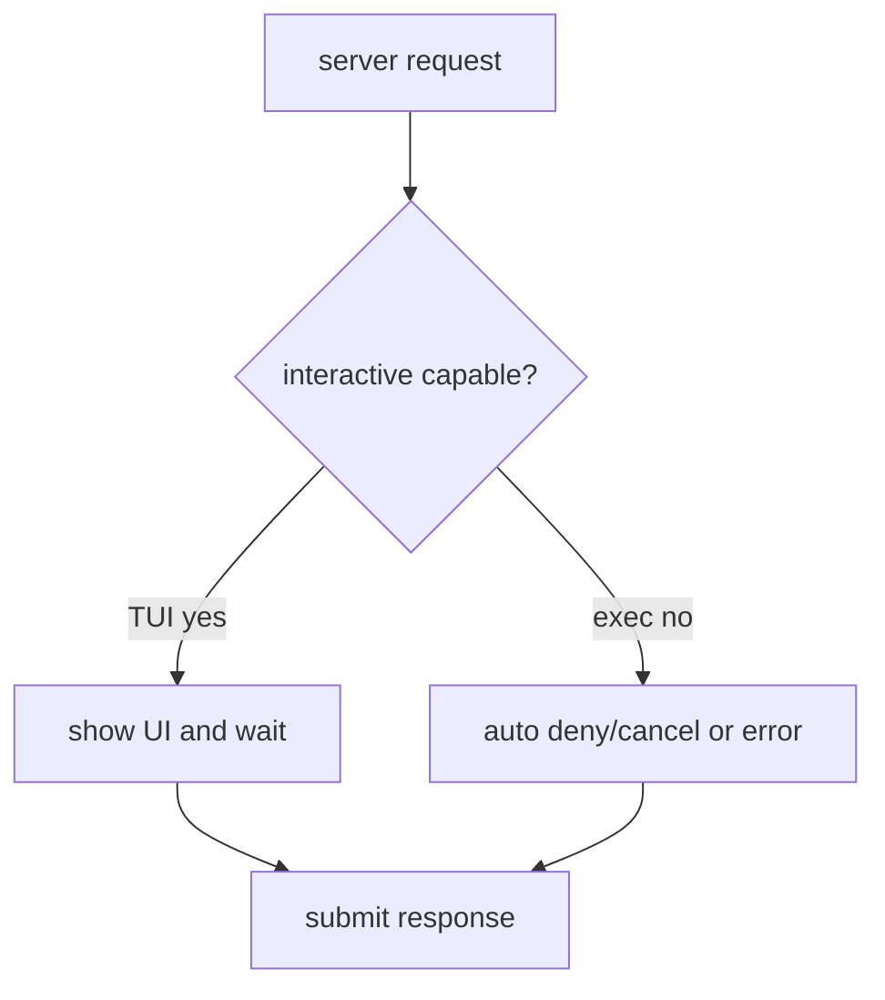
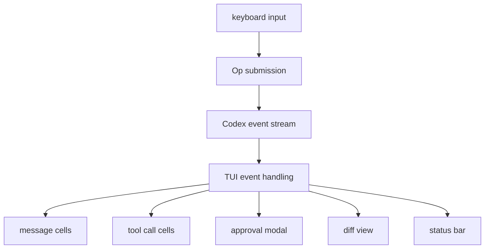
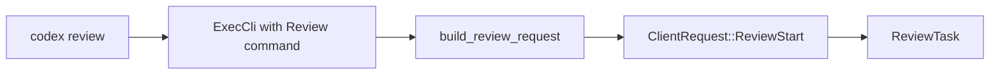
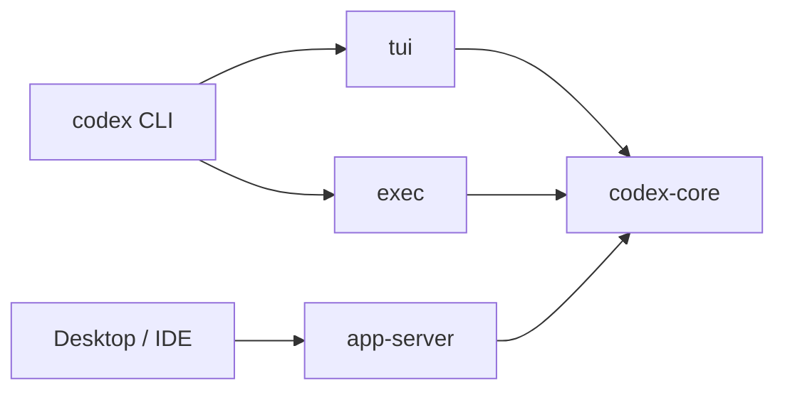

# 8. CLI、TUI 与 Exec：三种使用方式，一套核心

## 核心问题

用户看到的 Codex 有时是交互式 TUI，有时是 `codex exec` 的一次性命令，也可能是桌面应用背后的 app-server。入口不同，但核心都围绕 `codex-core` 的 thread 和 event 模型。

## 源码入口

- `codex-rs/cli/src/main.rs`
- `codex-rs/tui/`
- `codex-rs/exec/src/lib.rs`
- `codex-rs/exec/src/event_processor_with_jsonl_output.rs`
- `codex-rs/exec/src/event_processor_with_human_output.rs`
- `codex-rs/app-server-client/`

## cli 是多工具分发器

`codex-rs/cli/src/main.rs` 里的 `MultitoolCli` 用 clap 定义所有子命令。没有子命令时进入交互式 TUI；有子命令时路由到对应 crate。

常见入口：

| 命令 | 路径 | 作用 |
|------|------|------|
| `codex` | `tui` | 交互式终端 UI |
| `codex exec` | `exec` | 非交互执行任务 |
| `codex review` | `exec` review mode | 非交互代码审查 |
| `codex mcp` | `cli/mcp_cmd.rs` | 管理 MCP server 配置 |
| `codex mcp-server` | `mcp-server` | 把 Codex 作为实验性 MCP server |
| `codex app-server` | `app-server` | 启动 JSON-RPC 服务 |
| `codex sandbox` | sandbox commands | 调试平台沙箱 |
| `codex login` | `login` | 登录和凭据管理 |

`arg0` 机制也值得注意。某些 helper 可以通过可执行文件名触发不同路径，比如 Linux sandbox helper 或 apply_patch 虚拟 CLI。

## TUI 负责交互，不负责 agent 逻辑

TUI 建在 Ratatui/Crossterm 之上，负责渲染聊天历史、审批框、工具状态、diff、输入框、搜索和快捷键。它的复杂度很高，但架构上仍然是前端：向 core 提交操作，订阅事件更新界面。

这条边界很关键。TUI 可以很复杂，但不能把 agent loop 吞进去。否则 `exec`、app-server 和 MCP server 都会被迫复制逻辑。

## codex exec 是自动化入口

`codex exec` 用于非交互运行。它会解析命令行、加载配置、创建 in-process app-server client，然后发起 thread/turn 请求，最后把事件输出成人类可读文本或 JSONL。

`exec/src/lib.rs` 有几个值得看的点：

- 默认 headless 模式下审批策略更保守，不适合弹交互式确认
- 支持 `--json` 输出结构化事件
- 支持 stdin 作为 prompt 或附加上下文
- 会处理 server request，例如拒绝 exec mode 不支持的交互式 elicitation
- turn 完成时必要情况下会 `thread/read` 回填缺失 items

这个模式很适合 CI、脚本和上层自动化系统。

## CLI 分发调用链

`cli/src/main.rs` 的 `MultitoolCli` 把 Codex 做成多工具入口。没有子命令时进入 TUI；`exec`、`review`、`mcp-server`、`app-server`、`sandbox`、`login`、`plugin`、`features` 等子命令各自路由到对应 crate。

`arg0` 分发是一个容易略过的细节。某些 helper 可以通过可执行文件名走不同路径，比如 sandbox helper、exec server 或 apply patch 辅助入口。这让 Codex 可以把多个运行时 helper 放在同一个安装体系里。

## exec 实际上复用 app-server 协议

`exec/src/lib.rs` 会启动 `InProcessAppServerClient`，再通过 app-server request 驱动 thread。也就是说，`codex exec` 不是把 TUI 逻辑改成批处理，而是作为一个 app-server 客户端运行。

这个设计让 exec 和 app 前端共享 thread、turn、review、compact、event mapping。代价是 `exec` 的路径看起来绕，但好处是自动化入口不会成为第二套 core。

## exec 的输出有两套 processor

exec 的输出处理分成人类可读和 JSONL：

| 输出模式 | 源码 | 适合场景 |
|----------|------|----------|
| human | `codex-rs/exec/src/event_processor_with_human_output.rs` | 终端直接阅读 |
| JSONL | `codex-rs/exec/src/event_processor_with_jsonl_output.rs` | 脚本、CI、上层系统解析 |

JSONL processor 会把 app-server 的 `ThreadItem` 映射成 exec 侧的结构，比如 command execution、patch apply、MCP tool call、agent message。human processor 则会把命令、sandbox policy、输出片段整理成终端文本。

这也是 headless 入口的关键：stdout 要么稳定给机器读，要么稳定给人读，不应该混杂调试日志。

## exec 的交互边界更窄

TUI 可以弹审批框，exec 通常不能。源码里能看到 exec 会处理 server request：MCP elicitation 会被 cancel；某些审批在 exec mode 下不支持，会直接拒绝或返回错误。这样做是为了保证非交互命令不会卡在等待 UI 的状态。

| 请求类型 | TUI | exec |
|----------|-----|------|
| shell approval | 可以弹窗 | 依赖配置或拒绝 |
| apply_patch approval | 可以展示 diff | exec mode 下受限 |
| MCP elicitation | 可以询问用户 | 自动 cancel |
| dynamic steering | 可以实时输入 | 通常不适合 |

这个边界说明 headless 自动化的安全默认值应该更保守。一个 CI 命令不应该突然等待人工点击，也不应该悄悄批准高风险副作用。

## TUI 渲染的是事件，不是直接读模型流

TUI 的界面元素很多：聊天、reasoning、工具状态、patch diff、审批、计划、搜索、输入框。架构上它们都来自 core 事件或 app-server item 映射，而不是 TUI 自己重新执行 agent loop。

这条边界让 TUI 可以做复杂交互，又不影响 exec 或 app-server。新前端只要实现相同事件消费和操作提交，就能复用 core。

## review 子命令复用 exec

`codex review` 在 CLI 层会被转换成 `codex exec` 的 review command。`exec/src/lib.rs` 里再把 `ReviewArgs` 转成 `ReviewRequest`，通过 app-server 的 `review/start` 进入 review task。

这说明 review 不是完全独立的命令体系，而是 headless 执行入口上的一种 initial operation。它共享认证、配置、app-server client、输出 processor，只在任务语义上进入 review 模式。

## 三种入口的差异

| 能力 | TUI | exec | app-server |
|------|-----|------|------------|
| 人类实时交互 | 强 | 弱 | 取决于客户端 |
| JSON/自动化 | 弱 | 强 | 强 |
| 审批 UI | 内置 | 通常拒绝交互式审批 | 由客户端实现 |
| 多线程管理 | 有 | 以任务为中心 | 强 |
| 适合场景 | 日常开发 | 脚本、CI、批处理 | 桌面、IDE、远程客户端 |

## 失败路径

| 场景 | 风险 | 处理方向 |
|------|------|----------|
| CLI 参数和 config 冲突 | 启动配置不可预测 | clap 和 config builder 明确优先级 |
| exec stdout 混入日志 | 脚本解析失败 | 结构化输出和日志通道分离 |
| exec 需要交互审批 | headless 卡住 | 自动拒绝或报错 |
| app-server item 缺失 | exec 最终输出不完整 | turn 完成后可 `thread/read` 回填 |
| TUI 与 core 状态不同步 | UI 显示错误 | 只通过事件和 Op 同步 |
| sandbox helper 路径错误 | 命令执行失败 | arg0 paths 和 runtime paths 传递 |

## 设计取舍

Codex 没有把 `exec` 做成 TUI 的脚本模式，而是通过 app-server protocol 复用核心。这让 headless 输出可以很干净，stdout 只输出最终内容或 JSONL，其他日志走 stderr。

代价是链路更长：`exec -> in-process app-server client -> app-server protocol -> core`。但这个链路换来了和桌面/IDE 相同的 thread 操作模型。

## 如果自己做 Agent，可以学什么

交互式 CLI 和自动化 CLI 是两种产品，不要让它们共用同一套输出假设。TUI 可以有动画、审批弹窗和状态栏；exec 应该输出稳定、可解析、可脚本化的结果。

核心 agent 不应该知道自己是在 TUI 还是 CI 里。它只发事件。入口层决定怎么展示、怎么拒绝不支持的交互、怎么退出。

## 三种入口共用同一条核心路径

`codex`、`codex exec`、app/IDE 入口的体验不同，但都要把外部输入转成 core 能处理的 turn。

| 入口 | 用户意图 | 关键差异 |
|------|----------|----------|
| TUI | 人在终端里持续协作 | 需要实时渲染、审批 UI、键盘中断、滚动历史 |
| `codex exec` | 脚本或 CI 自动跑完任务 | 需要明确退出码、stdout/stderr、JSONL/human 输出 |
| app-server | 桌面、IDE、浏览器等前端 | 需要 thread/turn/item API、文件监听、插件和动态工具 |

## headless 模式为什么不是缩水版

`codex exec` 没有交互式 UI，但它不是少一半能力。它要把自动化场景里的边界讲清楚：没有用户随时批准时，审批策略怎么处理；输出给人看还是给机器看；任务失败时退出码怎么表达；是否持久化 rollout。

| 问题 | headless 要求 |
|------|---------------|
| 输入 | prompt 参数和 stdin 要有明确合并规则 |
| 输出 | human 和 JSONL 两种消费者都能处理 |
| 审批 | 不能卡在需要人工确认的 UI 上 |
| 状态 | ephemeral 与持久 rollout 要可选 |
| 失败 | 脚本需要可靠退出码 |

如果自己做 agent，`exec` 模式应该从第一版就单独测试。很多 CLI agent 在交互模式看起来可用，一进 CI 就暴露审批、输出和退出码问题。
