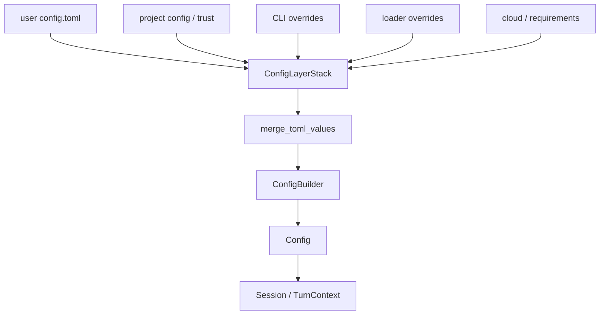
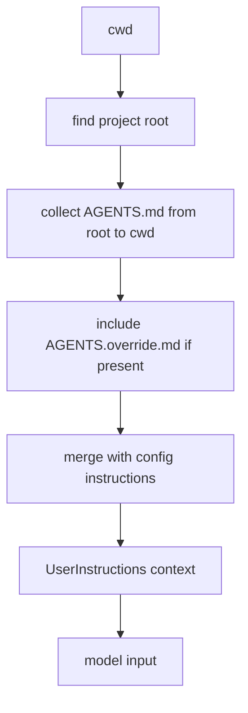
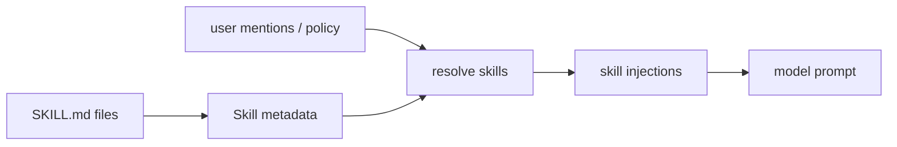
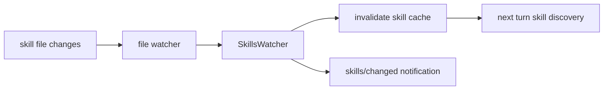
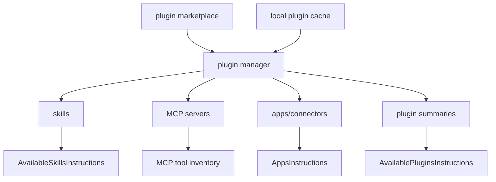
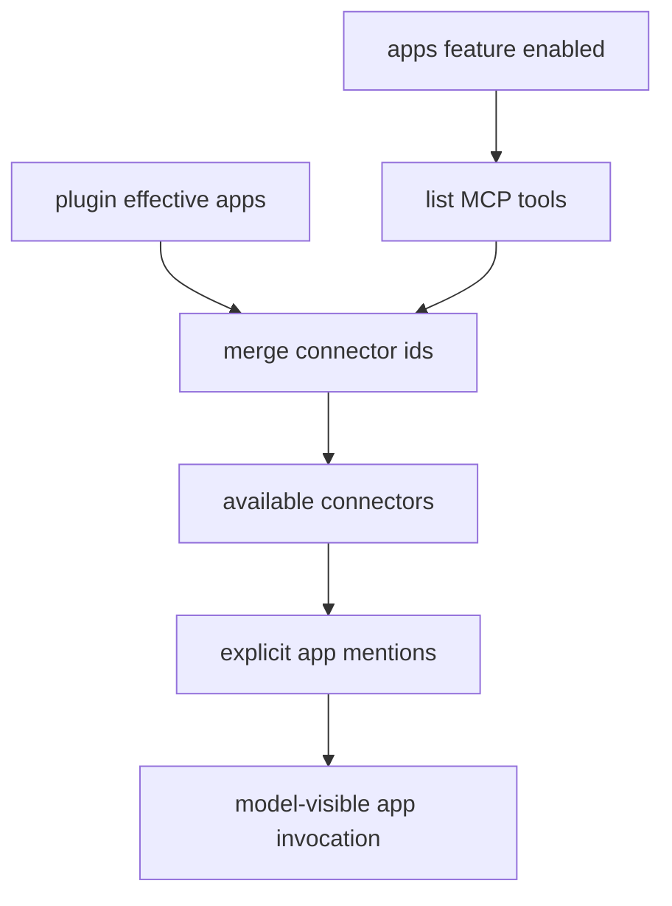
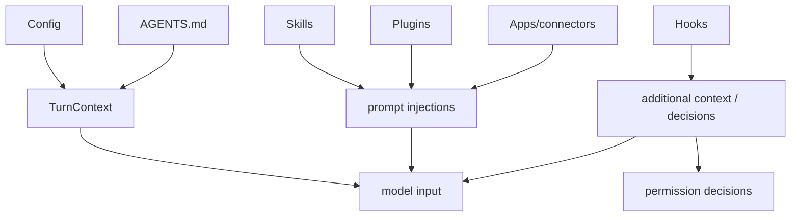

# 9. 定制系统：config、skills、plugins、hooks 和 AGENTS.md

## 核心问题

生产级 coding agent 不能只靠内置行为。不同团队有不同模型、审批策略、MCP server、项目规则、技能包和 hook。Codex 的定制系统分布在配置加载、技能、插件、hooks、AGENTS.md 和 app/connectors 几条线上。

## 源码入口

- `docs/config.md`
- `codex-rs/core/src/config/`
- `codex-rs/config/`
- `codex-rs/core/src/skills.rs`
- `codex-rs/core/src/skills_watcher.rs`
- `codex-rs/skills/`
- `codex-rs/core-skills/`
- `codex-rs/hooks/`
- `codex-rs/core/src/agents_md.rs`
- `codex-rs/core/src/plugins/`
- `codex-rs/plugin/`

## 配置是第一层定制

Codex 的 Rust CLI 使用 `config.toml`。配置会影响模型、provider、sandbox、approval、MCP server、通知、features、skills、plugins 等。

```toml
model = "gpt-5.4"
sandbox_mode = "workspace-write"

[mcp_servers.docs]
command = "docs-server"
supports_parallel_tool_calls = true
```

配置不是简单全局变量。`ConfigBuilder` 会合并用户配置、项目配置、CLI overrides、harness overrides 和 loader overrides。这样同一个核心可以被 TUI、exec、app-server 用不同默认值启动。

## 配置层不是平铺读取

源码里的 `ConfigBuilder` 会接入 `config_loader`，后者处理多层配置、项目 trust、requirements、cloud requirements、CLI overrides 和 loader overrides。最终生成的 `Config` 会带着模型、sandbox、approval、features、plugins、apps、project docs 等结果进入 session。



这套分层解决两个问题。一个是入口差异：TUI、exec、app-server 可以带不同 overrides；另一个是组织约束：requirements 可以限制 sandbox、approval policy、feature、hooks、network 等设置。

| 配置来源 | 典型用途 |
|----------|----------|
| user config | 用户长期偏好 |
| project config | 仓库级默认值 |
| CLI overrides | 单次命令覆盖 |
| harness overrides | 测试或外部运行环境覆盖 |
| requirements | 组织级约束 |
| cloud requirements | 账号或组织侧策略 |

`core/config.schema.json` 和 `core/src/config/schema.rs` 用于保持配置 schema 可生成、可测试。源码里还有 schema fixture 测试，避免配置文档和代码结构漂移。

## AGENTS.md 是项目规则入口

`AGENTS.md` 类似项目级开发说明。Codex 会读取并注入相关内容，让模型知道当前仓库的约定，比如测试命令、代码风格、目录规则。

这类规则适合放项目知识，不适合放一次性任务。它的价值在于每个线程都能复用，不需要用户每次手动粘贴。

`agents_md.rs` 里能看到几个具体规则：

| 规则 | 说明 |
|------|------|
| 默认文件名 | `AGENTS.md` |
| 本地覆盖文件 | `AGENTS.override.md` |
| 最大读取大小 | `AGENTS_MD_MAX_BYTES` 默认 32 KiB |
| 层级发现 | 从项目 root 到当前 cwd 收集 |
| 合并分隔 | `--- project-doc ---` |



层级 AGENTS.md 的意义是：根目录规则定义仓库共识，子目录规则补充局部约束。比如前端目录、后端目录、移动端目录可以各自声明不同测试命令。

## Skills 是可加载的指令包

skills 不是普通工具，它更像一组按需注入的说明文件和资源。Codex 有 system skills、用户 skills、插件带来的 skills 等来源。核心代码会收集 skill metadata，解析显式或隐式触发，再把相关内容注入当前回合。



这个设计解决的是上下文预算问题。不要把所有规则永远塞给模型，只有当前任务需要的技能才进入 prompt。

## Skills watcher 让技能变化可见

`skills_watcher.rs` 会把 skill 文件变化变成通知和缓存失效。app-server 也有 `skills/list`、`skills/changed` 等接口，前端可以展示当前可用技能，并在本地 skill 文件变化后刷新。



这对本地 agent 很重要。用户编辑一个 skill 后，不应该重启整个 Codex 才能生效；但也不能在每次模型请求前无条件重扫所有文件。watcher 提供了折中。

## Plugins 扩展分发边界

plugins 可以带来 skills、MCP server、apps 或其他扩展能力。`core/src/plugins/` 和 `plugin/` crate 负责发现、读取和管理这些扩展。

和 skills 相比，plugins 更像分发单位。skill 是模型可读能力说明，plugin 是把能力打包、安装、升级、暴露给 Codex 的机制。



`plugins_for_config` 会根据当前 config 计算实际启用的 plugin。`build_plugin_injections` 只在用户显式提到 plugin 时，把该 plugin 的可见 MCP servers、enabled apps 和 skill prefix 作为说明注入模型。

这说明 plugin 有两层可见性：列表层告诉模型有哪些 plugin；显式 mention 层才展开某个 plugin 的具体能力。

## Hooks 是生命周期拦截点

`codex-rs/hooks/` 提供生命周期 hook。hooks 可以在 session start、用户 prompt 提交、工具使用前后、stop 等阶段插入外部逻辑。

Hook 的价值在于不改 Codex 源码也能接入团队流程，比如：

- 工具执行前做安全审计
- 用户 prompt 提交后注入上下文
- 回合结束时发通知
- 对某些命令强制执行团队规则

Hook 也会带来风险。外部脚本本身可能慢、失败或有副作用，所以 hook 的输入输出、超时和错误处理都需要明确。

Hooks 的细节可以和 [Hooks 与扩展边界](./14-hooks-extensibility.md) 对照读。定制系统这一章只强调定位：hook 适合接团队流程，不适合替代 Codex core 的权限系统。

| hook 适合做 | hook 不适合做 |
|-------------|---------------|
| 阻断明确危险工具 | 绕过 sandbox |
| 给模型追加团队上下文 | 直接改写 session 内部状态 |
| 审计工具调用 | 代替 rollout |
| 自动批准低风险权限请求 | 给所有请求永久授权 |

## Apps 和 Connectors

Codex 还支持 ChatGPT connectors/apps 相关能力。用户可以通过 `$` 引用连接器，相关工具会进入模型可用能力。代码中 `connectors`、`apps` 和 MCP 管理会一起参与工具暴露。

这条线说明 Codex 的工具来源不止内置和本地 MCP，也包括账号和产品侧连接器。读源码时要把本地开源 runtime 和外部服务边界分清楚。

apps/connectors 的注入和 plugin、MCP 有交叉。`run_turn` 会在 apps enabled 或提到 plugin 时读取 MCP tool inventory，再把 plugin connectors 和可访问 connectors 合并，形成本轮 `available_connectors`。



这个流程说明 apps 不是单独外挂在 prompt 里，而是和 MCP 工具、plugin manifest、connector access 一起决定可用性。

## 定制入口如何叠加

同一次 turn 里，这些定制入口可能同时生效：



| 入口 | 进入位置 | 影响范围 |
|------|----------|----------|
| config | session / turn context | 模型、工具、安全、features |
| AGENTS.md | user instructions | 项目约定 |
| skills | contextual fragments | 当前任务工作流 |
| plugins | plugin instructions and capabilities | 插件能力 |
| hooks | tool lifecycle and context | 策略、审计、补充上下文 |
| apps/connectors | tools and app instructions | 外部系统能力 |

## 失败路径

| 场景 | 风险 | 处理方向 |
|------|------|----------|
| 配置层冲突 | 用户以为覆盖生效，实际被 requirements 限制 | config layer 和 source 信息要可读 |
| AGENTS.md 过大 | 占用上下文或读取成本高 | `project_doc_max_bytes` 限制 |
| skill 文件变化未刷新 | 模型看到旧规则 | skills watcher 通知 |
| plugin marketplace 解析失败 | 插件列表不完整 | load errors 作为状态暴露 |
| hook 输出非法 | 扩展脚本污染流程 | parser fail closed |
| app connector 未授权 | 模型调用不可用工具 | connector access 状态进入 app list |

## 设计取舍

Codex 的定制入口很多，初学者会觉得散。配置、AGENTS.md、skills、plugins、hooks、MCP、apps 都能影响模型看到什么和能做什么。

这不是偶然复杂，而是因为不同定制有不同生命周期：

| 机制 | 生命周期 | 适合内容 |
|------|----------|----------|
| config | 用户或项目长期 | 模型、权限、MCP、feature |
| AGENTS.md | 仓库长期 | 项目约定 |
| skill | 按需注入 | 专题能力说明 |
| plugin | 安装级 | 打包分发能力 |
| hook | 运行时事件 | 外部校验和流程 |
| app/connector | 账号或服务级 | 外部系统能力 |

## 如果自己做 Agent，可以学什么

不要只有一个巨大 system prompt。把规则按生命周期分层：永久规则放 base instructions，项目规则放仓库文件，专题规则做成 skill，外部流程用 hook，外部工具通过 MCP 或 plugin 接入。

这样做的好处是可维护。某个任务需要安全审计时加载安全规则，不需要让每次改 CSS 的任务都背着安全审计手册。
