# 10. 最小必要组件：自己实现一个小 Codex

## 核心问题

如果不复制 Codex 的全部功能，只想实现一个能工作的 coding agent，需要哪些组件？这一章把 Codex 的复杂实现压缩成可落地的最小架构。

## 源码入口

这一章不是逐行复刻源码，而是把 Codex 的关键路径映射成一个更小的实现清单。对照阅读时可以重点看：

- `codex-rs/protocol/src/protocol.rs`
- `codex-rs/core/src/session/turn.rs`
- `codex-rs/core/src/tools/`
- `codex-rs/core/src/exec.rs`
- `codex-rs/sandboxing/`
- `codex-rs/core/src/rollout.rs`
- `codex-rs/core/src/config/`

## 最小架构

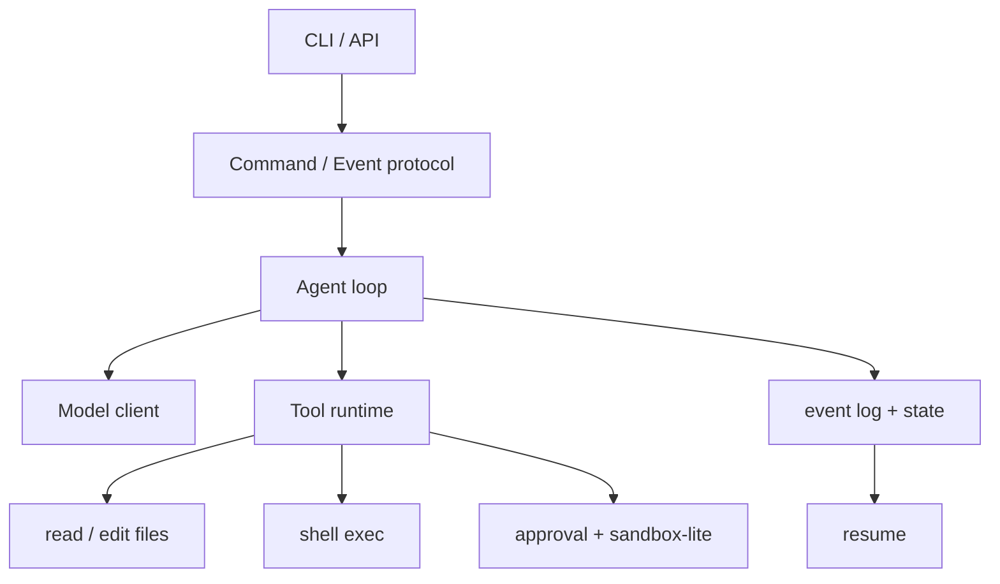

## 组件 1：协议边界

先定义输入和输出，不要先写 UI。

最小输入：

- `UserTurn { text, cwd }`
- `Interrupt`
- `ApprovalDecision`
- `Shutdown`

最小事件：

- `TurnStarted`
- `MessageDelta`
- `ToolStarted`
- `ToolCompleted`
- `ApprovalRequested`
- `TurnCompleted`
- `Error`

有了这层协议，TUI、HTTP API、CLI 脚本都可以共用同一个 agent core。

最小协议可以只用一个内存队列，但类型要提前定清楚：

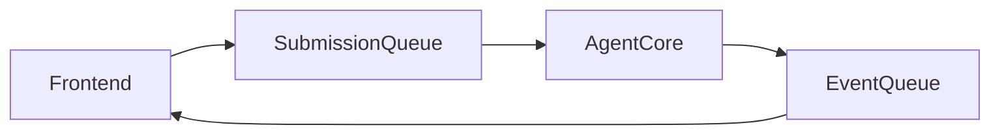

| 类型 | 最小字段 | 设计提醒 |
|------|----------|----------|
| `Submission` | `id`、`op` | 每个外部操作要有可追踪 id |
| `Op` | 用户输入、审批结果、中断、关闭 | 控制操作和用户消息放同一入口 |
| `Event` | `id`、`turn_id`、`msg` | UI 不应该读 core 内部状态 |
| `TurnItem` | message/tool/file change | 为未来 app-server 或 TUI 留映射空间 |

## 组件 2：Agent loop

核心循环只需要保持一个信号：是否需要 follow-up。

```text
record user input
loop:
  prompt = build_prompt(history, tools)
  stream = model(prompt)
  for item in stream:
    emit event
    if item is tool_call:
      result = run_tool(item)
      record tool result
      needs_follow_up = true
  if not needs_follow_up:
    break
```

先把这个循环写清楚，再加压缩、hook、memory。不要一开始就把所有能力塞进 loop。

更工程化一点，loop 可以拆成四个函数：

| 函数 | 职责 |
|------|------|
| `build_prompt` | 组装 history、context、tool specs |
| `sample_model` | 发起模型请求并消费 stream |
| `dispatch_tool` | 路由工具调用 |
| `record_followup` | 把工具结果写回 history |

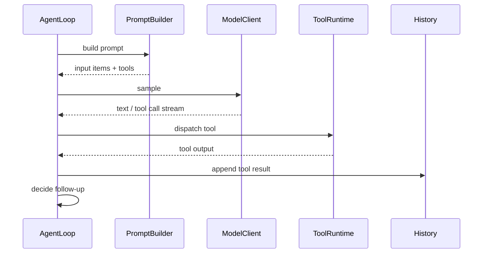

不要让 tool runtime 直接调用 model，也不要让 model client 直接写文件。边界越早分清，后面越容易加审批和测试。

## 组件 3：工具运行时

最小工具只需要三个：

- `read_file`
- `edit_file`
- `shell`

但执行路径要统一。每个工具都走：

```text
parse args -> validate -> approval check -> execute -> capture output -> record result
```

文件编辑不要直接全文件覆盖。最小实现可以用 search-and-replace，要求 old text 必须唯一匹配。shell 必须有 cwd 限制、超时和输出上限。

工具接口可以这样设计：

```text
ToolSpec { name, description, input_schema }
ToolCall { id, name, arguments }
ToolResult { call_id, status, content, metadata }
```

工具执行路径保持一致：

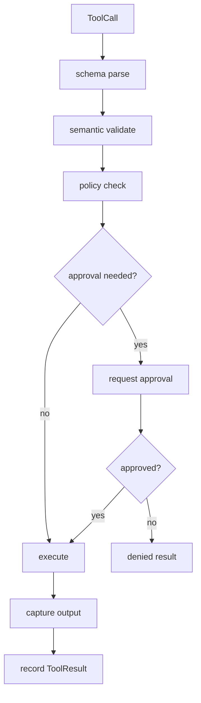

从 Codex 学到的一点是：工具结果不仅给模型，也给 UI 和日志。因此 result 里最好保留结构化 metadata，例如 exit code、cwd、changed paths、duration、truncated flag。

## 组件 4：安全边界

最小安全边界可以比 Codex 简单，但不能没有。

建议默认：

- 读操作自动允许
- 写文件需要在 workspace 内
- shell 默认需要审批
- 命令超时 10 到 30 秒
- 输出截断
- 禁止访问明显危险路径
- 可选：用容器或系统沙箱隔离命令

这不是为了做得保守，而是为了让错误有边界。没有边界的 agent 一旦跑偏，会把模型错误变成真实副作用。

最小审批矩阵可以这样：

| 操作 | 默认策略 | 原因 |
|------|----------|------|
| 读 workspace 文件 | allow | 低风险，常见 |
| 写 workspace 文件 | ask 或 allow-listed | 有副作用 |
| 写 workspace 外文件 | deny 或 ask with explicit path | 风险高 |
| shell 只读命令 | ask once by prefix | 命令解析难免误判 |
| shell 写命令 | ask every time | 副作用不一定能从字符串看全 |
| 网络访问 | ask | 数据外发和依赖下载都要留边界 |

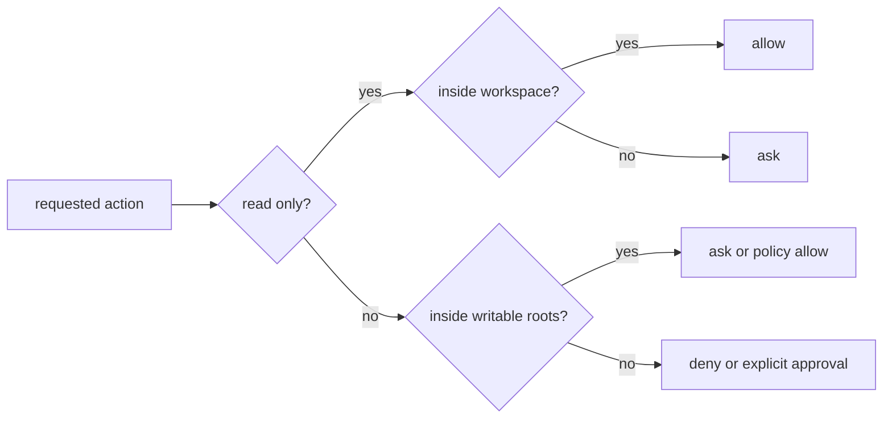

真正上线前，再把 sandbox 加进来。审批是用户决策，sandbox 是系统边界，两者不能互相替代。

## 组件 5：事件日志

最小实现也应该写事件日志。不要只保存最后一条消息。

事件日志可以先是 JSONL：

```json
{"type":"turn_started","id":"turn-1"}
{"type":"user_message","text":"fix tests"}
{"type":"tool_started","name":"shell","args":["pytest"]}
{"type":"tool_completed","exit_code":1}
{"type":"assistant_message","text":"..."}
```

有了日志，才能做 resume、debug、压缩前回放、失败分析和测试。

事件日志要避免两个常见错误：

| 错误 | 后果 |
|------|------|
| 只记录最终 assistant message | 工具调用和失败原因无法复盘 |
| 把 UI 渲染文本当日志 | 后续无法结构化查询 |

更稳的做法是双层存储：

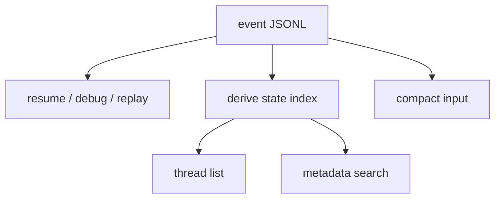

一开始 state index 可以是内存 map；后续再换 SQLite。关键是事件日志要足够完整，索引可以重建。

## 组件 6：上下文管理

最小版本可以先不做复杂 memory，但要做三件事：

- 每次发模型前归一化工具调用和输出
- 大工具输出不要完整塞回 prompt
- 上下文接近窗口时给出可恢复错误或做摘要

上下文管理的核心不是摘要算法，而是保证模型看到的历史合法、相关、不过大。

建议把上下文分成四类：

| 类别 | 示例 | 处理策略 |
|------|------|----------|
| stable context | 系统指令、项目规则 | 可作为 reference，减少重复 |
| recent conversation | 最近用户消息和 assistant 回复 | 尽量保留 |
| tool evidence | 命令输出、文件 diff | 截断、摘要、保留关键字段 |
| long-term memory | 用户偏好、项目事实 | 明确来源，按需注入 |

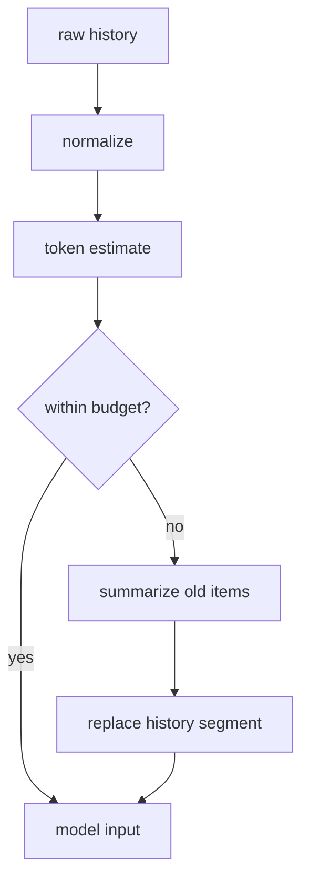

第一版可以没有自动 compact，但要在超过预算时给出明确错误和恢复建议。静默丢 history 是最难 debug 的问题之一。

## 组件 7：配置和项目规则

至少支持一个项目规则文件，比如 `AGENTS.md`。它可以告诉 agent：

- 测试命令
- 代码风格
- 禁止修改的目录
- 提交前检查

这比让用户每次都解释项目规则更可靠。

最小配置分三层就够：

| 层 | 示例 |
|----|------|
| 全局配置 | 模型、provider、默认 sandbox |
| 项目规则 | `AGENTS.md`、测试命令、禁止目录 |
| 单次覆盖 | CLI flags、环境变量 |

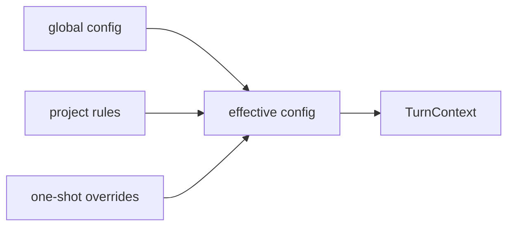

不要把所有东西都放进 prompt。模型选择、超时、sandbox、审批策略属于 runtime config；测试命令、代码风格、目录约定属于模型可见项目规则。

## 组件 8：代码编辑主路径

最小 agent 可以先用 search-and-replace，但要尽早把代码编辑变成结构化操作。

| 阶段 | 编辑方式 | 风险 |
|------|----------|------|
| v0.1 | search-and-replace，old text 唯一匹配 | 大文件和重复片段难处理 |
| v0.2 | patch DSL | 需要 parser，但 diff 可预览 |
| v0.3 | AST-aware edit for specific languages | 维护成本高 |

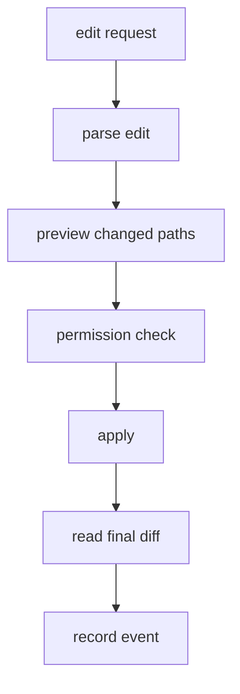

Codex 的 `apply_patch` 给出的启发是：编辑工具应该天然生成可审查 diff，而不是把“写文件成功”当作唯一结果。

## 组件 9：Headless 和交互式入口要分开

同一个 core 可以服务不同入口，但入口层的交互假设不同：

| 入口 | 输出 | 审批 |
|------|------|------|
| TUI | 丰富状态、diff、弹窗 | 可以交互 |
| headless CLI | stdout/JSONL | 默认保守 |
| HTTP/app-server | 事件流 | 客户端负责 UI |

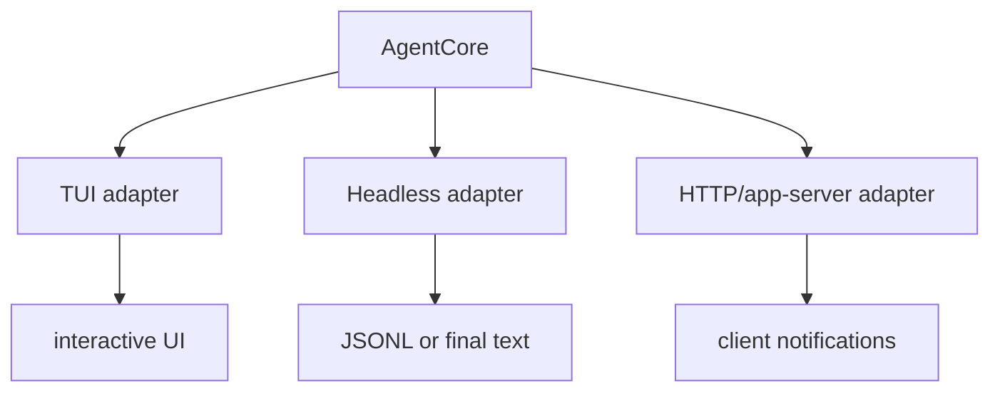

不要让 headless 入口打印 TUI 文本，也不要让 TUI 直接调用 agent 内部函数。协议事件是共同边界。

## 一个可实现的 v0.1

| 阶段 | 目标 |
|------|------|
| v0.1 | CLI 输入、模型调用、read/edit/shell、事件日志 |
| v0.2 | streaming events、审批、输出截断、resume |
| v0.3 | search-and-replace 编辑、项目规则、基础压缩 |
| v0.4 | MCP client、hooks、简单 TUI |
| v0.5 | sandbox、memory、multi-thread |

不要从 v0.5 开始。Codex 的价值是生产级细节，但学习时要先把最小 loop 跑通。

## 分阶段路线

### v0.1：能完成一轮真实任务

目标是跑通最短闭环：

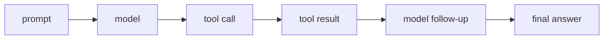

必做项：

| 模块 | 验收标准 |
|------|----------|
| 模型客户端 | 能流式接收文本和 tool call |
| 文件读取 | 能读 workspace 内文件 |
| 文件编辑 | 能修改一个文件并生成 diff |
| shell | 能执行命令，带超时和输出上限 |
| 日志 | 能重放一次任务发生了什么 |

### v0.2：可恢复、可审批

v0.2 开始补产品边界：

| 模块 | 验收标准 |
|------|----------|
| resume | 进程重启后能恢复 thread |
| approval | shell/write/network 有可解释审批 |
| structured events | UI 或脚本能订阅工具状态 |
| project rules | 能读取 `AGENTS.md` |
| output truncation | 大输出不会挤爆上下文 |

### v0.3：长会话与扩展

| 模块 | 验收标准 |
|------|----------|
| compact | 超过阈值时能摘要旧历史 |
| MCP client | 能接一个外部工具 |
| hooks | 能在工具前阻断，工具后补上下文 |
| headless JSONL | 能被脚本稳定解析 |
| tests | 有 agent loop、tool runtime、history normalize 的单元测试 |

### v0.4：生产化边界

| 模块 | 验收标准 |
|------|----------|
| sandbox | 命令副作用被系统边界限制 |
| multi-thread | 多会话并发不混状态 |
| sub-agent | 子任务可控、可等待、可关闭 |
| memory | 跨线程长期信息有来源和清理机制 |
| app-server | 前端通过协议而非内部 API 驱动 core |

## 最小实现的测试清单

| 测试 | 目的 |
|------|------|
| tool call 和 tool result 配对 | 防止模型输入不合法 |
| shell timeout | 防止命令挂死 |
| 输出截断 | 防止上下文爆掉 |
| edit old text 不唯一 | 防止错误替换 |
| 审批拒绝 | 模型能收到拒绝原因并改计划 |
| resume 后继续 turn | 确认事件日志可用 |
| compact 后继续任务 | 确认摘要没有破坏当前意图 |
| headless JSONL schema | 防止脚本集成被输出变化打断 |

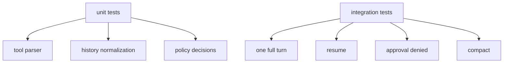

## 和 Codex 对照

| 最小组件 | Codex 对应路径 |
|----------|----------------|
| protocol | `codex-rs/protocol/src/protocol.rs` |
| loop | `codex-rs/core/src/session/turn.rs` |
| thread manager | `codex-rs/core/src/thread_manager.rs` |
| tools | `codex-rs/core/src/tools/` |
| shell exec | `codex-rs/core/src/exec.rs` |
| sandbox | `codex-rs/sandboxing/` |
| event log | `codex-rs/core/src/rollout.rs`、`codex-rs/rollout/` |
| config | `codex-rs/core/src/config/` |
| TUI | `codex-rs/tui/` |
| headless | `codex-rs/exec/` |

## 设计取舍

最小实现不要急着补齐 Codex 的所有能力。更合理的顺序是先让 loop 能可靠跑完一轮，再逐步加审批、日志、resume、压缩、MCP 和 sandbox。每加一个模块，都要确认它是在缩小风险或减少耦合，而不是只是在追求功能列表完整。

Codex 的源码适合当上限参照，不适合当 v0.1 模板。它处理的是多前端、多平台、多工具来源和长期会话，你自己的第一个版本只需要证明协议、工具和状态三件事可以稳稳接在一起。

## 如果自己做 Agent，可以学什么

Codex 不应该被照抄。它是生产系统，带着大量平台兼容和产品约束。更好的学习方式是抽象它的边界：协议、loop、工具、安全、状态。

先实现一个小而硬的版本，再按需求加 Codex 那些复杂层。这样你学到的是架构，而不是把自己困在 80 多个 crate 的细节里。
