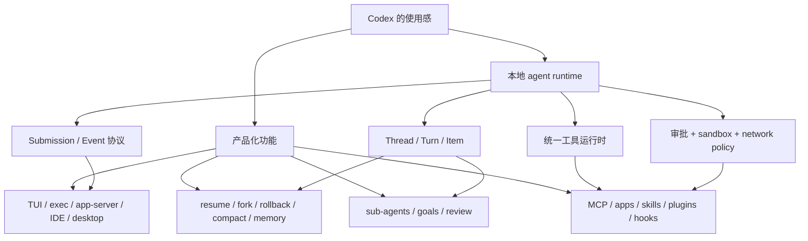

# 11. 为什么 Codex 用起来不一样：特性背后的架构

## 核心问题

普通 coding agent 也能调用模型、读文件、跑 shell，为什么 Codex 仍然值得专门读源码？这一章不把“好用”写成口号，而是看它把哪些产品特性沉到了 runtime 里。

先把边界说清楚。这里讨论的是开源的 Codex CLI 和本地 runtime，不包括模型能力本身，也不包括 Codex Web 的云端执行系统。下面的判断都以源码和官方文档为参照，不把社区感受当成源码事实。

## 源码入口

- `README.md`：本地运行、IDE、desktop app、Codex Web 的边界说明
- `codex-rs/README.md`：Rust CLI 的新增能力和 workspace 地图
- `codex-rs/docs/protocol_v1.md`：queue-pair、Session、Task、Turn 的概念
- `codex-rs/app-server/README.md`：Thread、Turn、Item、多前端 JSON-RPC API
- `codex-rs/core/src/thread_manager.rs`：thread 创建、恢复、fork 和内存管理
- `codex-rs/core/src/rollout.rs`：session rollout 和 thread 持久化入口
- `codex-rs/core/src/memories/README.md`：记忆流水线
- `codex-rs/core/src/tools/spec.rs`：内置工具、MCP、动态工具、子 agent 工具的规格构建
- `codex-rs/core/src/tools/parallel.rs`：工具并发控制
- `codex-rs/core/src/codex_delegate.rs`：子 agent session 的启动和事件转发
- `codex-rs/tools/src/agent_tool.rs`：`spawn_agent` 工具说明和使用约束
- `codex-rs/core/README.md`：三平台 sandbox 和平台假设
- `codex-rs/core/src/plugins/manager.rs`：plugin marketplace、skills、apps、MCP 的聚合管理

## 一张图看差异点

Codex 的特点不是某个按钮，而是这些模块能互相复用。同一个 thread 可以被 TUI 驱动，也可以被 app-server 驱动；同一套工具既能服务模型，也能服务 MCP、apps 和动态工具；同一套安全边界覆盖 shell、patch、MCP 调用和子 agent。

## 特性 1：它先是 runtime，再是 CLI

官方 README 把几种入口分得很清楚：终端里跑 `codex`，自动化里跑 `codex exec`，富界面通过 app-server 接入，其他 MCP client 可以通过实验性的 `codex mcp-server` 把 Codex 当成工具。`codex-rs/app-server/README.md` 进一步把 API 抽象成 Thread、Turn、Item，而不是终端里的输入行和输出行。

很多人觉得 Codex 比普通 CLI agent 更像产品，根源就在这里。CLI 只是一个客户端，核心是本地 agent runtime。这样 TUI、IDE、desktop app 和 headless automation 不用复制 agent loop，只需要实现自己的交互层。

这点很值得学。自己做 agent 时，哪怕第一版只有命令行，也应该尽早定义输入事件和输出事件。等你想接 Web UI、后台任务或 IDE 时，协议边界会比漂亮 UI 更值钱。

## 特性 2：thread 是可恢复的工作单元

Codex 不只保存聊天记录。app-server 暴露了 `thread/start`、`thread/resume`、`thread/fork`、`thread/list`、`thread/archive`、`thread/rollback`、`thread/compact/start` 等 API。源码里 `ThreadManager` 管 thread 生命周期，`rollout` 和 SQLite state 负责落盘，记忆流水线会从最近的 rollouts 里提取可复用信息。

这和简单 chat bot 的区别很大。普通聊天记录只回答“刚才说过什么”，Codex 的 thread 还要回答“这个任务跑到哪里了、能不能恢复、能不能 fork、能不能压缩、能不能被别的前端继续驱动”。这也是为什么它的源码里会有 rollout reconstruction、thread truncation、memory、goal 这些看起来偏重的模块。

如果自己做 Agent，事件日志不要等到最后再补。最小版本也可以先用 JSONL 保存 turn、tool call、tool result、assistant message 和错误。没有日志，resume、debug、压缩和回放都只能靠临时状态。

## 特性 3：工具不是一张固定清单

`core/src/tools/spec.rs` 里能看到 Codex 的工具来源很多：内置 shell、unified exec、apply_patch、MCP、MCP resource、dynamic tools、discoverable tools、tool_search、request_user_input、view_image、goal tools、review、子 agent 工具。`ToolRouter` 负责把模型返回的调用路由到 handler，`ToolOrchestrator` 再接审批、hook、sandbox 和执行。

这里有两个很实用的设计。一个是延迟暴露工具。MCP 工具、动态工具和 discoverable tools 不需要全量塞进 prompt，可以通过搜索、延迟加载或 namespace 降低上下文负担。另一个是并发不是全开，`tools/parallel.rs` 会按工具是否声明支持并发来决定读锁还是写锁，MCP server 也要显式配置 `supports_parallel_tool_calls`。

可以把 Codex 的工具系统理解成一层工具操作系统。工具不是 prompt 里的函数列表，而是一套可发现、可路由、可审批、可审计的 runtime 能力。这个方向比单纯增加工具数量更重要。

## 特性 4：安全不是一个确认弹窗

Codex 的安全路径很重。`core/README.md` 详细写了 macOS Seatbelt、Linux bubblewrap/Landlock、Windows sandbox 的差异。`core/src/tools/orchestrator.rs`、`core/src/exec.rs`、`core/src/guardian/`、`network-proxy/` 和 exec policy 共同决定一个工具调用能不能执行、要不要审批、要不要升级权限、网络能不能放行。

这解释了一个常见体验：Codex 可以更大胆地接近真实开发环境，因为它不是只靠模型自律。模型可以提出要跑命令，runtime 仍然有机会根据 cwd、sandbox、approval policy、Guardian review、网络策略和平台能力拦下来。

如果自己实现，先不要追三平台完整 sandbox。可以先做几条硬约束：workspace 外禁止写、shell 默认审批、网络默认关、命令超时、输出截断、危险路径拒绝。关键是把这些约束放在工具执行路径里，而不是只放在 UI 提示里。

## 特性 5：扩展能力按生命周期分层

Codex 的定制入口很多：`config.toml` 管模型、provider、sandbox、approval、MCP、features；`AGENTS.md` 管仓库规则；skills 是按需注入的专题能力；plugins 是分发单位，可以带 skills、apps、MCP；hooks 接生命周期事件；apps/connectors 接外部服务。

这不是把所有东西都塞进 system prompt。配置、项目规则、技能、插件、hook、外部连接器都有不同生命周期。长期稳定的东西进配置或项目文件，任务相关能力按需加载，外部流程走 hook 或 MCP。

这也是 Codex 适合团队环境的原因之一。个人 demo 可以靠一段长 prompt 维持，团队工具需要能安装、升级、禁用、审计和复用。`core/src/plugins/manager.rs` 里 plugin marketplace、curated cache、skills、apps、MCP server 的聚合逻辑，正是在解决这类分发问题。

## 特性 6：自动化模式不是缩水版聊天

`codex exec` 的定位是非交互运行：给一个 prompt，Codex 自己工作到结束。Rust README 还提到可以把 stdin 追加成 `<stdin>` block，`--ephemeral` 可以不持久化 rollout。app-server 侧还有 `command/exec`、`fs/readFile`、`fs/watch`、`model/list`、`config/read` 等接口，说明 Codex 不只服务聊天界面，也服务程序化集成。

这点对工程团队很有价值。很多 agent 工具只适合人盯着看，Codex 同时给了交互模式和 automation 模式。交互模式需要丰富事件，自动化模式需要稳定输出、退出语义和可配置权限，两者共用核心协议。

自己做 agent 时，不要把 headless 模式当成“把聊天输出打印出来”。自动化需要明确的结束条件、结构化事件、非零错误、日志位置、临时会话选项和可复现配置。

## 特性 7：子 agent 是受控工具，不是默认噪音

源码里已经有多 agent 能力。`codex_delegate.rs` 会启动子 Codex thread，复用父 session 的 auth、models、environment、skills、plugins、MCP manager、exec policy，并把子 agent 的审批请求路由回父 session。`tools/src/agent_tool.rs` 里对 `spawn_agent` 的说明也很克制：只有用户明确要求 sub-agent、delegation 或 parallel agent work 时才使用，不能把“深入研究”自动解释成可以派生子 agent。

这层设计很值得看。多 agent 最容易变成失控并发：每个 agent 都觉得自己在帮忙，最后成本上升、上下文分裂、结果互相覆盖。Codex 把子 agent 做成普通工具的一种，并且用 prompt 约束、权限继承、事件转发和审批路由管理它。

如果自己做多 agent，先定义所有权和写入范围。不要让多个 agent 同时改同一片文件，也不要让子 agent 绕过父任务的安全策略。

## 特性 8：体验来自事件粒度

Codex 的 TUI 体验不只是终端画得漂亮。协议里有 streaming delta、reasoning、tool start/stop、approval request、PlanDelta、warning、turn complete 等事件。app-server 又把它们映射成 `item/started`、`item/completed`、`item/agentMessage/delta`、`turn/completed` 这类通知。

事件粒度足够细，前端才能做出“正在发生什么”的体验：模型在想、正在跑哪个命令、哪个工具需要审批、文本流到哪里、回合为什么中断。没有这些事件，UI 只能在黑盒命令结束后一次性显示结果。

这也是很多人会喜欢 Codex 的地方：它看起来像在和本地开发环境协作，而不是远端模型偶尔吐一段代码。背后靠的是协议事件和工具状态，而不是前端动画。

## 用户能感觉到的点，源码里怎么落地

下面这张表把使用层面的感受拆成源码机制。它不是官方产品说明，而是基于开源 runtime 的结构化解读。

| 使用感 | 直接机制 | 更深一层的机制 | 代价 |
|--------|----------|----------------|------|
| 运行中能看到进展 | `EventMsg` / app-server item events | 模型流事件、工具事件、approval request 被拆开传输 | 协议类型很多，前端要处理更多状态 |
| 能放心让它动工作区 | `ToolOrchestrator`、approval、sandbox | first attempt / retry attempt、Guardian、network approval、output limits | 不同平台行为会不完全一致 |
| 能跑长任务 | rollout、state DB、thread manager | history 可压缩，thread 可恢复，memory 可从 rollout 抽取 | 状态路径比普通 chat bot 复杂 |
| 工具多但还能管理 | `ToolRouter`、`ToolRegistry`、`tool_search` | deferred tools、MCP exposure、dynamic tools、unavailable placeholders | prompt 和 registry 要每轮重建 |
| 可以接 IDE / desktop | app-server JSON-RPC | Thread / Turn / Item 抽象，不绑定终端 UI | UI 需要理解 agent 事件模型 |
| 子 agent 没有完全失控 | `codex_delegate`、agent tools | 子 thread 继承父 session 服务，审批路由回父 session | delegation 需要明确所有权和上下文 |
| 自动化不是聊天转 stdout | `codex exec`、JSONL events | headless 入口复用 core protocol 和 turn lifecycle | 必须定义退出、错误和持久化语义 |

这也是 Codex 和很多开源 agent demo 的分界：demo 往往先展示“模型会调用工具”，Codex 更关心“工具调用怎样进入一个可恢复、可审批、可观测、可扩展的 runtime”。

## 哪些地方不该直接照抄

Codex 的复杂度来自真实产品边界，学习时不需要一次照搬全部模块。几个地方适合谨慎取舍：

| Codex 做法 | 适合学习的点 | 小项目可以怎么降级 |
|------------|--------------|--------------------|
| 三平台 sandbox | 安全边界应该在执行路径里 | 先做 cwd 限制、人工审批、超时和输出上限 |
| app-server 多前端 | core 不绑定 UI | 先定义稳定事件 JSONL，再接 Web/TUI |
| memory 两阶段 pipeline | 长期记忆要和当前 history 分开 | 先不做 memory，只保留可检索 rollout |
| dynamic tools / tool_search | 工具多时要延迟发现 | 工具少时静态列表即可 |
| plugin marketplace | 扩展要能分发、启停、聚合 | 先支持本地 skills/hooks |
| Guardian 自动 reviewer | 自动审批要 fail closed | 先全部交给用户审批 |

这个角度能避免一个误区：把 Codex 的每个模块都当成最小 agent 的必需品。更合理的学习方式是先理解它为什么需要这些边界，再按自己的产品风险选择实现顺序。

## 关键结构对照

| 使用层面的感觉 | 源码里的支撑 | 值得学的点 |
|----------------|--------------|------------|
| 可以在 CLI、IDE、desktop、automation 里用 | `codex-rs/app-server/README.md`、`codex-rs/exec/src/lib.rs`、`codex-rs/mcp-server/` | 先做 core protocol，再做 UI |
| 会话能恢复、fork、压缩 | `codex-rs/core/src/thread_manager.rs`、`codex-rs/core/src/rollout.rs`、`codex-rs/core/src/compact.rs` | 把任务当成持久化工作单元 |
| 工具很多但不完全乱 | `codex-rs/core/src/tools/spec.rs`、`codex-rs/core/src/tools/router.rs`、`codex-rs/core/src/tools/registry.rs` | 工具要能发现、路由、审批、记录 |
| shell 权限比较克制 | `codex-rs/core/src/tools/orchestrator.rs`、`codex-rs/core/src/guardian/`、`codex-rs/sandboxing/` | 安全必须在执行路径里 |
| 能接团队规则和外部系统 | `codex-rs/core/src/agents_md.rs`、`codex-rs/core/src/skills.rs`、`codex-rs/core/src/plugins/`、`codex-rs/hooks/` | 按生命周期拆定制入口 |
| 能跑长期任务和自动化 | `codex-rs/exec/src/lib.rs`、`codex-rs/app-server/README.md`、`codex-rs/core/src/goals.rs` | headless 模式需要事件和状态 |
| 能受控地派生子 agent | `codex-rs/core/src/codex_delegate.rs`、`codex-rs/tools/src/agent_tool.rs` | 多 agent 要继承策略和明确所有权 |

## 设计取舍

Codex 选择了更复杂的 runtime。它的源码不像小型 agent demo 那样一眼看完，因为它要同时处理多入口、多平台、多工具来源、权限、安全、持久化、压缩、插件和团队策略。

这套复杂度不是免费午餐。它带来更多配置、更多状态、更多失败路径，也让初学者读源码时容易迷路。它换来的能力是：同一个核心可以服务多种产品形态，工具执行有硬边界，长任务有恢复基础，团队扩展不会全部挤进 prompt。

## 如果自己做 Agent，可以学什么

不要只学 Codex 的功能列表，更应该学它的分层方式。先问每个能力属于哪一层：协议、thread、工具、安全、上下文、扩展、前端。层次清楚之后，加功能才不会把 agent loop 变成一团回调。

一个更实用的学习顺序是：先做 `Submission/Event`，再做 `Thread/Turn/Item`，然后做统一工具管道和事件日志，最后再加 skills、MCP、plugins、hooks、memory 和 sub-agent。Codex 值得读，是因为它把这些后续问题都摆在了源码里。
