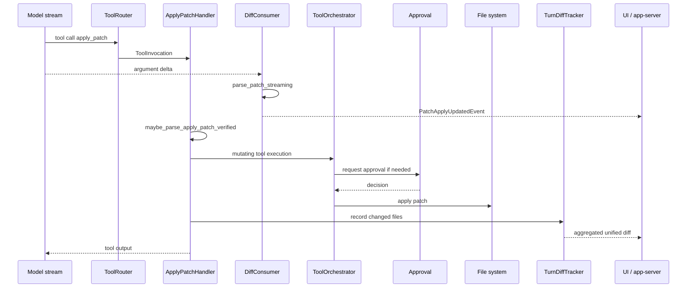
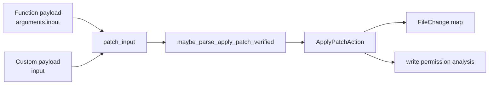
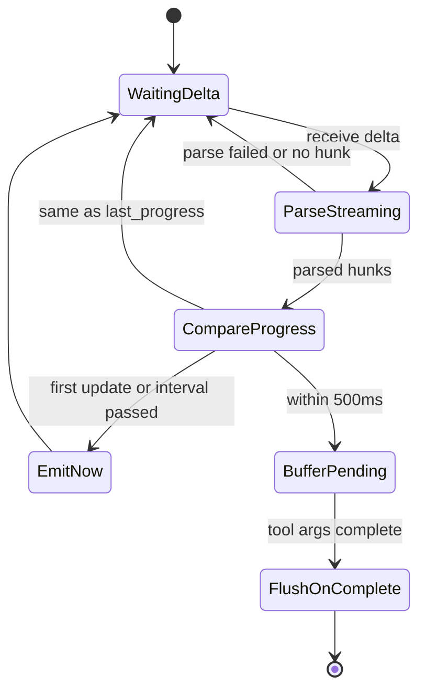
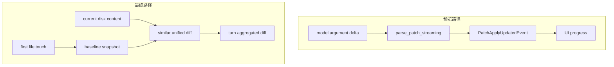
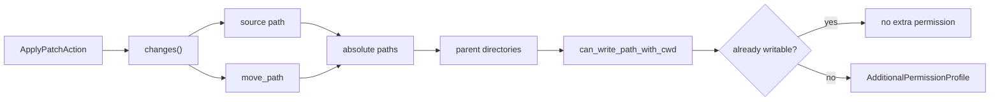
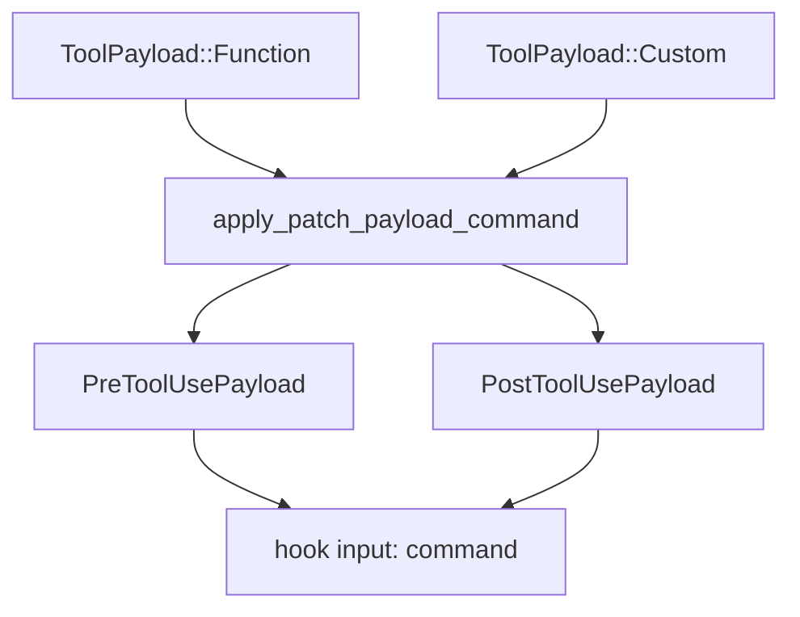
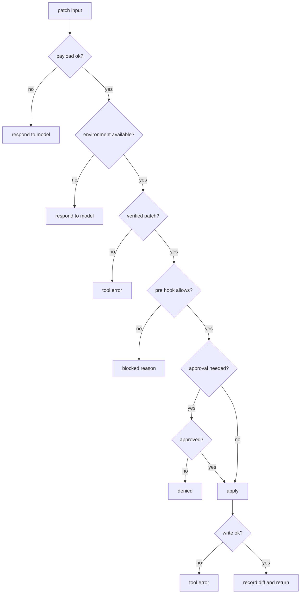
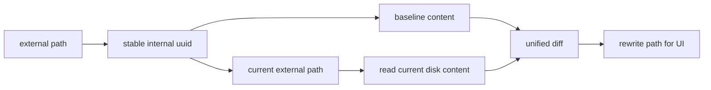
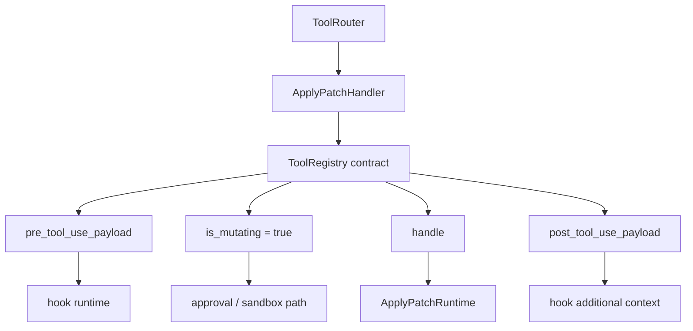
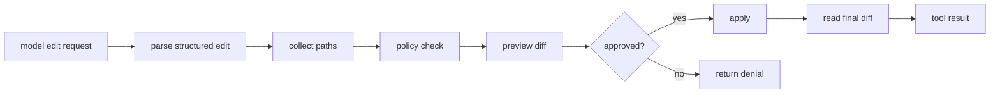

# 12. 代码编辑与 apply_patch

Codex 的代码编辑路径很值得单独拆出来看。很多 agent demo 会让模型直接写文件，或者把一段 shell 命令交给系统执行；Codex 把最常见的文件修改收敛到 `apply_patch` 这条路径上，让编辑行为在进入文件系统前就能被解析、预览、审批、追踪和回放。

本章只讲公开源码里的本地 runtime，不讨论模型为什么选择某种 patch，也不讨论云端服务。对应快照为 `openai/codex@87bc724`。

## 核心问题

读这一章前，可以带着几个问题看源码：

| 问题 | 对应源码 |
|------|----------|
| 模型输出的 patch 在哪里被解析 | `codex-rs/core/src/tools/handlers/apply_patch.rs` |
| patch 还没完全生成时，UI 为什么能看到变更预览 | `ApplyPatchArgumentDiffConsumer` |
| patch 为什么会触发审批或额外写权限 | `effective_patch_permissions`、`write_permissions_for_paths` |
| 一轮 turn 结束时的最终 diff 从哪里来 | `codex-rs/core/src/turn_diff_tracker.rs` |
| hook 为什么能看到 patch 的原始内容 | `apply_patch_payload_command` |

`apply_patch` 的设计要点是：文件编辑不是一个黑盒 shell 命令，而是一种结构化副作用。只要编辑能先被解析成文件级变化，系统就能做更细的权限判断和 UI 展示。

## 源码入口

| 路径 | 重点 |
|------|------|
| `codex-rs/core/src/tools/handlers/apply_patch.rs` | apply_patch 工具 handler、流式参数消费、审批输入、最终执行 |
| `codex-rs/core/src/turn_diff_tracker.rs` | turn 内文件变化聚合、rename 追踪、unified diff 生成 |
| `codex-rs/core/src/apply_patch.rs` | patch 解析、协议转换、执行入口的辅助逻辑 |
| `codex-rs/apply-patch/` | patch grammar 和解析实现 |
| `codex-rs/core/src/tools/orchestrator.rs` | 工具执行总编排，连接 hook、审批、sandbox |
| `codex-rs/core/src/tools/runtimes/apply_patch.rs` | apply_patch runtime 请求和执行封装 |
| `codex-rs/protocol/src/protocol.rs` | `PatchApplyUpdatedEvent`、`ApplyPatchApprovalRequestEvent`、`FileChange` |

从阅读顺序看，先读 `ApplyPatchHandler`，再读 `ApplyPatchArgumentDiffConsumer`，最后读 `TurnDiffTracker`。前者回答“如何执行编辑”，后者回答“如何把这轮编辑汇总给 UI 和后续流程”。

## 端到端流程



这张图里有两个 diff。第一个是参数流中的“预览 diff”，还没有真正写入文件；第二个是 `TurnDiffTracker` 的“最终 diff”，来自当前磁盘内容和 turn 开始时基线的比较。

## patch 先被当成结构化数据

`ApplyPatchHandler` 同时支持 function tool 和 custom/freeform tool 两种 payload。源码里 `matches_kind` 接受 `ToolPayload::Function` 和 `ToolPayload::Custom`，真正执行时再把两种输入统一成 `patch_input`。

| payload 形态 | 代表来源 | 处理方式 |
|--------------|----------|----------|
| `ToolPayload::Function { arguments }` | 常规函数工具调用 | 解析 `ApplyPatchToolArgs`，取出 `input` |
| `ToolPayload::Custom { input }` | freeform custom tool call | 直接把 `input` 当 patch 文本 |
| 其他 payload | 不支持 | 返回 `FunctionCallError::RespondToModel` |

这一层的价值不在格式兼容本身，而在统一后续路径。无论模型用哪种工具形态，hook 看到的是同一个 `tool_input.command`，审批看到的是同一组 `FileChange`，diff tracker 看到的是同一批文件路径。



`maybe_parse_apply_patch_verified` 不是只做语法解析。它会结合 `cwd` 和当前文件系统检查 patch 是否能落到实际文件上。这样审批和执行拿到的不是一段任意字符串，而是已经能对应到文件变化的 action。

## patch grammar 让编辑可审计

Codex 使用的 patch 语法不是通用 `diff -u`，而是一个更窄的编辑 DSL。典型结构如下：

```patch
*** Begin Patch
*** Update File: src/lib.rs
@@
-old line
+new line
*** End Patch
```

三类顶层 hunk 对应三类文件变化：

| hunk | 协议变化 | UI 和审批可以知道什么 |
|------|----------|----------------------|
| `AddFile` | `FileChange::Add { content }` | 新文件路径和完整内容 |
| `DeleteFile` | `FileChange::Delete { content }` | 删除路径 |
| `UpdateFile` | `FileChange::Update { unified_diff, move_path }` | 修改片段、可选 rename 目标 |

这种语法的好处是边界清楚。模型不能在 patch 里顺手执行命令，也不能把读文件、写文件、移动文件、联网请求混在同一个 shell 字符串里。系统可以在还没写磁盘前提取路径集合、生成预览、计算权限。

## 流式参数消费为什么重要

模型生成 patch 时，参数不是一次性到达的。`ApplyPatchArgumentDiffConsumer` 会不断累积 delta，调用 `parse_patch_streaming` 尝试解析当前已经生成的内容，并把能识别的 hunk 转成 `PatchApplyUpdatedEvent`。

关键逻辑集中在几个字段：

| 字段 | 作用 |
|------|------|
| `input` | 已经收到的 patch 文本 |
| `last_progress` | 上一次成功解析出的 hunk 列表 |
| `last_sent_at` | 上一次发出 UI 更新的时间 |
| `pending` | 500ms 节流期间暂存的最新更新 |



源码里有一个明确节流常量：

```rust
const APPLY_PATCH_ARGUMENT_DIFF_BUFFER_INTERVAL: Duration = Duration::from_millis(500);
```

这意味着 UI 不需要等工具真正执行完成才知道模型打算改什么。只要特性开关 `Feature::ApplyPatchStreamingEvents` 打开，模型生成参数的过程中就能看到 patch 预览。与此同时，节流避免 UI 被每个 token 级 delta 打爆。

## 预览 diff 与最终 diff 不是同一件事

`convert_apply_patch_hunks_to_protocol` 负责把 streaming parser 识别出的 `Hunk` 转成协议里的 `FileChange`。这里的 diff 来自模型正在生成的 patch 参数。

`TurnDiffTracker` 做的是另一件事：当文件被编辑时，它保存第一次看到该文件时的基线内容，之后根据磁盘上的当前内容计算最终 unified diff。它还会用稳定内部文件名追踪 rename 或 move，避免重命名后丢失基线。



这两个 diff 的边界很清楚：

| 类型 | 来源 | 时间点 | 可靠性 |
|------|------|--------|--------|
| 预览 diff | patch 参数流 | 工具执行前 | 表示模型意图，不代表已经写入 |
| 最终 diff | 基线快照与磁盘内容 | 工具执行后或 turn 汇总时 | 表示文件系统事实 |

因此，UI 可以用预览 diff 提前展示将要发生的变化，用最终 diff 展示真实落盘结果。对一个 coding agent 来说，这比只在最后吐出“已修改文件”更可控。

## 权限判断基于文件路径集合

`file_paths_for_action` 从 `ApplyPatchAction` 中提取所有受影响路径。对于普通更新，它会记录源路径；对于带 `move_path` 的更新，它也会记录目标路径。随后 `write_permissions_for_paths` 会检查这些路径的父目录是否已经在当前文件系统 sandbox 的可写范围内。



这里能看到一个安全取舍：审批不是只看“是否用了 apply_patch”，而是看这次 patch 要写哪些路径。即使工具本身是编辑工具，超出当前可写根目录时仍然需要额外权限。

`effective_patch_permissions` 会合并 session 已授予权限和 turn 已授予权限，再计算当前 patch 还需要哪些额外写权限。这样同一轮对话里已经批准过的路径不会反复要求用户确认，新的越界路径仍然会被拦住。

## hook 看到的是 command-shaped 输入

`apply_patch_payload_command` 的注释写得很直接：无论 apply_patch 来自旧的 JSON/function 形态，还是 freeform custom tool call，hook 都应该看到同一份原始 patch body，并放在 `tool_input.command` 里。



这让 hook 不必理解 Codex 内部的 tool payload 枚举。企业或团队可以在 hook 里检查 patch 内容，比如禁止修改某些路径、要求特定文件必须同时更新、记录审计信息。

## 执行路径上的失败点

`apply_patch` 不是“解析成功就一定写文件”。中间有多个失败出口：

| 阶段 | 失败条件 | 返回方向 |
|------|----------|----------|
| payload 解析 | payload 不是 function/custom，或 function 参数不符合 schema | `RespondToModel` |
| session 环境 | 当前 turn 没有可用 environment | `RespondToModel` |
| patch 校验 | patch 语法不合法、上下文不匹配、路径无效 | 工具错误返回模型 |
| 权限计算 | 目标路径超出 sandbox，需要额外权限 | 进入审批或拒绝 |
| hook 阻断 | `PreToolUse` 决定 block | 工具不执行，reason 给模型 |
| 用户或 Guardian 拒绝 | patch 审批未通过 | 工具不写文件 |
| 写入失败 | 文件系统写入出错 | 工具错误返回模型 |



这些失败点会让模型得到可解释的反馈，而不是让进程静默失败。对 coding agent 来说，失败可解释比失败可避免更现实。

## TurnDiffTracker 怎么聚合编辑

`TurnDiffTracker` 的源码注释列出了三个核心目标：

1. 第一次看到文件时保存基线。
2. 给外部路径分配稳定内部文件名，用于 rename 追踪。
3. 计算聚合 diff 时，把基线和当前磁盘内容在内存里比较，再把路径映射回外部路径。

它用 `similar` crate 生成 unified diff；在 git 仓库内时，还会尝试通过 `git hash-object` 帮助判断内容状态。rename/move 通过内部文件名维护映射，而不是只把路径字符串当唯一身份。



这种设计解决了一个常见细节：同一轮 turn 里，一个文件可能先被修改，再被移动。如果只按路径算 diff，最终路径已经变了，原路径的基线很容易丢。稳定内部名让“这个文件”跨路径变化仍然能被识别。

## 为什么偏向 patch 而不是随意写文件

事实层面，Codex 并不是完全不能通过 shell 修改文件。模型可以请求执行命令，命令也可能写文件。但对于直接代码编辑，`apply_patch` 提供了一条更容易控制的主路径。

工程判断可以分成几层：

| 维度 | patch 路径 | 随意写文件路径 |
|------|------------|----------------|
| 预览 | 能从参数流生成文件级预览 | 通常要等命令完成 |
| 审批 | 能按路径、diff、权限做判断 | 往往只能审命令字符串 |
| 失败反馈 | 语法、上下文、权限错误可细分 | 命令输出可能很散 |
| UI 展示 | 可直接转 `FileChange` | 需要再扫描文件系统 |
| 审计 | patch 文本可记录和复现 | shell 命令可能包含复杂副作用 |

这不是说 patch 一定优于所有编辑方式。批量格式化、代码生成器、构建脚本更新仍然适合命令。但人类 review 最常见的源代码修改，用 patch 做主路径会更容易和审批、安全、diff UI 接起来。

## 和工具编排的关系

`ApplyPatchHandler` 只是 handler。真正的工具生命周期仍然由工具系统负责：



`is_mutating` 返回 true 很关键。它告诉上层这不是纯查询工具，不能和只读工具一样处理。审批、sandbox、turn diff、hook 都围绕“这会改变文件系统”这个事实展开。

## 设计取舍

| 取舍 | 收益 | 代价 |
|------|------|------|
| 使用专门 patch grammar | 文件变化可解析、可预览、可审批 | 模型必须学会更窄的语法 |
| 流式解析 patch 参数 | UI 反馈更早，用户能提前看到修改意图 | parser 和节流逻辑更复杂 |
| 最终 diff 基于磁盘事实 | 能反映实际落盘结果 | 需要追踪基线、处理 rename 和文件读取 |
| hook 输入统一成 `command` | 扩展方不需要关心 payload 形态 | apply_patch 在 hook 语义上看起来像命令 |
| 按路径算额外权限 | 权限边界更细 | patch 执行前必须完成路径分析 |

值得注意的是，Codex 没有把安全完全放在模型层。模型可以提出修改，但修改进入文件系统前会被 runtime 重新解析和约束。

## 如果自己做 Agent，可以学什么

做最小 agent 时，不一定要完整复制 `apply_patch` grammar，但最好保留这几条原则：

1. 文件编辑要结构化。即使内部最终调用写文件 API，也应该先把编辑意图转成路径、操作类型和 diff。
2. 预览和落盘要分开。预览代表模型意图，最终 diff 代表文件系统事实。
3. 写权限要按路径判断。不要只因为工具名叫 edit 就默认允许所有写入。
4. 编辑工具要有可解释失败。语法错误、上下文不匹配、权限拒绝应当给模型不同反馈。
5. hook 或策略系统看到的输入要稳定。不要让扩展方分别适配 function call、custom tool、shell wrapper。

最小实现可以长这样：



## 可核对命令

在 `openai/codex` 源码根目录执行：

```bash
rg -n "struct ApplyPatchHandler|ApplyPatchArgumentDiffConsumer|apply_patch_payload_command" codex-rs/core/src/tools/handlers/apply_patch.rs
rg -n "PatchApplyUpdatedEvent|ApplyPatchApprovalRequestEvent|FileChange" codex-rs/protocol/src/protocol.rs
rg -n "struct TurnDiffTracker|get_unified_diff|hash-object" codex-rs/core/src/turn_diff_tracker.rs
rg -n "parse_patch_streaming|enum Hunk" codex-rs
```

如果只想确认核心设计，优先看 `ApplyPatchHandler::handle` 和 `TurnDiffTracker::get_unified_diff`。
