# 13. System Prompt 与上下文注入

Codex 的 prompt 不是一段固定 system prompt 加上用户消息。每一轮 turn 开始前，runtime 会把环境信息、权限边界、可用 skills、plugins、apps、hooks 追加上下文、用户配置、sub-agent 提醒等片段整理成模型输入。理解这条链路，才能解释为什么同一个 Codex core 可以服务 CLI、TUI、desktop、IDE、`exec` 和 sub-agent。

本章关注“上下文从哪里来、何时进入模型、如何避免重复注入”。不讨论具体模型训练，也不把产品行为反推成模型内部机制。

## 核心问题

| 问题 | 对应源码 |
|------|----------|
| Codex 有哪些上下文片段类型 | `codex-rs/core/src/context/mod.rs` |
| turn 开始时什么时候记录 context 更新 | `codex-rs/core/src/session/turn.rs` |
| skills 如何变成模型输入 | `codex-rs/core/src/skills.rs`、`codex-rs/core-skills/` |
| plugins 和 apps 如何按显式 mention 注入 | `codex-rs/core/src/plugins/injection.rs` |
| hook 的 additional context 如何进入后续模型输入 | `codex-rs/core/src/hook_runtime.rs` |
| AGENTS.md 这类项目指令从哪里来 | `codex-rs/core/src/agents_md.rs` |

可以把 Codex 的 prompt 看成两层：稳定的基础指令决定 agent 的通用行为；turn-scoped context 描述当前环境、权限、工具和用户本轮输入。后者会随 session、frontend、config 和工具结果变化。

## 源码入口

| 路径 | 重点 |
|------|------|
| `codex-rs/core/src/context/mod.rs` | context fragment 模块列表和导出 |
| `codex-rs/core/src/context/fragment.rs` | fragment registration 和 contextual user fragment |
| `codex-rs/core/src/session/turn.rs` | 每轮 turn 组装技能、插件、app、hook context 的主路径 |
| `codex-rs/core/src/session/mod.rs` | session 记录 context update 和 reference context item |
| `codex-rs/core/src/skills.rs` | skill 注入入口 |
| `codex-rs/core-skills/` | core skill 注入内容 |
| `codex-rs/core/src/plugins/injection.rs` | plugin mention 到 prompt item 的转换 |
| `codex-rs/core/src/hook_runtime.rs` | hook additional context 写入模型上下文 |
| `codex-rs/core/src/agents_md.rs` | AGENTS.md 读取和层级合并 |

这一章的阅读主线是 `run_turn`。它在真正请求模型前，会先完成 context update 记录、skills/plugins/apps 解析、hooks 运行和额外上下文收集。

## 上下文注入全景

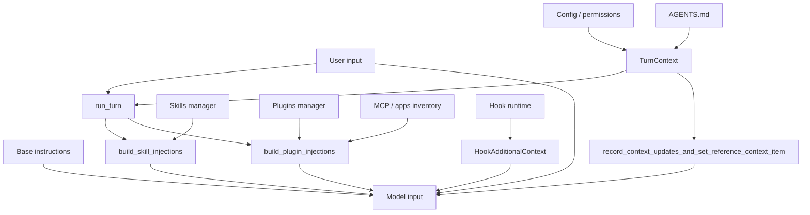

这条路径不是简单地把所有材料都塞进 prompt。Codex 会区分：

| 类型 | 何时出现 | 主要目的 |
|------|----------|----------|
| 基础指令 | session 配置或模型请求构建时 | 定义 agent 行为、工具规则、输出边界 |
| turn context | 每轮 turn | 告诉模型当前 cwd、sandbox、审批、frontend、环境 |
| skills | 显式 mention 或触发规则命中 | 给模型某类任务的专门工作流 |
| plugins | 显式 plugin mention | 给模型插件能力、apps、MCP 能力说明 |
| hook additional context | hook 运行后 | 把外部策略或工具结果补充给模型 |
| history / rollout | 跨 turn | 保留对话、工具结果、压缩摘要和恢复材料 |

## Context fragment 是 prompt 的“零件”

`context/mod.rs` 列出的模块可以看成 Codex prompt 的零件库。它导出了一组 fragment：

| fragment | 作用 |
|----------|------|
| `EnvironmentContext` | 当前工作目录、shell、日期、时区等运行环境 |
| `PermissionsInstructions` | 文件系统 sandbox、网络、审批策略 |
| `AvailableSkillsInstructions` | 当前可用 skill 列表 |
| `AvailablePluginsInstructions` | 当前可用 plugin 列表 |
| `AppsInstructions` | connector/app 相关能力 |
| `SkillInstructions` | 某个 skill 被选中后给模型的具体指令 |
| `PluginInstructions` | 某个 plugin 被提及时给模型的具体说明 |
| `HookAdditionalContext` | hook 输出的额外模型上下文 |
| `SubagentNotification` | 子 agent 相关提示 |
| `TurnAborted` | 被中断 turn 的上下文标记 |
| `UserShellCommand` | 用户 shell 命令带来的上下文 |
| `GuardianFollowupReviewReminder` | Guardian 后续复核提醒 |
| `ApprovedCommandPrefixSaved` | 已保存命令前缀审批规则 |
| `NetworkRuleSaved` | 已保存网络规则 |

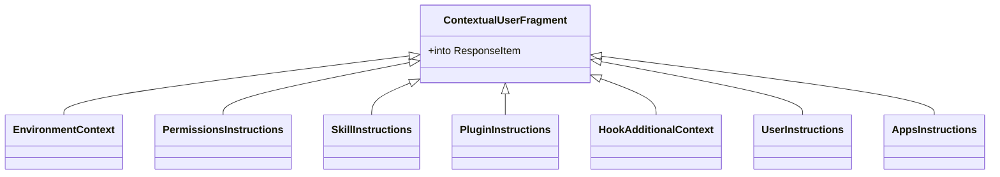

这些 fragment 多数最终会被转成 `ResponseItem`，进入模型请求的 input。把它们拆成类型的好处是：新增上下文来源时，不需要把所有 prompt 拼接逻辑写进一个巨大的字符串模板。

## run_turn 里的注入顺序

`run_turn` 的前半段做了很多和模型请求无关、但和 prompt 质量直接相关的工作。简化后顺序如下：

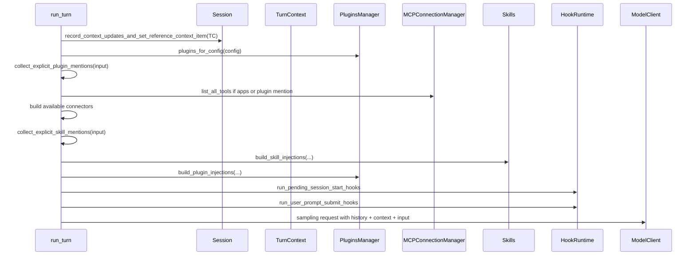

这里有两个细节很关键：

一方面，`record_context_updates_and_set_reference_context_item` 发生在技能和插件注入前。它负责把 turn context 的变化记录下来，并维护一个 reference context item，避免每轮都粗暴重复注入完整环境。

另一方面，skills、plugins、apps 是按本轮输入和当前配置动态展开的。模型没有必要在每轮都读完所有 skill 全文和所有 plugin 能力，只有显式提到或触发时才进入更重的指令。

## skills 注入不是全量倾倒

`build_skill_injections` 的输入包括本轮提到的 skills、当前 skills outcome、telemetry 和 tracking context。输出是 `SkillInjections`，里面有真正要注入的 items，也可能有 warnings。

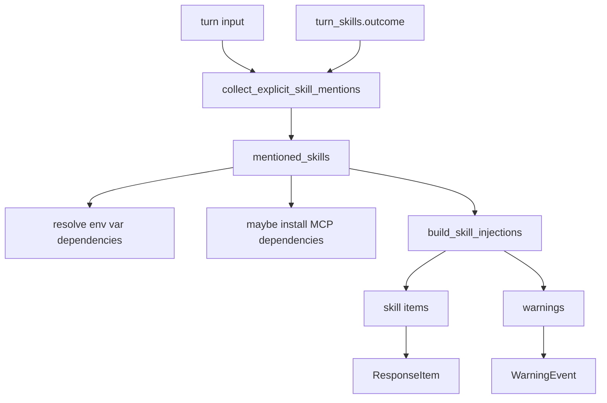

这种设计背后有一个上下文预算判断：skill 很有用，但每个 skill 都是 prompt 成本。Codex 让 skill 处在“可发现、可显式触发、按需注入”的位置，而不是 session 开始时一次性塞满。

值得注意的是，skills 还可能带来依赖检查。比如某个 skill 声明需要环境变量或 MCP server，turn 开始前会尽量解析这些依赖，并把问题反馈给用户或模型。

## plugins 和 apps 走显式 mention

plugins 和 apps 的注入更强调显式性。`collect_explicit_plugin_mentions` 会从输入里找结构化 `plugin://...` mention，再通过 `plugins_manager` 和 MCP/app inventory 构建本轮说明。

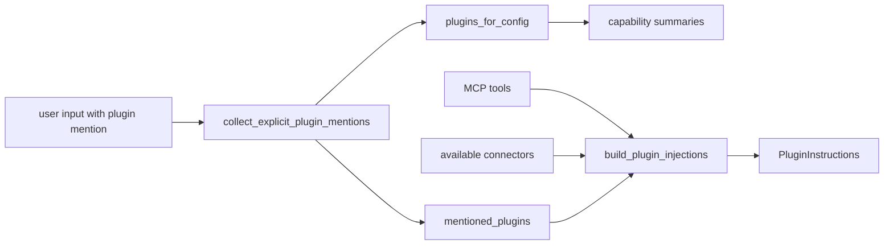

apps 的可用性依赖 MCP tools 和 connector 列表。源码里只有在 `turn_context.apps_enabled()` 或提到了 plugin 时，才会去 `mcp_connection_manager` 读取工具清单。这说明 app/plugin 能力不是无条件进入模型视野，而是受 config、frontend、显式 mention 和可访问 connector 共同决定。

## hook additional context 会进入后续模型输入

hook 不只负责阻断工具。`run_pending_session_start_hooks`、`run_user_prompt_submit_hooks`、`run_post_tool_use_hooks` 都可能返回 `additional_contexts`。`hook_runtime.rs` 会把这些字符串转成 `HookAdditionalContext` 类型的 contextual fragment。

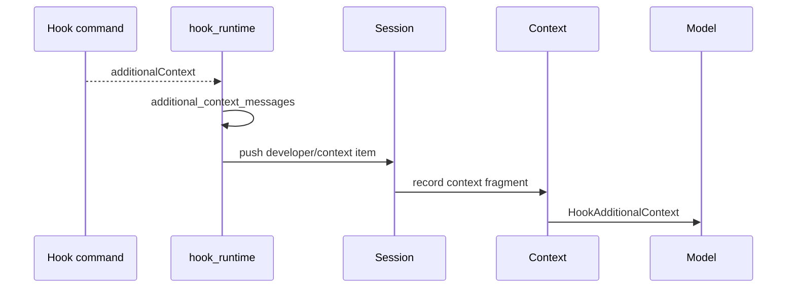

这种机制适合接入外部策略系统。例如 hook 可以在工具执行后告诉模型“这个仓库要求所有 migration 同步更新 schema snapshot”。它不需要改 Codex core，也不需要把规则写进全局 system prompt。

需要留意边界：hook additional context 是给模型看的补充信息，不等同于权限批准。权限决策仍走 `PermissionRequest` 或工具审批路径。

## AGENTS.md 属于项目级指令

AGENTS.md 这类项目指令解决的是另一类问题：同一个 agent 进入不同仓库时，需要知道该仓库的构建命令、风格约束、测试习惯和目录约定。源码入口在 `codex-rs/core/src/agents_md.rs`，具体加载结果会进入 turn context 和 prompt history。

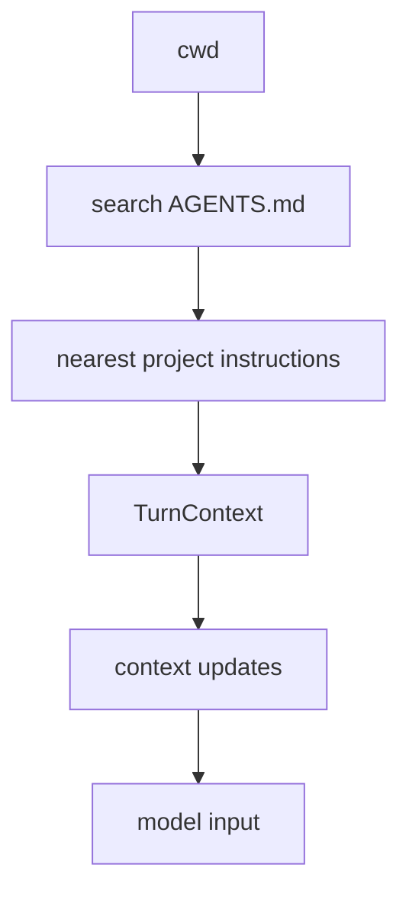

AGENTS.md 和 skills 的区别是：

| 维度 | AGENTS.md | skills |
|------|-----------|--------|
| 归属 | 仓库或目录 | 用户、插件或系统能力 |
| 触发 | 进入对应工作区 | 按任务、mention、规则选择 |
| 内容 | 项目约定 | 任务工作流或工具说明 |
| 生命周期 | 随 cwd 和文件层级变化 | 随配置、插件、安装状态变化 |

一个成熟 agent 需要同时支持这两类上下文。项目约定决定“在这里怎么做事”，skill 决定“遇到这类任务怎么做事”。

## environment context 与 permissions context

`EnvironmentContext` 和 `PermissionsInstructions` 是模型每轮判断工具行为的基础。比如当前 cwd、shell、日期、时区、sandbox 模式、网络策略、审批策略，都会影响模型是否应该请求执行命令、如何解释错误、是否需要先读文件。

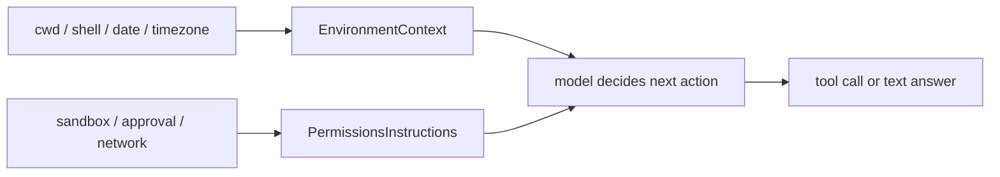

这类上下文有一个容易忽略的价值：它把 runtime 约束显式告诉模型。没有这些信息时，模型可能会假设自己能联网、能写任意路径、能交互式输入密码；实际工具层再拒绝，会造成更多失败循环。

## reference context item 的作用

长会话里，环境和权限并不一定每轮都变。如果每轮都完整注入同一份 context，会浪费 token；如果不注入，又可能让模型忘记当前边界。Codex 通过记录 context updates 和 reference context item，把“稳定上下文”和“变化片段”区分开。

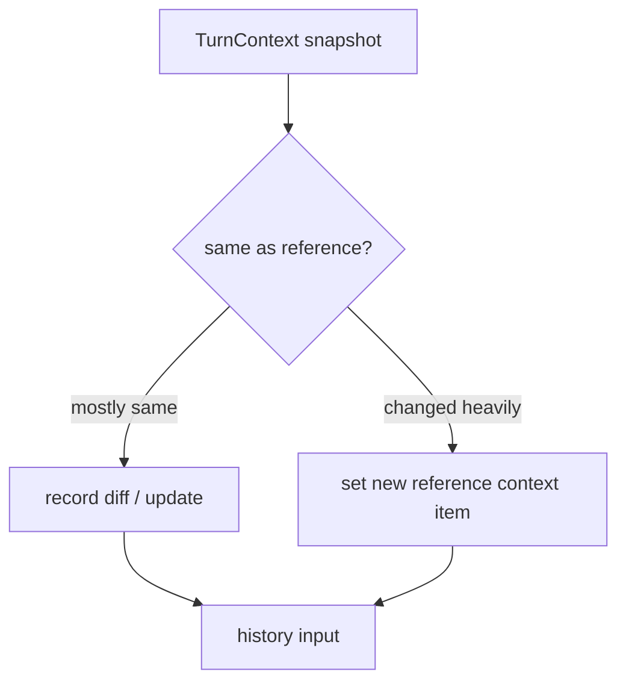

源码细节分布在 session 和 context manager 相关模块。理解时不必把它看成 prompt 技巧，而应看成长线程状态管理：上下文既要被模型看见，又不能无限重复。

## 失败路径和边界

| 场景 | 处理方式或风险 |
|------|----------------|
| MCP tools 读取失败 | 如果 apps 已启用，`run_turn` 可能直接返回；如果只是 plugin mention 需要能力说明，可能退化为空清单 |
| skill 依赖缺失 | 可能发 warning，或触发依赖解析和安装提示 |
| hook 返回 additional context | 会进入模型上下文，但不会自动越过审批 |
| context 太大 | 进入压缩、history 管理和 reference context 逻辑 |
| 用户显式 mention 不存在的 skill/plugin | 应反馈 warning 或无法解析，而不是凭空生成能力 |
| 前端不支持 apps | apps context 不应出现，避免模型调用不可用工具 |

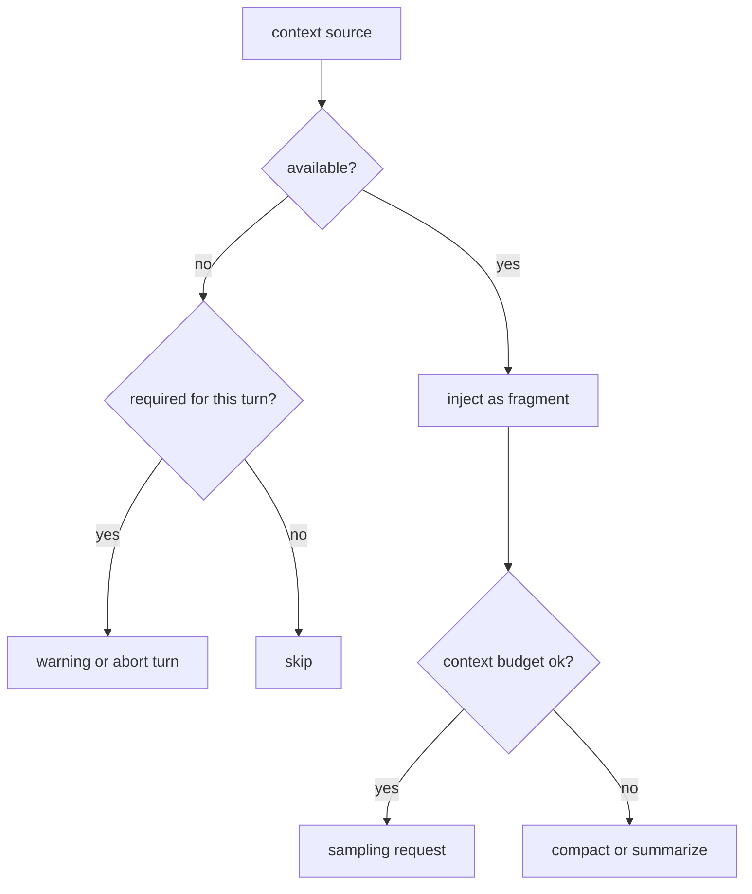

## 设计取舍

| 取舍 | 收益 | 代价 |
|------|------|------|
| 把上下文拆成 fragment | 新能力容易接入，历史记录更清楚 | 类型和注入路径变多 |
| skills/plugins 按需注入 | 节省上下文，降低无关指令干扰 | 需要 mention、触发和依赖解析 |
| hook additional context 进入模型 | 外部系统能动态补规则 | 必须区分提示与权限 |
| reference context item | 减少重复上下文 | 需要追踪上下文变化 |
| apps 依赖 connector inventory | 模型只看到可用能力 | 每轮可能需要读取 MCP/app 状态 |

最值得学的不是某段 prompt 文案，而是上下文被当成 runtime state 管理。提示词不是一块静态文本，而是一组可追踪、可更新、可裁剪的输入片段。

## 如果自己做 Agent，可以学什么

最小 agent 也建议把 prompt 分层：

1. 基础行为指令：定义工具使用、回答风格、安全边界。
2. 环境上下文：cwd、shell、平台、日期、权限。
3. 项目上下文：仓库约定、构建命令、测试命令。
4. 任务上下文：本轮用户输入、显式提到的文件或工具。
5. 动态扩展上下文：skills、plugins、hooks、apps。
6. 历史上下文：对话、工具结果、压缩摘要。

可以用一个简单的数据结构表达：

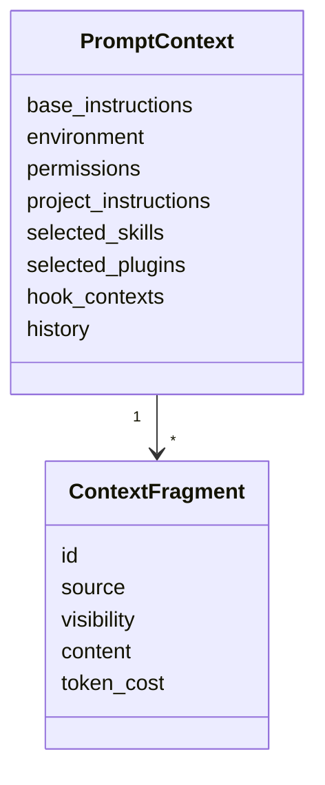

这样后续扩展不会退化成不断拼接字符串。每个 context fragment 都有来源、可见性和成本，才能做压缩、去重和审计。

## 可核对命令

在 `openai/codex` 源码根目录执行：

```bash
rg -n "mod environment_context|mod permissions_instructions|HookAdditionalContext" codex-rs/core/src/context
rg -n "record_context_updates_and_set_reference_context_item|build_skill_injections|build_plugin_injections" codex-rs/core/src/session/turn.rs
rg -n "run_user_prompt_submit_hooks|record_additional_contexts|additional_context_messages" codex-rs/core/src/hook_runtime.rs
rg -n "AGENTS.md|agents_md" codex-rs/core/src
```

如果要追一次完整 prompt 构建，建议从 `codex-rs/core/src/session/turn.rs` 的 `run_turn` 开始，按调用顺序读到 model sampling request。
