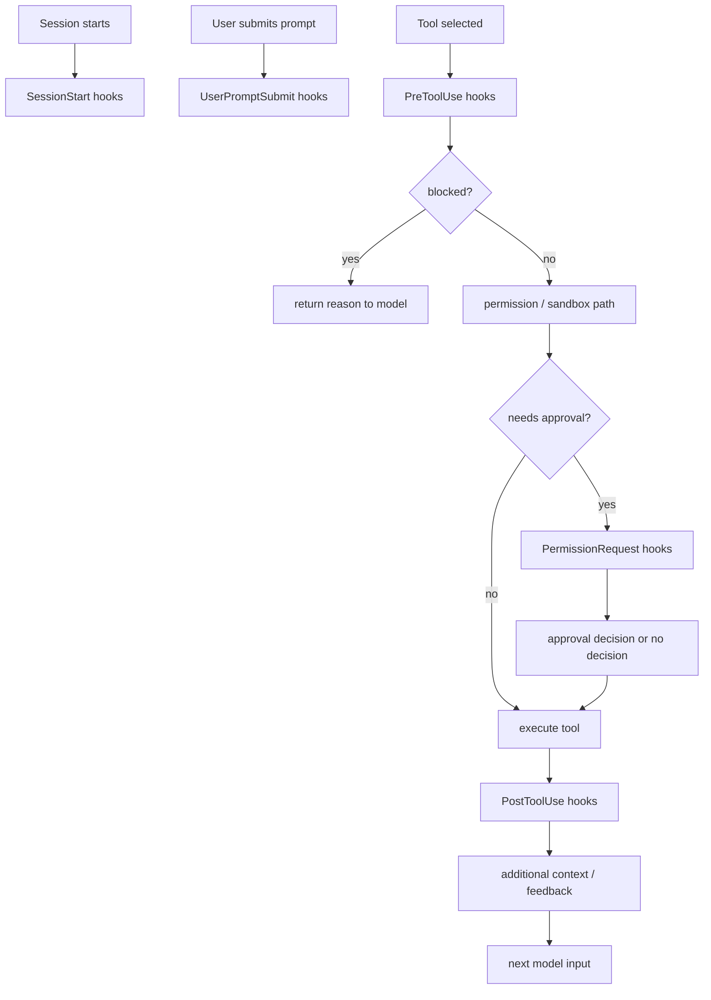
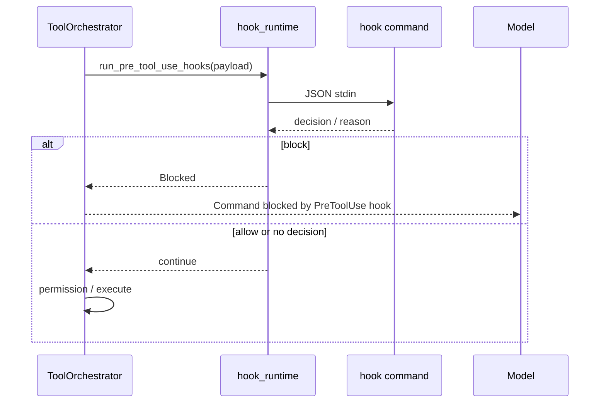
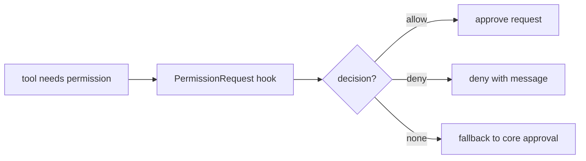
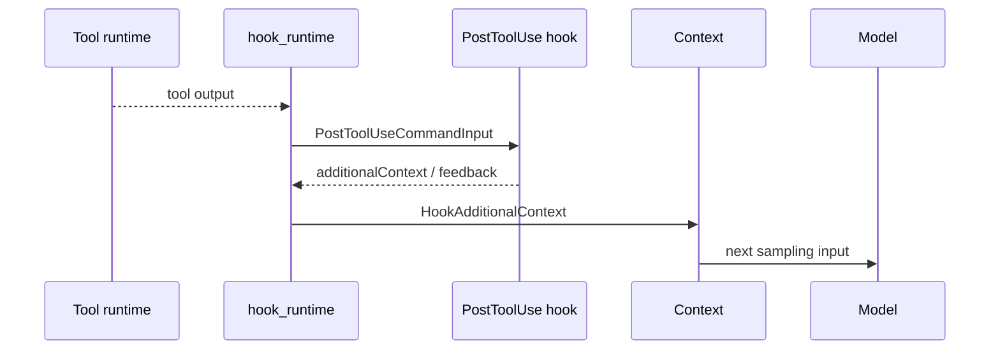
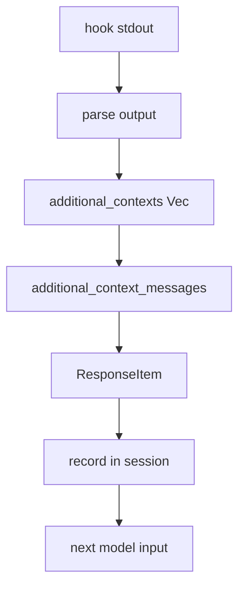
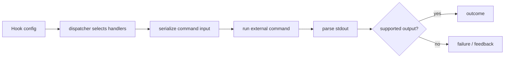
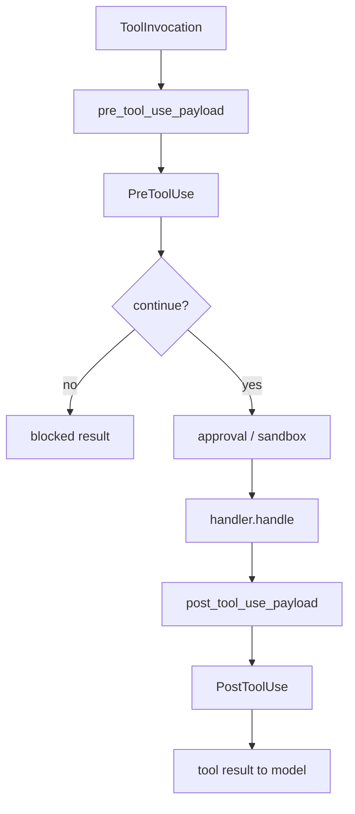
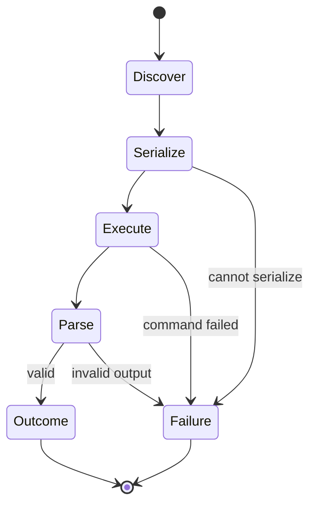
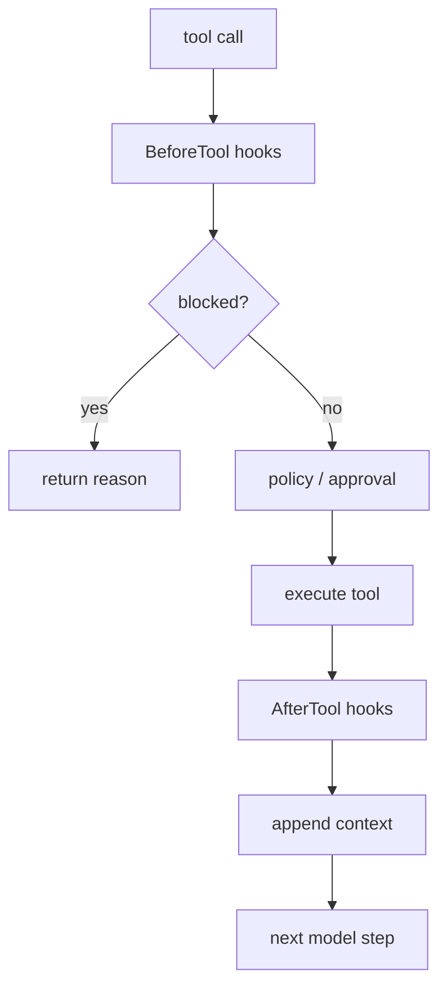

# 14. Hooks 与扩展边界

Hooks 是 Codex 扩展系统里很工程化的一层。它让外部脚本可以接在 session、用户输入、工具执行和权限请求等关键节点上，但又没有把任意脚本变成无限权力的插件。hook 能补上下文、阻断工具、参与权限决策，也可能被解析器拒绝。

本章重点讲 hook runtime 如何接入 agent loop，以及哪些能力属于 hook，哪些能力仍由 core 控制。

## 核心问题

| 问题 | 对应源码 |
|------|----------|
| hook runtime 在 core 哪里调用 | `codex-rs/core/src/hook_runtime.rs` |
| hook 支持哪些事件 | `codex-rs/hooks/src/schema.rs` |
| `PreToolUse` 如何阻断工具 | `run_pre_tool_use_hooks`、`parse_pre_tool_use` |
| `PermissionRequest` 如何给出审批结果 | `run_permission_request_hooks` |
| `PostToolUse` 如何补上下文或调整输出 | `codex-rs/hooks/src/events/post_tool_use.rs` |
| hook additional context 如何写进模型输入 | `record_additional_contexts` |

Hook 的核心价值是把团队策略、审计、上下文补充放到 runtime 之外，同时不破坏 Codex 内部的工具编排。

## 源码入口

| 路径 | 重点 |
|------|------|
| `codex-rs/core/src/hook_runtime.rs` | core 侧 hook 调用、事件转发、additional context 记录 |
| `codex-rs/hooks/src/schema.rs` | hook 输入输出 JSON schema |
| `codex-rs/hooks/src/engine/dispatcher.rs` | 选择匹配 handler、执行外部命令 |
| `codex-rs/hooks/src/engine/output_parser.rs` | 解析 hook stdout，拒绝不支持字段 |
| `codex-rs/hooks/src/events/pre_tool_use.rs` | `PreToolUse` 事件实现 |
| `codex-rs/hooks/src/events/permission_request.rs` | `PermissionRequest` 事件实现 |
| `codex-rs/hooks/src/events/post_tool_use.rs` | `PostToolUse` 事件实现 |
| `codex-rs/hooks/src/events/session_start.rs` | `SessionStart` additional context |
| `codex-rs/core/src/tools/orchestrator.rs` | 工具执行时调用 hook 的位置 |

阅读时建议从 `hook_runtime.rs` 开始，因为它展示了 hooks 和 Codex core 的接口边界；再进入 `codex-rs/hooks/` 看外部命令如何被发现、匹配、执行和解析。

## Hook 生命周期



从源码看，当前核心路径里最重要的是 `SessionStart`、`UserPromptSubmit`、`PreToolUse`、`PermissionRequest`、`PostToolUse`。配置 schema 里也能看到和停止、agent 后处理相关的 hook 名称，但本章不把尚未接入同等核心路径的行为夸大成事实。

## PreToolUse 是硬阻断点

`run_pre_tool_use_hooks` 在工具执行前运行。它拿到的 request 包括工具名、工具输入等信息。hook 可以返回 block 决策，Codex 会把阻断原因转成模型可见的错误消息。



`PreToolUse` 适合做确定性的本地策略，比如：

| 策略 | 原因 |
|------|------|
| 禁止修改 lockfile 以外的依赖声明 | 防止静默引入依赖 |
| 禁止执行特定危险命令 | 在模型请求进入审批前先挡住 |
| 要求某类文件修改必须走 patch | 保持 diff 可审计 |
| 禁止访问团队配置目录 | 保护本机敏感配置 |

源码里还体现了一个边界：不支持的字段会被 parser 拒绝。比如 hook 不能随意返回一组 core 不认识的更新指令。这样做会让 hook 协议更窄，但也降低扩展脚本破坏 runtime 状态的风险。

## PermissionRequest 是审批旁路，不是万能授权

`run_permission_request_hooks` 针对权限请求运行。它返回的是可选 `PermissionRequestDecision`，比如 allow 或 deny。没有决策时，core 仍然可以走常规用户审批或 Guardian 路径。



这个设计适合把组织策略自动化。例如团队可以写一个 hook：允许读取某些缓存目录，拒绝写入生产配置路径，对其余请求交给用户确认。

关键边界是：hook 的 allow 只是在当前权限请求语义里做决策，不代表给模型永久提升权限。最终执行仍然经过 core 的 sandbox、exec policy 和工具 runtime。

## PostToolUse 能把结果反馈给模型

`PostToolUse` 在工具成功产生输出后运行。它可以提供 additional context，也可能返回 feedback。对于 MCP tool，它还存在更新输出的相关字段，但 parser 对不支持的字段会 fail closed。



`PostToolUse` 的位置很适合做“工具结果解释器”。比如测试命令跑完后，hook 可以把 CI 规范、日志链接、失败分类补给模型。这样模型下一步不是只看原始 stdout，而是带着团队上下文继续判断。

## additional context 的写入路径

`hook_runtime.rs` 里有一组函数专门处理 additional context：

| 函数 | 作用 |
|------|------|
| `record_additional_contexts` | 把 hook 返回的字符串记录到 session/turn context |
| `additional_context_messages` | 把字符串转成模型输入消息 |
| `HookAdditionalContext` | 用 context fragment 表达 hook 来源 |



这里的设计很克制。additional context 是文本，不是直接修改内部状态的句柄。hook 可以影响模型下一步的判断，但不能绕过 core 的任务状态机。

## hook 输入输出协议

外部 hook 命令通常通过 stdin 收到 JSON，再通过 stdout/stderr 返回结构化结果或错误。`schema.rs` 定义了这些 wire 类型。

| 事件 | 输入结构 | 输出结构 |
|------|----------|----------|
| `PreToolUse` | `PreToolUseCommandInput` | `PreToolUseCommandOutputWire` |
| `PermissionRequest` | `PermissionRequestCommandInput` | `PermissionRequestCommandOutputWire` |
| `PostToolUse` | `PostToolUseCommandInput` | `PostToolUseCommandOutputWire` |



解析器的存在很重要。hook 是外部脚本，必须假设它可能输出非法 JSON、过时字段、空 reason、或者试图使用未支持能力。Codex 把这些情况收敛到 parser 和 outcome，避免外部脚本直接污染 core 状态。

## Hook 与工具系统的连接点

Hook 并不替代工具系统。对工具来说，hook 只是生命周期里的几个拦截点：



不同工具可以定义自己的 hook payload。比如 apply_patch 会把原始 patch body 放进 `tool_input.command`，shell 工具会提供命令和 cwd。hook 看到的是稳定协议，不需要知道 handler 内部怎么执行。

## 失败路径

| 失败点 | 常见原因 | 结果 |
|--------|----------|------|
| hook discovery 失败 | 配置错误、命令不存在 | 对应 hook 不运行或返回 warning |
| JSON 序列化失败 | tool input 无法转成 hook schema | hook outcome 表示失败 |
| hook 命令退出非零 | 外部脚本错误或主动拒绝 | 根据事件语义转成 feedback/deny/block |
| stdout 非法 | 不是 JSON 或字段不支持 | parser 拒绝，通常 fail closed |
| block 缺少 reason | 阻断原因不可用 | parser 生成错误消息 |
| additional context 过多 | 增加上下文成本 | 进入常规 context/history 压力 |



## 安全边界

Hook 的风险来自两侧。一侧是 hook 自己能执行本机命令，另一侧是 hook 能把文本写回模型上下文。Codex 通过几个边界降低风险：

| 边界 | 作用 |
|------|------|
| 事件枚举 | hook 只能接在预定义生命周期节点 |
| schema parser | 不支持字段不会静默生效 |
| additional context 文本化 | hook 不能直接改 core 状态 |
| 权限决策限定 | `PermissionRequest` 只处理权限请求，不是通用 root |
| 工具 runtime 仍执行最终副作用 | hook 不能替代 sandbox 和 handler |

hook 脚本本身仍然要谨慎配置。它运行在用户机器上，能做什么取决于命令权限和系统环境。Codex runtime 能约束它对 agent 状态的影响，但不能把任意本地脚本变成无风险组件。

## 设计取舍

| 取舍 | 收益 | 代价 |
|------|------|------|
| 用外部命令做 hook | 易接入现有脚本、语言无关 | 需要处理进程、stdout、超时和错误 |
| 用 JSON schema 限定输入输出 | 协议可审计 | 扩展能力增加时需要升级 schema |
| `PreToolUse` 可 block | 能做强策略 | 误配置会阻断正常工作 |
| `PostToolUse` 可补上下文 | 能把外部知识接给模型 | 容易增加 token 成本 |
| 不支持字段 fail closed | 降低隐式行为风险 | 旧脚本或误写脚本会更容易暴露错误 |

Hook 的工程味很重：它牺牲了一部分“随便扩展”的自由，换来可预测的生命周期和协议边界。

## 如果自己做 Agent，可以学什么

实现 hook 系统时，可以先做三个事件：

1. `BeforeTool`：允许 block，并要求 reason。
2. `PermissionRequest`：允许 allow/deny/none。
3. `AfterTool`：允许追加模型上下文。

最小设计可以这样：



不要一开始就让 hook 改写任意内部对象。更稳的做法是先让 hook 输出少量结构化结果：block、allow、deny、additional context、feedback。等协议稳定后，再谨慎增加更多能力。

## 可核对命令

在 `openai/codex` 源码根目录执行：

```bash
rg -n "run_pre_tool_use_hooks|run_permission_request_hooks|run_post_tool_use_hooks" codex-rs/core/src/hook_runtime.rs
rg -n "PreToolUseCommandInput|PermissionRequestCommandInput|PostToolUseCommandInput" codex-rs/hooks/src/schema.rs
rg -n "parse_pre_tool_use|parse_permission_request|parse_post_tool_use" codex-rs/hooks/src/engine/output_parser.rs
rg -n "additional_context|HookAdditionalContext" codex-rs/core/src codex-rs/hooks/src
```

如果要判断某个 hook 能不能影响工具执行，优先看 `output_parser.rs`，它定义了外部脚本真正能返回什么。
