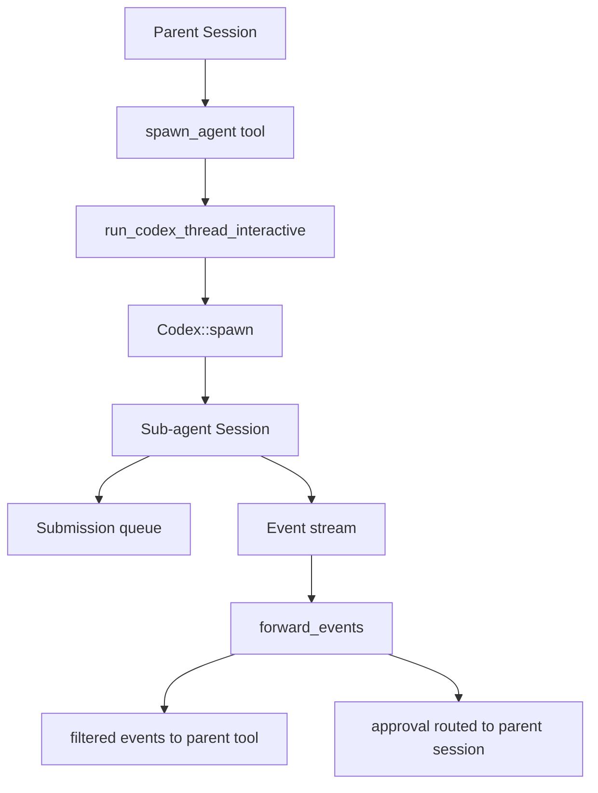
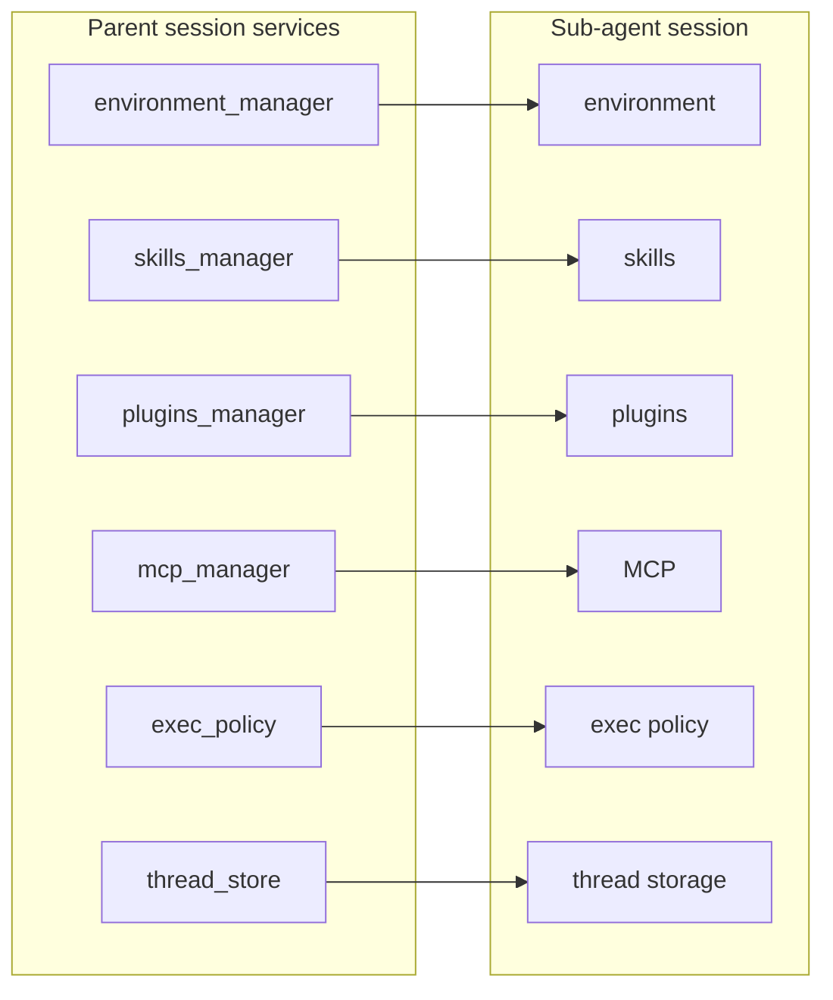
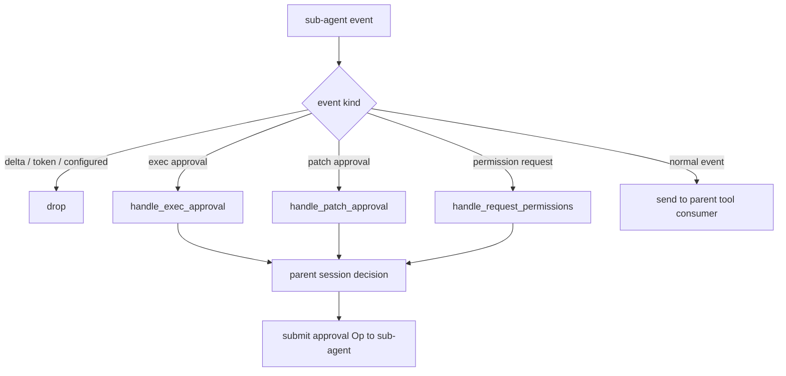
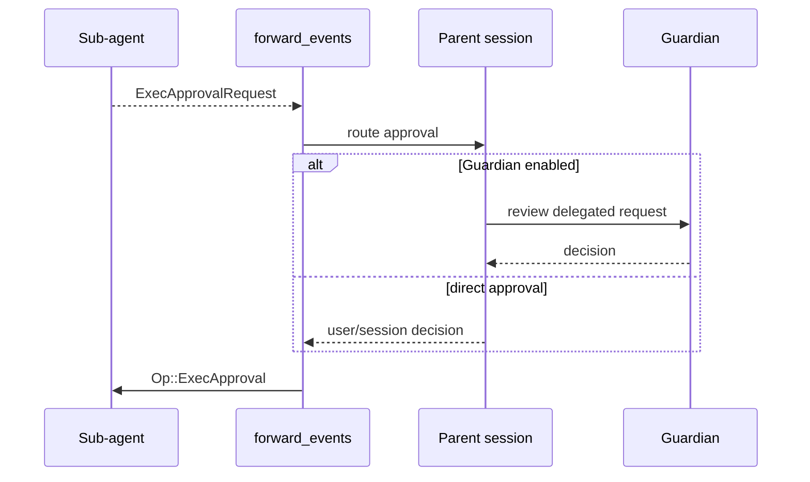
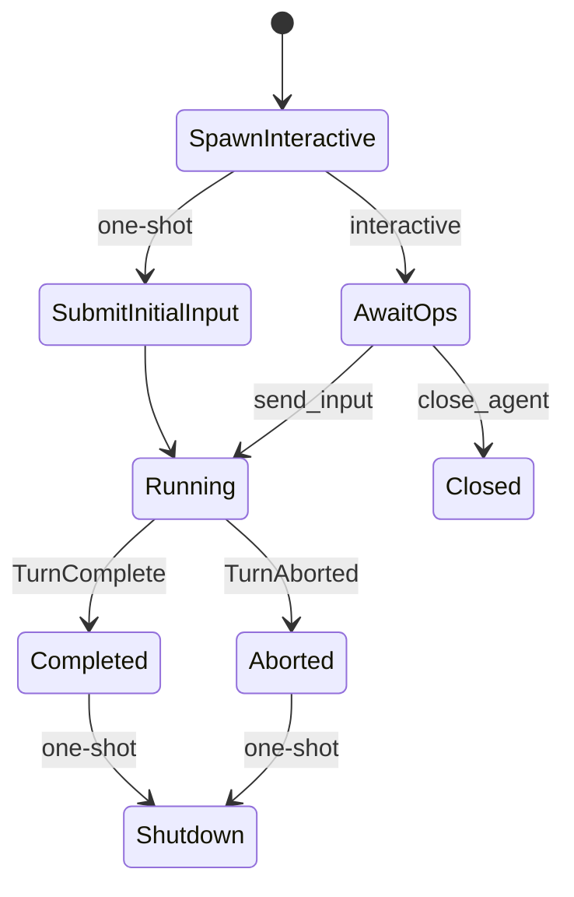
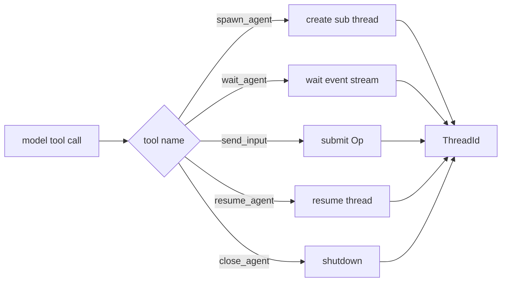
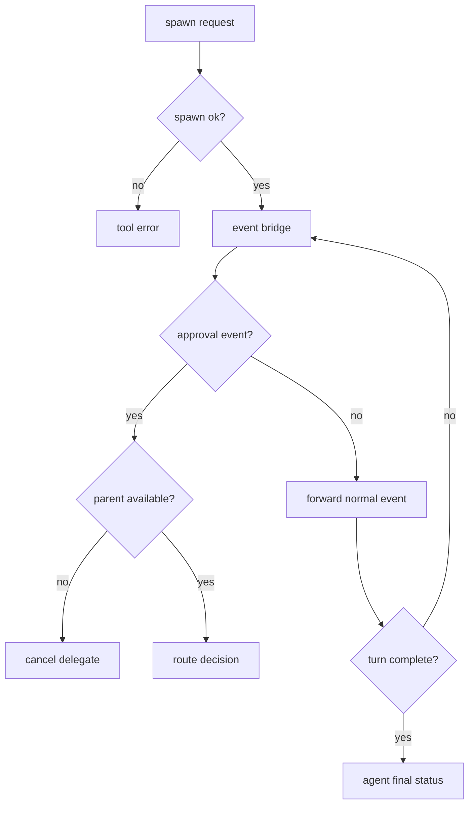
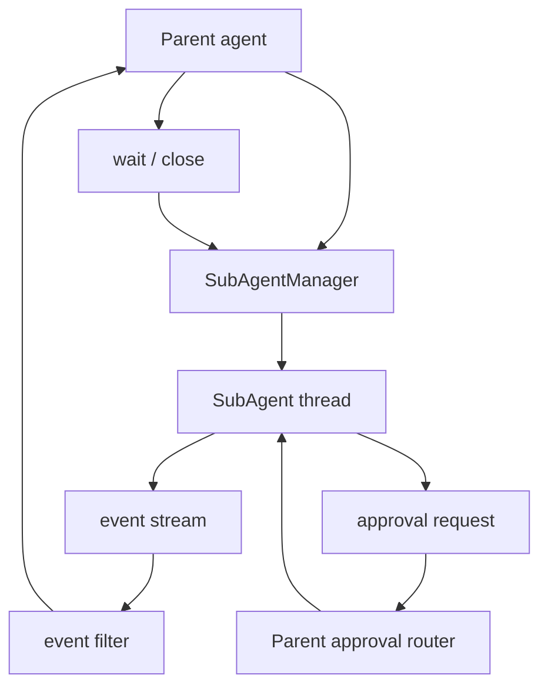

# 15. 多 Agent 与委托执行

Codex 的多 agent 能力不是简单地启动几个独立进程。源码里的子 agent 是一个受控的 Codex thread：它继承父 session 的 runtime 服务和权限边界，审批请求会回到父 session，事件会被过滤后桥接给调用方。这样多 agent 能并行推进任务，又不会脱离主会话的安全和可观测边界。

本章讲 `spawn_agent`、`wait_agent`、`send_input` 这类工具背后的实现，不讨论模型层面的协作策略。

## 核心问题

| 问题 | 对应源码 |
|------|----------|
| 子 agent 如何创建新的 Codex thread | `codex-rs/core/src/codex_delegate.rs` |
| 子 agent 继承父 session 哪些服务 | `run_codex_thread_interactive` |
| 子 agent 的审批为什么回到父 session | `forward_events`、`handle_exec_approval`、`handle_patch_approval` |
| `spawn_agent` 等工具在哪里实现 | `codex-rs/core/src/tools/handlers/multi_agents.rs`、`multi_agents_v2.rs` |
| 工具说明在哪里定义 | `codex-rs/tools/src/agent_tool.rs` |
| 子 agent 来源如何标记 | `SessionSource::SubAgent`、`SubAgentSource` |

理解多 agent 时要先放下“多个模型自由聊天”的想象。Codex 的实现更像一个父 session 管理多个子 thread，每个子 thread 仍然走 Codex 的协议、工具、权限和事件系统。

## 源码入口

| 路径 | 重点 |
|------|------|
| `codex-rs/core/src/codex_delegate.rs` | 子 Codex thread 启动、事件桥接、审批转发 |
| `codex-rs/core/src/tools/handlers/multi_agents.rs` | v1 多 agent 工具 handler |
| `codex-rs/core/src/tools/handlers/multi_agents_v2.rs` | v2 多 agent handler 模块 |
| `codex-rs/tools/src/agent_tool.rs` | agent 工具 schema 和提示约束 |
| `codex-rs/core/src/thread_manager.rs` | thread 创建、恢复、fork |
| `codex-rs/core/src/codex_thread.rs` | CodexThread 异步接口 |
| `codex-rs/protocol/src/protocol.rs` | `SubAgentSource`、`Op`、`EventMsg` |

建议先读 `run_codex_thread_interactive`，再读 `forward_events`。前者决定子 agent 继承什么，后者决定子 agent 能把什么事件交回父侧。

## 子 agent 是受控 thread



`run_codex_thread_interactive` 返回的是一个 `Codex` IO 结构：调用方可以继续给子 agent 提交 `Op`，也可以读取它发出的事件。这个结构让 `send_input`、`wait_agent`、`close_agent` 这类工具有了统一基础。

## 子 agent 继承哪些运行时能力

`Codex::spawn` 的参数里能看到大量父 session 服务被 `Arc::clone` 到子 session：

| 继承项 | 作用 |
|--------|------|
| `environment_manager` | 复用环境管理和文件系统环境 |
| `skills_manager` | 子 agent 能看到同一套 skills |
| `plugins_manager` | 复用插件和 app 能力 |
| `mcp_manager` | 复用 MCP 管理能力 |
| `skills_watcher` | skill 变更监听一致 |
| `agent_control` | agent 控制面复用 |
| `exec_policy` | 执行策略继承 |
| `thread_store` | thread 存储复用 |
| `analytics_events_client` | 分析事件上报复用 |
| `environments` | 从父 turn 选择的环境继承 |



这说明子 agent 不是临时裸模型请求。它仍然处在同一个 Codex runtime 生态里，拥有相同的工具系统和扩展系统，也受同一类策略约束。

## SessionSource::SubAgent 标记来源

子 agent 创建时会把 `session_source` 设置为 `SessionSource::SubAgent(subagent_source.clone())`。这个标记会影响 telemetry、事件解释和后续审批来源。

| 来源标记 | 作用 |
|----------|------|
| `SubAgentSource` | 表示子 agent 是从哪个工具或场景产生 |
| `SessionSource::SubAgent` | 区分普通用户 session 和委托 session |
| `GuardianApprovalRequestSource::DelegatedSubagent` | Guardian 审批时标明请求来自子 agent |

这类来源标记对安全审计很有用。一个危险命令来自主 agent 还是子 agent，不应该在日志和审批里混成同一类事件。

## 事件桥接会过滤和改写边界

`forward_events` 是多 agent 实现里最关键的一段。它不断读取子 agent 事件，然后决定：

| 事件类型 | 处理方式 |
|----------|----------|
| legacy delta | 忽略 |
| token count | 忽略 |
| `SessionConfigured` | 忽略 |
| `ThreadNameUpdated` | 忽略 |
| `ExecApprovalRequest` | 不直接给调用方，转给父 session 审批 |
| `ApplyPatchApprovalRequest` | 不直接给调用方，转给父 session 审批 |
| `RequestPermissions` | 转父 session 处理 |
| `RequestUserInput` | 可能作为子 agent 交互请求处理 |
| 普通进度或完成事件 | 转发给消费者 |



这个桥接层决定了多 agent 不是安全边界之外的自由执行。子 agent 想运行命令或改文件，仍然要经由父 session 的审批系统。

## 审批回到父 session

`handle_exec_approval` 和 `handle_patch_approval` 都遵循同一个模式：

1. 从子 agent 事件里取出 approval id、命令或 patch changes。
2. 判断是否走 Guardian。
3. 如果走 Guardian，构造 `GuardianApprovalRequest`，来源标成 `DelegatedSubagent`。
4. 否则调用父 session 的 `request_command_approval` 或 `request_patch_approval`。
5. 等到决策后，把 `Op::ExecApproval` 或 `Op::PatchApproval` 提交回子 agent。



这也是 Codex 多 agent 设计最值得学的地方：并行不等于绕过审批。子 agent 越多，越需要把副作用决策集中回父 session。

## one-shot 与 interactive 两种委托

`run_codex_thread_interactive` 用于长期交互式子 thread。`run_codex_thread_one_shot` 是它的便利包装：创建子 thread 后立即提交 `Op::UserInput`，并在收到 `TurnComplete` 或 `TurnAborted` 后自动 shutdown。

| 模式 | 适用场景 | 生命周期 |
|------|----------|----------|
| interactive | `spawn_agent` 后继续 `send_input`、`wait_agent` | 父侧显式管理 |
| one-shot | 一次性委托任务 | 完成或中断后自动关闭 |



这种分层避免了为一次性任务和长期子 agent 写两套 runtime。one-shot 只是 interactive 的一种使用方式。

## multi_agents 工具层

`multi_agents.rs` 暴露了几个 handler：

| handler | 工具语义 |
|---------|----------|
| `SpawnAgentHandler` | 创建子 agent |
| `WaitAgentHandler` | 等待一个或多个 agent 完成 |
| `SendInputHandler` | 给已有 agent 追加输入 |
| `ResumeAgentHandler` | 恢复已关闭或可恢复 agent |
| `CloseAgentHandler` | 关闭 agent |

源码里还会用 `ThreadId::from_string` 校验 agent id。工具层不应该信任模型随手编出的字符串，必须确认它能映射到真实 thread。



## 为什么子 agent 是工具而不是独立 UI

把子 agent 做成工具有几个直接后果：

| 设计 | 结果 |
|------|------|
| 父 agent 主动调用 `spawn_agent` | 子 agent 受任务语义约束 |
| 子 agent 事件回到工具结果 | 父 agent 可以整合输出 |
| 审批回到父 session | 安全边界集中 |
| 子 agent 有 thread id | 可以等待、恢复、关闭 |
| 工具说明约束使用方式 | 模型被提醒何时该委托、何时该本地处理 |

如果把每个子 agent 都做成完全独立 UI，会增加协作自由，但父 agent 很难保证结果可汇总、副作用可审批、生命周期可回收。

## 多 agent 的失败路径

| 失败点 | 说明 |
|--------|------|
| 子 thread 创建失败 | 配置、认证、模型管理器、环境继承都可能失败 |
| agent id 无效 | `ThreadId::from_string` 校验失败 |
| 子 agent 请求审批但父 session 已取消 | cancel token 触发，delegate shutdown |
| approval 等待被取消 | 需要向子 agent 回写拒绝或终止 |
| 子 agent 事件流断开 | `forward_events` 退出，调用方只能得到结束或错误 |
| one-shot 没有 TurnComplete | 可能因 TurnAborted 或 shutdown 提前结束 |
| 多 agent 输出互相冲突 | runtime 能隔离审批，不能自动解决语义冲突 |



## 设计取舍

| 取舍 | 收益 | 代价 |
|------|------|------|
| 子 agent 复用 Codex thread | 工具、安全、上下文能力完整 | 创建成本比裸模型请求高 |
| 继承父 session 服务 | 行为一致，配置一致 | 父子状态边界更复杂 |
| 审批回到父 session | 安全集中，可审计 | 子 agent 等待审批时会阻塞 |
| 过滤事件 | 父 agent 只看到有用信息 | 调试时可能需要更底层日志 |
| one-shot 包装 interactive | 少维护一套流程 | 简单任务也要启动完整子 thread |

多 agent 最难的不是“能并发”，而是并发后还能知道谁在做什么、谁能改文件、谁来批准危险操作、谁负责收尾。

## 如果自己做 Agent，可以学什么

实现多 agent 时，建议先有四个约束：

1. 子 agent 必须有明确生命周期：spawn、send、wait、close。
2. 子 agent 的副作用审批必须回到父控制面。
3. 子 agent 的事件要过滤，避免把内部噪声当成最终结果。
4. 子 agent 不能默认继承无限权限，只继承必要 runtime state。

一个最小设计可以这样：



子 agent 适合做边界清楚的任务：读一组文件、实现一个 disjoint 模块、跑独立验证、做局部 review。紧耦合任务不适合拆出去，因为上下文同步成本会超过并行收益。

## 可核对命令

在 `openai/codex` 源码根目录执行：

```bash
rg -n "run_codex_thread_interactive|run_codex_thread_one_shot|forward_events" codex-rs/core/src/codex_delegate.rs
rg -n "handle_exec_approval|handle_patch_approval|DelegatedSubagent" codex-rs/core/src/codex_delegate.rs
rg -n "SpawnAgentHandler|WaitAgentHandler|SendInputHandler|ThreadId::from_string" codex-rs/core/src/tools/handlers/multi_agents.rs
rg -n "spawn_agent|wait_agent|send_input|close_agent" codex-rs/tools/src/agent_tool.rs
```

如果只读一段，优先读 `forward_events`。它最能说明 Codex 子 agent 的安全边界。
