# 16. Task、Review 与 Goals

Agent loop 只是 Codex 执行的一层。更外层还有 task：普通对话、review、compact、undo、user shell、ghost snapshot 等不同工作流，都通过 `SessionTask` 接入 session。再往旁边看，goals runtime 会记录线程目标、预算、持续执行和外部状态变化。

本章讲 Codex 如何把“用户提交一次输入”包装成可管理的任务生命周期，以及 review/compact/undo 这类非普通对话为什么不应该硬塞进同一个 `run_turn`。

## 核心问题

| 问题 | 对应源码 |
|------|----------|
| task 抽象在哪里定义 | `codex-rs/core/src/tasks/mod.rs` |
| 普通 turn 怎么调用 `run_turn` | `codex-rs/core/src/tasks/regular.rs` |
| review task 在哪里 | `codex-rs/core/src/tasks/review.rs` |
| compact / undo / user shell 是什么任务 | `codex-rs/core/src/tasks/compact.rs`、`undo.rs`、`user_shell.rs` |
| task 启动时 session 做了什么 | `Session::start_task` |
| goals runtime 监听哪些事件 | `codex-rs/core/src/goals.rs` |
| goal 模板在哪里 | `codex-rs/core/templates/goals/continuation.md`、`budget_limit.md` |

`SessionTask` 的存在说明 Codex 没把所有功能都塞进“聊天回合”。不同工作流可以共享 session、turn context、事件和持久化，但各自拥有自己的执行逻辑。

## 源码入口

| 路径 | 重点 |
|------|------|
| `codex-rs/core/src/tasks/mod.rs` | `SessionTask` trait、task 启动、abort、完成处理 |
| `codex-rs/core/src/tasks/regular.rs` | 常规用户输入如何进入 `run_turn` |
| `codex-rs/core/src/tasks/review.rs` | review task |
| `codex-rs/core/src/tasks/compact.rs` | compact task |
| `codex-rs/core/src/tasks/undo.rs` | undo task |
| `codex-rs/core/src/tasks/user_shell.rs` | 用户 shell 命令 task |
| `codex-rs/core/src/tasks/ghost_snapshot.rs` | ghost snapshot task |
| `codex-rs/core/src/goals.rs` | goal runtime 状态机和预算统计 |
| `codex-rs/core/templates/goals/continuation.md` | 自动继续的 prompt 模板 |
| `codex-rs/core/templates/goals/budget_limit.md` | 预算限制提示模板 |

建议先读 `SessionTask` trait，再读 `Session::start_task`，最后看 `RegularTask::run`。这样可以先理解外层生命周期，再回到普通 agent loop。

## SessionTask 抽象

`SessionTask` trait 很小：

| 方法 | 作用 |
|------|------|
| `kind()` | 返回 `TaskKind`，用于状态、UI、telemetry |
| `span_name()` | tracing span 名称 |
| `run(...)` | 执行任务，返回可选 final agent message |
| `abort(...)` | 任务被取消后做清理，默认 no-op |

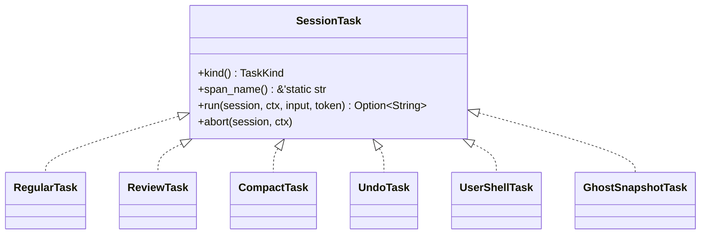

这个 trait 的意义在于把“任务是什么”和“session 如何管理任务”拆开。Session 只需要知道任务类型、如何运行、如何取消，不需要把所有工作流写成一个巨大 match。

## task 启动时发生什么

`Session::spawn_task` 会先 abort 当前 active task，再清理 connector selection，然后调用 `start_task`。`start_task` 做的事情很多，简化如下：

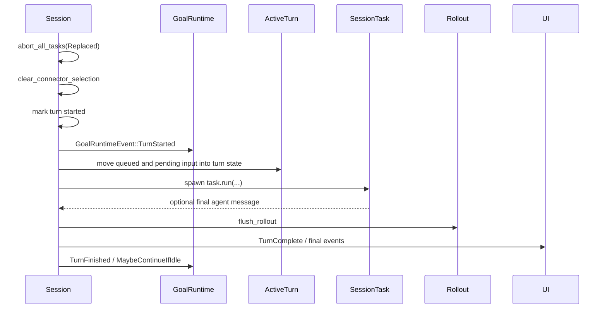

这里能看到 task 生命周期比 `run_turn` 更大。`run_turn` 只负责模型和工具循环；`start_task` 还要处理 active turn、pending input、goal accounting、rollout flush、取消 token 和最终事件。

## RegularTask 如何包住 run_turn

`RegularTask::run` 是最常见路径。它会：

1. 发送 `TurnStarted` 事件。
2. 清除 server reasoning included 状态。
3. 尝试消费 startup prewarm client session。
4. 调用 `run_turn`。
5. 如果 session 里还有 pending input，就用空输入继续跑下一次 `run_turn`。

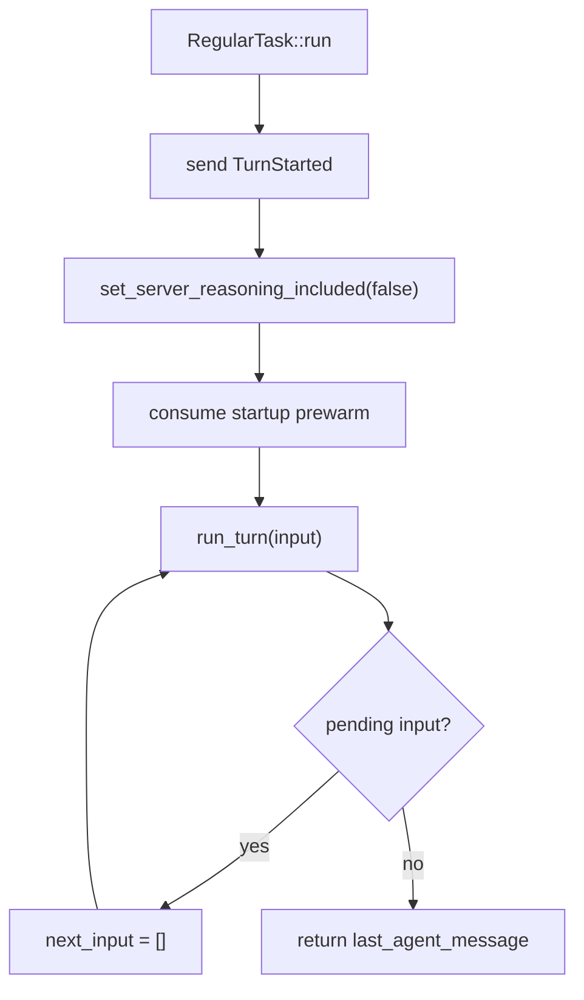

最后这一步很有意思。用户或工具可能在当前 task 运行时又塞入 pending input。`RegularTask` 不直接结束，而是在同一个任务里继续跑一轮空输入，让 session 把 pending input 消费掉。

## TaskKind 不等于所有 task 的名字

源码里的 task 模块包括：

| 模块 | 大致语义 | `TaskKind` |
|------|----------|------------|
| `regular` | 普通用户输入 | `Regular` |
| `review` | review 模式任务 | `Review` |
| `compact` | 压缩上下文 | `Compact` |
| `undo` | 撤销或恢复相关操作 | `Regular` |
| `user_shell` | 用户 shell 命令上下文 | `Regular` |
| `ghost_snapshot` | ghost snapshot 工作流 | `Regular` |

这说明 `TaskKind` 更像 UI/状态层的粗分类，不一定和 Rust 模块一一对应。某些特殊任务仍然可能归到 `Regular`，因为它们在外部生命周期上表现得像普通 turn。

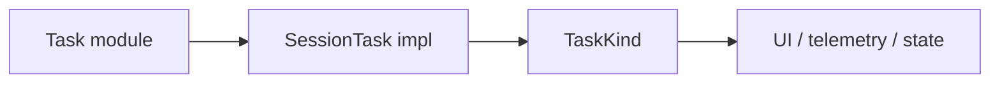

## Review task 为什么要单独存在

Review 模式的核心差异是任务目标不同。普通 task 要解决用户请求；review task 要以审查姿态检查代码风险、回归、测试缺口和实现偏差。把 review 单独做成 task，可以让它拥有独立的 prompt、输入准备、事件处理和完成语义。

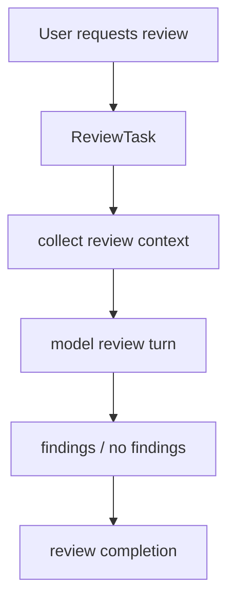

这种分离避免普通对话路径越来越臃肿。review 的输出标准、风险排序、文件引用、测试缺口说明都可以在 review task 里组织，而不是让 `run_turn` 通过大量条件判断改变行为。

## Compact task 是维护上下文，不是回答用户

Compact task 的目标是压缩历史，让长线程能继续运行。它和普通 task 的差别是：它主要维护上下文状态，而不是直接完成用户业务请求。

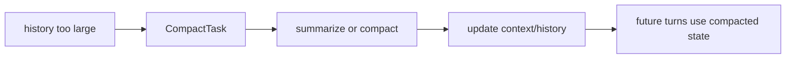

把 compact 做成 task 有两个好处：

| 好处 | 说明 |
|------|------|
| 生命周期统一 | 仍然能走 session task 的取消、事件、rollout flush |
| 语义分离 | 压缩历史和回答用户不是同一件事 |

长会话里，压缩是 agent runtime 的维护动作。它对用户可见，但不应该和业务任务混成一个模型回合。

## user_shell task 处理用户主动命令

`user_shell.rs` 的注释提醒了一个 UI 细节：有些用户 shell 命令会作为独立 turn 生命周期执行，会发 `TurnStarted` / `TurnComplete`；有些发生在 active turn 内，不能重复发第二组生命周期事件。

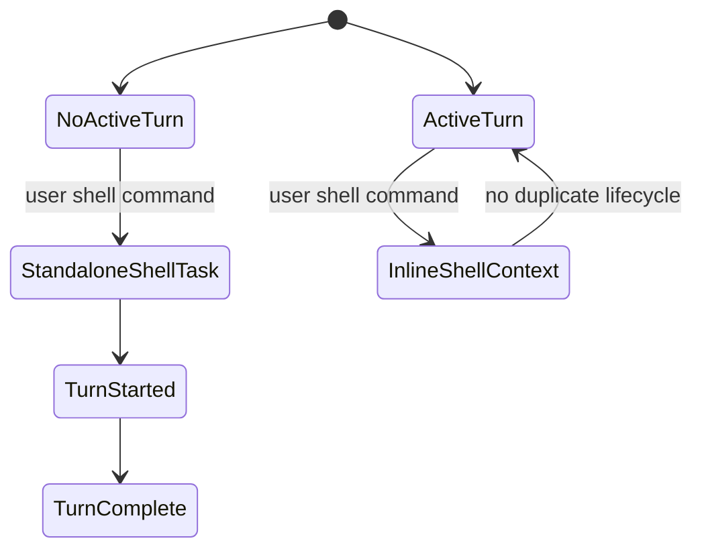

这个细节说明 task 系统也要服务前端体验。UI 不能因为一个内部命令就看到重复 turn；模型也需要知道用户 shell 命令带来的上下文变化。

## 中断标记进入历史

`InterruptedTurnHistoryMarker` 有三个形态：

| 形态 | 作用 |
|------|------|
| `Disabled` | 不写入中断标记 |
| `ContextualUser` | 作为上下文用户片段写入 |
| `Developer` | 作为 developer message 写入 |

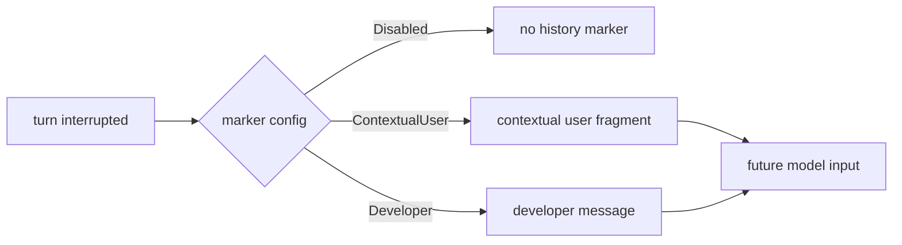

中断不是单纯 UI 状态。下一轮模型需要知道上一轮为什么停了，否则可能把未完成动作误认为已经完成。Codex 把中断标记纳入 history/context，让下一轮能接上语义。

## Goals runtime 监听任务事件

`GoalRuntimeEvent` 是 goals runtime 和 task/tool 生命周期之间的桥：

| 事件 | 含义 |
|------|------|
| `TurnStarted` | turn 开始，记录初始 token usage |
| `ToolCompleted` | 某个工具完成 |
| `ToolCompletedGoal` | 和 goal 相关的工具完成 |
| `TurnFinished` | turn 结束，带完成状态和工具调用数 |
| `MaybeContinueIfIdle` | 空闲时可能自动继续 |
| `TaskAborted` | task 被取消 |
| `ExternalMutationStarting` | 外部目标状态即将变更 |
| `ExternalSet` | 外部设置 goal 状态 |
| `ExternalClear` | 外部清除 goal |
| `ThreadResumed` | thread 恢复 |

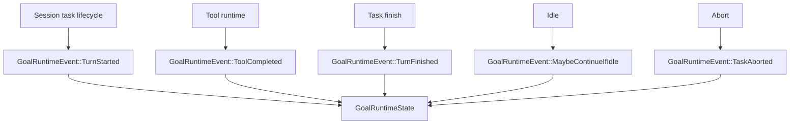

Goals runtime 不是独立跑在旁边的黑盒。它通过 session task 和工具事件获得时机，再结合 state DB、预算统计和 continuation lock 决定是否更新目标状态或触发继续执行。

## GoalRuntimeState 里的并发控制

`GoalRuntimeState` 有几个字段很能说明问题：

| 字段 | 作用 |
|------|------|
| `state_db` | 持久化 goal 状态 |
| `budget_limit_reported_goal_id` | 避免重复报告预算限制 |
| `accounting_lock` | 控制 token/时间统计并发 |
| `accounting` | 当前统计快照 |
| `continuation_turn_id` | 当前 continuation turn |
| `continuation_lock` | 防止多个自动继续同时启动 |
| `continuation_suppressed` | 抑制自动继续 |

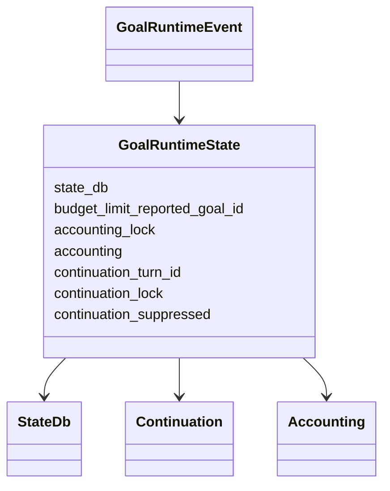

自动继续是很容易出事故的功能。没有 `continuation_lock` 这类约束时，多个 idle 事件可能同时触发后续 turn，造成重复执行或状态竞态。

## continuation 与 budget 模板

goals runtime 使用两个模板：

| 模板 | 用途 |
|------|------|
| `codex-rs/core/templates/goals/continuation.md` | 需要继续推进目标时构造模型输入 |
| `codex-rs/core/templates/goals/budget_limit.md` | 达到预算限制时构造提示 |

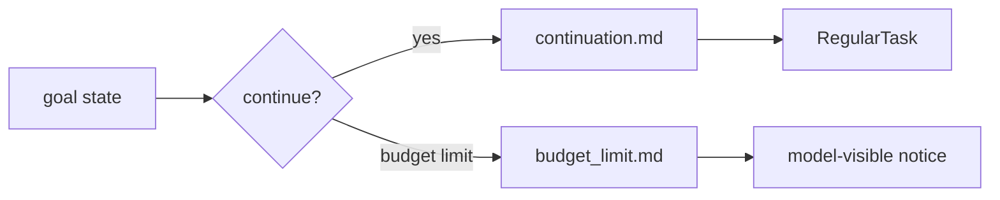

把 continuation 做成模板，而不是硬编码字符串，有利于单独调整目标继续的提示语义。与此同时，触发 continuation 的时机仍然由 runtime 状态机控制。

## 失败路径

| 失败点 | 风险 | 处理思路 |
|--------|------|----------|
| task 被新输入替换 | 正在运行的工具或模型流需要取消 | `abort_all_tasks(TurnAbortReason::Replaced)` |
| task run 返回前 rollout 未 flush | UI 看到完成，但持久状态落后 | 完成前 `flush_rollout` |
| pending input 未消费 | 用户输入被留到未知时机 | `RegularTask` 循环继续 `run_turn` |
| 中断不写历史 | 下一轮模型不知道上轮停在哪里 | `InterruptedTurnHistoryMarker` |
| 自动继续重复触发 | 多个 continuation turn 并发 | `continuation_lock` |
| 预算重复提醒 | 用户被同一限制刷屏 | `budget_limit_reported_goal_id` |

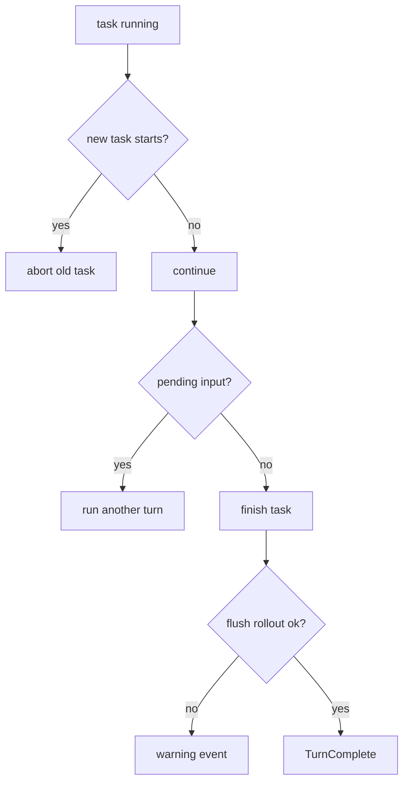

## 设计取舍

| 取舍 | 收益 | 代价 |
|------|------|------|
| task 包住 turn | 不同工作流共享生命周期 | 多一层抽象 |
| `SessionTask` trait 很小 | 新 task 接入成本低 | 复杂 task 需要自己管理内部状态 |
| 普通 task 循环消费 pending input | 降低输入丢失风险 | 一个 task 内可能有多次 `run_turn` |
| goals 监听事件而非侵入 run_turn | 目标系统和 agent loop 解耦 | 事件时机必须维护准确 |
| continuation lock | 防止自动继续竞态 | 自动化行为更保守 |

Codex 的 task 系统说明一个经验：真实 agent 不只有“聊天”。压缩、review、撤销、用户 shell、目标继续，都需要和普通对话共享状态，但不能都写进同一个函数。

## 如果自己做 Agent，可以学什么

最小实现可以先定义两层：

1. `Turn`：负责一次模型请求、工具执行、follow-up。
2. `Task`：负责一个用户可见工作流，内部可以跑一个或多个 turn。

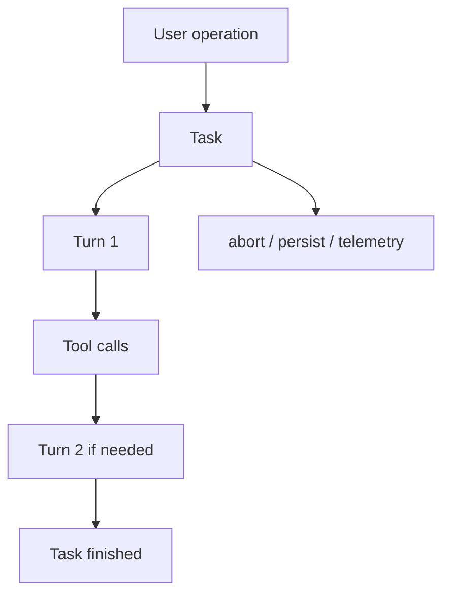

随后再加几类任务：

| 阶段 | 建议任务 |
|------|----------|
| v0.1 | regular task |
| v0.2 | compact task、review task |
| v0.3 | undo task、user shell task |
| 生产化 | goals、budget、continuation |

关键是不要让 `run_turn` 承担所有职责。模型循环越纯，周边工作流越容易维护。

## 可核对命令

在 `openai/codex` 源码根目录执行：

```bash
rg -n "trait SessionTask|fn start_task|abort_all_tasks|InterruptedTurnHistoryMarker" codex-rs/core/src/tasks/mod.rs
rg -n "struct RegularTask|run_turn|has_pending_input|TurnStarted" codex-rs/core/src/tasks/regular.rs
rg -n "pub\\(crate\\) enum GoalRuntimeEvent|struct GoalRuntimeState|MaybeContinueIfIdle" codex-rs/core/src/goals.rs
rg -n "continuation.md|budget_limit.md" codex-rs/core/templates/goals codex-rs/core/src/goals.rs
```

如果要追完整任务生命周期，先读 `Session::start_task`，再读 `RegularTask::run`，最后回到 `run_turn`。

## SessionTask 是任务边界

Codex 把普通对话、review、compact、undo、user shell 等都放进 task 模型里，不是把它们写成 UI 命令回调。

| task | 入口 | 作用 |
|------|------|------|
| regular | `Op::UserTurn` | 正常 agent loop |
| review | `/review` 或相关 app-server API | 代码审查任务 |
| compact | `Op::Compact` 或 app-server compact start | 压缩 history |
| undo | undo task | 回滚或恢复历史 |
| user shell | 用户直接执行 shell | 把用户 shell 命令纳入事件和状态 |

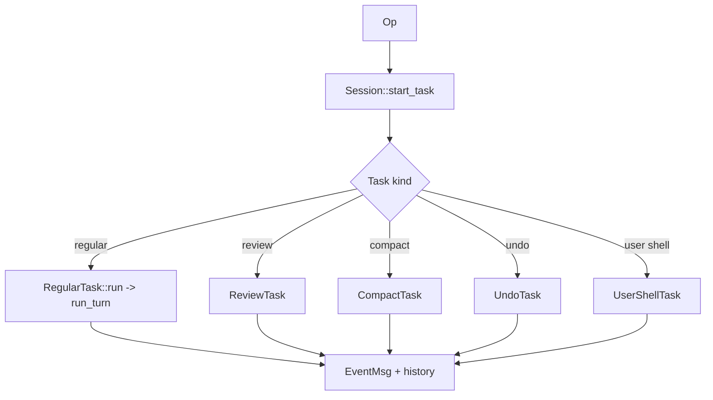

这让所有长动作都能共享中断、事件、history、rollout 和前端展示。比如 compact 不是后台偷偷改数组，它也是一类 turn/task，有事件、有 replacement history、有失败反馈。

## review 和 goals 的区别

`ReviewTask` 处理的是“让模型审查代码”这类明确任务；goals 更像长任务控制层，用于预算、继续、idle 后是否自动推进等。两者都和普通 agent loop 有关，但层级不同。

| 机制 | 更像什么 | 典型源码 |
|------|----------|----------|
| `ReviewTask` | 一种任务类型 | `core/src/tasks/review.rs`、`session/review.rs` |
| `GoalRuntimeState` | 长程目标状态机 | `core/src/goals.rs` |
| goal templates | 继续/预算提示 | `core/templates/goals/` |
| plan tool | UI 协作状态 | `tools/src/plan_tool.rs` |

## Stop hook 和 task lifecycle 的关系

Stop hook 可以在模型准备结束时要求继续，比如提示模型先跑测试或补验证。这类能力如果只做成 UI 提醒，很容易被忽略；放进 task lifecycle 后，它能变成后续模型输入。

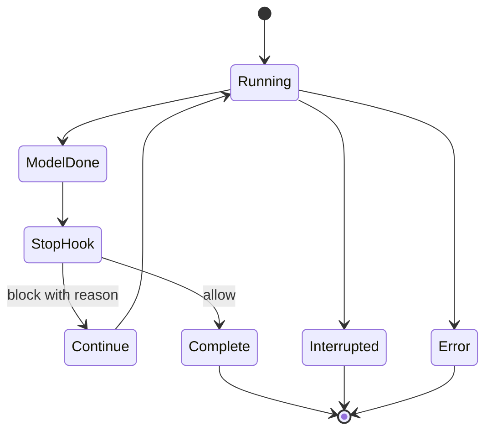

这也是 Codex 比普通 while loop 多一层 task 的原因：任务结束本身也可能被扩展点影响。
