# 17. 上下文压缩深读

上下文压缩是 Codex 里最值得细读的机制之一。它不是把聊天记录丢给模型总结一下，而是围绕“长线程还能不能继续正确运行”做了一套状态替换协议：触发时机、压缩输入、摘要位置、初始上下文重注入、history 合法性、rollout 恢复、remote compact、memory pipeline 都在同一个问题上交汇。

公开源码能确认的是 Codex 的本地 runtime 如何做压缩。至于其他闭源工具内部如何实现，只能做体验层面的谨慎比较，不能把未公开实现写成事实。

## 核心问题

| 问题 | 对应源码 |
|------|----------|
| 什么时候触发自动压缩 | `codex-rs/core/src/session/turn.rs` |
| 手动 compact 走哪条 task | `codex-rs/core/src/tasks/compact.rs` |
| inline compact 如何生成摘要 | `codex-rs/core/src/compact.rs` |
| remote compact 如何使用 provider 能力 | `codex-rs/core/src/compact_remote.rs` |
| 压缩后 history 如何保持合法 | `codex-rs/core/src/context_manager/history.rs` |
| 压缩如何影响 turn context baseline | `InitialContextInjection`、`reference_context_item` |
| resume 时如何重建压缩后的历史 | `codex-rs/core/src/session/rollout_reconstruction.rs` |

这一章的核心判断是：Codex 的压缩强在状态边界，而不只是摘要 prompt。它把压缩当作 history replacement，而不是普通 assistant 总结。

## 源码入口

| 路径 | 重点 |
|------|------|
| `codex-rs/core/src/session/turn.rs` | pre-turn / mid-turn 自动压缩触发点 |
| `codex-rs/core/src/tasks/compact.rs` | `CompactTask` 选择 local 或 remote |
| `codex-rs/core/src/compact.rs` | inline compact、summary 构造、recent user messages 保留 |
| `codex-rs/core/src/compact_remote.rs` | provider remote compact、compact endpoint 输出过滤 |
| `codex-rs/core/src/context_manager/history.rs` | history normalize、token 估算、reference context baseline |
| `codex-rs/core/src/session/mod.rs` | `replace_compacted_history` |
| `codex-rs/core/src/session/rollout_reconstruction.rs` | resume 时处理 `RolloutItem::Compacted` |
| `codex-rs/core/templates/compact/prompt.md` | inline compact prompt |
| `codex-rs/core/templates/compact/summary_prefix.md` | compaction summary 前缀 |

推荐阅读顺序：先读 `turn.rs` 的触发点，再读 `compact.rs` 的 replacement history，最后读 `compact_remote.rs` 和 `history.rs`。这样不会把压缩误解成单独的总结任务。

## 三类压缩路径

Codex 里至少有三类压缩路径：

| 路径 | 触发 | phase | `InitialContextInjection` |
|------|------|-------|---------------------------|
| 手动 compact | 用户提交 `Op::Compact` 或 app-server `thread/compact/start` | `StandaloneTurn` | `DoNotInject` |
| pre-turn auto compact | 采样前 token usage 超过 auto compact limit，或切到更小上下文模型 | `PreTurn` | `DoNotInject` |
| mid-turn auto compact | 模型或工具还需要 follow-up，但 token usage 已到阈值 | `MidTurn` | `BeforeLastUserMessage` |

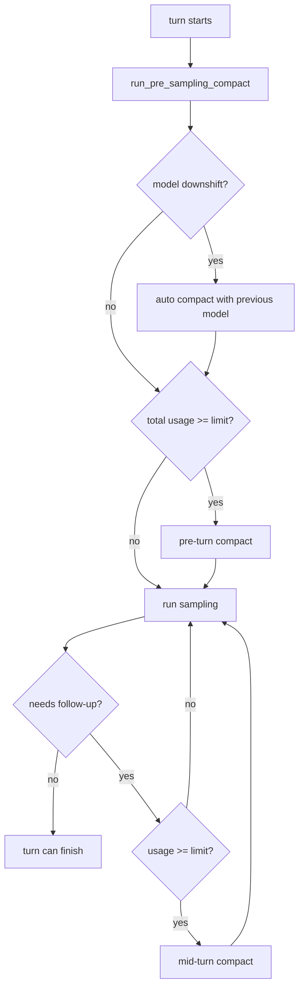

这张图里最关键的是 mid-turn compact。它发生在当前任务还没结束的时候，模型需要继续看工具结果或 pending input。如果只是把 summary append 到最后，模型会把压缩摘要当成最新用户意图，当前任务边界会变乱。Codex 因此专门引入 `BeforeLastUserMessage`。

## `InitialContextInjection` 是压缩的核心开关

`compact.rs` 里有一个小 enum：

| 值 | 用途 |
|----|------|
| `DoNotInject` | pre-turn 或 manual compact，替换 history 后清空 `reference_context_item`，下一轮正常 turn 会全量重注入初始上下文 |
| `BeforeLastUserMessage` | mid-turn compact，把 canonical initial context 插到最后一个真实用户消息之前，并把当前 turn context 作为 baseline |

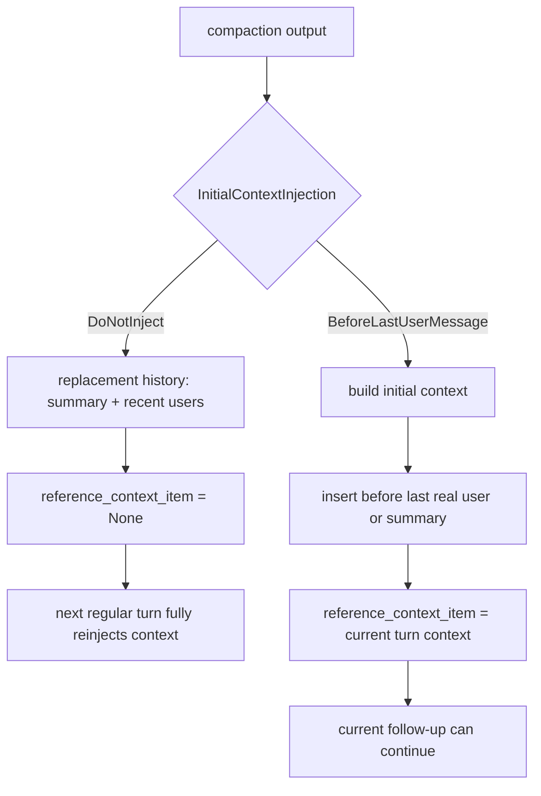

这就是 Codex 压缩比普通总结更细的地方。压缩后的 history 不是只有 summary，还要维持“模型接下来应该从哪里继续”的结构。

## inline compact 的实际流程

inline compact 使用普通模型请求生成摘要。`run_compact_task_inner_impl` 的流程可以简化成：

1. 发出 `ContextCompactionItem` started 事件。
2. 克隆当前 history。
3. 把 compact prompt 作为一次用户输入记录到 compact 用的临时 history。
4. 请求模型，直到收到 `response.completed`。
5. 从 compact turn 里取最后一条 assistant message 作为 summary suffix。
6. 拼上 `SUMMARY_PREFIX`。
7. 收集压缩前真实用户消息。
8. 构造 replacement history。
9. 必要时插入 initial context。
10. 保留 ghost snapshots。
11. 调用 `replace_compacted_history`。
12. 重算 token usage，发 warning。

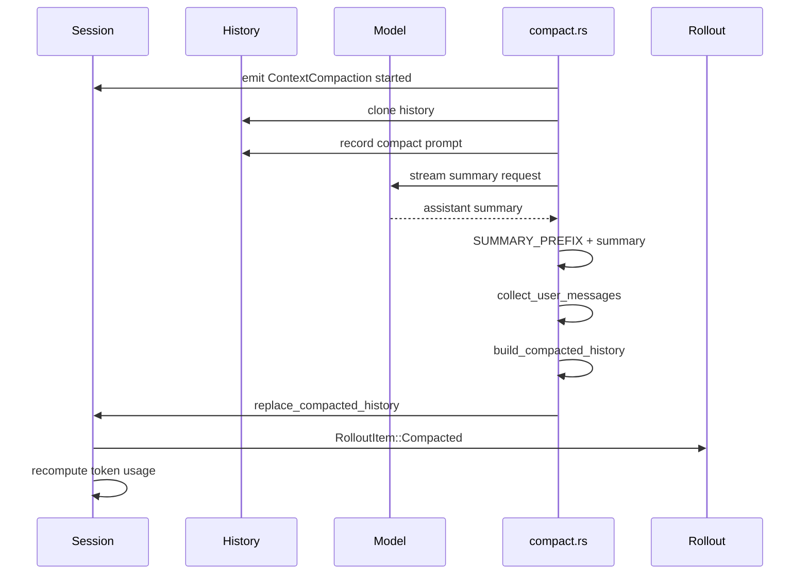

inline compact prompt 很直接。它要求模型生成一个 handoff summary，让另一个 LLM 能继续任务，包含当前进展、关键决策、约束、剩余步骤、关键数据和引用。这个 prompt 的强项是任务交接，不是文学式摘要。

## replacement history 的结构

`build_compacted_history` 不是把全部旧内容替换成 summary。它会保留最近真实用户消息，最多约 `COMPACT_USER_MESSAGE_MAX_TOKENS = 20_000`，再把 summary 作为最后一条 user message 放进去。

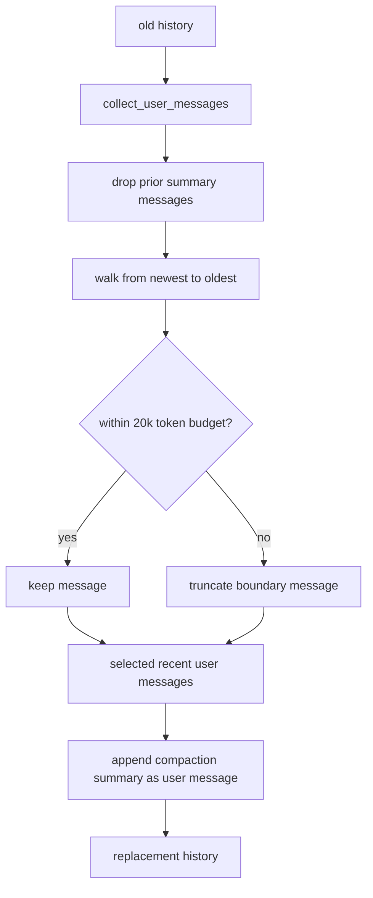

这个结构很重要：

| 保留内容 | 作用 |
|----------|------|
| 最近真实用户消息 | 保留原始需求和最新约束 |
| summary | 承接早期上下文、决策、进展 |
| ghost snapshots | 维持 `/undo` 等能力 |
| initial context | mid-turn 时保持当前 runtime 边界 |

如果只保留 summary，模型会丢掉用户最新原话里的细节；如果只保留最近消息，早期决策会丢。Codex 选择的是摘要加近期原文的混合结构。

## compact 失败时如何处理

压缩本身也可能因为上下文太大而失败。inline compact 的处理方式不是直接放弃，而是在 `ContextWindowExceeded` 时从临时 history 开头移除最旧 item，再重试。`ContextManager::remove_first_item` 会同时移除对应 tool call/output，保持 history invariants。

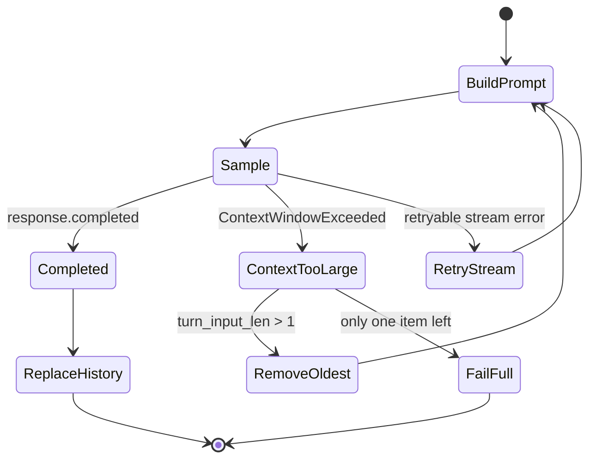

这里体现出两个策略：

| 策略 | 目的 |
|------|------|
| 从最旧 item 裁剪 | 保住最近上下文和 prompt cache 前缀 |
| 维护 tool pair | 避免压缩 prompt 变成模型 API 不接受的非法 history |

压缩失败仍然会通过 `ErrorEvent` 反馈，不会静默替换 history。

## pre-turn compact 与模型降级

`run_pre_sampling_compact` 先检查是否需要用上一个模型的上下文窗口做压缩。这个路径针对一种特殊情况：当前 turn 切到了上下文更小的模型，而旧 history 对新模型太大。

`maybe_run_previous_model_inline_compact` 的判断条件包括：

| 条件 | 说明 |
|------|------|
| 有 `previous_turn_settings` | 知道上一轮模型 |
| 新旧模型都有 context window | 能比较窗口大小 |
| 当前 usage 超过新模型 auto compact limit | 新模型接不住旧 history |
| 模型 slug 发生变化 | 确实切模型 |
| 旧 context window 大于新 context window | 是 downshift，不是升窗 |

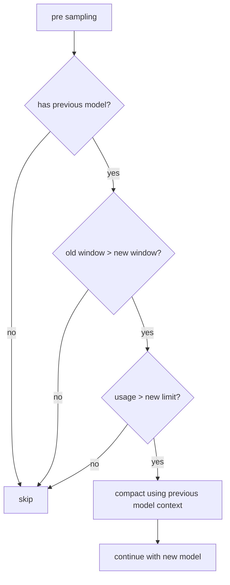

这个细节很高级。切到小上下文模型时，如果直接用新模型 compact，compact 请求本身可能就放不进去；用旧模型先压一轮，成功率更高。

## mid-turn compact 为什么位置特殊

mid-turn compact 只在两个条件同时满足时触发：token usage 达到 auto compact limit，并且还需要 follow-up。需要 follow-up 可能来自模型工具调用、pending input、Responses API `end_turn=false` 等。

源码里触发后会：

1. 调用 `run_auto_compact(..., InitialContextInjection::BeforeLastUserMessage, CompactionReason::ContextLimit, CompactionPhase::MidTurn)`。
2. reset websocket session。
3. 根据是否还有 model follow-up 调整 `can_drain_pending_input`。
4. continue 当前 `run_turn` loop。

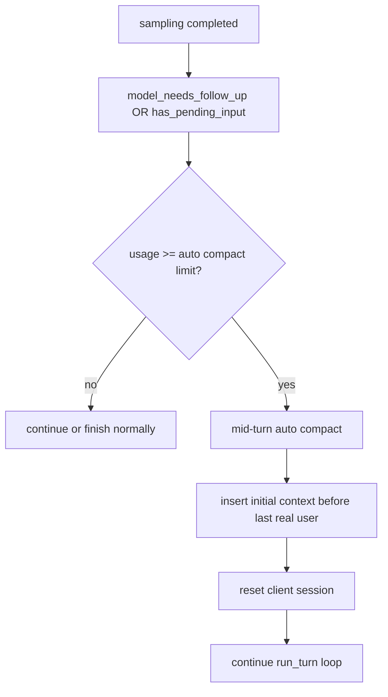

mid-turn 压缩的目标不是结束当前回合，而是给当前回合腾空间继续跑。这个目标决定了它不能简单清空 context baseline。

## remote compact 的差异

如果 provider 支持 remote compaction，Codex 会走 `compact_remote.rs`。它不是用普通 summary prompt，而是调用 model client 的 `compact_conversation_history`，让 provider 返回新的 compacted history。

remote compact 的关键步骤：

| 步骤 | 作用 |
|------|------|
| `trim_function_call_history_to_fit_context_window` | 远端 compact 请求前先裁剪函数调用历史 |
| `built_tools` | 构造 compact 请求里的工具 specs |
| `compact_conversation_history` | 调 provider 的 compact 能力 |
| `process_compacted_history` | 过滤远端返回的 history |
| `record_installed` | rollout trace 记录 compact output 成为 live history 的边界 |

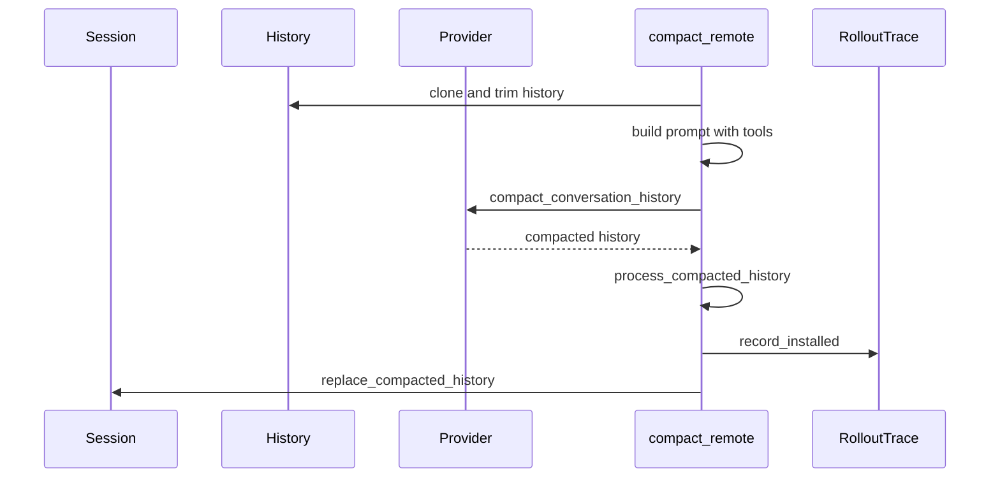

remote compact 更像 provider-native 的 history transformation。inline compact 更像用普通模型请求生成 handoff summary。两者最终都要落到同一个边界：`replace_compacted_history`。

## remote output 为什么要过滤

`process_compacted_history` 会丢掉远端输出里的 developer messages，也会丢掉非真实 user content 的 user messages，只保留真实 user message、hook prompt、assistant message、compaction item 等。源码注释说明原因：remote output 可能包含 stale 或重复 instruction content。

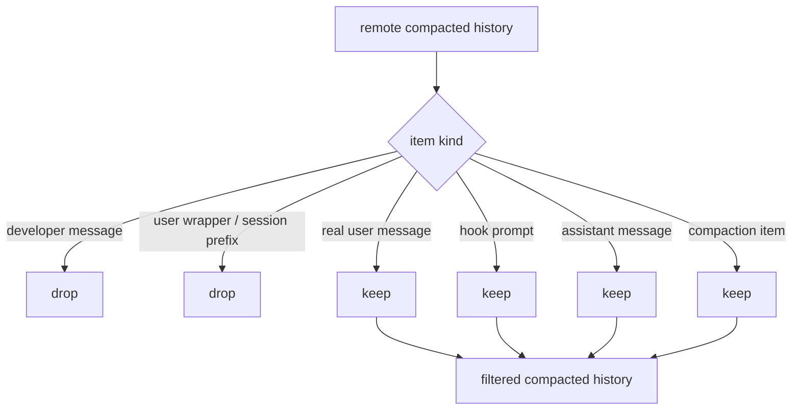

这一步非常关键。压缩模型返回的 history 不能被无条件信任。当前 runtime 的 developer/context 指令必须由 Codex 重新构造，不能从压缩输出里继承一份可能过期的副本。

## `replace_compacted_history` 是语义边界

无论 inline 还是 remote，最终都会调用 `Session::replace_compacted_history`：

1. 替换 in-memory history。
2. 持久化 `RolloutItem::Compacted`。
3. 如果有 `reference_context_item`，持久化 `RolloutItem::TurnContext`。
4. 调用 `model_client.advance_window_generation()`。

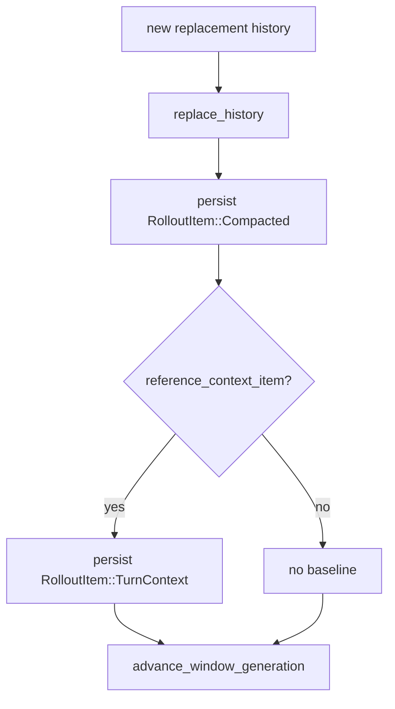

这一步把压缩从“临时摘要”变成“当前线程的新历史”。rollout 里保存 replacement history，resume 时才能恢复同样状态，而不是重新猜一次摘要。

## history 合法性仍然由 ContextManager 保底

压缩后 history 仍然要经过 `ContextManager::for_prompt`。它会确保：

| invariant | 说明 |
|-----------|------|
| every call has output | 每个 function/custom call 都有对应 output |
| every output has call | 孤立 output 会被移除 |
| unsupported images stripped | 模型不支持图片时剥离图片 |
| ghost snapshots not sent to model | ghost snapshot 可用于 runtime，但不进入 prompt |

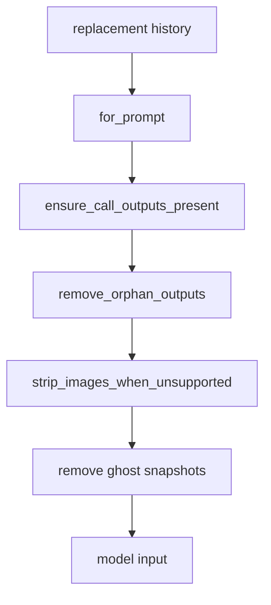

这说明压缩不是唯一防线。即使 replacement history 来自 inline 或 remote compact，发给模型前仍要过 history normalization。

## 和 memory 的区别

上下文压缩和 memory pipeline 都会摘要信息，但解决的问题完全不同：

| 机制 | 输入 | 输出 | 生命周期 |
|------|------|------|----------|
| compact | 当前 thread history | 当前 thread 的 replacement history | 线程内 |
| memory Phase 1 | eligible rollouts | stage-1 raw memory、rollout summary | 跨线程候选 |
| memory Phase 2 | stage-1 outputs | memory artifacts 和 consolidation result | 全局长期 |

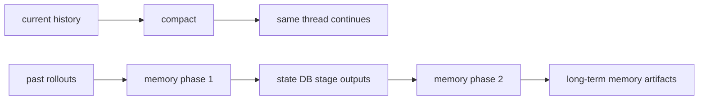

把 memory 当 compact，会让当前任务背上长期偏好噪声；把 compact 当 memory，会把短期任务细节写进长期记忆。Codex 把两条路径拆开，是很值得学习的设计。

## 为什么会感觉更稳

基于源码可验证的部分，Codex 压缩体验可能更稳的原因主要在这些工程点：

| 机制 | 带来的体验 |
|------|------------|
| pre-turn / mid-turn 分开 | 采样前超限和任务中超限能用不同策略处理 |
| model downshift compact | 切到小上下文模型时不至于直接爆窗 |
| recent user messages 保留 | 摘要之外保留最新原始需求 |
| initial context 重新插入 | 压缩后仍保留当前权限、环境、项目规则边界 |
| remote output 过滤 | 避免压缩模型带回过期 developer/context 指令 |
| rollout replacement history | resume 后能恢复压缩后的真实状态 |
| history normalization | 压缩后仍保持模型 API 所需结构合法 |

这类稳定感不是来自一个更聪明的 summary prompt，而是来自压缩前后状态协议做得更细。

## 和 Claude Code 的比较边界

用户体验上，很多人会感到不同工具的上下文压缩质量差异明显。但源码教程里需要区分三类判断：

| 判断类型 | 能不能写成事实 | 说明 |
|----------|----------------|------|
| Codex 源码里的机制 | 可以 | `openai/codex` 公开源码可核对 |
| Claude Code 公开文档或可观察行为 | 可以谨慎引用 | 需要具体资料来源 |
| Claude Code 内部压缩实现 | 不应断言 | 没有同等开源实现可核对 |

因此，更稳的写法是比较设计维度，而不是宣称某个闭源实现一定怎样：

| 维度 | Codex 可验证机制 | 对比时可问的问题 |
|------|------------------|------------------|
| 触发点 | pre-turn、mid-turn、manual | 另一个工具是否区分采样前和回合中 |
| 状态替换 | `replacement_history` | 压缩是否成为可恢复历史 |
| 上下文重注入 | `InitialContextInjection` | 压缩后是否重建当前 runtime context |
| 最近原文保留 | `COMPACT_USER_MESSAGE_MAX_TOKENS` | 摘要之外是否保留近期用户原话 |
| 恢复语义 | rollout reconstruction | resume 后是否知道压缩边界 |
| 输出过滤 | remote compact 丢 developer/stale wrappers | provider compact 输出是否被重新约束 |

这样的比较更有学习价值。它把“感觉更好”拆成可观察、可验证的工程问题。

## 失败路径

| 失败点 | 风险 | 处理方式 |
|--------|------|----------|
| compact 请求本身超窗 | 压缩无法启动 | inline compact 裁剪最旧 item 后重试 |
| stream 断开 | summary 没生成 | 按 provider retry budget 重连 |
| 只有一个 item 仍超窗 | 无法再裁剪 | 标记 context full，发错误事件 |
| remote compact 返回旧 developer 指令 | stale context 污染下一轮 | `should_keep_compacted_history_item` 过滤 |
| mid-turn 不重注入 initial context | 当前任务丢权限/环境边界 | `BeforeLastUserMessage` 插入 canonical context |
| compaction rollout 不完整 | resume 后状态不一致 | `RolloutItem::Compacted` 存 replacement history |
| rollback 裁掉 context baseline | 下一轮差量 context 错误 | 清空 `reference_context_item`，下次全量注入 |

## 设计取舍

| 取舍 | 收益 | 代价 |
|------|------|------|
| compact 是 history replacement | resume、fork、rollback 有明确边界 | 实现比普通 summary 复杂 |
| 保留最近用户消息 | 最新需求不完全依赖摘要 | replacement history 仍占一定 token |
| pre-turn 和 mid-turn 分开 | 触发语义更准确 | 需要维护 context 注入位置 |
| remote compact 输出过滤 | 防止 stale instruction | 可能丢掉 provider 返回的一些上下文 |
| 压缩后重算 token usage | UI 和 auto compact 判断更准确 | 多一次状态计算 |
| 多次 compact warning | 提醒准确性风险 | 用户会看到更多系统提示 |

压缩本质上是有损操作。Codex 的设计不是假装无损，而是尽量让损失发生在可控边界内。

## 如果自己做 Agent，可以学什么

一个可学习的最小压缩方案可以这样做：

1. 触发点至少分成 pre-turn 和 mid-turn。
2. 压缩输出必须替换 history，而不是只 append summary。
3. 保留最近用户原文，不要只保留 summary。
4. 压缩后重建当前环境和权限上下文。
5. 压缩事件写入 event log，resume 时使用同一份 replacement history。
6. 发模型前仍然 normalize history。

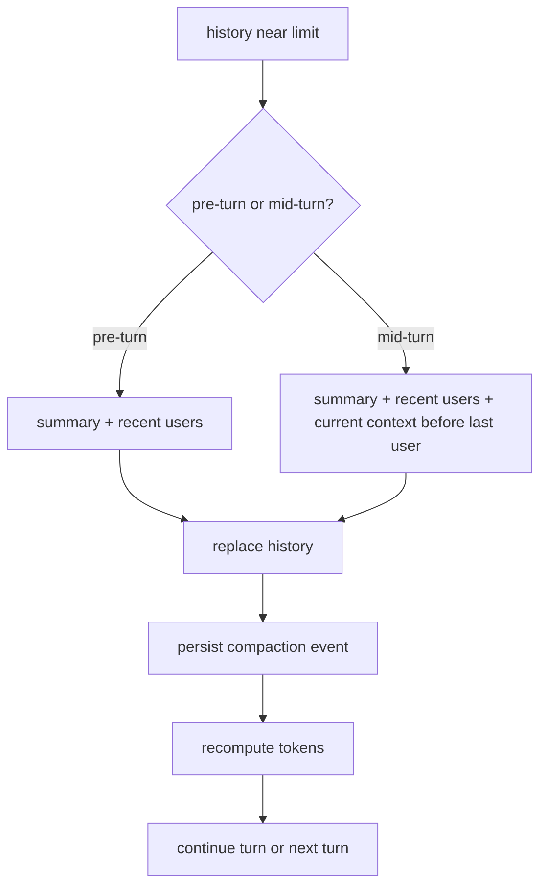

第一版不需要 remote compact，也不需要 memory pipeline。先把 replacement history、recent user preservation、context reinjection 和 resume 语义做对，压缩质量会比纯摘要方案稳很多。

## 源码核对命令

在 `openai/codex` 源码根目录执行：

```bash
rg -n "run_pre_sampling_compact|maybe_run_previous_model_inline_compact|run_auto_compact" codex-rs/core/src/session/turn.rs
rg -n "InitialContextInjection|build_compacted_history|COMPACT_USER_MESSAGE_MAX_TOKENS" codex-rs/core/src/compact.rs
rg -n "process_compacted_history|should_keep_compacted_history_item|compact_conversation_history" codex-rs/core/src/compact_remote.rs
rg -n "replace_compacted_history|RolloutItem::Compacted" codex-rs/core/src/session
rg -n "reference_context_item|normalize_history|remove_first_item" codex-rs/core/src/context_manager/history.rs
```

想快速理解整条链路，先读这四段：

1. `turn.rs` 的 `run_pre_sampling_compact`
2. `turn.rs` 里 post sampling token usage 后的 mid-turn compact 分支
3. `compact.rs` 的 `run_compact_task_inner_impl`
4. `compact_remote.rs` 的 `process_compacted_history`

## current main 里值得新增的压缩细节

当前快照的 `compact.rs` 有一段注释直接点明 mid-turn compact 的语义问题：不能把 compaction summary 放在 history 最后，因为模型会把它当成最新用户意图；因此需要把 initial context 插到最后真实用户消息或 summary 之前。这个设计比普通“总结历史并追加一条消息”更精细。

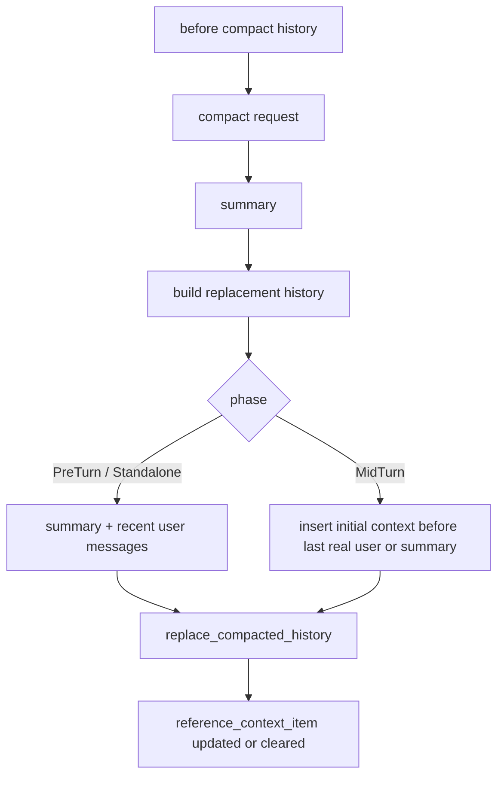

## remote compact 的过滤意义

`compact_remote.rs` 的 `process_compacted_history` 会处理 provider 返回的 compacted history。它不是盲信远端结果，而是要把 history 重新整理成 Codex runtime 能接受的形态，比如清理不该保留的 role、重注入初始上下文、保证最后的 compaction item 位置符合语义。

| 风险 | 过滤或处理目标 |
|------|----------------|
| 远端返回 stale developer instructions | 用当前 initial context 替换 |
| 返回非 user/developer 内容 | 避免污染模型历史 |
| mid-turn summary 位置不对 | 保持当前用户意图仍是任务继续点 |
| 模型切换后上下文不完整 | 重注入 model switch message |

这说明 Codex 把 remote compact 当 provider 能力，而不是把历史控制权交给 provider。

## 压缩后的可恢复性来自 rollout

`replace_compacted_history` 会写入 `RolloutItem::Compacted`。这使 resume 和 rollback 能知道 history 不是自然增长到现在，而是发生过一次替换。`rollout_reconstruction_tests.rs` 里有大量测试覆盖 reference context、rollback、incomplete compaction metadata 等边界。

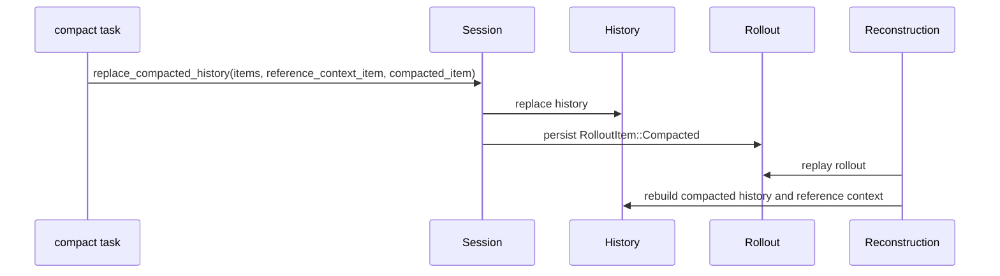

如果自己做 agent，压缩结果必须进入事件日志。否则用户恢复会话时只能看到压缩后的数组，不知道什么时候、为什么、用什么摘要替换了历史。

## Codex 和 Claude Code 压缩对比的边界

公开资料里，Claude Code 的上下文工程常被描述为多级压缩、缓存和恢复机制。Codex 这里能确定的是公开源码中的状态替换协议：pre-turn、mid-turn、remote compact、reference context、replacement history、rollout reconstruction、memory phase1/phase2。

| 维度 | Codex 可源码确认 | 其他产品比较时的写法 |
|------|------------------|----------------------|
| 触发时机 | `turn.rs` 中 pre-sampling 和 mid-turn | 只能说公开资料或可见体验显示会自动压缩 |
| history 替换 | `replace_compacted_history` | 不推断闭源内部是否同样替换 |
| 初始上下文重注入 | `InitialContextInjection` 和 tests | 只比较“长会话能继续”的体验 |
| 记忆系统 | `core/src/memories/README.md` 两阶段 pipeline | 不把记忆和压缩混用 |

这章最值得学的是状态边界，而不是某个摘要 prompt。摘要 prompt 可以改，history replacement 和 baseline 语义才是长会话稳定的核心。

## 逐段源码走读：`compact.rs`

`compact.rs` 的主线可以按下面顺序读。

| 顺序 | 函数或常量 | 读它是为了什么 |
|------|------------|----------------|
| 1 | `InitialContextInjection` | 明白 pre-turn/manual 和 mid-turn 的差异 |
| 2 | `run_inline_compact_task` / `run_compact_task` | 看不同 compact phase 如何进入同一实现 |
| 3 | `run_compact_task_inner_impl` | 看 summary 请求、错误重试、replacement history 构造 |
| 4 | `collect_user_messages` | 看为什么最近用户原话要保留 |
| 5 | `build_compacted_history` | 看 summary 和 recent user messages 如何组合 |
| 6 | `insert_initial_context_before_last_real_user_or_summary` | 看 mid-turn 语义边界 |

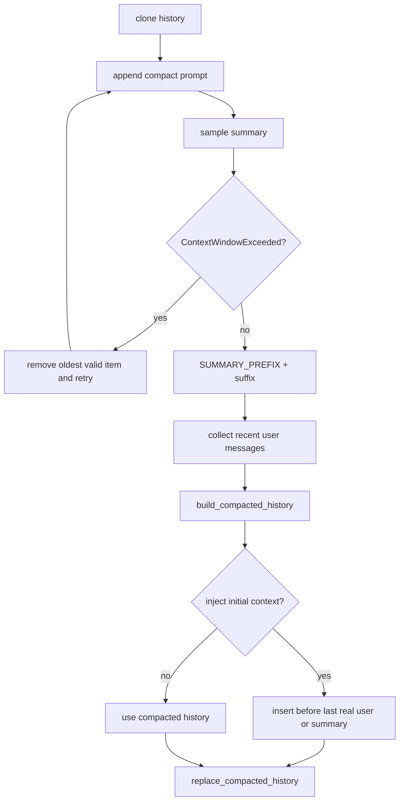

## 逐段源码走读：`compact_remote.rs`

remote compact 的重点不是“远端更聪明”，而是 Codex 如何把远端结果重新收回本地 runtime 语义。

| 读点 | 问题 |
|------|------|
| `should_use_remote_compact_task` | 哪些 provider 能走 remote compact |
| remote request 构造 | provider 接收什么历史 |
| `process_compacted_history` | 返回 history 怎么过滤、替换和重注入 |
| tests | stale developer、non-user content、model switch、last real user 这些边界怎么保证 |

如果 remote compact 输出不能满足 Codex 的 history 语义，宁愿过滤和重注入，也不能让 provider 的输出直接成为长期 history。

## compact prompt 的位置

`core/templates/compact/prompt.md` 负责告诉模型生成 handoff summary。`summary_prefix.md` 则让后续模型知道这段内容是 compaction summary。prompt 质量当然重要，但它不是唯一保障。

| 层 | 作用 |
|----|------|
| prompt | 要求摘要覆盖当前任务、进展、约束、下一步 |
| summary prefix | 标记这不是普通用户请求 |
| replacement history | 把 summary 放进合法 history |
| initial context injection | 保留当前 runtime 上下文 |
| rollout item | 让恢复和回放知道发生过 compact |

这五层合在一起，才是 Codex 压缩值得学的部分。
