# 18. 被称道的 Codex 特性深读

## 核心问题

公开讨论里，Codex 常被称道的不是单一模型能力，而是一组工程特性：本地运行、开源透明、Rust CLI、sandbox/approval、`codex exec`、MCP、`/review`、context compaction、skills/plugins/hooks、subagents、worktrees 和 automations。它们看起来像产品功能，落到源码里却分别属于协议、工具、安全、上下文、任务、扩展和多前端架构。

本章要回答三个问题：

| 问题 | 回答方式 |
|------|----------|
| 公开资料里反复提到 Codex 哪些亮点 | 先看官方文档、官方 README、Hacker News、技术媒体和社区文章 |
| 这些亮点在源码里靠什么支撑 | 把每个功能映射到 `codex-rs/...` 的实际模块 |
| 哪些地方值得学习，哪些地方不能神化 | 把收益、代价、失败路径和适合照搬的抽象拆开 |

比较 Claude Code 这类闭源工具时，只能比较公开可见的产品行为和官方文档。内部实现没有公开，不能把体验判断写成源码事实。Codex 的优势在于开源 runtime 可核对：入口、协议、工具、sandbox、compaction、review、subagent 和 app-server 都能追到代码。

## 公开资料里反复出现的评价

下面这张表不是热度排行，而是资料搜集后的主题归纳。来源包括官方 README、官方 Codex 文档、TechCrunch 对首次发布的报道、Hacker News 发布讨论、以及几篇围绕 compaction、review、MCP 工作流的社区文章。

| 公开主题 | 代表资料 | 可核对事实 | 适合深挖的源码方向 |
|----------|----------|------------|--------------------|
| 本地运行的开源终端 agent | [openai/codex README](https://github.com/openai/codex)、[TechCrunch 发布报道](https://techcrunch.com/2025/04/16/openai-debuts-codex-cli-an-open-source-coding-tool-for-terminals/) | Codex CLI 是本地运行的 coding agent，仓库开源，当前 Rust CLI 是维护主线 | CLI 入口、core protocol、TUI、exec |
| Rust、零依赖安装、终端体验 | `codex-rs/README.md`、HN 发布讨论 | Rust CLI 是默认体验，提供平台二进制、npm、Homebrew 安装 | workspace 分层、`codex-rs/cli/`、`codex-rs/tui/` |
| sandbox 与 approval 让 agent 能接近真实工作区 | [Sandbox 官方文档](https://developers.openai.com/codex/concepts/sandboxing)、HN 讨论 | sandbox 是技术边界，approval 是决策边界，二者配合 | `ToolOrchestrator`、`sandboxing`、Guardian、network proxy |
| `codex exec` 适合脚本和 CI | [Non-interactive mode](https://developers.openai.com/codex/noninteractive)、`codex-rs/README.md` | `codex exec` 可非交互执行，支持 stdin、JSONL、CI 示例 | `codex-rs/exec/src/lib.rs`、app-server in-process client |
| `/review` 是日常工程里很实用的模式 | [CLI features](https://developers.openai.com/codex/cli/features)、[Codex review 社区文章](https://codex.danielvaughan.com/2026/03/30/codex-cli-review-command-code-review-workflows/) | review 可以基于分支、未提交变更、commit 或自定义指令运行 | `ReviewTask`、`spawn_review_thread`、review prompt |
| context compaction 支撑长任务 | [Context compaction 社区文章](https://codex.danielvaughan.com/2026/03/31/codex-cli-context-compaction-architecture/)、本导读第 17 章 | Codex 有 pre-turn、mid-turn、manual compact，且支持 remote/local 两类路径 | `compact.rs`、`compact_remote.rs`、`turn.rs` |
| MCP 让 Codex 可以接外部工具，也能被别的 agent 调用 | [MCP 官方文档](https://developers.openai.com/codex/mcp)、[MCP 工作流文章](https://www.jdhodges.com/blog/codex-cli-claude-code-mcp-speeds-command-line/) | Codex 支持 MCP client，Rust README 还说明实验性 `codex mcp-server` | `codex-mcp`、`rmcp-client`、`mcp-server`、tool spec |
| skills、plugins、hooks 让能力可分发、可插拔 | [Skills](https://developers.openai.com/codex/skills)、[Plugins](https://developers.openai.com/codex/plugins)、[Hooks](https://developers.openai.com/codex/hooks) | skills 是按需指令包，plugins 可打包 skills/apps/MCP，hooks 接生命周期事件 | `skills.rs`、`plugins/manager.rs`、`hook_runtime.rs` |
| subagents 支持并行探索和受控委托 | [Subagents 概念文档](https://developers.openai.com/codex/concepts/subagents)、[Subagents 配置文档](https://developers.openai.com/codex/subagents) | subagents 需要显式触发，适合把噪声工作移出主线程 | `codex_delegate.rs`、`agent_tool.rs`、multi_agents handlers |
| desktop/app 的 worktrees、automations、review pane 更像完整开发工作台 | [App features](https://developers.openai.com/codex/app/features)、[Worktrees](https://developers.openai.com/codex/app/worktrees)、[Automations](https://developers.openai.com/codex/app/automations) | 公开文档描述 worktree、handoff、automation、review pane、browser/computer use | app-server Thread/Turn/Item、rollout、goals、thread API |

公开讨论里也有批评：早期 Node/React CLI 的依赖体验、sandbox 在部分 Linux 环境的兼容性、复杂架构任务中的幻觉、长上下文退化、自动压缩带来的信息损失。这些批评不能忽略，因为它们正好指向 Codex runtime 的真实边界。

## 源码入口

| 主题 | 主要路径 |
|------|----------|
| CLI 与 Rust workspace | `codex-rs/README.md`、`codex-rs/cli/src/main.rs`、`codex-rs/tui/` |
| 非交互执行 | `codex-rs/exec/src/lib.rs`、`codex-rs/exec/src/exec_events.rs` |
| 协议与多前端 | `codex-rs/protocol/src/protocol.rs`、`codex-rs/app-server/README.md`、`codex-rs/app-server/src/codex_message_processor.rs` |
| 工具规格与 web search | `codex-rs/tools/src/tool_spec.rs`、`codex-rs/tools/src/tool_registry_plan.rs` |
| apply_patch 与 diff | `codex-rs/core/src/tools/handlers/apply_patch.rs`、`codex-rs/core/src/turn_diff_tracker.rs` |
| sandbox、approval、网络 | `codex-rs/core/src/tools/orchestrator.rs`、`codex-rs/sandboxing/src/manager.rs`、`codex-rs/core/src/tools/network_approval.rs`、`codex-rs/network-proxy/README.md` |
| review | `codex-rs/core/src/session/review.rs`、`codex-rs/core/src/tasks/review.rs`、`codex-rs/core/src/review_prompts.rs` |
| context compaction | `codex-rs/core/src/session/turn.rs`、`codex-rs/core/src/compact.rs`、`codex-rs/core/src/compact_remote.rs` |
| MCP、动态工具、apps | `codex-rs/core/src/mcp.rs`、`codex-rs/codex-mcp/`、`codex-rs/mcp-server/src/message_processor.rs` |
| skills、plugins、hooks | `codex-rs/core/src/skills.rs`、`codex-rs/core/src/plugins/manager.rs`、`codex-rs/core/src/hook_runtime.rs` |
| subagents | `codex-rs/core/src/codex_delegate.rs`、`codex-rs/tools/src/agent_tool.rs`、`codex-rs/core/src/tools/handlers/multi_agents.rs` |
| thread、rollout、goals | `codex-rs/core/src/thread_manager.rs`、`codex-rs/core/src/rollout.rs`、`codex-rs/core/src/goals.rs` |

## 总览：公开亮点如何落到 runtime

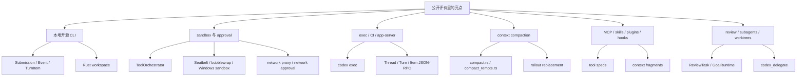

这张图可以作为本章的阅读地图。Codex 被称道的地方不是散落的功能点，而是这些功能都能回到同一套 runtime：协议负责前后端边界，工具 runtime 负责副作用，sandbox 和 approval 负责风险，上下文系统负责长线程，app-server 负责多前端，tasks/goals/subagents 负责更复杂的工作流。

## 1. 本地开源 CLI：透明度本身就是能力

官方 README 的一句话很关键：Codex CLI 是在本机运行的 coding agent。TechCrunch 发布报道也强调它把 OpenAI 模型接到本地命令行、代码和计算任务上，并且是开源工具。HN 发布讨论里，“Codex 开源、Claude Code 不开源”也是高频对比点。

这个特性被称道，不只是因为能在终端里用。更重要的是源码可读，行为可审计，开发者能看到 agent loop、工具规格、审批策略、sandbox 选择、上下文压缩和协议事件如何实现。对想学习 coding agent 架构的人来说，开源 runtime 比黑盒体验更重要。

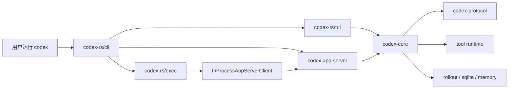

这条链路解释了为什么 Codex 不是一个简单 shell wrapper。CLI 是入口，真正的复用点在 core、protocol 和 app-server。`codex exec` 不是独立实现一套 agent，app-server 也不是只给桌面应用定制，它们都绕回同一个 Thread/Turn/Item 和工具事件模型。

| 可见特性 | 源码机制 | 价值 | 代价 |
|----------|----------|------|------|
| 本地运行 | `codex-rs/cli/src/main.rs` 分发到 TUI、exec、app-server | 工作区、shell、git、编辑器都在本地 | 模型请求和账号体系仍依赖外部服务 |
| 开源 | Apache-2.0 仓库，可读 Rust workspace | 可以验证机制，不必猜 prompt 和工具行为 | 云端 Codex Web 和模型本身不在开源范围 |
| Rust CLI | `codex-rs/README.md` 说明 Rust CLI 是维护主线 | 更适合原生终端、单文件二进制、平台 sandbox | 跨平台细节变多，Windows/macOS/Linux 各有分支 |
| 多入口 | TUI、exec、app-server、MCP server | 一个 core 可以服务多种产品形态 | 协议层和状态层更重 |

如果自己做 agent，可以先学它的边界：UI 不直接操作模型和工具，而是提交 `Submission`，再消费 `Event`。即便第一版只有命令行，也值得先把事件协议定下来。

## 2. 安全体验：sandbox 和 approval 是两层控制

官方 sandbox 文档把边界说得很清楚：sandbox 是技术边界，approval 是决策边界。HN 讨论里也有人提到 Codex 会展示 diff、运行命令前询问、默认限制工作目录和网络。这类体验背后的关键，不是提示词让模型乖一点，而是工具执行路径上有硬约束。

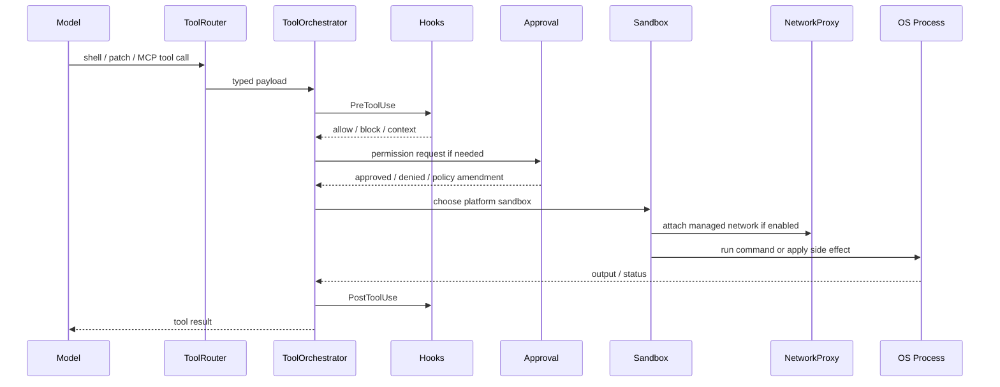

`ToolOrchestrator` 是关键入口。模型提出工具调用后，运行时会把它路由成 typed payload，再经过 hook、approval、sandbox、网络策略和执行器。`sandboxing/src/manager.rs` 再根据平台和策略选择 macOS Seatbelt、Linux sandbox 或 Windows sandbox。

| 安全层 | 源码线索 | 处理的问题 |
|--------|----------|------------|
| 工具路由 | `codex-rs/core/src/tools/router.rs` | 模型返回的 tool call 不能直接执行，需要解析成受控 payload |
| 审批策略 | `codex-rs/core/src/session/mod.rs`、`codex-rs/core/src/tools/orchestrator.rs` | 判断某次操作是否需要用户或自动 reviewer 许可 |
| Guardian | `codex-rs/core/src/guardian/` | 自动复核某些 approval request，降低人工审批压力 |
| 平台 sandbox | `codex-rs/sandboxing/src/manager.rs` | 限制文件系统、网络和进程能力 |
| 网络代理 | `codex-rs/network-proxy/README.md`、`codex-rs/core/src/tools/network_approval.rs` | 网络不只开关，还可以按策略放行、询问或记录 |
| hooks | `codex-rs/core/src/hook_runtime.rs` | 在工具使用前后插入团队规则或额外上下文 |

这个设计的学习价值在于：安全不是 UI 弹窗。UI 可以展示审批请求，但真正的边界必须在执行路径。否则模型只要绕过前端，或者某个工具被误接入，就会获得过大权限。

代价也很明确。sandbox 会带来平台兼容问题，尤其是依赖系统缓存、网络命名空间、全局工具链的语言生态。社区文章里提到 Ubuntu VM 上 bubblewrap/AppArmor 组合导致 `codex exec` sandbox 失败，就是这种复杂度的外部表现。更稳的结论不是“sandbox 总是无痛”，而是“能执行 shell 的 agent 必须有可审计的 sandbox/approval 路径”。

## 3. `codex exec`：把 agent 变成可脚本化工具

HN 发布讨论里有人把这类 CLI agent 类比成 Linux utility：可以把智能撒进 CI、PR review、脚本、日志分析等流程，而不是只做一个聊天界面。官方 Non-interactive mode 文档也给了 CI auto-fix、stdin piping、JSONL 输出等例子。

`codex exec` 的源码入口是 `codex-rs/exec/src/lib.rs`。文件顶部有一个重要约束：默认输出模式下 stdout 只能写最终消息；`--json` 模式下 stdout 必须是 JSONL；其他输出写 stderr。这说明 exec 模式不是“把 TUI 打印到终端”，而是一个可被脚本消费的协议化入口。

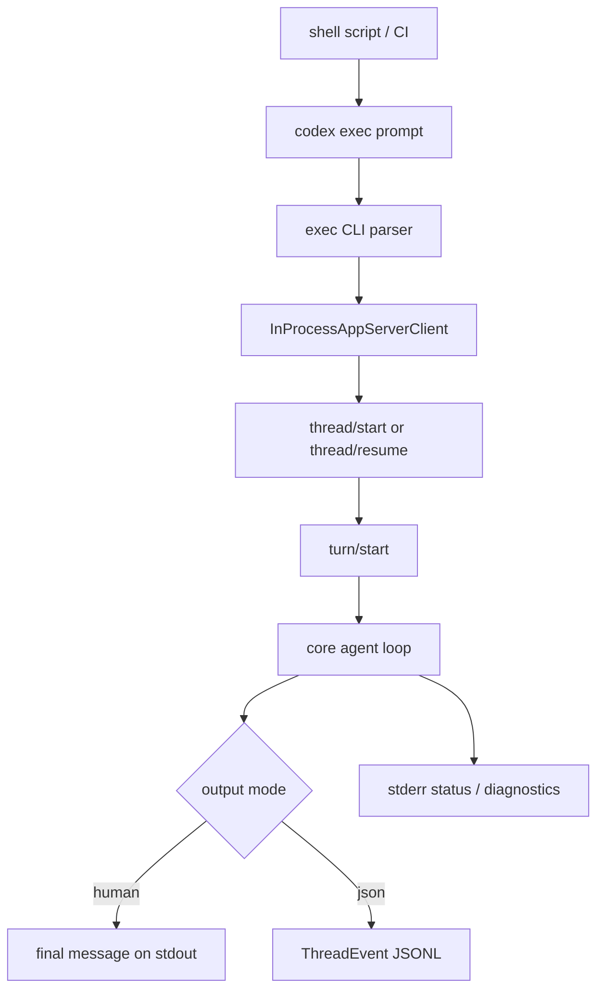

可脚本化带来三类价值：

| 价值 | 例子 | 源码支撑 |
|------|------|----------|
| 自动化工作流 | CI 失败后让 Codex 读日志、修最小变更、再跑测试 | `codex-rs/exec/src/lib.rs`、`codex-rs/exec/src/exec_events.rs` |
| 可组合 stdin | `npm test` 输出作为上下文，prompt 作为指令 | `StdinPromptBehavior`、prompt-plus-stdin 逻辑 |
| 机器可读事件 | JSONL 输出可被其他程序解析 | `EventProcessorWithJsonOutput`、exec event types |

这里的设计取舍很值得学。交互式 agent 可以用丰富 UI 掩盖中间状态，自动化 agent 必须回答：什么时候结束，失败如何表达，stdout 是否稳定，stderr 是否可忽略，事件能否被消费，临时会话是否落盘。`codex exec --ephemeral`、JSONL、非零退出和 app-server in-process client 都围绕这些问题展开。

## 4. `/review`：把代码审查做成独立 task

官方 CLI features 页把本地 code review 放在突出位置。社区文章也把 `/review` 评价为日常使用中很实用的功能，因为它可以看 base branch、未提交变更、某个 commit，也能带自定义审查重点。

源码里 review 不是普通聊天 prompt。`codex-rs/core/src/session/review.rs` 会构造 review-specific turn context，选择 `review_model` 或当前模型，禁用 web search 和 view image，并发送 `EnteredReviewMode` 事件。`codex-rs/core/src/tasks/review.rs` 再启动一个 `ReviewTask`，通过 `run_codex_thread_one_shot` 跑子 Codex conversation，并把结果解析成结构化 `ReviewOutputEvent`。

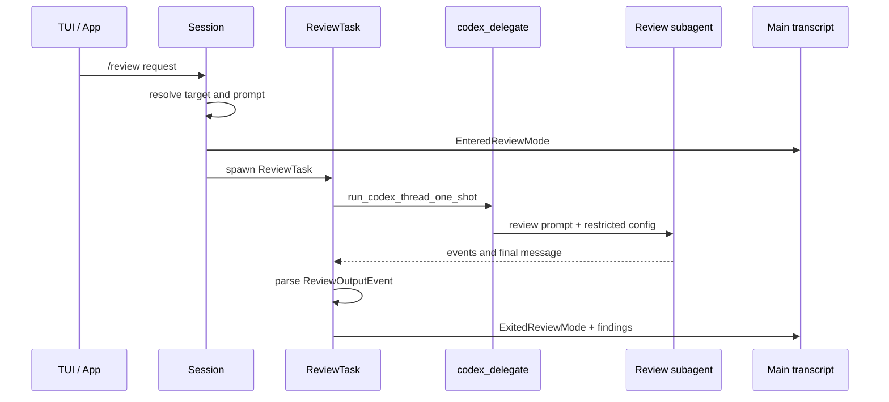

这层实现有几个值得注意的细节：

| 细节 | 为什么重要 |
|------|------------|
| `review_model` 可覆盖当前模型 | 日常开发可用快模型，审查可固定高推理模型 |
| review 禁用 web search 和 view image | 代码审查更强调当前 diff，不让外部资料污染判断 |
| `approval_policy = Never` | review 是只读任务，不应该卡在工具审批上 |
| structured `ReviewOutputEvent` | 前端可以把 findings 渲染成 review pane 或 inline comments |
| 结果作为独立 turn 进入 transcript | 可以重复审查、对比前后反馈 |

这个功能被称道，原因不是它能“让模型挑错”这么简单，而是它把 review 当成一种 task lifecycle：进入 review mode、运行受限子任务、压制中间 assistant delta、解析结构化输出、退出 review mode。自己做 agent 时，可以把 review、compact、undo、shell command 都看成 task，而不是把所有行为塞进普通聊天回合。

## 5. context compaction：长线程的关键不是摘要，而是状态替换

用户特别关心上下文压缩，这是 Codex 里最值得学习的一块。社区文章常说 Codex compaction 的价值在于让长任务不断线；但源码显示，真正强的地方不是某个 summary prompt，而是压缩被接进了 agent loop 和 rollout 语义。

Codex 有三类压缩入口：manual compact、pre-turn auto compact、mid-turn auto compact。第 17 章已经逐段展开，这里只看它为什么会被称道。

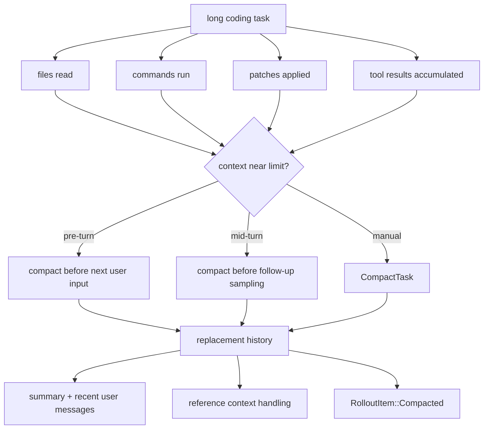

关键设计有三点：

| 设计 | 源码 | 为什么比普通总结更稳 |
|------|------|----------------------|
| pre-turn 与 mid-turn 都能触发 | `codex-rs/core/src/session/turn.rs` | 长工具链中间也能压缩，不必等下一次用户输入 |
| replacement history | `codex-rs/core/src/compact.rs` | 压缩不是追加一条摘要，而是替换模型可见 history |
| `InitialContextInjection::BeforeLastUserMessage` | `codex-rs/core/src/compact.rs` | mid-turn 时能把 initial context 插回正确位置，让当前任务继续 |
| remote compact 与 inline compact 分流 | `codex-rs/core/src/compact_remote.rs`、`codex-rs/core/src/compact.rs` | provider 有能力时可走远端压缩，没有时本地生成 handoff summary |
| rollout 记录 compaction | `codex-rs/core/src/session/mod.rs`、`codex-rs/core/src/session/rollout_reconstruction.rs` | resume 时能重建压缩后的历史，而不是丢失边界 |

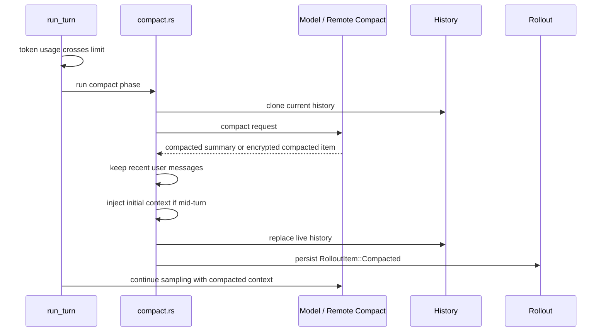

这也是 Codex 和很多工具在长会话体验上差异明显的来源。普通做法可能是用户手动 `/compact`，或者模型自己总结历史。Codex 则把压缩放进 runtime：压缩前后都有事件、history 有结构约束、tool pair 要合法、rollout 要能恢复、mid-turn 要维护当前用户意图。

但它不是魔法。压缩一定会损失信息。`compact.rs` 保留最近真实用户消息和一条 summary，早期 assistant 输出、工具结果、文件内容都会被摘要化或丢弃。长任务质量仍然取决于任务切分、摘要质量、模型能力、文件重新读取策略和用户是否让 agent 在过大的上下文里继续漂移。好的学习姿势是：把 compaction 当成长任务的安全阀，而不是无限上下文。

## 6. MCP：Codex 既能接工具，也能成为工具

官方 MCP 文档说 Codex 支持在 CLI 和 IDE extension 中连接 MCP servers。Rust README 又说明 Codex 可以实验性地用 `codex mcp-server` 启动为 MCP server，让其他 MCP client 把 Codex 当作工具。社区里也有人把 Codex 通过 MCP 接进 Claude Code，用它做第二意见、plan review 或 code review。

这类用法之所以被称道，是因为 MCP 把 Codex 从单一 CLI 变成了网络里的一个节点。它既能消费外部工具，也能被别的 agent 调用。

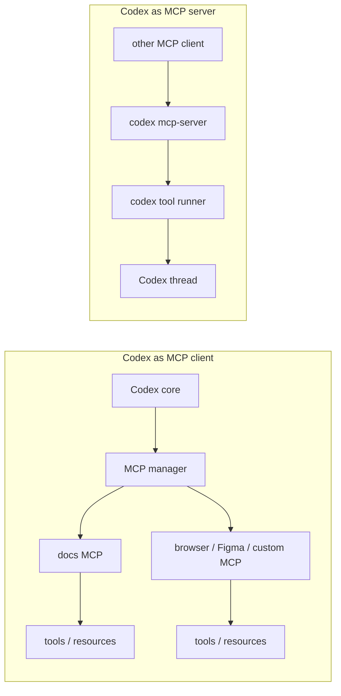

| 方向 | 源码入口 | 适合场景 | 边界 |
|------|----------|----------|------|
| Codex 作为 MCP client | `codex-rs/core/src/mcp.rs`、`codex-rs/codex-mcp/`、`codex-rs/rmcp-client/` | 文档检索、浏览器、Figma、内部系统工具 | MCP 工具仍要进入 Codex 的工具和审批路径 |
| Codex 作为 MCP server | `codex-rs/mcp-server/src/message_processor.rs`、`codex-rs/mcp-server/src/codex_tool_runner.rs` | 让其他 agent 调用 Codex 做审查、分析或实现 | 官方标注 experimental，不应假设 API 稳定 |
| MCP 资源 | `codex-rs/tools/src/mcp_resource_tool.rs` | 把外部数据作为 context 读入 | 资源也有上下文成本，不能无脑灌入 |
| MCP 并发 | `docs/config.md`、`codex-rs/core/src/tools/parallel.rs` | 安全的 read-only 工具可以并行 | 读写共享状态的 MCP server 不应随便开并发 |

MCP 的学习价值在于接口边界。自己做 agent 时，不一定要一开始支持完整 MCP，但要避免把所有外部能力做成硬编码函数。工具来源、工具 schema、工具权限、工具输出、工具并发能力都应该有统一描述。

## 7. Web search 和多模态：外部信息也要进入工具体系

官方 CLI features 页提到 Codex 带 first-party web search tool，默认使用 OpenAI 维护的 web search cache，live 模式需要显式配置或在特定权限下启用。TechCrunch 发布报道也提到 Codex CLI 可把截图、低保真草图和本地代码结合，用于多模态推理。App/IDE features 还写到图片拖拽、image generation、browser preview 和 computer use。

源码里 web search 被建模为 tool spec，而不是普通网络请求。`codex-rs/tools/src/tool_spec.rs` 的 `create_web_search_tool` 会根据 `WebSearchMode::Cached`、`Live`、`Disabled` 决定是否暴露工具，并设置 `external_web_access`。协议里还有 `WebSearchBegin`、`WebSearchEnd` 和 `WebSearchCall` 事件。

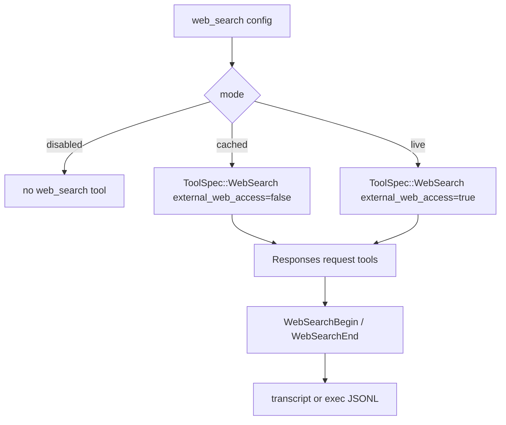

这层设计很有参考价值。外部信息不是越多越好。web search 有 prompt injection 风险，图片和 browser/computer use 会接触非代码状态，image generation 还会引入成本和产物管理。Codex 把这些能力接成工具，并通过 mode、feature flag、approval、sandbox、transcript 让它们可见、可关、可记录。

| 功能 | 公开资料里的说法 | 源码或协议落点 | 取舍 |
|------|------------------|----------------|------|
| cached web search | 默认用缓存降低 live prompt injection 暴露 | `WebSearchMode::Cached`、`external_web_access=false` | 新鲜度弱于 live search |
| live web search | 可通过 `--search` 或配置启用 | `WebSearchMode::Live` | 风险和不可控内容变多 |
| image input / view image | App/IDE/CLI 支持图片作为上下文 | `view_image` 工具、协议 items | 多模态质量依赖模型和 UI |
| image generation | App/IDE 可生成或编辑图片 | image generation tool spec | 成本高，产物验证要另做 |
| browser/computer use | App 文档描述预览、评论、GUI-only bug 复现 | app-server、apps/plugins、computer/browser tools | 权限和系统状态风险更高 |

## 8. skills、plugins、hooks：扩展能力按生命周期拆开

Codex 的扩展系统很容易被低估。公开文档里，skills 是可复用指令和脚本，plugins 可以打包 skills、apps 和 MCP servers，hooks 可以在工具调用、权限请求、stop、用户提交 prompt 等事件上插入逻辑。

这些入口的价值在于生命周期不同：

| 扩展入口 | 生命周期 | 适合放什么 |
|----------|----------|------------|
| `AGENTS.md` | 仓库或目录规则 | 项目约定、测试命令、代码风格 |
| skills | 按需触发的任务能力 | review 流程、PDF 处理、浏览器验证、设计规范 |
| plugins | 可分发扩展包 | skills + app integration + MCP 配置 |
| hooks | 生命周期拦截器 | 工具审批前后的团队策略、额外上下文、阻断规则 |
| apps/connectors | 外部服务连接 | GitHub、Slack、Google Drive 等 |

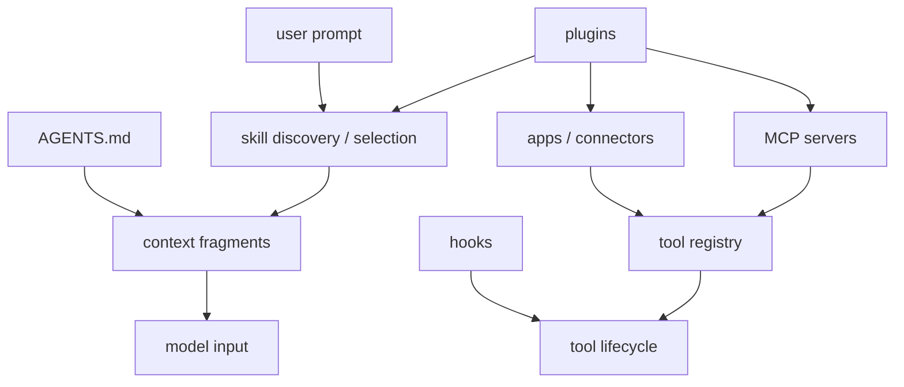

源码里可以从 `codex-rs/core/src/skills.rs`、`codex-rs/core/src/skills_watcher.rs`、`codex-rs/core/src/plugins/manager.rs`、`codex-rs/core/src/plugins/injection.rs`、`codex-rs/core/src/hook_runtime.rs` 追这条链。hook 输出解析在 `codex-rs/hooks/src/engine/output_parser.rs`，它会处理 block、approval、additional context 等结果。

被称道的点是“可定制”，但更值得学的是“不把所有定制都塞进一个长 prompt”。稳定规则、按需技能、可安装插件、外部 app、生命周期 hook 应该分层。这样 agent 才能被团队维护、升级和审计。

## 9. subagents：并行能力必须受控

官方 Subagents 文档说得很克制：Codex 不会自动 spawn subagents，只有用户明确要求 subagents 或 parallel agent work 时才应该用。文档还提醒 subagent workflow 会消耗更多 token，因为每个 subagent 都要单独做模型和工具工作。

源码里的实现也体现了受控委托。`codex_delegate.rs` 会创建子 Codex thread，继承父 session 的 auth、models、environment、skills、plugins、MCP manager、exec policy 等服务，并把子 agent 的审批请求路由回父 session。`codex-rs/tools/src/agent_tool.rs` 的工具说明也强调任务要具体、写入范围要 disjoint、不要重复主线程工作。

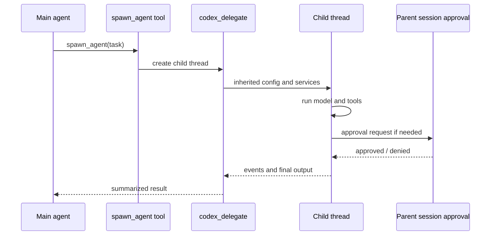

| 设计 | 价值 | 代价 |
|------|------|------|
| 显式触发 | 防止 agent 把普通深度分析自动升级成多 agent | 用户需要知道何时值得并行 |
| 子 thread | 隔离探索、审查、文档整理等噪声 | 上下文和 token 成本增加 |
| 父 session 审批 | 子 agent 不能绕过权限边界 | 审批链路更复杂 |
| 事件桥接 | 主线程能观察子 agent 进度和结果 | UI/协议要承载更多状态 |
| 写入范围约束 | 降低并行写冲突 | 任务拆分要求更高 |

自己做多 agent 时，最应该学这点：subagent 是工具，不是默认策略。并行的真正价值不是多几个模型同时说话，而是把可分离、可验证、可合并的工作拆出去。

## 10. worktrees 和 automations：从聊天转向工作台

Codex app 文档里的 worktrees、automations、review pane、in-app browser、computer use，是产品体验里很亮的一部分。这里要分清边界：desktop app 的全部实现不等同于 `codex-rs` 开源 core；但 app-server 的 Thread/Turn/Item、rollout、goals、review、thread fork/rollback/compact 等 API，能解释这些能力为什么需要一个更重的 runtime。

worktree 文档说 Codex app 可以在 Git worktree 中并行跑任务，把后台任务和本地 foreground checkout 隔开。automations 文档则说明后台任务会用默认 sandbox 设置，组织策略还能限制 `approval_policy = "never"` 等危险配置。

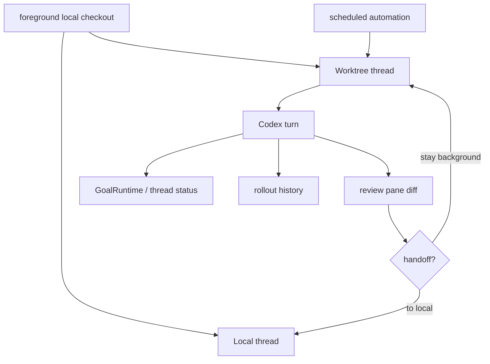

这类体验的本质是任务隔离和可恢复。聊天式 agent 只关心当前对话，工作台式 agent 还要关心：

| 问题 | Codex 公开能力 | 相关源码方向 |
|------|----------------|--------------|
| 后台任务会不会污染当前 checkout | worktree 隔离、handoff | app-server thread API、git info、rollout |
| 自动化能否无人值守 | automations、approval policy、sandbox requirements | `goals.rs`、tasks、permissions |
| 用户如何审查结果 | review pane、diff、inline comments | `TurnDiffTracker`、app-server item events |
| 任务是否能恢复 | thread resume、archive、rollback、compact | `thread_manager.rs`、`rollout.rs` |

如果自己做 agent，这一层不必一开始照搬。更实用的顺序是先有稳定事件日志和 diff，再支持 branch/worktree 隔离，最后做定时和自动继续。没有可恢复状态和可审查 diff，自动化只会把风险放大。

## 这些特性之间的组合关系

Codex 被称道的地方往往来自组合，而不是单点。

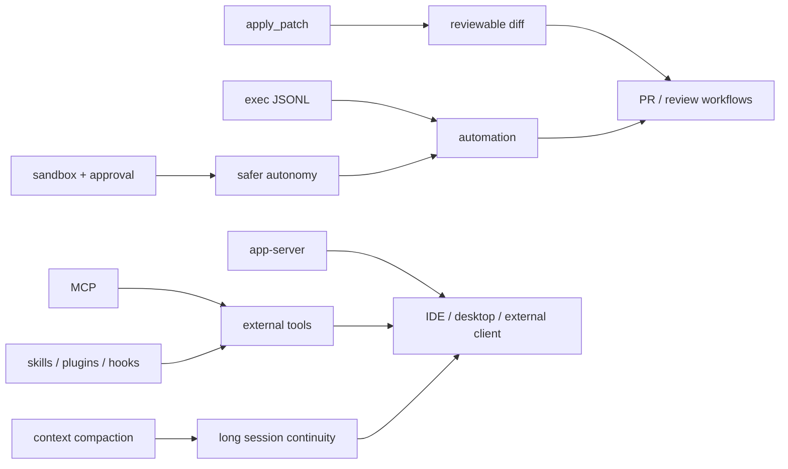

几个典型组合：

| 组合 | 用户能感知到的结果 | 背后机制 |
|------|--------------------|----------|
| `apply_patch` + `TurnDiffTracker` + review pane | 改动可预览、可审查、可回滚 | 结构化 patch、turn-level diff、Git diff |
| sandbox + approval + network proxy | agent 可以更大胆地动工作区 | 工具执行路径上的硬边界 |
| `codex exec` + JSONL + app-server | 能接 CI、脚本和其他程序 | 非交互协议和事件流 |
| compaction + rollout + resume | 长任务不必一到窗口上限就断 | history replacement 和持久化恢复 |
| MCP + plugins + skills | 外部工具和团队流程能进 Codex | 工具规格、上下文注入、扩展分发 |
| subagents + parent approval | 并行探索不必失控 | 子 thread 继承策略，审批回父 session |
| worktrees + automations + review | 后台任务能与 foreground 开发分离 | 任务隔离、diff 审查、thread 状态 |

这也是源码阅读时容易漏掉的点：单独看某个文件会觉得只是功能实现，串起来看才会发现 Codex 其实在做一个本地 agent operating runtime。

## 边界与失败路径

精品源码导读不能只写优点。下面这些边界直接来自公开资料、源码结构和社区反馈。

| 边界 | 具体表现 | 正确理解 |
|------|----------|----------|
| 开源不等于全栈透明 | CLI/runtime 开源，模型、账号、云端 Codex Web 不在仓库里 | 只把可核对的本地 runtime 写成事实 |
| sandbox 会有平台差异 | macOS、Linux、Windows 的机制不同，部分环境会踩兼容问题 | sandbox 是必要边界，但需要 fallback、诊断和文档 |
| compaction 会损失信息 | summary 取代早期 tool results 和 assistant 输出 | 长任务仍要切分，重要事实应落到文件或验证命令 |
| web search 不是无风险知识源 | cached mode 降低 live 内容暴露，但结果仍不应被完全信任 | 外部资料进入 prompt 前要有来源和不信任边界 |
| review 不是测试替代品 | review 找风险，不能证明行为正确 | review 后仍要跑 targeted tests 或人工验证 |
| subagents 会放大成本 | 每个子 agent 都会消耗自己的模型和工具预算 | 只把可并行、可合并的工作拆出去 |
| hooks/plugins 增加供应链面 | 外部脚本、apps、MCP servers 都可能接触敏感数据 | 安装、权限、数据共享和审批要可审计 |
| worktrees 依赖 Git 语义 | 同一分支不能被多个 worktree 同时 checkout | 自动化和 handoff 需要尊重 Git 引用约束 |

这些边界不是削弱 Codex 的价值，反而说明它为什么值得读。真实 agent runtime 的难点就在这些失败路径里：权限、状态、上下文、外部工具、并行、恢复和审查没有任何一个能靠 prompt 单独解决。

## 如果自己做 Agent，可以学什么

可以把 Codex 的被称道特性拆成 8 个可复用设计原则。

| 原则 | 最小实现 | 生产化方向 |
|------|----------|------------|
| core 和 UI 解耦 | `Submission` / `Event` JSONL | app-server、TUI、IDE、desktop 共用 core |
| 工具执行统一入口 | shell、patch、read file 都走一个 dispatcher | `ToolRouter`、approval、hooks、parallel、MCP |
| 编辑结构化 | 先支持 unified diff 或 patch | 流式 patch preview、turn diff、per-hunk review |
| 安全放在 runtime | cwd 限制、网络默认关、命令审批 | OS sandbox、network proxy、Guardian、org policy |
| 长任务有状态 | JSONL rollout + resume | compact、memory、goals、thread fork/rollback |
| 扩展按生命周期分层 | 本地 rules + skills | plugins、apps、MCP、hooks、marketplace |
| 自动化独立设计 | headless command + exit code | JSONL events、ephemeral mode、CI recipes |
| 并行受控 | 手动启动只读 explorer | 子 thread、权限继承、写入范围、结果桥接 |

学习 Codex 时，不必照搬所有模块。更合理的路线是先实现能解释这些特性的最小骨架：

1. 定义 `Submission` / `Event`，让 UI 和 core 分开。
2. 用 `Thread` / `Turn` / `Item` 保存任务状态。
3. 所有工具调用走一个工具 runtime。
4. shell、patch、网络先接审批和 cwd 限制。
5. 每个 turn 结束产出 diff 和事件日志。
6. 做一个 headless `exec`，保证 stdout/stderr/exit code 稳定。
7. 再加 compaction，先做 summary + recent user messages，再做 rollout replacement。
8. 最后加 MCP、skills、hooks、plugins、subagents 和 automations。

这个顺序的好处是，每一步都能单独产生价值，也能自然通向 Codex 那种更完整的 runtime。

## 验证命令

下面这些命令可以用来核对本章里的源码判断。

```bash
# CLI / exec / app-server 入口
rg -n "codex exec|mcp-server|sandbox|MCP client" README.md codex-rs/README.md
rg -n "InProcessAppServerClient|EventProcessorWithJsonOutput|StdinPromptBehavior" codex-rs/exec/src/lib.rs
rg -n "thread/start|turn/start|review/start|thread/compact/start|thread/fork" codex-rs/app-server/README.md

# 工具、安全和 web search
rg -n "ToolOrchestrator|start_approval_async|Approval|sandbox" codex-rs/core/src/tools
rg -n "create_web_search_tool|WebSearchMode|external_web_access" codex-rs/tools/src
rg -n "NetworkApprovalService|network_policy|NetworkProxy" codex-rs/core/src codex-rs/network-proxy

# review
rg -n "spawn_review_thread|review_model|EnteredReviewMode" codex-rs/core/src/session/review.rs
rg -n "ReviewTask|run_codex_thread_one_shot|ReviewOutputEvent" codex-rs/core/src/tasks/review.rs

# context compaction
rg -n "run_pre_sampling_compact|InitialContextInjection|replace_compacted_history" codex-rs/core/src
rg -n "compact_remote|process_compacted_history|should_keep_compacted_history_item" codex-rs/core/src/compact_remote.rs

# extensions and subagents
rg -n "run_pre_tool_use_hooks|run_permission_request_hooks|run_post_tool_use_hooks" codex-rs/core/src/hook_runtime.rs
rg -n "plugin|marketplace|skills|apps|mcp" codex-rs/core/src/plugins codex-rs/core/src/skills.rs
rg -n "run_codex_thread_one_shot|spawn_agent|SubAgent" codex-rs/core/src/codex_delegate.rs codex-rs/tools/src/agent_tool.rs
```

## 参考来源

- [openai/codex](https://github.com/openai/codex)：官方开源仓库。
- [Codex CLI README](https://github.com/openai/codex/blob/main/codex-rs/README.md)：Rust CLI、MCP、exec、sandbox 的官方说明。
- [Codex CLI features](https://developers.openai.com/codex/cli/features)：interactive mode、review、web search、approval modes、exec、MCP、tips。
- [Sandbox](https://developers.openai.com/codex/concepts/sandboxing)：sandbox 与 approval 的官方边界。
- [Non-interactive mode](https://developers.openai.com/codex/noninteractive)：`codex exec`、stdin piping、CI 示例。
- [Model Context Protocol](https://developers.openai.com/codex/mcp)：Codex 连接 MCP servers 的官方说明。
- [Agent Skills](https://developers.openai.com/codex/skills)、[Plugins](https://developers.openai.com/codex/plugins)、[Hooks](https://developers.openai.com/codex/hooks)：扩展系统资料。
- [Subagents](https://developers.openai.com/codex/concepts/subagents)：并行子 agent 的官方概念说明。
- [Worktrees](https://developers.openai.com/codex/app/worktrees)、[Automations](https://developers.openai.com/codex/app/automations)：Codex app 的后台任务和工作区隔离资料。
- [TechCrunch 发布报道](https://techcrunch.com/2025/04/16/openai-debuts-codex-cli-an-open-source-coding-tool-for-terminals/)：Codex CLI 首次发布时的公开定位和风险提醒。
- [Hacker News 发布讨论](https://news.ycombinator.com/item?id=43708025)：终端 agent、开源透明、sandbox、MCP、上下文等社区讨论。
- [Codex CLI Context Compaction](https://codex.danielvaughan.com/2026/03/31/codex-cli-context-compaction-architecture/)：社区整理的 compaction 机制文章，关键结论仍应回源码核对。
- [Codex CLI Review Workflows](https://codex.danielvaughan.com/2026/03/30/codex-cli-review-command-code-review-workflows/)：社区整理的 `/review` 工作流文章，适合和 `ReviewTask` 源码对照阅读。
- [Codex CLI + Claude Code MCP workflow](https://www.jdhodges.com/blog/codex-cli-claude-code-mcp-speeds-command-line/)：把 Codex 作为 MCP 工具接入其他 agent 的社区用法。
