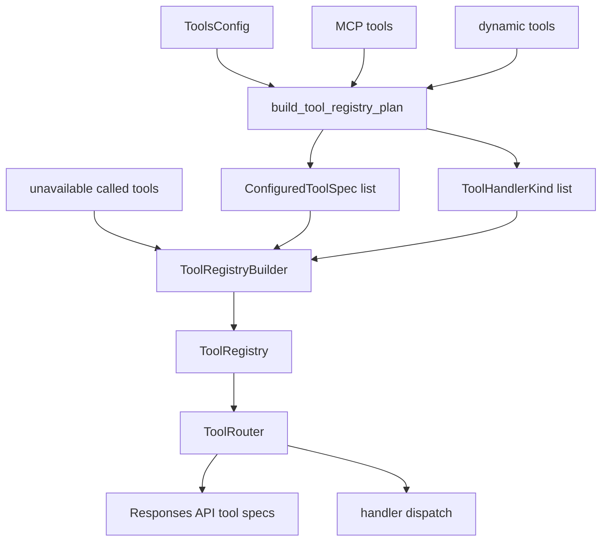
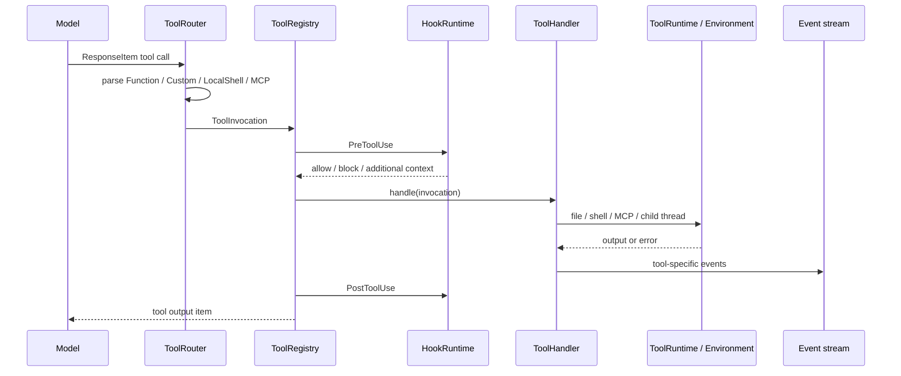
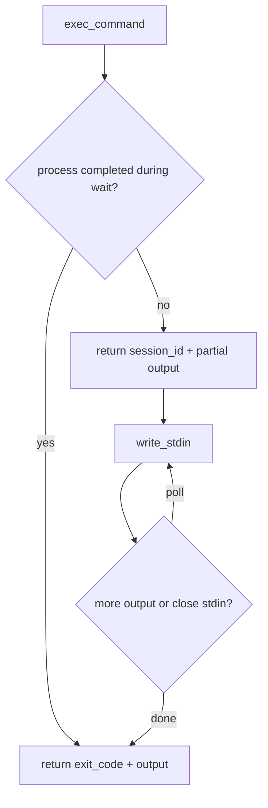
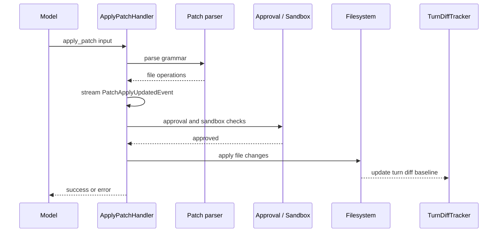
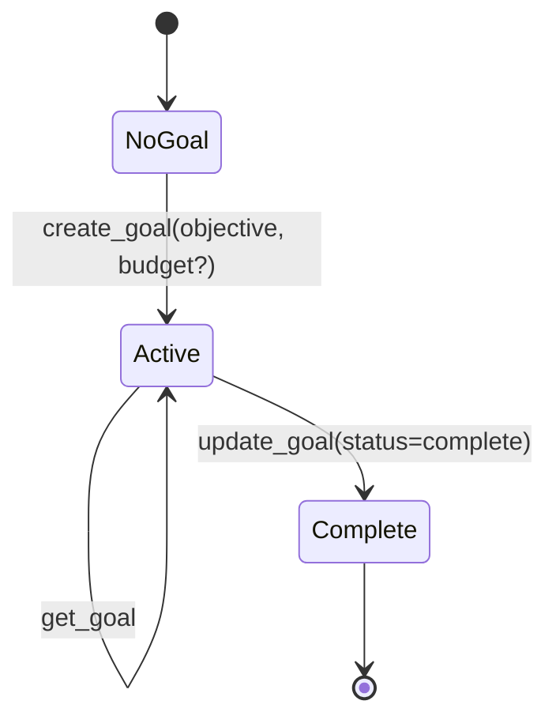
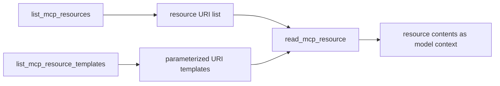
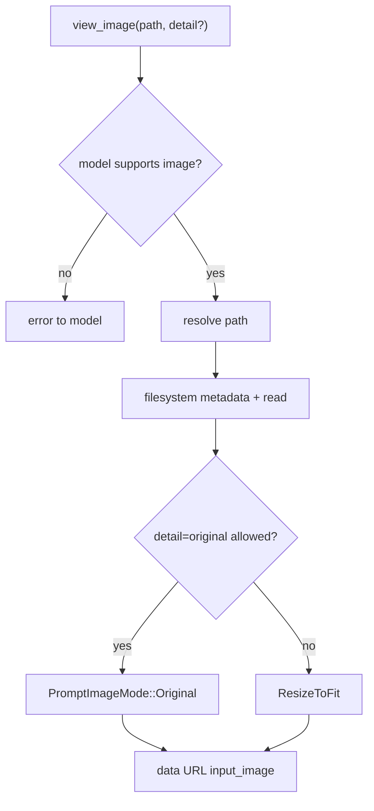
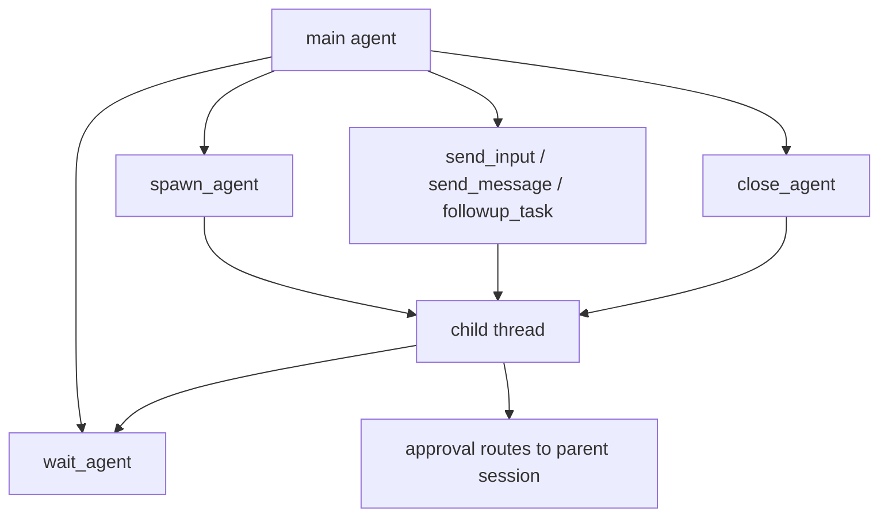

# 19. Codex 工具图鉴：每个 tool 的原理、取舍与对比

## 核心问题

Codex 的工具系统不能只看 `ToolRouter` 和 `ToolOrchestrator`。真正影响使用体验的是每个工具的边界：哪些工具会产生副作用，哪些只是 UI 状态，哪些来自 MCP 或 app connector，哪些只在特定 feature 下出现，哪些是旧协议兼容层。

这一章按 `openai/codex@4f1d5f00f0175e257ddc4a47746453edecb27017` 的源码，把 Codex 当前模型可见工具拆成完整目录，并逐类回答四件事：

| 问题 | 解释 |
|------|------|
| 工具做什么 | 模型为什么需要这个工具 |
| 怎么实现 | tool spec、handler、runtime 和事件路径 |
| 为什么这样设计 | 安全、上下文、可审查性、自动化或多前端需求 |
| 优劣与对比 | 和 Claude Code、Aider、Cursor/Cline/Roo 等公开可见能力的相似点和差异 |

注意边界：其他产品的内部实现未必公开，这里只比较公开文档、可观察行为和常见使用模式，不把闭源工具内部机制写成事实。

## 源码入口

| 路径 | 重点 |
|------|------|
| `codex-rs/tools/src/tool_spec.rs` | `ToolSpec` 类型：function、namespace、tool_search、local_shell、image_generation、web_search、freeform |
| `codex-rs/tools/src/tool_registry_plan.rs` | 按配置生成当前 turn 的工具清单和 handler 映射 |
| `codex-rs/core/src/tools/spec.rs` | 把 plan 转成 `ToolRegistryBuilder`，注册具体 handler |
| `codex-rs/core/src/tools/router.rs` | 把 Responses API 返回的 tool call 转成 `ToolPayload` |
| `codex-rs/core/src/tools/registry.rs` | 调用 handler、hook、输出转换和日志 |
| `codex-rs/core/src/tools/orchestrator.rs` | 审批、sandbox、升级执行和 retry 边界 |
| `codex-rs/core/src/tools/parallel.rs` | 工具并发调度和读写锁 |
| `codex-rs/tools/src/local_tool.rs` | shell / exec / permission 类工具规格 |
| `codex-rs/tools/src/apply_patch_tool.rs` | `apply_patch` freeform 和 JSON 两种规格 |
| `codex-rs/tools/src/agent_tool.rs` | multi-agent v1/v2 工具规格 |
| `codex-rs/tools/src/tool_discovery.rs` | `tool_search` 和 `tool_suggest` |
| `codex-rs/tools/src/mcp_resource_tool.rs` | MCP resource 相关工具 |
| `codex-rs/tools/src/goal_tool.rs` | goal 工具 |
| `codex-rs/tools/src/agent_job_tool.rs` | CSV fan-out agent job 工具 |
| `codex-rs/tools/src/code_mode.rs` | code mode 的 `exec` / `wait` 包装工具 |

推荐阅读顺序：先读 `tool_registry_plan.rs`，因为它回答“哪些工具会被放进当前 turn”；再读 `core/src/tools/spec.rs`，因为它回答“这些工具由哪个 handler 执行”；最后按工具类型读具体 handler。

## 总览：工具不是固定清单

Codex 每一轮的工具清单是动态生成的。`build_tool_registry_plan` 会根据模型、feature flag、shell 类型、environment、MCP、dynamic tools、collab tools、goal tools、request permissions、code mode 等配置决定暴露哪些工具。



这解释了一个常见误解：Codex 不是“内置一张工具表”。同一个 Codex，在不同客户端、不同模型、不同权限和不同配置下，模型看到的工具会变。

| 条件 | 影响 |
|------|------|
| `has_environment` | 决定 shell、apply_patch、view_image、list_dir 等本地环境工具是否可用 |
| `shell_type` | 决定暴露 `shell`、`local_shell`、`exec_command`/`write_stdin`，还是 `shell_command` |
| `apply_patch_tool_type` | 决定 `apply_patch` 是 freeform grammar 还是 JSON function |
| `web_search_mode` | 决定 `web_search` 是 cached、live，还是不暴露 |
| `mcp_tools` / `deferred_mcp_tools` | 决定 MCP 工具直接暴露为 namespace，还是通过 `tool_search` 延迟加载 |
| `collab_tools` / `multi_agent_v2` | 决定多 agent 工具是 v1 还是 v2 |
| `goal_tools` | 决定 `get_goal`、`create_goal`、`update_goal` 是否出现 |
| `code_mode_enabled` | 决定是否用 freeform `exec` 包装一批嵌套工具 |

## 工具分类表

| 类别 | 工具 | 主要作用 |
|------|------|----------|
| shell / process | `shell`、`shell_command`、`local_shell`、`exec_command`、`write_stdin`、code-mode `exec`、code-mode `wait` | 运行命令、读输出、维护长进程 |
| 文件编辑 | `apply_patch` | 结构化编辑文件，生成可审查 diff |
| 计划和任务状态 | `update_plan`、`get_goal`、`create_goal`、`update_goal` | UI 计划、持久目标、预算状态 |
| 权限和交互 | `request_permissions`、`request_user_input` | 请求更大权限或向用户提短问题 |
| MCP 和动态工具 | MCP namespace function、`list_mcp_resources`、`list_mcp_resource_templates`、`read_mcp_resource`、dynamic tools | 连接外部工具和资源 |
| 工具发现 | `tool_search`、`tool_suggest`、unavailable placeholder | 延迟发现工具、建议安装插件或 connector、解释不可用工具 |
| 多模态和外部知识 | `web_search`、`view_image`、`image_generation` | 搜索、读取图片、生成图片 |
| 多 agent | v1: `spawn_agent`、`send_input`、`resume_agent`、`wait_agent`、`close_agent`; v2: `spawn_agent`、`send_message`、`followup_task`、`wait_agent`、`close_agent`、`list_agents` | 受控委托、并行探索、子任务管理 |
| 批量 agent job | `spawn_agents_on_csv`、`report_agent_job_result` | CSV fan-out 并行处理 |
| 实验和测试 | `list_dir`、`test_sync_tool` | 实验性目录列表、集成测试同步 |

## 工具调用生命周期



所有工具最终都要回到模型可消费的 output item。不同工具的 output body 不同：shell 是文本，MCP 是 MCP tool result，`view_image` 是 `input_image` content item，`apply_patch` 有自己的 patch output，code-mode 工具返回 JSON 结构。

## shell / process 工具

### `shell`

`shell` 是旧式 function tool，参数核心是 `command: string[]`、`workdir`、`timeout_ms`。Unix 下说明鼓励使用 `["bash", "-lc", "..."]`，Windows 下用 PowerShell 示例。handler 是 `ShellHandler`，最终进入 shell runtime 和 sandbox/approval 路径。

| 维度 | 说明 |
|------|------|
| 源码规格 | `codex-rs/tools/src/local_tool.rs` 的 `create_shell_tool` |
| handler | `codex-rs/core/src/tools/handlers/shell.rs` |
| runtime | `codex-rs/core/src/tools/runtimes/shell.rs` |
| 并发 | `supports_parallel_tool_calls = true` |
| 主要风险 | 命令有副作用，输出可能过大，平台 shell 语义不同 |

为什么保留 `shell`：它是最直接的命令执行抽象，适合简单命令和旧模型工具格式。缺点是没有 `exec_command` 那样清楚的 PTY/session 语义，对长进程和交互式命令不如 unified exec。

### `shell_command`

`shell_command` 把命令作为字符串交给默认 shell，参数比 `shell` 更接近人类输入。它在 `ConfigShellToolType::ShellCommand` 下暴露，handler 是 `ShellCommandHandler`。

优点是提示模型更简单，缺点是字符串 shell 更容易混入环境差异、quoting 问题和隐式状态。它适合“像终端一样执行一段脚本”，不适合长进程交互。

### `local_shell`

`local_shell` 是 Responses API 的特殊 tool type，不是普通 JSON function。`ToolSpec::LocalShell {}` 序列化成 `{"type":"local_shell"}`，模型返回 `ResponseItem::LocalShellCall` 后由 `ToolRouter` 转成 `ToolPayload::LocalShell`。

| 维度 | 说明 |
|------|------|
| 源码规格 | `codex-rs/tools/src/tool_spec.rs` 的 `ToolSpec::LocalShell` |
| router | `codex-rs/core/src/tools/router.rs` 的 `ResponseItem::LocalShellCall` 分支 |
| handler | 仍注册到 `ShellHandler` |
| 价值 | 更贴近模型原生 shell action，减少 JSON 包装 |
| 代价 | 依赖模型和 API 对 `local_shell` 的支持 |

### `exec_command` 和 `write_stdin`

`exec_command` 是 unified exec 入口，参数包含 `cmd`、`workdir`、`shell`、`tty`、`yield_time_ms`、`max_output_tokens`，返回可能包含 `session_id`。如果进程没有结束，模型再用 `write_stdin` 给同一 session 写入 stdin 或轮询输出。



| 优点 | 代价 |
|------|------|
| 能处理长进程、PTY、增量输出 | 工具状态比一次性 shell 更复杂 |
| 输出有 token 上限和 chunk/session 语义 | 模型需要正确管理 `session_id` |
| 更适合 TUI、app-server、自动化统一展示 | 对简单命令略显重 |

和其他产品对比：Claude Code、Cline/Roo 等也有 shell command 能力，公开可见体验通常是“运行命令、展示输出、必要时询问权限”。Codex 的特殊点在于 `exec_command` 明确建模了长进程 session 和 stdin 写入，适合非交互自动化和 app-server 事件化展示。

### code-mode `exec` 和 `wait`

code mode 会把一批嵌套工具包装进一个 freeform `exec` 工具。模型在 freeform grammar 里写要执行的代码或工具调用，`wait` 用来等待 yielded exec cell。源码入口是 `codex-rs/tools/src/code_mode.rs` 和 `codex-rs/core/src/tools/code_mode/`。

这类设计的价值是让模型在同一个执行模式里调用多个“嵌套工具”，并把工具定义注入到 code-mode prompt。代价是调试复杂度更高，普通读者会看到两层工具：外层 `exec`，内层被包装的 shell、patch、MCP 等。

## 文件编辑工具：`apply_patch`

`apply_patch` 是 Codex 最值得学的工具之一。它有两种规格：

| 类型 | 源码 | 使用场景 |
|------|------|----------|
| freeform grammar | `create_apply_patch_freeform_tool` | GPT-5 类模型，直接输出 patch，不包 JSON |
| JSON function | `create_apply_patch_json_tool` | gpt-oss 等需要 JSON function 的模型 |

`apply_patch` 的核心不是“能改文件”，而是把文件编辑限制在可解析的 patch grammar 里。handler 会解析 patch，构造 diff consumer，支持流式 patch preview，最终通过 runtime 执行并进入审批/sandbox/TurnDiffTracker。



| 优点 | 代价 |
|------|------|
| 可预览、可审批、可按文件聚合 diff | 大改动时 patch 容易写错 |
| 能把编辑从 shell 命令中分离出来 | 对二进制文件和复杂生成物不适合 |
| 便于 TUI/app-server 展示和最终 review | 模型必须学会 patch grammar |

和 Aider 对比：Aider 长期强调 diff/patch 形态和 git commit 工作流，优势是代码编辑体验很聚焦。Codex 的差异是 `apply_patch` 被接进更大的工具 runtime：审批、sandbox、hooks、turn diff、multi frontend 都能复用同一条路径。

和 Claude Code 对比：Claude Code 公开体验里也会展示文件修改和 diff，内部实现未公开。Codex 的可学习点是源码里能看到 patch grammar、handler、runtime 和 turn diff 的完整链路。

## 计划和目标工具

### `update_plan`

`update_plan` 是 UI 状态工具。handler 不改变代码，也不把“计划”当作模型知识库；它解析 `UpdatePlanArgs` 后发出 `EventMsg::PlanUpdate`，让客户端渲染任务清单。

| 维度 | 说明 |
|------|------|
| 源码规格 | `codex-rs/tools/src/plan_tool.rs` |
| handler | `codex-rs/core/src/tools/handlers/plan.rs` |
| 输出 | 固定 “Plan updated” |
| 限制 | Plan mode 下禁止调用，避免计划模式里再维护 checklist |

它的价值是把“进度可见性”做成结构化事件。缺点是它本身不保证任务完成，过度依赖计划工具会制造漂亮但不真实的进度条。

### `get_goal`、`create_goal`、`update_goal`

goal tools 管 persisted thread goal。`create_goal` 只能在明确要求时创建目标；`update_goal` 只暴露 `complete` 状态，不允许模型随便暂停、恢复或改预算。



这套工具的设计偏保守。优点是让长任务有目标和预算状态，缺点是不能当成通用 project manager。和 Claude Code 的 task/todo 体验相比，Codex 把 goal 放到 runtime 状态和 app-server API 里，适合自动继续和后台线程。

## 权限和用户交互工具

### `request_permissions`

`request_permissions` 让模型请求额外文件系统或网络权限。handler 会 normalize additional permissions，拒绝空权限，然后走 `session.request_permissions`，最终由客户端或自动 reviewer 给出响应。

| 优点 | 代价 |
|------|------|
| 权限升级显式、可审计 | 会打断自动化流程 |
| 可以按 turn 或 session scope 生效 | UI 和组织策略要实现完整 |
| 和 sandbox/network proxy 统一 | 模型可能在不该请求时请求，需要策略约束 |

其他产品也常见“要不要运行这个命令”“是否允许编辑文件”的确认流程。Codex 的细节在于权限是工具化的，permission profile 可以被 runtime 归一化，并且后续 shell-like command 自动继承授予结果。

### `request_user_input`

`request_user_input` 让模型向用户问 1 到 3 个短问题，每个问题有 2 到 3 个选项。这个工具不是聊天提问的替代品，而是结构化 UI 输入。它只在特定 collaboration mode 可用。

优点是用户选择更清晰，客户端可以渲染短问题和选项。缺点是不适合复杂讨论，也不适合模型遇到任何不确定都停下来问。

## MCP、动态工具和资源工具

### MCP namespace function tools

当 MCP tools 直接可用时，Codex 会按 namespace 把它们放进 `ToolSpec::Namespace`。每个 MCP tool 转成 Responses API namespace function，handler 是 `McpHandler`。

| 维度 | 说明 |
|------|------|
| 转换入口 | `mcp_tool_to_responses_api_tool` |
| 注册入口 | `tool_registry_plan.rs` 的 namespace_entries |
| handler | `codex-rs/core/src/tools/handlers/mcp.rs` |
| 输出 | `McpToolOutput` 转回 Responses API output item |

MCP 的优势是标准化外部工具接入，适合文档、浏览器、Figma、内部系统、GitHub 等。代价是工具数量会膨胀，schema 质量取决于 MCP server，外部系统还会带来认证、隐私和副作用风险。

### `list_mcp_resources`、`list_mcp_resource_templates`、`read_mcp_resource`

这三个工具不是调用 MCP action，而是读取 MCP resource。官方描述也提醒：资源可以给模型提供文件、数据库 schema 或应用上下文，优先于 web search。



优势是读上下文比乱搜网页更可控，缺点是 resource 也会占上下文，且 URI/template 需要用户或模型正确选择。

### dynamic tools

dynamic tools 来自当前 Codex thread 或 app-server 连接，可能 immediate load，也可能 defer loading。handler 是 `DynamicToolHandler`，执行时会通过 app-server/dynamic tool runtime 回到提供方。

这类工具的价值在于让前端、桌面 app 或 connector 在运行时注入能力。代价是可复现性变弱，因为同一份源码在不同 app 环境里工具集不同。

## 工具发现和建议工具

### `tool_search`

`tool_search` 搜索 deferred MCP tools 和 deferred dynamic tools。它用 BM25 在工具 metadata 上检索，并把匹配工具暴露给下一轮模型。

| 优点 | 代价 |
|------|------|
| 避免把所有工具一次性塞进 prompt | 模型需要先搜索再调用，多一步 |
| 大量 MCP/app 工具时节省上下文 | 搜索 query 写差会漏工具 |
| 能保留工具发现可审计路径 | 工具使用变成两阶段状态 |

和 Cursor、Cline/Roo 的 MCP 工具体验相比，Codex 的 `tool_search` 更强调 deferred tools。工具不是全量可见，而是“需要时搜索并加载”。这是上下文管理层面的取舍。

### `tool_suggest`

`tool_suggest` 用来建议安装或启用缺失 connector/plugin。它只在明确找不到可用工具、且 discoverable tools 中有清晰匹配时使用。

这个工具不是直接完成任务，而是把“能力缺失”转成产品交互。优势是能引导用户安装 connector，缺点是推荐不准会变成干扰。

### unavailable placeholder

当模型调用了当前不可用的工具，Codex 会注册 placeholder，返回错误说明该工具不可用。这个设计比静默失败好，因为模型能得到明确反馈，UI 也能解释为什么调用失败。

## 多模态和外部知识工具

### `web_search`

`web_search` 是 Responses API 特殊工具。`WebSearchMode::Cached` 会设置 `external_web_access=false`，`Live` 会设置 `true`，`Disabled` 时不暴露工具。它还支持 filters、user location、context size，以及部分模型的 text+image search content types。

| 优点 | 代价 |
|------|------|
| 不必通过 shell `curl` 把网页塞进上下文 | 搜索结果仍是不可信输入 |
| cached mode 降低 live web prompt injection 暴露 | 新鲜度不如 live |
| 工具事件能进入 transcript / JSONL | 搜索质量由上游服务决定 |

和 Claude Code、Cursor 等产品的 web search 类能力相比，Codex 的关键是把 cached/live 做成明确配置，并把搜索作为 Responses API tool spec，而不是让模型随意访问网络。

### `view_image`

`view_image` 从本地文件系统读取图片，把它转成 data URL，并作为 `input_image` content item 返回模型。handler 会检查模型是否支持 image input、文件是否存在、是否为文件、是否允许 `detail=original`。



优势是本地截图、UI、设计稿可以进入模型；缺点是图片是上下文成本，且路径和分辨率处理都要谨慎。和 IDE/desktop 的图片拖拽相比，`view_image` 是更底层的本地文件入口。

### `image_generation`

`image_generation` 是特殊 tool spec，输出格式当前设置为 `png`。它更偏产品能力：生成 UI asset、placeholder、图像编辑等。源码里主要是 tool spec 暴露，具体生成能力由模型/API 工具完成。

优势是视觉资产可以在同一条 agent 流程中生成；缺点是成本高、结果需要人工或视觉验证，不适合作为代码逻辑正确性的证明。

## 多 agent 工具

Codex 同时保留 multi-agent v1 和 v2 两套工具规格。选择哪套由 `multi_agent_v2` 配置决定。

### v1 工具

| 工具 | 作用 |
|------|------|
| `spawn_agent` | 创建子 agent |
| `send_input` | 向已有 agent 发送消息，可 interrupt |
| `resume_agent` | 恢复已关闭 agent |
| `wait_agent` | 等待 agent 进入 final status |
| `close_agent` | 关闭 agent 和子孙 agent |

### v2 工具

| 工具 | 作用 |
|------|------|
| `spawn_agent` | 创建带 task name 的子 agent |
| `send_message` | 给 agent mailbox 发消息，不触发新 turn |
| `followup_task` | 给非 root agent 发消息并触发 turn |
| `wait_agent` | 等 mailbox update，而不是直接返回完整内容 |
| `close_agent` | 关闭 agent |
| `list_agents` | 列出当前 root thread tree 里的 live agents |



为什么这样设计：子 agent 是工具，不是默认并发策略。它继承父 session 的服务和安全边界，审批回到父 session。这样能并行探索，又不会让子 agent 绕过权限。

和 Claude Code 的 subagents 对比：公开文档层面两者都强调把探索、审查、分工任务移到子 agent。Codex 的可学习点是源码里能看到 `codex_delegate.rs`、父 session 审批桥接和 v1/v2 工具演进。

## 批量 agent job 工具

`spawn_agents_on_csv` 根据 CSV 每一行启动一个 worker sub-agent；worker 必须调用 `report_agent_job_result` 报告结果。适合批量审计、逐文件检查、逐服务迁移评估。

| 优点 | 代价 |
|------|------|
| 把重复任务并行化 | token 和并发成本高 |
| CSV 输入/输出适合批处理 | 每个 worker 都要正确报告 |
| 可设置 max_concurrency 和 runtime | 错误聚合和重试语义更复杂 |

普通多 agent 适合少量复杂分工，CSV fan-out 适合大量同构任务。这个区别值得保留。

## 实验和测试工具

### `list_dir`

`list_dir` 是 experimental supported tool，列目录条目，支持 offset、limit、depth。它和 shell `ls` 的区别是结构更固定，不需要 shell。优点是安全和解析更可控，缺点是功能不如系统命令灵活。

### `test_sync_tool`

`test_sync_tool` 是集成测试同步工具，用 sleep 和 barrier 验证并发行为。它不是面向用户的产品工具。文档里保留它，是为了说明工具清单里会有测试和实验能力，不能把所有工具都当成稳定产品功能。

## 与其他产品的工具对比

| 能力 | Codex | Claude Code | Aider | Cursor / Cline / Roo |
|------|-------|-------------|-------|----------------------|
| shell 命令 | 多形态：`shell`、`local_shell`、`exec_command`、code-mode `exec` | 公开体验有命令执行和权限确认，内部实现未公开 | 可运行命令，常和 git/test 流程结合 | IDE/extension 中常见终端命令执行 |
| 文件编辑 | `apply_patch` grammar + handler + turn diff | 公开体验有 diff 和文件修改，内部编辑机制未公开 | 强调 patch/diff 和 git commit | IDE diff/edit flow，通常贴近编辑器 |
| 权限 | `request_permissions` + approval + sandbox + network proxy | 公开体验有权限确认 | 通常依赖用户配置和 git 工作流 | 常见用户确认和 workspace 限制 |
| 工具扩展 | MCP、dynamic tools、plugins、apps、tool_search | MCP 和插件生态公开可见 | provider/model/command 集成较强 | MCP/extension/plugin 生态因产品不同而异 |
| 计划状态 | `update_plan` 事件工具 | 公开体验有 todo/plan 类展示 | 更偏对话和编辑状态 | IDE agent 常有 task list |
| 子 agent | v1/v2 工具 + parent approval | 公开文档有 subagents | 不是核心形态 | 部分产品有多 agent 或 mode |
| 长任务目标 | goal tools + app-server goal API | 公开体验有长任务和继续能力 | 偏命令行会话 | IDE/background task 因产品而异 |
| 工具发现 | `tool_search` / `tool_suggest` | 公开生态中有 MCP/tool 管理 | 工具集合更静态 | 插件/connector 搜索取决于产品 |

这张表的重点不是评出强弱，而是看产品假设。Aider 更像“代码编辑和 git 工作流专家”；Cursor/Cline/Roo 更贴近 IDE 和插件工具链；Claude Code 的公开体验强调终端 agent 和子 agent；Codex 的开源 runtime 展示了工具如何被 protocol、registry、approval、sandbox、MCP、app-server 和多 agent 统一起来。

## 逐工具取舍总结

| 工具 | 最值得学的点 | 不适合照搬的地方 |
|------|--------------|------------------|
| `exec_command` / `write_stdin` | 长进程 session 和增量输出 | 小 agent 可先用一次性 shell |
| `apply_patch` | 编辑可解析、可预览、可审批 | patch grammar 对模型要求高 |
| `update_plan` | UI 状态工具不混进业务逻辑 | 计划不等于完成 |
| `request_permissions` | 权限升级工具化 | 没有 sandbox 时价值有限 |
| `request_user_input` | 结构化短问题 | 不适合复杂需求澄清 |
| MCP tools | 外部工具标准化 | 工具过多会污染上下文 |
| MCP resources | 上下文来源可枚举 | resource 也有 token 成本 |
| `tool_search` | deferred tools 降低上下文压力 | 搜索失败会隐藏可用能力 |
| `tool_suggest` | 能力缺失变成产品交互 | 推荐不准会打扰用户 |
| `web_search` | cached/live 边界清晰 | 搜索结果仍需不信任处理 |
| `view_image` | 图片作为 tool output 回模型 | 多模态模型和成本依赖强 |
| `spawn_agent` 系列 | 子 agent 受父 session 控制 | 并行会放大成本和冲突 |
| `spawn_agents_on_csv` | 批量同构任务自动化 | 只适合可分片、可结构化结果 |
| `list_dir` | 结构化替代简单 shell | 实验能力，不应当作核心稳定 API |

## 如果自己做 Agent，可以学什么

一个实用实现顺序如下：

1. 先做 `shell`，但必须有 cwd、timeout、output limit。
2. 再做结构化编辑工具，最好不要让模型随意 `cat > file`。
3. 把审批和 sandbox 放到工具执行路径，而不是放在 UI 提示里。
4. 做一个 `update_plan` 类 UI 状态工具，让长任务可见。
5. 接 MCP 或 plugin 前，先设计工具 registry 和 namespace。
6. 工具数量变多后，再做 `tool_search` 这样的延迟发现。
7. 多 agent 只在明确分工时启用，并要求写入范围和所有权。
8. 对外部知识和图片工具保持不信任边界。

Codex 的工具系统值得读，不是因为工具数量多，而是因为每种工具都被放进同一条可审计路径：spec、router、handler、runtime、event、approval、sandbox、output。这个统一性比单个工具本身更重要。

## 验证命令

```bash
# 枚举工具规格入口
rg -n "pub fn create_.*tool|ToolSpec::LocalShell|ToolSpec::ImageGeneration|ToolSpec::WebSearch|ToolSpec::ToolSearch" codex-rs/tools/src

# 看当前 turn 如何生成工具清单
rg -n "build_tool_registry_plan|register_handler|push_spec" codex-rs/tools/src/tool_registry_plan.rs codex-rs/core/src/tools/spec.rs

# 查 shell / exec 工具
rg -n "create_exec_command_tool|create_write_stdin_tool|create_shell_tool|create_shell_command_tool|create_local_shell_tool" codex-rs/tools/src
rg -n "ShellHandler|UnifiedExecHandler|ShellCommandHandler" codex-rs/core/src/tools

# 查 apply_patch
rg -n "create_apply_patch|ApplyPatchHandler|ApplyPatchRuntime|TurnDiffTracker" codex-rs/tools/src codex-rs/core/src

# 查 MCP / dynamic / discovery
rg -n "create_tool_search_tool|create_tool_suggest_tool|McpHandler|DynamicToolHandler|McpResourceHandler" codex-rs/tools/src codex-rs/core/src/tools

# 查多 agent 和 agent job
rg -n "create_spawn_agent|create_wait_agent|spawn_agents_on_csv|report_agent_job_result" codex-rs/tools/src codex-rs/core/src/tools
```

## current main 工具图鉴补充

当前快照里，工具规格相关源码主要集中在 `codex-rs/tools/src/`，runtime 侧集中在 `codex-rs/core/src/tools/`。读工具时要同时看模型看到什么和实际谁执行。

| 工具族 | spec 入口 | runtime/handler 入口 |
|--------|-----------|----------------------|
| shell / exec | `codex-rs/tools/src/local_tool.rs` | `codex-rs/core/src/tools/handlers/`、`codex-rs/core/src/unified_exec/` |
| apply_patch | `codex-rs/tools/src/apply_patch_tool.rs`、`codex-rs/tools/src/tool_apply_patch.lark` | `codex-rs/core/src/tools/runtimes/apply_patch.rs` |
| MCP | `codex-rs/tools/src/mcp_tool.rs`、`codex-rs/tools/src/mcp_resource_tool.rs` | `codex-rs/core/src/mcp_tool_call.rs`、`codex-rs/core/src/tools/handlers/` |
| dynamic tools | `codex-rs/tools/src/dynamic_tool.rs` | `codex-rs/core/src/tools/handlers/dynamic.rs` |
| tool_search | `codex-rs/tools/src/tool_discovery.rs` | `codex-rs/core/src/tools/handlers/tool_search.rs` |
| plan/goals | `codex-rs/tools/src/plan_tool.rs`、`codex-rs/tools/src/goal_tool.rs` | `codex-rs/core/src/goals.rs` |
| agents | `codex-rs/tools/src/agent_tool.rs`、`codex-rs/tools/src/agent_job_tool.rs` | `codex-rs/core/src/tools/handlers/multi_agents.rs`、`codex-rs/core/src/tools/handlers/multi_agents_v2.rs`、`codex-rs/core/src/tools/handlers/multi_agents_common.rs`、`codex-rs/core/src/codex_delegate.rs` |

## 逐工具评价模板

后续维护工具图鉴时，每个工具按同一套模板写，避免变成清单。

| 字段 | 要回答的问题 |
|------|--------------|
| 做什么 | 模型为什么需要它 |
| 怎么暴露 | function、namespace、freeform、local_shell、tool_search 还是 dynamic |
| 怎么执行 | handler、runtime、approval、sandbox、hook 如何接入 |
| 失败路径 | 参数错、权限拒绝、输出过大、进程未结束、MCP 错误如何反馈 |
| 设计取舍 | 为什么不用更简单的工具形态 |
| 竞品对比 | 只比较公开可见行为，不推断闭源内部 |

## shell 工具族的细分价值

| 工具 | 适合场景 | 不适合场景 |
|------|----------|------------|
| `shell` | 旧式 JSON command array、简单命令 | 长进程和交互 |
| `shell_command` | 接近人类输入的一段 shell 字符串 | 需要精确 argv 控制时 |
| `local_shell` | 模型/API 原生 local shell action | 不支持该 tool type 的模型 |
| `exec_command` | 长进程、PTY、增量输出、session id | 极简单一次性命令略重 |
| `write_stdin` | 给未结束进程输入或轮询 | 没有 session 的命令 |

这类细分解释了 Codex 为什么不是只有一个 `run_command`。终端 agent 面对的不是单次命令，而是测试服务器、watcher、交互式命令、长输出、超时和分块读取。

## 工具图鉴的判断边界

工具优劣不能只看能不能完成任务。还要看 prompt 成本、安全边界、UI 展示、可恢复性和自动化语义。

| 维度 | 好工具的表现 |
|------|--------------|
| prompt 成本 | schema 不该无节制膨胀，必要时走 tool_search |
| 安全 | 能在执行前表达副作用范围 |
| 可审查 | 输出和 diff 能被 UI 展示 |
| 可恢复 | 结果能进入 history/rollout，resume 后仍可解释 |
| 自动化 | headless 模式下不会卡死在不明确交互里 |

## 每类工具的优劣总表

| 工具族 | 优点 | 代价 | 适合照抄到最小 agent 吗 |
|--------|------|------|--------------------------|
| shell / exec | 覆盖面最大，能跑测试和构建 | 安全风险最高，输出和长进程复杂 | 需要，但先做最小安全线 |
| apply_patch | 可审查、可审批、diff 清晰 | grammar 失败和大改动不友好 | 很适合，先简化实现 |
| MCP | 扩展能力强，生态友好 | server 信任、schema 膨胀、认证复杂 | v0.3 以后再做 |
| dynamic tools | 能让前端和 connector 提供能力 | 调试和权限边界更复杂 | 不适合 v0.1 |
| tool_search | 降低 prompt 成本 | 模型需要先搜索再调用 | 工具很多时再做 |
| plan/goals | 改善长任务可见性和继续能力 | 容易变成 UI 状态和真实状态不一致 | plan 可以早做，goals 晚做 |
| subagents | 适合并行探索和验证 | 权限、冲突、成本、事件桥接复杂 | 不适合第一版 |
| web/image | 增强外部知识和多模态 | prompt injection、版权、成本、渲染风险 | 按产品需求加 |

## 和 Claude Code、Aider、Cline/Roo 的公开对比

| 维度 | Codex | 其他产品公开可见行为 |
|------|-------|----------------------|
| 文件编辑 | `apply_patch` grammar、turn diff、approval 路径可源码核对 | Aider 强调 diff/patch；Claude Code、Cline/Roo 会展示文件编辑和 diff |
| shell | unified exec、session id、stdin 写入、sandbox/approval | 多数工具支持 shell，但长进程和权限语义各不相同 |
| MCP | MCP client 和 experimental MCP server 都在源码/文档里 | Claude Code、Cline/Roo 等也公开支持 MCP |
| tool lazy loading | `tool_search` 和 deferred MCP/dynamic tools | 其他产品也有工具/技能发现，但内部机制不能直接推断 |
| subagents | 作为受控工具进入父 session | Claude Code 公开有 subagent/agent 能力，内部边界不作为 Codex 事实 |

这张表的目的不是排名，而是定位可学习点。Codex 的优势是很多工具边界能直接读源码，适合研究生产级 agent runtime。

## 维护工具图鉴的核对清单

新增工具或更新工具章节时，至少跑这些检查：

```bash
rg -n "create_.*tool" codex-rs/tools/src
rg -n "ToolHandlerKind|register_handler" codex-rs/tools/src/tool_registry_plan.rs codex-rs/core/src/tools/spec.rs
rg -n "tool_supports_parallel|supports_parallel_tool_calls" codex-rs/core/src/tools codex-rs/tools/src
rg -n "run_pre_tool_use_hooks|run_post_tool_use_hooks" codex-rs/core/src/hook_runtime.rs
```

然后回答四个问题：模型是否能看到这个工具；runtime 是否有 handler；这个工具是否能产生副作用；失败时模型和用户分别看到什么。
