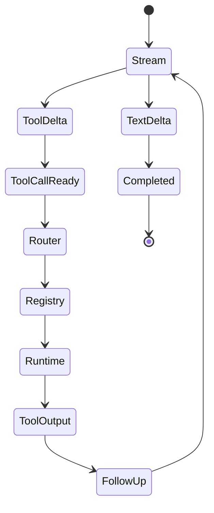

# 20. 源码走读工作簿：把 Codex 当成 Agent 工程课来读

这一章不是新机制，而是一组可执行的读源码练习。前面章节解释 Codex 怎么设计，这一章把读法拆成任务：每个练习都有目标、入口、阅读顺序、检查点和产出。适合边打开 `openai/codex@4f1d5f00f0175e257ddc4a47746453edecb27017` 边读。

## 使用方式

每个练习按同一套节奏做：

1. 先读目标和问题，不急着打开所有文件。
2. 用给出的 `rg` 命令定位入口。
3. 只沿着调用链读，不展开无关模块。
4. 读完写一个 5 行总结：输入是什么，输出是什么，中间状态在哪里，失败怎么处理，设计取舍是什么。


## 练习 1：一条用户输入如何进入模型

### 目标

读懂 `Submission -> Op::UserTurn -> RegularTask -> run_turn`。这个练习是所有后续阅读的基础。

### 入口命令

```bash
rg -n "pub\\(super\\) async fn submission_loop|pub async fn user_input_or_turn|struct RegularTask|pub\\(crate\\) async fn run_turn" codex-rs/core/src
rg -n "pub struct Submission|pub enum Op|UserTurn" codex-rs/protocol/src/protocol.rs
```

### 阅读顺序

| 顺序 | 文件 | 检查点 |
|------|------|--------|
| 1 | `codex-rs/protocol/src/protocol.rs` | `Submission` 和 `Op::UserTurn` 带了哪些字段 |
| 2 | `codex-rs/core/src/session/handlers.rs` | `submission_loop` 怎么分发 `Op` |
| 3 | `codex-rs/core/src/tasks/regular.rs` | 普通用户输入为什么先进入 task |
| 4 | `codex-rs/core/src/session/turn.rs` | `run_turn` 前半段做了哪些模型前准备 |

### 要写下来的结论

| 问题 | 读完后应该能回答 |
|------|------------------|
| 为什么 Codex 不让 UI 直接调用模型 | 因为 UI 只提交协议消息，核心用 task 管生命周期 |
| 为什么 `UserTurn` 字段很多 | 每轮模型请求都可能换 cwd、权限、sandbox、model、context |
| 为什么 task 层存在 | 中断、pending input、review、compact 都要共享生命周期 |

## 练习 2：模型输出如何变成工具调用

### 目标

读懂模型 stream、tool call 收集和工具分发之间的边界。

### 入口命令

```bash
rg -n "async fn run_sampling_request|async fn try_run_sampling_request|build_tool_call|ToolRouter" codex-rs/core/src/session/turn.rs codex-rs/core/src/tools/router.rs
rg -n "pub struct ToolRouter|tool_supports_parallel|ResponseItem::" codex-rs/core/src/tools/router.rs
```

### 阅读顺序

| 顺序 | 文件 | 检查点 |
|------|------|--------|
| 1 | `codex-rs/core/src/session/turn.rs` | `run_sampling_request` 和 `try_run_sampling_request` 怎么分工 |
| 2 | `codex-rs/core/src/tools/router.rs` | 不同 Responses item 怎么变成 `ToolCall` |
| 3 | `codex-rs/core/src/tools/registry.rs` | handler 如何被调用 |
| 4 | `codex-rs/core/src/tools/parallel.rs` | 哪些工具可以并行 |

### 状态图



### 要写下来的结论

| 问题 | 读完后应该能回答 |
|------|------------------|
| `ToolRouter` 为什么不直接执行工具 | 它只负责把模型语言转成内部调用 |
| 并行工具调用为什么要单独模块 | 读写副作用不同，不能只看模型并发意愿 |
| 工具输出为什么回 history | 模型下一轮只能通过 history 观察工具结果 |

## 练习 3：工具清单为什么不是固定表

### 目标

读懂 `build_tool_registry_plan` 如何按环境生成工具列表。

### 入口命令

```bash
rg -n "pub fn build_tool_registry_plan|ToolRegistryPlanParams|register_handler|push_spec" codex-rs/tools/src/tool_registry_plan.rs
rg -n "fn build_tool_registry|ToolRegistryBuilder|DynamicToolHandler|ToolSearchHandler" codex-rs/core/src/tools/spec.rs
```

### 阅读顺序

| 顺序 | 文件 | 检查点 |
|------|------|--------|
| 1 | `codex-rs/tools/src/tool_config.rs` | `ToolsConfig` 从哪些输入生成 |
| 2 | `codex-rs/tools/src/tool_registry_plan.rs` | 哪些工具受 config/model/feature 影响 |
| 3 | `codex-rs/core/src/tools/spec.rs` | spec 和 handler 如何绑定 |
| 4 | `codex-rs/core/src/tools/tool_search_entry.rs` | deferred MCP/dynamic tools 怎么进入 search |

### 输出表

读完后自己填这张表。

| 工具 | 什么条件下出现 | handler 是什么 | 是否有副作用 |
|------|----------------|----------------|--------------|
| `apply_patch` |  |  |  |
| `exec_command` |  |  |  |
| `tool_search` |  |  |  |
| MCP namespace |  |  |  |
| `spawn_agent` |  |  |  |

## 练习 4：apply_patch 为什么比 shell 写文件更可控

### 目标

读懂 patch grammar、runtime apply、路径审批和 turn diff。

### 入口命令

```bash
rg -n "create_apply_patch|tool_apply_patch.lark" codex-rs/tools/src
rg -n "apply_patch|TurnDiffTracker|PatchApply" codex-rs/core/src codex-rs/protocol/src
```

### 阅读顺序

| 顺序 | 文件 | 检查点 |
|------|------|--------|
| 1 | `codex-rs/tools/src/apply_patch_tool.rs` | freeform 和 JSON 工具规格 |
| 2 | `codex-rs/tools/src/tool_apply_patch.lark` | patch grammar 限制了什么 |
| 3 | `codex-rs/core/src/tools/runtimes/apply_patch.rs` | runtime apply 的前置假设 |
| 4 | `codex-rs/core/src/turn_diff_tracker.rs` | 最终 diff 怎么从文件系统事实计算 |

### 对比练习

把下面三种编辑方式各写一个风险：

| 方式 | 风险 |
|------|------|
| `sed -i` 或 shell 重写 |  |
| 全文件覆盖 |  |
| `apply_patch` |  |

目标不是证明 patch 永远最好，而是看清 Codex 为什么把常规文本编辑放在结构化工具里。

## 练习 5：安全链路如何串起来

### 目标

读懂工具执行前后的安全边界：hook、approval、Guardian、sandbox、network policy。

### 入口命令

```bash
rg -n "run_pre_tool_use_hooks|run_permission_request_hooks|run_post_tool_use_hooks" codex-rs/core/src/hook_runtime.rs
rg -n "approval|Guardian|sandbox|network_policy" codex-rs/core/src codex-rs/sandboxing codex-rs/network-proxy
```

### 阅读顺序

| 顺序 | 文件 | 检查点 |
|------|------|--------|
| 1 | `codex-rs/core/src/hook_runtime.rs` | hook 在工具前后如何运行 |
| 2 | `codex-rs/hooks/src/engine/output_parser.rs` | hook 输出怎么 fail closed |
| 3 | `codex-rs/core/src/tools/orchestrator.rs` | approval 和 sandbox 如何编排 |
| 4 | `codex-rs/core/src/tools/sandboxing.rs` | sandbox 参数如何生成 |
| 5 | `codex-rs/core/src/tools/network_approval.rs` | 网络审批如何接工具执行 |

### 要画的图

自己画一张工具执行图，必须包含这几个节点：`PreToolUse`、approval policy、Guardian、sandbox、runtime、`PostToolUse`、tool output。

## 练习 6：上下文为什么要有 baseline

### 目标

读懂 `reference_context_item`，这是理解 Codex context 和 compaction 的关键。

### 入口命令

```bash
rg -n "reference_context_item|record_context_updates_and_set_reference_context_item|build_settings_update_items" codex-rs/core/src/session codex-rs/core/src/context_manager
rg -n "ContextualUserFragment|environment_context|permissions_instructions|skill_instructions" codex-rs/core/src/context
```

### 阅读顺序

| 顺序 | 文件 | 检查点 |
|------|------|--------|
| 1 | `codex-rs/core/src/session/turn_context.rs` | turn context 包含哪些环境信息 |
| 2 | `codex-rs/core/src/context/` | 哪些 fragment 会进入模型输入 |
| 3 | `codex-rs/core/src/session/mod.rs` | reference context 如何设置 |
| 4 | `codex-rs/core/src/session/tests.rs` | baseline 缺失、compact 后重注入如何测试 |

### 关键问题

| 问题 | 答案应该包含 |
|------|--------------|
| 为什么不能每轮都全量注入 | prompt 成本、缓存稳定性、重复上下文 |
| 为什么不能只注入一次 | cwd、权限、skills、plugins、hooks 可能变化 |
| compact 后为什么要重注入 | replacement history 可能吃掉之前的 developer/context messages |

## 练习 7：压缩如何保持任务继续

### 目标

读懂 pre-turn compact、mid-turn compact、remote compact 和 replacement history。

### 入口命令

```bash
rg -n "run_pre_sampling_compact|auto_compact|InitialContextInjection" codex-rs/core/src/session/turn.rs codex-rs/core/src/compact.rs
rg -n "process_compacted_history|replace_compacted_history|RolloutItem::Compacted" codex-rs/core/src
```

### 阅读顺序

| 顺序 | 文件 | 检查点 |
|------|------|--------|
| 1 | `codex-rs/core/src/session/turn.rs` | pre-turn 和 mid-turn 触发点 |
| 2 | `codex-rs/core/src/compact.rs` | inline compact 生成 replacement history |
| 3 | `codex-rs/core/src/compact_remote.rs` | remote compact 返回后如何过滤 |
| 4 | `codex-rs/core/src/session/rollout_reconstruction.rs` | resume 时 compact history 如何重建 |

### 读完后的判断题

| 判断 | 对还是错 | 原因 |
|------|----------|------|
| compact 只是把旧对话总结成一条 assistant 消息 |  |  |
| mid-turn compact 要特别处理最后用户消息位置 |  |  |
| remote compact 输出可以直接替换本地 history |  |  |
| rollout 记录 compact 是为了恢复和审计 |  |  |

## 练习 8：memory pipeline 和 compact 的区别

### 目标

读懂 memory phase1/phase2，不把长期记忆和当前线程压缩混在一起。

### 入口命令

```bash
sed -n '1,220p' codex-rs/core/src/memories/README.md
rg -n "phase1|phase2|consolidation|stage_one|selected_for_phase2" codex-rs/core/src/memories codex-rs/core/templates/memories
```

### 输出表

| 机制 | 何时运行 | 输入 | 输出 | 是否服务当前 turn |
|------|----------|------|------|-------------------|
| compact |  |  |  |  |
| memory phase 1 |  |  |  |  |
| memory phase 2 |  |  |  |  |

## 练习 9：多 agent 是怎么被限制住的

### 目标

读懂 `spawn_agent` 为什么是受控工具，而不是无限递归的 agent swarm。

### 入口命令

```bash
rg -n "spawn_agent|depth|approval_policy|sandbox|fork_context" codex-rs/core/src/tools/handlers codex-rs/core/src/codex_delegate.rs codex-rs/tools/src/agent_tool.rs
find codex-rs/core/src/agent -maxdepth 1 -type f -print
```

### 阅读顺序

| 顺序 | 文件 | 检查点 |
|------|------|--------|
| 1 | `codex-rs/tools/src/agent_tool.rs` | 模型看到的工具 schema |
| 2 | `codex-rs/core/src/tools/handlers/multi_agents_common.rs` | 子 agent 配置如何继承和限制 |
| 3 | `codex-rs/core/src/codex_delegate.rs` | 子 thread 如何跑、事件如何桥接 |
| 4 | `codex-rs/core/src/agent/` | registry、mailbox、role、status 如何拆分 |

## 练习 10：把读源码变成自己的设计

读完前面练习后，写一个最小 agent 设计。不要超过 2 页，必须包含：

| 部分 | 要写什么 |
|------|----------|
| 协议 | 输入和输出事件有哪些 |
| loop | 一轮模型调用如何继续到下一轮 |
| 工具 | 工具 spec、handler、审批怎么分开 |
| 安全 | shell 和文件编辑最低边界 |
| 上下文 | 项目规则、环境、history 怎么进模型 |
| 压缩 | 超窗时先怎么处理 |
| 恢复 | 事件日志如何支持 resume |

如果这 2 页写不清楚，继续读 02、03、04、05、06、17。读 Codex 最有价值的结果，不是记住所有文件名，而是能把这些边界迁移到自己的 agent 里。
