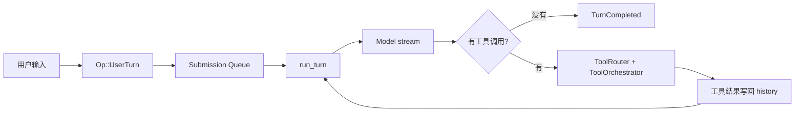
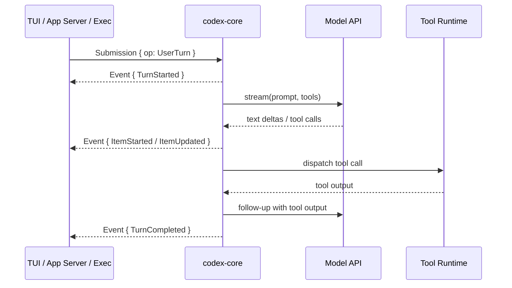
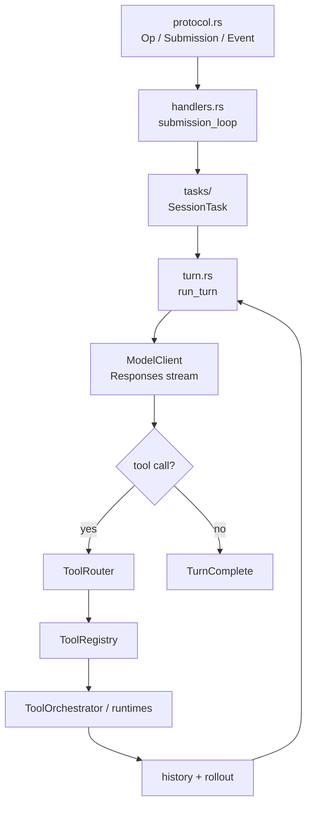
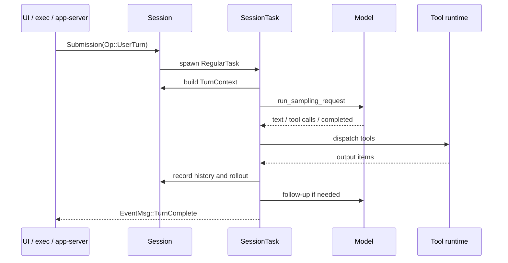

# 10 分钟读懂 Codex CLI

这篇是全项目的压缩版。读完以后，你应该能知道 Codex 的主线在哪，源码从哪里开始读，以及它和一个简单 tool-use agent 的差别在哪里。

## 核心问题

如果只用 10 分钟看 Codex，最该抓住哪条线？答案是：Codex 不是一个直接调用模型的 CLI，而是一个围绕协议队列、agent loop、工具运行时和安全边界组织起来的本地 runtime。

## Codex 的一句话模型

Codex 是一个本地 agent runtime。它把用户输入变成 `Op`，送进 `Submission` 队列；核心循环调用模型，模型返回文本或工具调用；工具执行结果写回历史；如果还需要模型继续判断，就进入下一轮。



## 源码入口

- `codex-rs/protocol/src/protocol.rs`：`Op`、`Submission`、`Event`
- `codex-rs/core/src/session/mod.rs`：`Codex` 和 `Session`
- `codex-rs/core/src/session/handlers.rs`：`submission_loop`
- `codex-rs/core/src/session/turn.rs`：`run_turn`
- `codex-rs/core/src/tools/`：工具运行时

## 它不是一个单文件 while loop

最小 agent 可以写成这样：

```text
history.push(user_message)
loop:
  response = model(history, tools)
  history.push(response)
  if no tool call:
    break
  result = run_tool(response.tool_call)
  history.push(result)
```

Codex 仍然是这个结构，但它把每个环节都拆成了可替换的工程模块。

| 最小 agent | Codex 里的对应模块 |
|------------|-------------------|
| user message | `Op::UserTurn` / `UserInput` |
| model call | `ModelClient` / `ModelClientSession` |
| tool list | `ToolRouter` 构建工具规格 |
| tool execution | `ToolRegistry` + `ToolOrchestrator` |
| history | `ContextManager` / rollout / state |
| UI events | `Event` / `EventMsg` |
| safety | approval policy / Guardian / sandbox |

这个拆分让 Codex 不只能跑在 TUI 里，也能跑在 `codex exec`、app-server、实验性 MCP server 和桌面应用背后。

## Rust workspace 是第一张地图

`codex-rs/Cargo.toml` 是阅读 Codex 的第一张地图。关键 crate 可以先按职责分成四组。

| 分组 | 关键 crate | 作用 |
|------|------------|------|
| 核心运行时 | `core`、`protocol`、`rollout`、`state` | agent loop、协议、会话记录、状态 |
| 用户入口 | `cli`、`tui`、`exec`、`app-server` | 终端、非交互、JSON-RPC、多前端 |
| 工具与安全 | `tools`、`exec`、`sandboxing`、`linux-sandbox`、`network-proxy` | 工具定义、命令执行、沙箱、网络控制 |
| 扩展 | `codex-mcp`、`mcp-server`、`skills`、`plugin`、`hooks` | MCP、技能、插件、生命周期扩展 |

如果只想快速读懂主线，可以先忽略大部分 utility crate，从 `protocol -> core/session -> core/tools -> cli/exec/app-server` 这条线走。

## Queue-pair 是核心边界

Codex 的协议文件写得很直接：它使用 Submission Queue / Event Queue 模式。外部把 `Submission` 送进去，核心把 `Event` 发出来。这个边界很重要，因为 UI 不需要知道模型循环里的细节，核心也不需要知道自己面对的是 TUI、桌面应用还是 headless runner。



## 工具系统有两层责任

`ToolRouter` 解决找谁执行的问题：模型返回一个 tool call，router 把它转换成内部 `ToolCall`，找到对应 handler。

`ToolOrchestrator` 解决能不能执行和怎么执行的问题：审批、hook、沙箱选择、失败后是否升级权限，都在这一层附近发生。这样 shell、apply_patch、MCP 工具和动态工具可以共享同一套安全管道。

## 安全不是一个开关

Codex 的安全不是只弹一个确认框。它至少有几层：

- `AskForApproval` 决定默认审批策略
- exec policy 和命令分析判断某些调用是否允许
- Guardian 可以作为自动 reviewer 参与审批
- sandboxing crate 选择平台沙箱
- `core/src/exec.rs` 把命令变成可执行请求并收集输出
- network proxy 可以把网络访问纳入策略控制

这个设计的核心不是绝对安全，而是把风险放到多个互相独立的边界上。

## 设计取舍

Codex 用更多类型和模块换来更清楚的运行边界。`Submission` / `Event` 让 UI 和核心解耦，`ToolRouter` / `ToolOrchestrator` 让工具暴露和工具执行分开，sandbox 和审批则把模型输出拦在真实副作用之前。

代价也很明显：源码入口变多，初读时不如一个 demo loop 直接。读 Codex 最好的方式不是从每个 crate 的细节开始，而是先跟住一次用户输入如何穿过协议、session、模型流和工具系统。

## 最短阅读路线

1. 看 `codex-rs/README.md`，确认 crate 分层。
2. 看 `codex-rs/protocol/src/protocol.rs`，理解 `Op` 和 `Event`。
3. 看 `codex-rs/core/src/session/handlers.rs` 的 `submission_loop`。
4. 看 `codex-rs/core/src/session/turn.rs` 的 `run_turn`。
5. 看 `codex-rs/core/src/tools/router.rs` 和 `registry.rs`。
6. 看 `codex-rs/core/src/exec.rs` 和 `codex-rs/sandboxing/`。

读到这里，Codex 的骨架基本就立住了。

## 如果自己做 Agent，可以学什么

先把输入输出协议、模型循环、工具运行时和安全策略分开。哪怕第一版只有 CLI，也不要让 UI 直接持有所有 agent 状态。这个边界一旦立住，后面接 TUI、HTTP、MCP 或桌面应用时，核心 loop 不需要重写。

## 10 分钟读源码时抓哪几个断点

Codex 的源码很大，快速读时不要从 crate 数量开始，也不要先看 TUI。最短路径是抓住四个断点，每个断点都能回答一个工程问题。

| 断点 | 问题 | 入口 |
|------|------|------|
| 协议断点 | 外部输入怎么进入核心 | `codex-rs/protocol/src/protocol.rs` |
| 任务断点 | 一次用户请求如何变成可中断任务 | `codex-rs/core/src/session/handlers.rs`、`codex-rs/core/src/tasks/` |
| 采样断点 | 模型流、工具调用、follow-up 怎么循环 | `codex-rs/core/src/session/turn.rs` |
| 副作用断点 | shell、patch、MCP、动态工具怎么被审批和执行 | `codex-rs/core/src/tools/`、`codex-rs/tools/src/` |



这条线读通后，再看 app-server、TUI、exec、MCP server 就容易很多。它们不是几套 agent，而是不同外壳把请求转换成同一个核心协议。

## Codex 和 demo agent 的真正差别

很多 agent demo 只有一个 `messages` 数组和一个工具函数表。Codex 的源码显示，生产级 coding agent 至少要补六层。

| 层级 | demo 常见写法 | Codex 的做法 |
|------|---------------|--------------|
| 输入 | 直接把用户文本塞进 messages | `Op::UserTurn` 带 cwd、模型、权限、sandbox、turn context |
| 输出 | 函数返回字符串 | `EventMsg` 流式发 text、tool、approval、warning、error |
| 工具 | `name -> function` 映射 | `ToolSpec -> Router -> Registry -> Handler -> Runtime` |
| 安全 | prompt 里说不要乱跑命令 | approval、exec policy、Guardian、sandbox、network policy |
| 长会话 | 历史太长就总结 | pre-turn/mid-turn compact、replacement history、reference context |
| 扩展 | 手写几个插件 | MCP、dynamic tools、skills、plugins、hooks、apps、subagents |

## 一轮 Codex 任务的最小心智模型

可以把 Codex 的任务看成“可恢复的工具循环”。用户看到的是一条指令，内部看到的是一串 turn。每个 turn 可能调用模型一次，也可能因为工具结果需要继续而反复采样。



这里有两个容易忽略的点。一是 UI 不直接驱动模型，UI 只提交 `Submission`，再消费 `Event`。二是工具结果不是临时变量，而是会进入 history 和 rollout，后续压缩、恢复、审计都依赖这条记录。

## 快速判断某个功能属于哪一层

| 看到的能力 | 先去哪里找 |
|------------|------------|
| `/review`、compact、undo、user shell | `codex-rs/core/src/tasks/` |
| prompt 里突然出现 AGENTS、skills、plugins | `codex-rs/core/src/context/` 和 `session/turn.rs` |
| 模型能不能看到某个 tool | `codex-rs/tools/src/tool_registry_plan.rs` |
| tool call 为什么被拒绝 | `core/src/tools/orchestrator.rs`、`hook_runtime.rs`、`exec_policy.rs` |
| 线上 app 或 IDE 怎么同步状态 | `codex-rs/app-server/src/codex_message_processor.rs` |
| 子 agent 怎么回传事件 | `codex-rs/core/src/codex_delegate.rs` 和 `core/src/tools/handlers/multi_agents_*` |

这张表适合当源码调试入口。先按能力归层，再用 `rg` 查关键类型，比直接全仓库搜索某个 UI 文案更快。

## 该不该照抄 Codex

最小 agent 不需要一开始照抄 Codex 的全部结构，但有三件事越早做越省事。

第一，输入输出协议要独立。哪怕第一版只支持 CLI，也可以先定义 `Submission` 和 `Event` 的简化版。后面接网页、IDE、任务队列时，核心 loop 不会被 UI 绑住。

第二，工具副作用要集中管理。只要工具能写文件或跑命令，就不要让每个 handler 自己决定权限。把审批、沙箱、超时、输出上限放在统一 orchestrator 里，后续加 hook 和审计会轻很多。

第三，长会话状态要分层。模型输入、事件日志、结构化索引、记忆不是一回事。可以先用 JSON 文件实现，但概念上不要混成一个 `messages` 数组。
